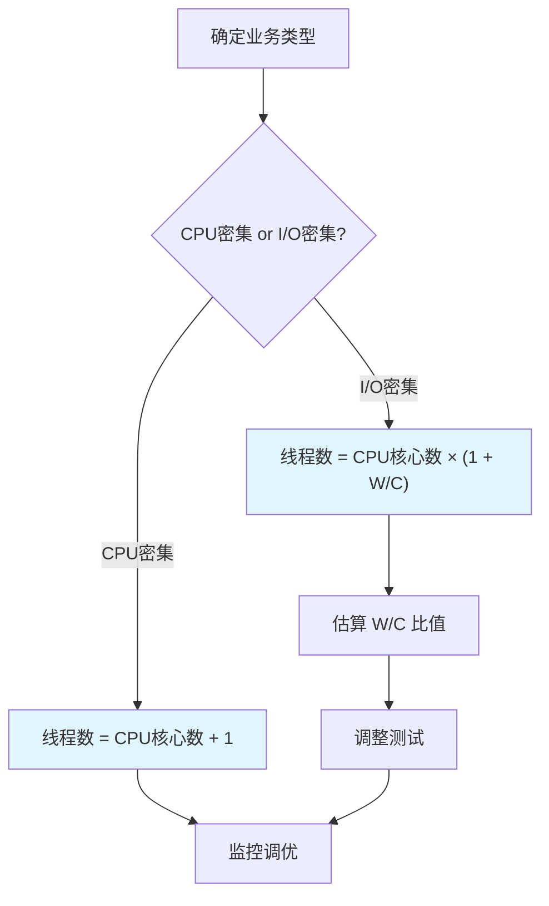

# 线程池大小如何设置

在项目中配置线程池时，很多同学会疑惑：到底该设置多少个线程？为什么有人说 CPU 核心数 +1？我自己也踩过坑——设了 100 个线程，结果 CPU 打满，性能反而下降。

今天我们就来把这个计算方法彻底讲清楚。

## 一、核心概念：CPU 密集型 vs I/O 密集型

### 1.1 CPU 密集型

**特点**：计算量大，CPU 利用率高，线程大部分时间在做计算

**典型场景**：
- 数学计算、加密解密
- 图像处理、视频编码
- 数据压缩、排序

**线程数公式**：

```
最佳线程数 = CPU 核心数 + 1
```

**原因**：
- 线程数 = CPU 核心数时，CPU 始终在计算
- 线程数 = CPU 核心数 + 1 时，有一个线程可以切换
- 超过 CPU 核心数 + 1 后，上下文切换开销 > 计算收益

### 1.2 I/O 密集型

**特点**：大部分时间在等待 I/O，CPU 利用率低

**典型场景**：
- 数据库读写
- 文件读写
- 网络请求
- API 调用

**线程数公式**：

```
最佳线程数 = CPU 核心数 × (1 + W/C)

W = 等待时间（Wait Time）
C = 计算时间（Compute Time）
```

**例子**：
- 如果一个任务等待 9 秒，计算 1 秒（W/C = 9）
- CPU 核心数 = 4
- 最佳线程数 = 4 × (1 + 9) = 40

### 1.3 公式图解



## 二、计算方法详解

### 2.1 获取 CPU 核心数

```java
// 方法1：Runtime
int cpuCores = Runtime.getRuntime().availableProcessors();

// 方法2：OperatingSystemMXBean
OperatingSystemMXBean os = ManagementFactory.getOperatingSystemMXBean();
int cpuCores = os.getAvailableProcessors();

// 方法3：Environment
int cpuCores = Integer.parseInt(System.getenv("CPU_CORES"));
```

### 2.2 CPU 密集型计算

```java
// 假设 CPU 有 8 核心
int cpuCores = Runtime.getRuntime().availableProcessors();  // 8

// CPU 密集型最佳线程数
int corePoolSize = cpuCores + 1;  // 9
int maxPoolSize = cpuCores + 1;  // 9

ThreadPoolExecutor executor = new ThreadPoolExecutor(
    corePoolSize,
    maxPoolSize,
    60L, TimeUnit.SECONDS,
    new LinkedBlockingQueue<>(1000),
    new ThreadFactoryBuilder().setNameFormat("cpu-pool-%d").build(),
    new ThreadPoolExecutor.AbortPolicy()
);
```

### 2.3 I/O 密集型计算

```java
// 假设 CPU 有 4 核心
int cpuCores = Runtime.getRuntime().availableProcessors();  // 4

// 假设 W/C = 2（等待时间是计算时间的2倍）
int wcRatio = 2;

// I/O 密集型最佳线程数
int corePoolSize = cpuCores * (1 + wcRatio);  // 4 × 3 = 12
int maxPoolSize = cpuCores * (1 + wcRatio) * 2;  // 4 × 3 × 2 = 24

ThreadPoolExecutor executor = new ThreadPoolExecutor(
    corePoolSize,
    maxPoolSize,
    60L, TimeUnit.SECONDS,
    new LinkedBlockingQueue<>(1000),
    new ThreadFactoryBuilder().setNameFormat("io-pool-%d").build(),
    new ThreadPoolExecutor.AbortPolicy()
);
```

### 2.4 估算 W/C 比值

```java
// 方法1：Profiler 工具
// 使用 JProfiler、YourKit 等工具测量

// 方法2：日志记录
public class IOCounter {
    private final ThreadLocal<Long> startTime = ThreadLocal.withInitial(
        () -> System.nanoTime()
    );
    
    public void process(Task task) {
        long computeStart = System.nanoTime();
        compute(task);  // 计算部分
        long computeTime = System.nanoTime() - computeStart;
        
        long waitStart = System.nanoTime();
        ioOperation();  // I/O 部分
        long waitTime = System.nanoTime() - waitStart;
        
        log.info("W/C = {} / {} = {}", 
            waitTime, computeTime, (double) waitTime / computeTime);
    }
}

// 方法3：JMH 微基准测试
@BenchmarkMode(Mode.AverageTime)
@OutputTimeUnit(TimeUnit.MILLISECONDS)
public class IOCalculationBenchmark {
    @Benchmark
    public int measureIOCalculation(Blackhole bh) {
        int sum = 0;
        for (int i = 0; i < 1000; i++) {
            sum += compute();
            bh.consume(ioOperation());
        }
        return sum;
    }
}
```

## 三、生产配置建议

### 3.1 常见配置对照表

| 业务类型 | corePoolSize | maximumPoolSize | keepAliveTime | 示例场景 |
| --- | --- | --- | --- | --- |
| CPU 密集 | CPU + 1 | CPU + 1 | 0 | 计算密集任务 |
| I/O 密集（轻） | CPU × 2 | CPU × 2 | 60s | 轻量 API 调用 |
| I/O 密集（中） | CPU × 3 | CPU × 4 | 60s | 数据库、文件 |
| I/O 密集（重） | CPU × 4 | CPU × 8 | 120s | 外部服务调用 |

### 3.2 异步任务配置

```java
// 异步任务线程池：I/O 密集
ThreadPoolExecutor asyncExecutor = new ThreadPoolExecutor(
    50,   // CPU × 4（假设 CPU 核心数 8-16 的中间值）
    100,  // 最大线程数
    60L, TimeUnit.SECONDS,
    new LinkedBlockingQueue<>(10000),
    new ThreadFactoryBuilder().setNameFormat("async-pool-%d").build(),
    new ThreadPoolExecutor.CallerRunsPolicy()
);
```

### 3.3 批量任务配置

```java
// 批量处理：CPU 密集
ThreadPoolExecutor batchExecutor = new ThreadPoolExecutor(
    Runtime.getRuntime().availableProcessors() + 1,
    Runtime.getRuntime().availableProcessors() + 1,
    0L, TimeUnit.MILLISECONDS,
    new LinkedBlockingQueue<>(1000),
    new ThreadFactoryBuilder().setNameFormat("batch-pool-%d").build(),
    new ThreadPoolExecutor.AbortPolicy()
);
```

### 3.4 HTTP 服务配置

```java
// HTTP 请求处理：I/O 密集 + 背压
ThreadPoolExecutor httpExecutor = new ThreadPoolExecutor(
    100,   // 核心线程数
    200,   // 最大线程数
    120L, TimeUnit.SECONDS,
    new LinkedBlockingQueue<>(1000),
    new ThreadFactoryBuilder().setNameFormat("http-pool-%d").build(),
    new ThreadPoolExecutor.CallerRunsPolicy()  // 背压
);
```

## 四、监控与调优

### 4.1 基础监控指标

```java
public class ThreadPoolMonitor {
    public static void printStatus(ThreadPoolExecutor executor) {
        ThreadPoolExecutor e = executor;
        System.out.println("=== 线程池状态 ===");
        System.out.println("核心线程数: " + e.getCorePoolSize());
        System.out.println("最大线程数: " + e.getMaximumPoolSize());
        System.out.println("当前线程数: " + e.getPoolSize());
        System.out.println("活跃线程数: " + e.getActiveCount());
        System.out.println("已完成任务: " + e.getCompletedTaskCount());
        System.out.println("队列任务数: " + e.getQueue().size());
    }
}
```

### 4.2 调优信号

| 现象 | 原因 | 解决 |
| --- | --- | --- |
| CPU 100%，响应慢 | 线程数不足或 CPU 密集任务过多 | 增加线程数或优化算法 |
| CPU 很低，队列积压 | 线程数过多或 I/O 瓶颈 | 减少线程数或优化 I/O |
| 任务被拒绝 | 队列满，线程数不足 | 增加 maximumPoolSize 或队列大小 |
| 上下文切换频繁 | 线程数过多 | 减少线程数 |

### 4.3 动态调整

```java
// 根据监控动态调整
public void adjustThreadPool(ThreadPoolExecutor executor) {
    int activeCount = executor.getActiveCount();
    int maxPoolSize = executor.getMaximumPoolSize();
    int corePoolSize = executor.getCorePoolSize();
    int queueSize = executor.getQueue().size();
    
    // 如果活跃线程接近最大线程数，增加核心线程数
    if (activeCount >= maxPoolSize && queueSize > 100) {
        executor.setCorePoolSize(corePoolSize + 10);
        System.out.println("增加核心线程数到: " + (corePoolSize + 10));
    }
    
    // 如果队列经常为空，减少核心线程数
    if (queueSize < 10 && activeCount < corePoolSize - 5) {
        executor.setCorePoolSize(corePoolSize - 5);
        System.out.println("减少核心线程数到: " + (corePoolSize - 5));
    }
}
```

### 4.4 监控工具

```java
// JMX 监控
MBeanServer mbs = ManagementFactory.getPlatformMBeanServer();
ObjectName name = new ObjectName("java.util.concurrent:type=ThreadPoolExecutor,*");

Set<ObjectName> names = mbs.queryNames(name, null);
for (ObjectName on : names) {
    ThreadPoolExecutor mbean = JMX.newMBeanProxy(
        mbs, on, ThreadPoolExecutor.class
    );
    System.out.println("Active: " + mbean.getActiveCount());
    System.out.println("PoolSize: " + mbean.getPoolSize());
    System.out.println("QueueSize: " + mbean.getQueue().size());
}
```

## 五、常见问题与避坑

### 5.1 线程数设置过大

```java
// 错误：CPU 核心数 8，却设置了 100 个线程
ThreadPoolExecutor executor = new ThreadPoolExecutor(
    100,   // 太大！
    100,
    60L, TimeUnit.SECONDS,
    new LinkedBlockingQueue<>(),
    Executors.defaultThreadFactory(),
    new ThreadPoolExecutor.AbortPolicy()
);

// 问题：
// 1. 上下文切换开销巨大
// 2. 内存占用增加
// 3. 性能反而下降
```

### 5.2 I/O 密集型用 CPU 公式

```java
// 错误：I/O 密集型用 CPU 公式
int cpuCores = Runtime.getRuntime().availableProcessors();  // 8

// I/O 密集型，W/C = 5
ThreadPoolExecutor executor = new ThreadPoolExecutor(
    cpuCores + 1,  // 9（太少！）
    cpuCores + 1,
    60L, TimeUnit.SECONDS,
    new LinkedBlockingQueue<>(),
    Executors.defaultThreadFactory(),
    new ThreadPoolExecutor.AbortPolicy()
);

// 问题：大部分时间在等待 I/O，CPU 利用率极低
```

### 5.3 不考虑队列容量

```java
// 错误：队列容量设置过小
ThreadPoolExecutor executor = new ThreadPoolExecutor(
    10, 20,
    60L, TimeUnit.SECONDS,
    new ArrayBlockingQueue<>(10),  // 太小！
    Executors.defaultThreadFactory(),
    new ThreadPoolExecutor.AbortPolicy()
);

// 问题：突发流量时，队列很快满，任务被拒绝
```

## 【学习小结】

本篇文章的核心要点：

1. **CPU 密集型公式**：`线程数 = CPU 核心数 + 1`，避免上下文切换开销
2. **I/O 密集型公式**：`线程数 = CPU 核心数 × (1 + W/C)`，充分利用等待时间
3. **W/C 比值**：通过 Profiler、日志或 JMH 测量估算
4. **常见配置**：CPU 密集用核心数+1，I/O 密集用核心数×2~8
5. **监控指标**：活跃线程数、队列大小、已完成任务数
6. **调优信号**：CPU 打满减少线程，CPU 空闲增加线程
7. **动态调整**：`setCorePoolSize()` 和 `setMaximumPoolSize()` 可以运行时调整
8. **最佳实践**：先按公式设置，再通过监控数据微调
