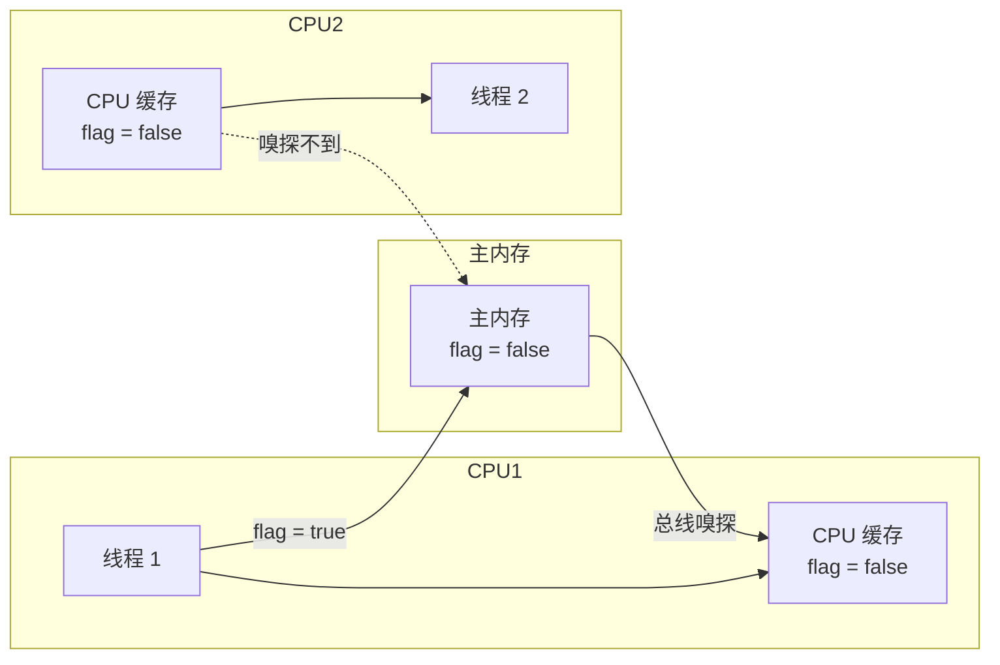
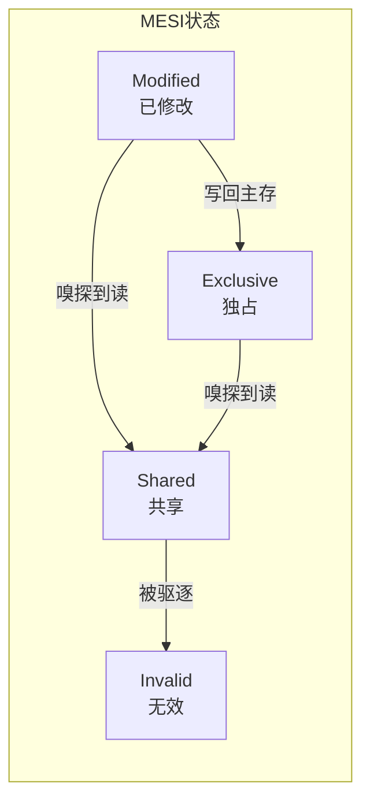
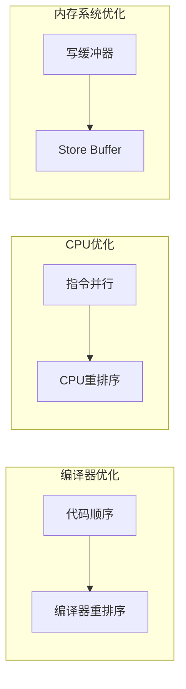
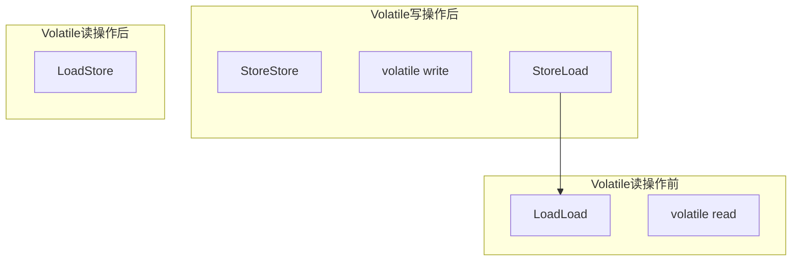

# volatile 可见性与禁止重排序

**目标级别**：P6

## 快速自测

面试官问：「volatile 是如何保证可见性的？为什么它不能保证原子性？」

你能回答到第几层？

---

## 一、核心问题

### 🔴 volatile 是什么？

volatile 是 Java 中的轻量级同步机制，它保证**可见性**和**有序性**，但不保证**原子性**。

```java
public class VolatileDemo {
    private volatile boolean flag = false;
    
    public void writer() {
        flag = true;  // volatile 写
    }
    
    public void reader() {
        if (flag) {   // volatile 读
            // 一定能读到最新的值
        }
    }
}
```

### volatile 的作用

| 作用 | 说明 |
|------|------|
| **可见性** | 线程 A 修改了 volatile 变量，线程 B 立即可见 |
| **有序性** | volatile 禁止指令重排序 |
| **原子性** | **不保证**！如 `i++` 这种复合操作 |

---

## 二、可见性保证

### 问题背景



### volatile 读写的内存语义

```java
// volatile 写
public void volatileWrite() {
    this.value = 1;      // 普通写
    this.ready = true;   // volatile 写
}
// 相当于：
// this.value = 1;
// Store Barrier（强制刷新到主内存）
// this.ready = true;

// volatile 读
public void volatileRead() {
    boolean ready = this.ready;  // volatile 读
    if (ready) {
        int x = this.value;      // 普通读
    }
}
// 相当于：
// Load Barrier（无效化本地缓存）
// boolean ready = this.ready;
// int x = this.value;
```

### 缓存一致性协议

现代 CPU 使用 **MESI** 协议保证缓存一致性：



| 状态 | 说明 |
|------|------|
| **Modified (M)** | 缓存行已修改，且是唯一副本 |
| **Exclusive (E)** | 缓存行未修改，且是唯一副本 |
| **Shared (S)** | 缓存行未修改，但可能有其他副本 |
| **Invalid (I)** | 缓存行无效 |

---

## 三、禁止重排序

### 指令重排序的原因



### volatile 内存屏障

```java
// volatile 变量的内存屏障
// Store 屏障：StoreStore | VolatileStore | StoreLoad
// Load  屏障：LoadLoad | VolatileLoad | LoadStore
```

### 屏障类型

| 屏障类型 | 作用 |
|---------|------|
| **LoadLoad** | 禁止Load1重排序到Load2之后 |
| **StoreStore** | 禁止Store1重排序到Store2之后 |
| **LoadStore** | 禁止Load1重排序到Store2之后 |
| **StoreLoad** | 禁止Store1重排序到Load2之后 |

### volatile 的屏障规则



---

## 四、volatile 的应用场景

### 场景一：状态标志

```java
public class ShutdownFlag {
    private volatile boolean shutdown = false;
    
    public void shutdown() {
        shutdown = true;
    }
    
    public void run() {
        while (!shutdown) {
            // 处理任务
        }
    }
}
```

### 场景二：单例模式

```java title="DCL + volatile"
public class Singleton {
    // volatile 防止指令重排序
    private static volatile Singleton instance;
    
    public static Singleton getInstance() {
        if (instance == null) {
            synchronized (Singleton.class) {
                if (instance == null) {
                    instance = new Singleton();
                    // new Singleton() 分解为：
                    // 1. 分配内存
                    // 2. 调用构造
                    // 3. 赋值给 instance
                    // volatile 防止 2 和 3 重排序
                }
            }
        }
        return instance;
    }
}
```

### 场景三：防止类初始化重排序

```java
public class Instance {
    // instance 可能先赋值再初始化
    private static Instance instance = new Instance();
    
    private int value = 1;
    
    public Instance() {
        value = 2;
    }
    
    public int getValue() {
        return value;
    }
}
```

---

## 五、volatile vs synchronized

### 对比表

| 维度 | volatile | synchronized |
|------|----------|--------------|
| **锁机制** | 无锁 | 互斥锁 |
| **可见性** | 保证 | 保证 |
| **有序性** | 保证（内存屏障） | 保证 |
| **原子性** | 不保证 | 保证 |
| **性能** | 高（轻量级） | 低（重量级） |
| **使用场景** | 状态标志、单例 | 需要原子性的场景 |

### 何时用 volatile？

```java
// ✅ 适合的场景
private volatile boolean ready;
private volatile long value;

// ❌ 不适合的场景
private volatile int count;
count++;  // 不保证原子性！

// ✅ 正确做法：使用 AtomicInteger
private AtomicInteger count = new AtomicInteger();
count.incrementAndGet();  // 原子操作
```

---

## 六、面试题精讲

### 🔴 第一层：volatile 是如何保证可见性的？

> **参考答案**：
>
> volatile 通过**内存屏障**和**缓存一致性协议**保证可见性：
>
> 1. **volatile 写**后插入 Store Barrier，强制将修改刷新到主内存
> 2. **volatile 读**前插入 Load Barrier，无效化本地缓存，强制从主内存重新读取
> 3. CPU 的缓存一致性协议（MESI）会在其他 CPU 嗅探到修改时自动无效化其缓存副本

### 🟡 第二层：volatile 为什么不能保证原子性？

> **参考答案**：
>
> `i++` 包含三个操作：
> 1. 读取 i 的值
> 2. 计算 i + 1
> 3. 写回 i
>
> volatile 只能保证每一步看到的结果，但没有锁住整个过程。两个线程可能同时读取到相同的值，然后各自 +1，再写回，导致更新丢失。

### 🟡 第三层：volatile 和 synchronized 的区别？

> **参考答案**：
>
> | 维度 | volatile | synchronized |
> |------|----------|--------------|
> | **作用** | 修饰变量 | 修饰方法/代码块 |
> | **锁机制** | 无锁 | 互斥锁 |
> | **可见性** | 保证 | 保证 |
> | **有序性** | 保证（部分） | 保证 |
> | **原子性** | 不保证 | 保证 |
> | **性能** | 高 | 低 |

### 💡 第四层：volatile 底层的内存屏障是如何实现的？

> **参考答案**：
>
> volatile 的内存屏障通过 CPU 指令实现：
>
> - **x86/x64**：使用 `MFENCE`、`SFENCE`、`LFENCE` 指令
> - **ARM**：使用 `DMB`、`DSB` 数据屏障指令
> - **HotSpot**：通过 `OrderAccess` 类抽象不同平台的实现
>
> ```cpp
> // HotSpot OrderAccess.cpp (x86 实现)
> void OrderAccess::storeload() {
>     // x86 TSO 模型下，storeload 需要 mfence
>     __asm__ volatile ("mfence" ::: "memory");
> }
> ```

---

## 七、常见错误与陷阱

### ⚠️ 陷阱 1：volatile 不能替代锁

```java
// 错误：volatile 不能保证原子性
public class Counter {
    private volatile int count = 0;
    
    public void increment() {
        count++;  // 不是原子操作！
    }
}

// 结果可能小于预期值
```

### ⚠️ 陷阱 2：long/double 的 volatile

```java
// 在 64 位 JVM 中，long/double 的读写已经是原子性的
// 但 volatile 仍然需要，用于 happens-before

private volatile long value;  // 保证可见性和有序性
```

### ⚠️ 陷阱 3：volatile 和 CAS 混淆

```java
// volatile 只保证可见性，不保证原子性
private volatile int count;

// 两个线程同时执行
// 线程 A：count++
// 线程 B：count++
// 结果可能是 1，而不是 2

// 需要用 AtomicInteger
private AtomicInteger count = new AtomicInteger();
count.incrementAndGet();  // CAS 保证原子性
```

---

## 八、对比总结表

| 操作 | volatile 读 | synchronized |
|------|------------|--------------|
| 读取值 | 从主内存读取最新值 | 进入 Monitor 获取锁后再读 |
| 写入值 | 立即刷新到主内存 | 释放锁前刷新到主内存 |
| 可见性 | 保证 | 保证 |
| 重排序 | 禁止（部分） | 禁止（全系列） |
| 原子性 | 不保证 | 保证 |

---

## 九、扩展思考

> **追问**：什么是 happens-before？

happens-before 是 Java 内存模型的核心概念。如果操作 A happens-before 操作 B，那么：
1. A 的结果对 B 可见
2. A 的执行顺序在 B 之前

volatile 的 happens-before 规则：volatile 写 happens-before 后续的 volatile 读。

> **追问**：双重检查锁定为什么要 volatile？

`instance = new Singleton()` 分解为三条指令：
1. 分配内存
2. 调用构造
3. 赋值给 instance

如果没有 volatile，指令 2 和 3 可能重排序，导致其他线程看到已赋值但未构造的对象。

---

## 延伸阅读

- [JMM 与 happens-before](./jmm)
- [CAS 原理与 ABA 问题](./cas)
- [synchronized 原理与锁升级](./synchronized)
- [AQS 抽象队列同步器](./aqs)
