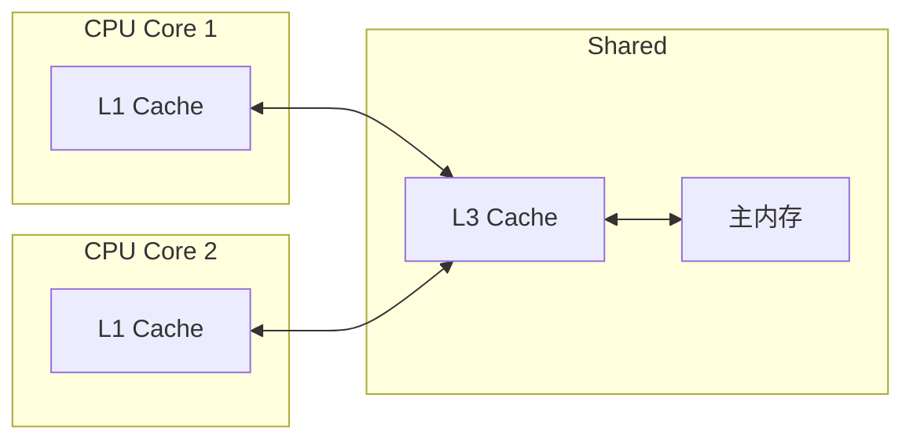
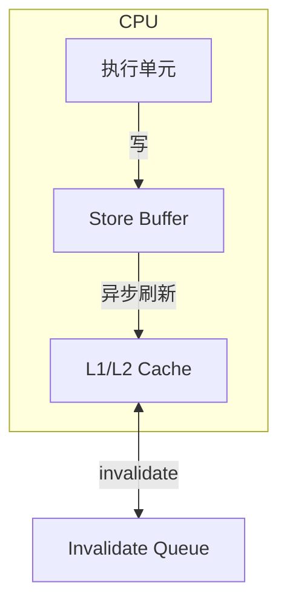
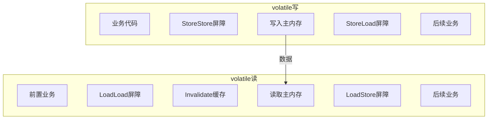

# volatile可见性与禁止重排序

## 一道让候选人原形毕露的面试题

面试官问候选人小张：

"volatile能保证原子性吗？"

小张斩钉截铁地说："能！volatile保证可见性和有序性。"

面试官又问："那下面的代码线程安全吗？"

```java
public class Counter {
    private volatile int counter = 0;
    
    public void increment() {
        counter++;
    }
}
```

小张说："安全，因为volatile保证了可见性和有序性。"

面试官摇摇头。

这个场景太经典了。volatile是Java并发中最重要的关键字之一，但很多人对它的理解一知半解，只知道"保证可见性"，不知道volatile的**边界在哪里**，什么时候该用，什么时候不该用。

今天这篇文章，把volatile讲透。

## 为什么需要volatile

### CPU缓存导致的可见性问题

现代CPU架构中，每个核心有自己的缓存：



当Core 1修改了变量a，写入自己的L1缓存后，Core 2可能还在使用旧的L1缓存中的值。这就是**可见性问题**。

### Store Buffer与Invalidate Queue

CPU为了提升性能，引入了两级缓冲：

1. **Store Buffer**：CPU写操作先写入Store Buffer，稍后异步刷新到缓存
2. **Invalidate Queue**：收到invalidate消息后，排队等待处理



问题来了：
- Store Buffer可能导致**写操作对其他CPU不可见**（还没刷新）
- Invalidate Queue可能导致**invalidate消息处理延迟**（还没执行）

这就是为什么"一个线程写入，另一个线程看不到"的根本原因。

## volatile的两大特性

### 特性一：可见性保证

volatile通过**内存屏障（Memory Barrier）**解决可见性问题：

**volatile写的处理**：
1. 写操作前插入StoreStore屏障
2. 强制将数据写入主内存
3. 写操作后插入StoreLoad屏障
4. 等待所有invalidate确认

**volatile读的处理**：
1. 读操作前插入LoadLoad屏障
2. 强制invalidate本地缓存
3. 从主内存读取最新值
4. 读操作后插入LoadStore屏障



### 特性二：禁止重排序

volatile通过内存屏障**禁止指令重排序**：

| 屏障类型 | 作用 |
|----------|------|
| StoreStore | 防止volatile写之前的写重排序到volatile写之后 |
| StoreLoad | 防止volatile写之后的读写重排序到volatile写之前 |
| LoadLoad | 防止volatile读之前的读重排序到volatile读之后 |
| LoadStore | 防止volatile读之前的读重排序到volatile读之后的写之前 |

### volatile的读写语义

```java
public class VolatileSemantics {
    private volatile int a = 0;
    private int b = 0;
    
    public void writer() {
        a = 1;     // volatile写
        b = 2;     // 普通写
    }
    
    public void reader() {
        int r1 = b;  // 普通读
        int r2 = a;  // volatile读
    }
}
```

**重排序分析**：
- `a = 1` happens-before `b = 2`（程序顺序）
- `b = 2` happens-before `r1 = b`（需要synchronized或其他机制）
- `a = 1` happens-before `r2 = a`（volatile规则）

## volatile不能保证原子性

### counter++的分解

`counter++`不是原子操作，而是三步：

1. **读取**：从主内存读取counter到CPU寄存器
2. **加1**：在寄存器中加1
3. **写回**：将结果写回主内存

```java
public class Counter {
    private volatile int counter = 0;
    
    public void increment() {
        // 分解为三步：
        // 1. int temp = counter;  // 读取
        // 2. temp = temp + 1;      // 加1
        // 3. counter = temp;       // 写回
        // volatile只保证单步的可见性，不保证复合操作的原子性
        counter++;
    }
}
```

### ❌ 错误示例：volatile的复合操作

```java
public class UnsafeCounter {
    private volatile int counter = 0;
    
    // ❌ 不安全
    public void increment() {
        counter++;  // 复合操作
    }
    
    // ❌ 不安全
    public void decrement() {
        counter--;  // 复合操作
    }
    
    // ❌ 不安全
    public void add(int delta) {
        counter += delta;  // 复合操作
    }
}
```

### ✅ 正确做法：使用AtomicInteger

```java
public class SafeCounter {
    private AtomicInteger counter = new AtomicInteger(0);
    
    public void increment() {
        counter.incrementAndGet();  // 原子操作
    }
    
    public void decrement() {
        counter.decrementAndGet();
    }
    
    public void add(int delta) {
        counter.addAndGet(delta);
    }
}
```

## volatile的使用场景

### 场景一：状态标志

```java
public class Service {
    private volatile boolean running = true;
    
    public void run() {
        while (running) {
            // 执行业务逻辑
            try {
                process();
            } catch (Exception e) {
                log.error("Error", e);
            }
        }
    }
    
    public void stop() {
        running = false;  // 修改标志
    }
}
```

**原理**：主线程修改running后，worker线程一定能立即看到变化，从而退出循环。

### 场景二：双重检查锁定

```java
public class Singleton {
    private static volatile Singleton instance;
    
    public static Singleton getInstance() {
        if (instance == null) {
            synchronized (Singleton.class) {
                if (instance == null) {
                    instance = new Singleton();
                }
            }
        }
        return instance;
    }
}
```

**问题分析**：
- `instance = new Singleton()` 可能重排序为：分配内存 → 设置引用 → 调用构造函数
- volatile写 happens-before volatile读
- 后续线程读到非null时，对象已完全构造

### 场景三：保证对象引用的安全发布

```java
public class SafePublication {
    private volatile Map<String, String> cache;
    
    public void init() {
        Map<String, String> temp = new HashMap<>();
        temp.put("key", "value");
        cache = temp;  // volatile写，安全发布
    }
    
    public String get(String key) {
        // 一定能读到完全初始化的map
        return cache.get(key);
    }
}
```

### 场景四：保证64位变量的原子读写

```java
public class LongDemo {
    private volatile long value = 0;
    
    public void setValue(long v) {
        value = v;  // volatile保证原子性
    }
    
    public long getValue() {
        return value;  // volatile保证原子性
    }
}
```

**说明**：在32位JVM上，非volatile的long/double读写是分两次完成的，可能读到"撕裂"的值。

## volatile的底层实现（JIT）

### JIT插入的内存屏障

JIT编译器在volatile操作前后插入内存屏障：

```java
public class JITBarrier {
    private volatile int x = 0;
    
    public void writer() {
        x = 1;  // volatile写
    }
    
    public void reader() {
        int r = x;  // volatile读
    }
}
```

**JIT生成的伪汇编**：

```
# volatile写 x = 1
lock addl $0x0,(%rsp)    # StoreLoad屏障（也起到StoreStore的作用）

# volatile读 int r = x
movl x(%rip),%eax        # LoadLoad + LoadStore
```

`lock addl`指令是x86架构的内存屏障指令，强制：
1. 将Store Buffer中的数据刷新到缓存
2. Invalidate所有其他CPU核心的缓存行
3. 刷新CPU的写缓冲区

### StoreLoad屏障的开销

StoreLoad屏障是**最重的屏障**，因为它需要等待所有CPU核心确认invalidate。

这意味着：volatile写的成本比普通写高。

```java
// 测量volatile vs 普通变量的写性能
public class VolatilePerfTest {
    private volatile int volatileVar = 0;
    private int normalVar = 0;
    
    public void benchmark() {
        long start = System.nanoTime();
        for (int i = 0; i < 10_000_000; i++) {
            volatileVar = i;  // volatile写
        }
        long volatileTime = System.nanoTime() - start;
        
        start = System.nanoTime();
        for (int i = 0; i < 10_000_000; i++) {
            normalVar = i;  // 普通写
        }
        long normalTime = System.nanoTime() - start;
        
        System.out.println("volatile: " + volatileTime + "ns");
        System.out.println("normal: " + normalTime + "ns");
        System.out.println("ratio: " + (double)volatileTime / normalTime);
    }
}
```

## volatile与synchronized对比

### 功能对比

| 特性 | volatile | synchronized |
|------|----------|--------------|
| 原子性 | 不保证 | 保证 |
| 可见性 | 保证 | 保证 |
| 有序性 | 保证（禁止重排序） | 保证（加锁区域有序） |
| 阻塞 | 不阻塞 | 可能阻塞 |
| 性能 | 轻量 | 较重 |

### 选择原则

```java
// ✅ 用volatile的场景：单纯的状态标志
private volatile boolean running = true;

// ✅ 用synchronized的场景：需要原子性的复合操作
private int counter = 0;
public synchronized void increment() {
    counter++;
}

// ✅ 用AtomicXxx的场景：高性能的原子操作
private AtomicInteger counter = new AtomicInteger(0);
public void increment() {
    counter.incrementAndGet();
}
```

### 性能对比

```java
public class PerformanceComparison {
    private volatile int volatileCounter = 0;
    private int syncCounter = 0;
    private AtomicInteger atomicCounter = new AtomicInteger(0);
    private final Object lock = new Object();
    
    public void benchmark() {
        // volatile: ~100ms
        long start = System.nanoTime();
        for (int i = 0; i < 100_000_000; i++) {
            volatileCounter = i;
        }
        
        // synchronized: ~2000ms（锁竞争）
        start = System.nanoTime();
        for (int i = 0; i < 100_000_000; i++) {
            synchronized (lock) {
                syncCounter = i;
            }
        }
        
        // AtomicInteger: ~150ms（CAS，无锁）
        start = System.nanoTime();
        for (int i = 0; i < 100_000_000; i++) {
            atomicCounter.set(i);
        }
    }
}
```

## 生产中的常见误区

### 误区一：volatile能替代锁

```java
// ❌ 错误：volatile不能保证原子性
private volatile int balance = 1000;

public void withdraw(int amount) {
    if (balance >= amount) {  // 检查
        balance -= amount;     // 修改
    }
}

// ✅ 正确：使用原子操作
private AtomicInteger balance = new AtomicInteger(1000);

public void withdraw(int amount) {
    while (true) {
        int current = balance.get();
        if (current >= amount) {
            if (balance.compareAndSet(current, current - amount)) {
                return;
            }
        } else {
            return;
        }
    }
}
```

### 误区二：volatile的数组保证元素可见

```java
// ❌ 错误理解
private volatile int[] arr = new int[10];

public void write() {
    arr[0] = 100;  // 写入数组元素
}

public int read() {
    return arr[0];  // 只能保证arr引用的可见性，不保证arr[0]的可见性
}

// ✅ 正确做法：数组引用 volatile 或数组元素 volatile
private int[] arr = new int[10];

public synchronized void write() {
    arr[0] = 100;
}

public synchronized int read() {
    return arr[0];
}

// 或者使用 AtomicIntegerArray
private AtomicIntegerArray arr = new AtomicIntegerArray(10);

public void write() {
    arr.set(0, 100);
}
```

### 误区三：volatile能保证线程安全

```java
// ❌ 错误：volatile不能解决竞态条件
public class Account {
    private volatile int balance = 1000;
    
    public void transfer(Account target, int amount) {
        if (balance >= amount) {  // 线程A和线程B可能同时通过检查
            balance -= amount;
            target.balance += amount;
        }
    }
}

// ✅ 正确：使用锁
public class Account {
    private int balance = 1000;
    private final Object lock = new Object();
    
    public void transfer(Account target, int amount) {
        synchronized (lock) {
            synchronized (target.lock) {
                if (balance >= amount) {
                    balance -= amount;
                    target.balance += amount;
                }
            }
        }
    }
}
```

## 面试中的高频追问

### 追问1：volatile和synchronized的区别？

volatile只保证可见性和有序性，不保证原子性。synchronized三者都保证。

### 追问2：volatile为什么不能保证原子性？

因为`counter++`是三个独立操作的组合：
1. 读取counter
2. 加1
3. 写回counter

volatile只保证单次读/写的原子性，不保证复合操作的原子性。

### 追问3：volatile的可见性是如何保证的？

通过内存屏障：
- 写：StoreStore屏障 + 写入主内存 + StoreLoad屏障
- 读：LoadLoad屏障 + invalidate缓存 + LoadStore屏障

### 追问4：volatile数组的元素修改能被其他线程看到吗？

不能。volatile数组只保证数组引用的可见性，不保证数组元素的可见性。

## 【学习小结】

1. **volatile两大特性**：可见性 + 禁止重排序
2. **可见性原理**：内存屏障强制刷新/失效缓存
3. **禁止重排序**：四种内存屏障覆盖所有场景
4. **不能保证原子性**：复合操作（++、+=等）仍然需要锁或CAS
5. **使用场景**：状态标志、安全发布、64位变量原子读写
6. **常见误区**：volatile≠锁、volatile数组≠元素volatile
7. **性能**：volatile写比普通写重（StoreLoad屏障），volatile读与普通读相近

---

**延伸阅读**：
- [JMM内存模型](/java/concurrent/jmm)
- [happens-before原则](/java/concurrent/happens-before)
- [CAS原理与ABA问题](/java/concurrent/cas)