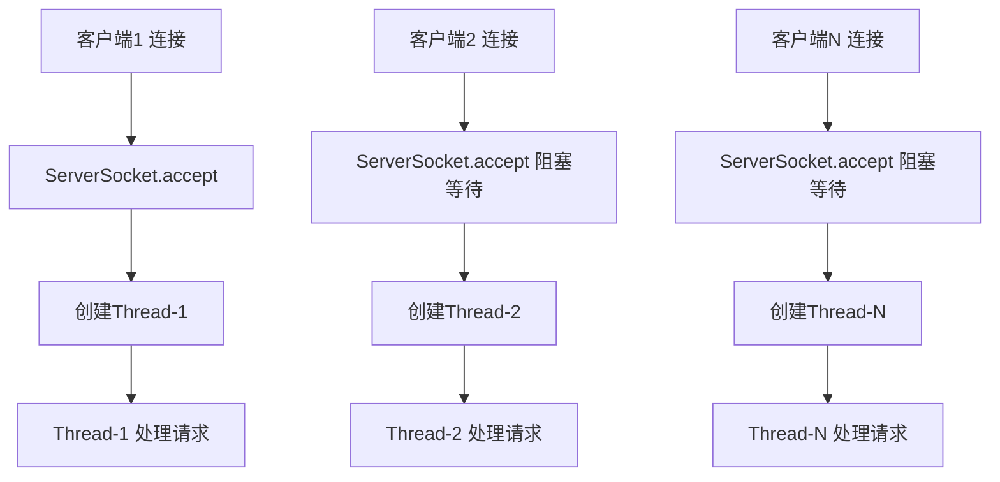
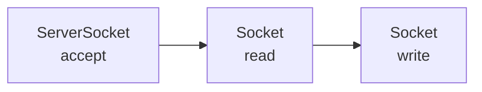
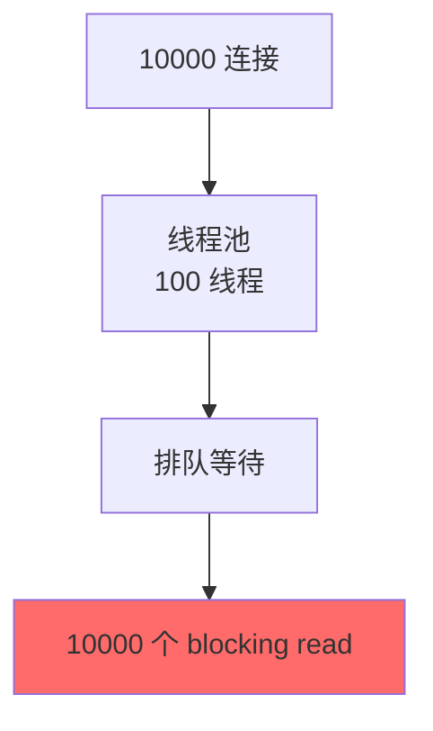

# BIO（阻塞IO）原理

在项目中用过 BIO 的同学肯定有这个感受：本地测试好好的，一上生产环境连接数一多，线程就扛不住了。

我自己就踩过这个坑。早年做一个聊天服务，最开始用的 BIO，300 个并发用户时 CPU 还挺正常，结果到了 1000 个用户，线程数直接爆表，GC 频率也飙升。后来排查发现，光是维持 1000 个连接的 socket 读写，就创建了 1000 个线程，每个线程栈占用 1MB，光栈内存就消耗了 1GB。

今天我们就来把 BIO 的原理讲清楚，顺便说说为什么在高性能场景下它会被嫌弃。

## 一、BIO 的基本模型

BIO（Blocking I/O，同步阻塞 I/O）是 Java 最早提供的 IO 模型，也是最符合直觉的一种模型。

### 1.1 核心组件

BIO 模型中有两个核心角色：

1. **ServerSocket**：服务端的"迎宾员"，负责监听端口、接受连接
2. **Socket**：客户端的"话筒"，负责发送和接收数据

```java
ServerSocket serverSocket = new ServerSocket(8080);

while (true) {
    // 阻塞方法：等待客户端连接
    Socket socket = serverSocket.accept();
    
    // 收到连接后，创建新线程处理
    new Thread(() -> {
        handleClient(socket);
    }).start();
}
```

这段代码看起来简单，但它隐藏了一个致命问题：**每个客户端连接都要创建一个新线程**。

### 1.2 请求处理流程



流程是这样的：

1. 客户端发起连接 → `ServerSocket.accept()` 阻塞等待
2. 收到连接 → 创建新线程 → 处理该连接的读写
3. 如果线程正在 read/write → 继续阻塞

**关键点**：每个线程在整个连接生命周期内都是"绑定"的，哪怕它只是在等待对方发数据。

### 1.3 典型的 BIO 服务端代码

```java
public class BioServer {
    public static void main(String[] args) throws IOException {
        ServerSocket serverSocket = new ServerSocket(8080);
        System.out.println("服务器启动，监听 8080 端口...");
        
        while (true) {
            // 阻塞：等待客户端连接
            final Socket socket = serverSocket.accept();
            System.out.println("收到客户端连接：" + socket.getRemoteSocketAddress());
            
            // 为每个连接创建新线程
            new Thread(() -> {
                try {
                    handleRequest(socket);
                } catch (IOException e) {
                    e.printStackTrace();
                } finally {
                    try {
                        socket.close();
                    } catch (IOException e) {
                        e.printStackTrace();
                    }
                }
            }).start();
        }
    }
    
    private static void handleRequest(Socket socket) throws IOException {
        // 获取输入流（读数据）—— 阻塞操作
        BufferedReader reader = new BufferedReader(
            new InputStreamReader(socket.getInputStream())
        );
        
        // 获取输出流（写数据）
        PrintWriter writer = new PrintWriter(
            socket.getOutputStream(), true
        );
        
        String request;
        while ((request = reader.readLine()) != null) {
            System.out.println("收到消息：" + request);
            writer.println("服务器收到：" + request);
        }
    }
}
```

客户端代码：

```java
public class BioClient {
    public static void main(String[] args) throws IOException {
        Socket socket = new Socket("localhost", 8080);
        PrintWriter out = new PrintWriter(socket.getOutputStream(), true);
        BufferedReader in = new BufferedReader(
            new InputStreamReader(socket.getInputStream())
        );
        
        out.println("Hello Server");
        String response = in.readLine();
        System.out.println("服务器响应：" + response);
        
        socket.close();
    }
}
```

## 二、BIO 的阻塞点分析

### 2.1 三个主要的阻塞操作

BIO 模型中有三个地方会发生阻塞：



1. **ServerSocket.accept()**：等待客户端连接
2. **Socket.getInputStream().read()**：等待对方发数据
3. **Socket.getOutputStream().write()**：等待缓冲区可写

### 2.2 阻塞的底层原理

当执行 `accept()` 时，如果没有任何客户端连接，内核会把这个线程挂起，CPU 切换到其他任务。直到有客户端到来，内核才会唤醒这个线程。

同样的，`read()` 时如果对方还没发数据，线程也会被挂起。

```java
// 伪代码展示阻塞原理
while (true) {
    // 这里会阻塞，直到有连接到来
    Socket socket = serverSocket.accept();
    
    // 这里又会阻塞，直到客户端发来数据
    byte[] data = socket.getInputStream().read();
    
    // 这里还会阻塞，直到数据写入成功
    socket.getOutputStream().write(response);
}
```

### 2.3 【直观类比】BIO 的阻塞模型

想象餐厅的服务员：

- **BIO 模式**：每个客人配一个专属服务员，这个服务员一直站在客人旁边，等客人点菜、等厨师做菜、等客人吃完。整个过程这个服务员都不能去服务其他人。
- **NIO 模式**：一个服务员同时照看多桌客人，他在各桌之间巡逻，哪桌客人招呼他就去哪桌。

BIO 的问题在于：当客人在"等待"（想事情、聊天、犹豫点啥）时，服务员就被绑定了，完全浪费。

## 三、10K 连接问题：线程池救不了

很多同学会说："线程开销大，那我用线程池不就好了？"

我们来算一笔账：

### 3.1 线程的资源消耗

| 资源项 | 消耗 |
|--------|------|
| 线程栈大小（JVM默认） | 1MB |
| 线程对象本身 | ~200KB |
| CPU 上下文切换 | 几毫秒 |

如果有 10000 个并发连接：

- **线程栈占用**：10000 × 1MB = **10GB**（光栈就要 10GB！）
- **线程对象占用**：10000 × 200KB ≈ **2GB**
- **上下文切换**：10000 个线程竞争 CPU，调度开销巨大

### 3.2 线程池能解决吗？

```java
ExecutorService executor = Executors.newFixedThreadPool(100);

while (true) {
    Socket socket = serverSocket.accept();
    executor.submit(() -> handleClient(socket));
}
```

线程池确实能限制最大线程数，但**治标不治本**：



想象这个场景：

1. 10000 个客户端连接进来
2. 线程池只有 100 个线程
3. 9999 个连接在排队等待
4. 假设每个连接的 read() 平均要等 1 秒才能收到数据
5. 这 9999 个客户端的请求实际上都在"假死"状态

线程池只是让你的服务器不会因为线程数爆炸而崩溃，但**并不能提升 IO 处理能力**。

### 3.3 ❌ 错误示范：迷信线程池

```java
// 表面上解决了问题，实际上没有
ExecutorService pool = Executors.newFixedThreadPool(100);

// 问题：10000 个连接进来，9999 个在等待
while (true) {
    Socket socket = serverSocket.accept();
    pool.submit(() -> {
        // 这个线程会被 read() 阻塞
        socket.getInputStream().read();
    });
}
```

真正的瓶颈是：**线程在等待 IO 时被阻塞，而不是线程数量本身**。

## 四、BIO 的适用场景

### 4.1 适合使用 BIO 的场景

BIO 不是一无是处，在以下场景下它反而是最简单合适的方案：

| 场景 | 说明 |
|------|------|
| 连接数少 | < 100 个并发连接，BIO 的代码复杂度最低 |
| 短连接 | 连接生命周期短，建立/关闭频繁 |
| 连接稳定 | 不需要处理大量空闲连接 |
| 开发简单 | 不需要考虑复杂的异步逻辑 |

### 4.2 经典 BIO 应用： JDBC 连接

JDBC 中的 Connection、Statement、ResultSet 默认都是阻塞模式：

```java
// 这是典型的 BIO 模式
Connection conn = dataSource.getConnection();
PreparedStatement ps = conn.prepareStatement(sql);
ResultSet rs = ps.executeQuery();  // 阻塞，直到数据库返回结果

while (rs.next()) {
    // 处理每一行数据
}
```

所以在数据库操作密集型应用中，即使使用线程池，也容易遇到瓶颈。这也是为什么后来出现了异步 JDBC（如 R2DBC）和连接池技术（如 Druid、HikariCP）。

### 4.3 BIO 与同步编程

BIO 的一个优点是：**编程模型简单，代码是同步的**。

```java
String request = reader.readLine();
String response = process(request);
writer.println(response);
```

三行代码，逻辑一目了然。如果是异步模型，代码会分散在多个回调里，调试和理解都更复杂。

所以对于业务逻辑简单、并发要求不高的场景，BIO + 线程池其实够用了。

## 五、生产环境中的 BIO 问题

### 5.1 经典生产事故：聊天服务

我之前带的一个项目，需要实现一个内部聊天服务。开发同学用了 BIO 模型：

```java
// 简化的聊天处理代码
while (true) {
    Socket socket = serverSocket.accept();
    new Thread(() -> {
        BufferedReader reader = new BufferedReader(
            new InputStreamReader(socket.getInputStream())
        );
        
        String msg;
        while ((msg = reader.readLine()) != null) {
            // 广播消息给所有在线用户
            broadcast(msg);
        }
    }).start();
}
```

上线第一周还算正常，300 个在线用户。第二周扩展到 1000 用户，问题就来了：

- 线程数飙升到 1000+，GC 频繁
- 内存占用从 500MB 飙到 2GB
- 响应时间从 50ms 变成 500ms

最后重构成了 NIO 才解决问题。

### 5.2 排查 BIO 性能问题

如果你的服务用了 BIO，遇到性能问题，可以按以下步骤排查：

1. **检查线程数**：`jstack <pid>` 看有多少线程在 `BlockingQue`

2. **检查 IO 阻塞**：`jstack` 看线程堆栈，是否大量线程停在 `read()` 或 `accept()`

3. **检查 CPU 使用**：`top -H -p <pid>` 看 CPU 时间消耗

```bash
# 查看 Java 进程的所有线程
jstack 12345 | grep "Blocked" | wc -l

# 查看线程状态分布
jstack 12345 | grep "java.lang.Thread.State" | sort | uniq -c
```

### 5.3 BIO 的替代方案

| 场景 | 替代方案 | 说明 |
|------|----------|------|
| 高并发聊天/推送 | NIO / Netty | 非阻塞 + 多路复用 |
| 高性能 HTTP 服务 | NIO / Netty | 零拷贝 + 事件驱动 |
| 高并发数据库操作 | 连接池 + 异步驱动 | 减少等待时间 |
| 超高并发 | AIO / 异步框架 | 彻底异步化 |

## 六、BIO 的改进方向

### 6.1 最小化线程数

如果一定要用 BIO，可以尽量减少线程数：

```java
// 使用单线程处理多个连接（需要配合非阻塞 IO）
// 这实际上是 BIO 到 NIO 的过渡

Selector selector = Selector.open();
ServerSocketChannel serverChannel = ServerSocketChannel.open();
serverChannel.configureBlocking(false);  // 非阻塞模式
serverChannel.register(selector, SelectionKey.OP_ACCEPT);
```

### 6.2 使用线程池隔离

```java
// 区分处理不同类型的任务
ExecutorService ioPool = Executors.newFixedThreadPool(10);   // IO 密集
ExecutorService cpuPool = Executors.newFixedThreadPool(4);    // CPU 密集

while (true) {
    Socket socket = serverSocket.accept();
    ioPool.submit(() -> {
        Object result = readFromSocket(socket);
        cpuPool.submit(() -> process(result));
    });
}
```

### 6.3 连接超时设置

```java
Socket socket = serverSocket.accept();
socket.setSoTimeout(30000);  // 30 秒超时，避免无限等待
socket.setKeepAlive(true);   // 保持连接活跃
socket.setTcpNoDelay(true);  // 禁用 Nagle 算法，低延迟
```

## 七、学习小结

【学习小结】

- BIO 是同步阻塞 IO 模型，每个连接需要一个独立线程
- 三个阻塞点：`accept()`、`read()`、`write()`
- 线程开销：每个线程约 1MB 栈空间，10000 连接需要 10GB+
- 线程池只能限制最大线程数，无法解决阻塞问题
- 适用场景：低并发（< 100）、短连接、业务逻辑简单的场景
- 生产高并发场景建议迁移到 NIO 或 Netty

BIO 是理解 IO 模型的基础，但真正高性能的服务器，不会选择 BIO。理解 BIO 的局限性，才能更好地理解为什么需要 NIO 和 AIO。