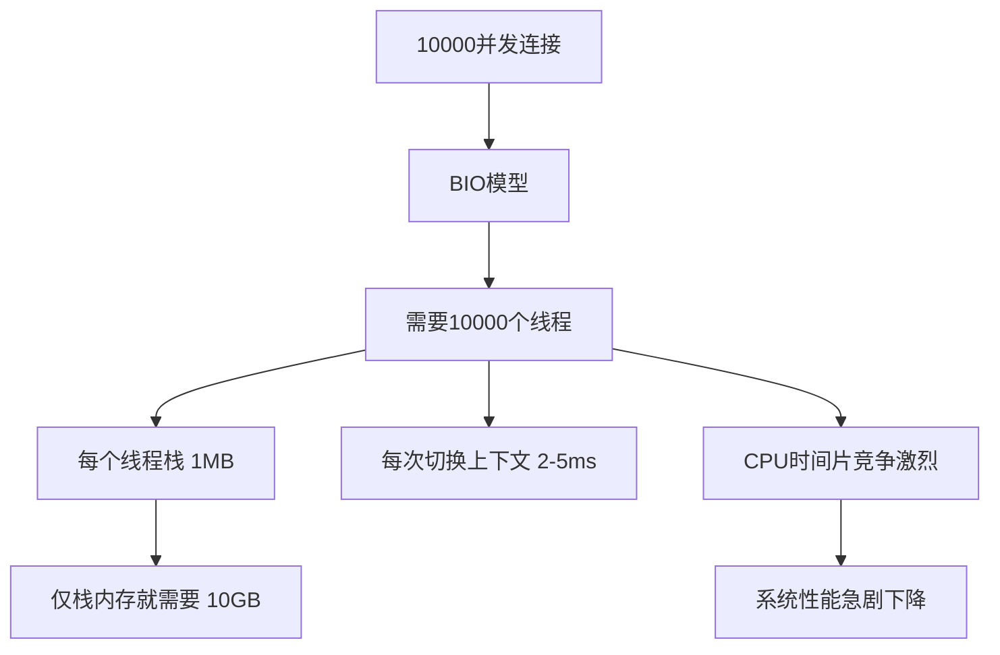

候选人小赵坐在字节跳动1-2级别的面试间里，面试官翻到简历上"熟悉IO模型"这一行，开口问道：

"BIO的线程模型是什么样的？"

小赵说："一个连接对应一个线程。"面试官点点头，又问："那accept()方法是阻塞在哪一步？"

小赵愣了一下："好像是...等待客户端连接？"面试官没说话，继续追问："read()方法呢？什么时候会被阻塞？"

小赵开始语无伦次，最后勉强说了句"等待数据就绪"。面试官叹了口气，在纸上写了两个字。

小赵问是什么，面试官说："送你两个字：重学。"

【面试官心理】
我问他BIO的线程模型，其实是在试探他两件事：第一，他知不知道BIO是一请求一线程的模型；第二，他能不能说清楚accept和read分别阻塞在哪个阶段。很多候选人只会背"阻塞IO"三个字，却说不清底层系统调用发生了什么。BIO这题看似简单，但能答到核心细节的人不到20%。

## 一、BIO的核心原理 🔴

### 1.1 什么是BIO

BIO（Blocking IO），即阻塞IO，是Java最早提供的IO API，所有操作都是同步阻塞的。在BIO模型中，线程发起一个IO请求后，必须等待IO操作完成后才能继续执行。

**BIO的阻塞点有两个**：

1. **accept()阻塞**：服务端线程调用`ServerSocket.accept()`后，如果没有客户端连接，线程会一直阻塞，直到有客户端到来。
2. **read()阻塞**：从socket中读取数据时，如果内核缓冲区没有数据，线程会一直阻塞，直到数据就绪或连接断开。

```java
// BIO 标准写法
ServerSocket serverSocket = new ServerSocket(8080);
while (true) {
    // 这里阻塞——等待客户端连接
    Socket clientSocket = serverSocket.accept();
    // 每来一个客户端，起一个线程处理
    new Thread(() -> {
        try {
            InputStream in = clientSocket.getInputStream();
            byte[] buf = new byte[1024];
            // 这里阻塞——等待数据就绪
            int len = in.read(buf);
            // 处理数据...
        } catch (IOException e) {
            e.printStackTrace();
        }
    }).start();
}
```

这就是经典的**一请求一线程**模型。

### 1.2 ❌ 错误示范

**候选人原话1**："BIO就是同步阻塞IO，性能很差，不适合高并发。"

**问题诊断**：
- 背了结论但不会推导：BIO为什么不适合高并发？因为线程太贵。
- 不知道线程开销在哪：每个线程有独立的栈空间（约1MB），10000个连接就要10GB内存。
- 无法量化：1秒创建销毁1000个线程，JVM早就OOM了。

**候选人原话2**："accept()阻塞是因为没有客户端连接，read()阻塞是因为没有数据。"

**问题诊断**：
- 这是正确的废话，没有技术深度。
- 面试官要听到的是：accept()阻塞在系统调用`accept()`，等待TCP三次握手完成；read()阻塞在内核缓冲区数据未就绪，需要等待数据从网卡拷贝到内核缓冲区。

**候选人原话3**："BIO可以直接换成NIO，性能就能提升。"

**问题诊断**：
- 这种回答暴露了对IO模型的误解：BIO换NIO不只是换个API，是整套编程模型和并发策略的改变。
- 不知道NIO的复杂度增加在哪里：需要自己管理selector、处理读写事件、维护连接状态。

【面试官心理】
BIO这题我通常用来筛选基础是否扎实。知道"一个连接一个线程"的占80%，能说清楚accept和read阻塞原理的占40%，能解释线程开销和连接数上限的是20%，能说出BIO在什么场景下依然适用的只有10%。

### 1.3 标准回答

**P5级别（基础原理）**：
>BIO是阻塞IO模型，核心特点是**一请求一线程**。服务端每接收一个客户端连接，就创建一个新线程处理该连接的所有读写操作。线程会阻塞在两个地方：`accept()`等待客户端连接，`read()`等待数据就绪。

**P6级别（原理+细节）**：
>BIO的`ServerSocket.accept()`底层调用操作系统的`accept()`系统调用，当没有客户端连接时，线程阻塞在系统调用层面，CPU空转。`read()`同理，阻塞在内核缓冲区数据未就绪时。BIO的问题在于：**线程是稀缺资源**，每个线程有独立栈空间（默认1MB），当连接数达到数千时，线程本身的开销会成为瓶颈。假设10000个并发连接，每个线程1MB栈，就需要约10GB内存，再加上线程切换的上下文开销，系统性能急剧下降。

**P7级别（原理+实战+演进）**：
>在BIO模型中，`accept()`阻塞在TCP三次握手完成前，`read()`阻塞在数据从网卡拷贝到内核缓冲区完成前。这种模型的优势是编程简单、模型直观，在**连接数少但每个连接数据量大的场景**下依然高效（比如数据库连接池）。
>
>但BIO的致命缺陷是**线程资源的浪费**：一个线程同时只能处理一个连接，即使该连接99%的时间都在等待数据，线程也不能处理其他连接。
>
>**什么场景用BIO依然合理**？传统的Tomcat默认是BIO模式（在bio模式下），但从Tomcat 8开始默认切换到NIO。内部系统、工具脚本、测试用例等轻量级场景，BIO依然是一个合理选择。

### 1.4 BIO的线程开销量化



**具体数据**：
- 线程默认栈大小：`-Xss`默认1MB（JDK 11+在某些场景下可以更小）
- 线程上下文切换：约2~5ms（取决于CPU负载）
- 线程创建销毁：约50~100ms（JVM层面）
- 1000个并发连接BIO模型：每秒最多处理约100~1000个请求（线程切换成为瓶颈）

:::tip 💡
面试加分点：如果能说出"线程池+队列"这种BIO优化方案（伪异步IO），以及它的局限性，说明你对BIO有实战理解。
:::

### 1.5 伪异步IO——BIO的最后一搏

为了解决线程开销问题，很多人会用**线程池+BIO**来优化，这就是"伪异步IO"：

```java
// 伪异步IO：线程池复用
ServerSocket serverSocket = new ServerSocket(8080);
// 线程池复用，避免无限创建线程
ExecutorService pool = Executors.newFixedThreadPool(200);
while (true) {
    Socket clientSocket = serverSocket.accept();
    pool.submit(() -> {
        // 业务处理
    });
}
```

**但这个方案有根本性缺陷**：

1. **线程池大小是固定的**，当请求超过200个时，队列积压，请求超时
2. **阻塞的本质没变**：`read()`依然阻塞，如果数据分批到达，线程依然无法处理其他连接
3. **无法突破C10K问题**：线程数量受限于内存和上下文切换开销

【面试官心理】
能说出伪异步IO的局限性，说明这个候选人有实战踩坑经验。很多候选人只知道"线程池可以优化BIO"，但不知道线程池只是延长了BIO的寿命，无法从根本上解决问题。

## 二、accept()与read()的底层原理 🟡

### 2.1 操作系统层面的阻塞机制

```
用户态                 内核态                  硬件
┌─────────┐          ┌──────────┐          ┌──────┐
│ Java    │          │  TCP     │          │ 网卡  │
│ 线程    │          │  缓冲区  │          │      │
└────┬────┘          └────┬─────┘          └──┬───┘
     │ 调用accept()        │                    │
     │ ──────────────────>│                    │
     │ 阻塞等待            │                    │
     │<────────────────────│<───────────────────│ TCP握手完成
     │ 返回socket          │                    │
     │                    │                    │
     │ 调用read()          │                    │
     │ ──────────────────>│                    │
     │ 阻塞等待数据         │                    │
     │<────────────────────│<───────────────────│ 数据到达
     │ 返回数据            │                    │
```

**accept()阻塞点**：调用`accept()`后，线程从用户态进入内核态，等待TCP三次握手完成。内核完成握手后，生成`socket`文件描述符，返回给用户态。

**read()阻塞点**：调用`read()`后，线程阻塞在内核态，等待数据从网卡DMA拷贝到内核缓冲区。数据就绪后，再从内核缓冲区拷贝到用户缓冲区，返回。

### 2.2 追问升级：为什么read()需要两次拷贝？

这是P6/P7的追问深水区。

**第一次拷贝**：数据从网卡到内核缓冲区（DMA拷贝，CPU不参与）
**第二次拷贝**：数据从内核缓冲区到用户缓冲区（CPU参与拷贝）

Linux 2.4+引入了**零拷贝**机制（后面会讲），通过`sendfile()`系统调用可以跳过第二次拷贝。

:::warning ⚠️
这里容易翻车：如果候选人把DMA拷贝和CPU拷贝混为一谈，面试官会认为他对IO底层机制理解不够深入。
:::

## 三、BIO的适用场景 🟢

BIO不是一无是处，在以下场景依然适用：

| 场景 | 原因 |
| --- | --- |
| 连接数少（`<100`） | 线程开销可控，编程简单 |
| 每个连接数据量大 | 线程大部分时间在处理数据，而非空等 |
| 内部系统/工具 | 无需高并发，简单直接 |
| 测试/原型开发 | 快速验证想法，不关心性能 |

:::tip 💡
加分回答：能说出BIO在Apache MINA、传统Tomcat（bio模式下）等框架中的应用，说明有实际使用经验。
:::

## 四、生产避坑

### 4.1 线程资源耗尽

**线上案例**：某服务用BIO实现文件上传，并发上传达到500时，线程池耗尽，所有新请求排队，最终OOM。

**排查方法**：
- `jstack <pid>` 查看线程堆栈，看大量线程`BLOCKED`在`read()`
- 观察`tomcat.thread.count`指标飙升
- 检查线程池队列长度

**解决方案**：
- 切换到NIO/AIO模型
- 如果必须用BIO，严格限制最大连接数
- 使用异步文件IO（NIO.2的`AsynchronousFileChannel`）

### 4.2 连接未关闭导致资源泄漏

```java
// ❌ 错误写法：连接未关闭
Socket socket = serverSocket.accept();
InputStream in = socket.getInputStream();
int len;
// 没有try-with-resources，异常时不关闭socket
while ((len = in.read(buf)) != -1) { ... }
```

正确做法：

```java
// ✅ 正确写法
try (Socket socket = serverSocket.accept();
     InputStream in = socket.getInputStream()) {
    int len;
    while ((len = in.read(buf)) != -1) { ... }
} // 自动关闭
```

## 五、工程选型

**什么时候选BIO**：
- 小型内部系统，连接数可预估
- 团队对NIO不熟悉，需要快速交付
- 单机部署，不需要高并发

**什么时候必须放弃BIO**：
- 并发连接数`>`1000
- QPS`>`1000
- C10K/C100K级别问题

:::details 📖 点击展开：Linux IO模型演化
```
BIO = 阻塞IO（blocking）
NIO = 多路复用IO（select/poll/epoll）
AIO = 异步IO（Linux: io_uring, Windows: IOCP）
```
Linux从2.5开始支持AIO，但真正成熟是内核5.1+引入io_uring之后。在此之前，Linux的"AIO"其实是基于线程模拟的，效率不如NIO。
:::

## 六、面试通关话术

**开场**：
> BIO是Java最早提供的IO模型，核心特点是**同步阻塞**，一请求一线程。线程在两个地方会阻塞：`accept()`等待连接、`read()`等待数据。

**被追问原理**：
> 从操作系统层面看，`accept()`阻塞在TCP三次握手完成，`read()`阻塞在数据从网卡到内核缓冲区的DMA拷贝以及从内核缓冲区到用户缓冲区的CPU拷贝这两个阶段。

**被追问优化**：
> 常见优化是用线程池做伪异步IO，但本质问题没解决——线程仍然阻塞在read上。真正突破BIO瓶颈的是NIO的多路复用模型，用一个线程管理多个连接。
