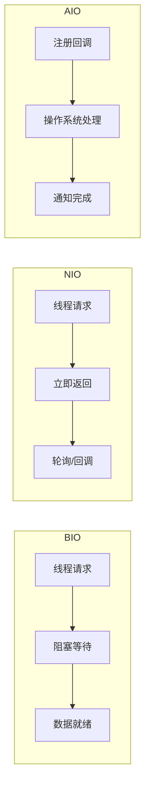
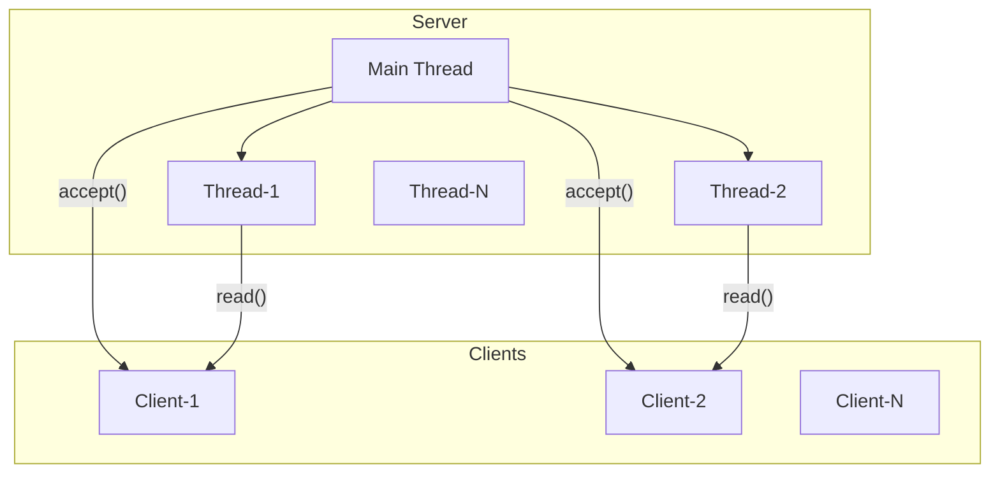
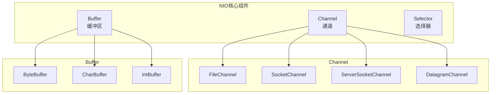
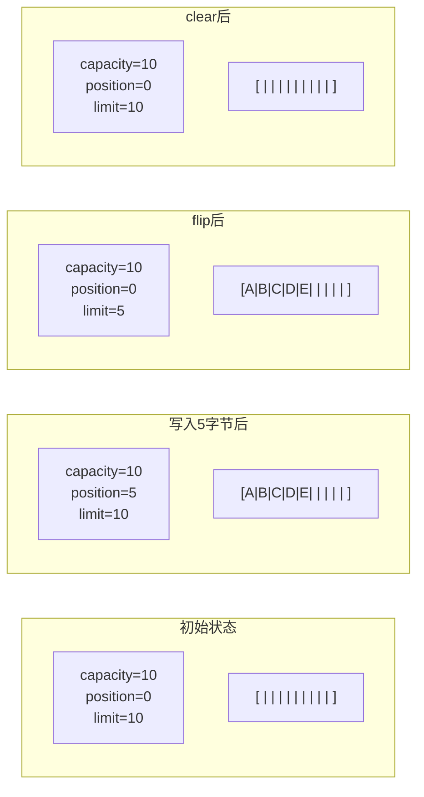
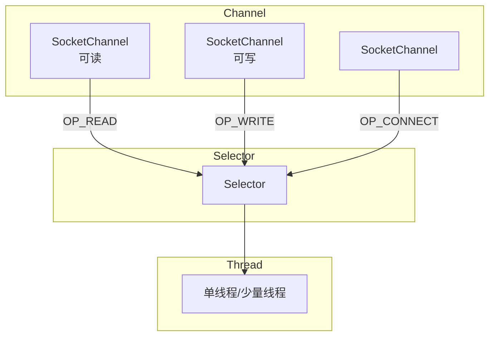
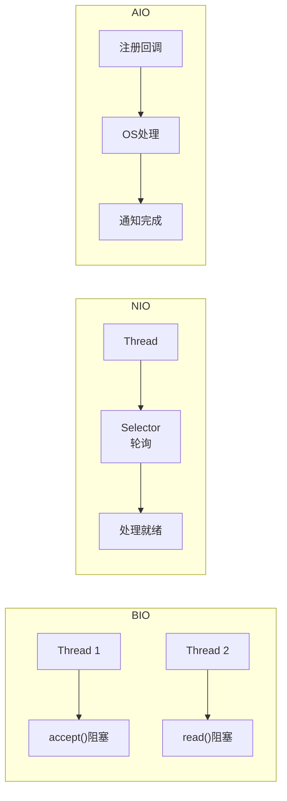

# Java I/O 体系

**目标级别**：P5 / P6

## 快速自测

面试官问：「BIO、NIO、AIO 的区别是什么？NIO 的核心组件有哪些？」

你能回答到第几层？

---

## 一、核心问题

### 🔴 Java I/O 有哪几种模式？

| 模式 | 全称 | 特点 | 引入版本 |
|------|------|------|----------|
| **BIO** | Blocking I/O | 同步阻塞 | JDK 1.0 |
| **NIO** | New I/O / Non-blocking I/O | 同步非阻塞 + 多路复用 | JDK 1.4 |
| **AIO** | Asynchronous I/O | 异步非阻塞 | JDK 1.7 |

### I/O 模型对比



---

## 二、BIO（Blocking I/O）

### 原理

传统的 Socket 编程使用阻塞 I/O，一个线程一次只能处理一个连接。

```java title="BioServer.java"
public class BioServer {
    public static void main(String[] args) throws IOException {
        ServerSocket server = new ServerSocket(8080);
        System.out.println("服务器启动，端口 8080");
        
        while (true) {
            // 阻塞：等待客户端连接
            Socket client = server.accept();
            System.out.println("客户端连接: " + client.getRemoteSocketAddress());
            
            // 每个客户端一个线程
            new Thread(() -> {
                try {
                    handle(client);
                } catch (IOException e) {
                    e.printStackTrace();
                }
            }).start();
        }
    }
    
    private static void handle(Socket client) throws IOException {
        // 阻塞：等待数据
        BufferedReader reader = new BufferedReader(
            new InputStreamReader(client.getInputStream()));
        
        String line;
        while ((line = reader.readLine()) != null) {
            System.out.println("收到: " + line);
            // 响应
            PrintWriter writer = new PrintWriter(
                client.getOutputStream(), true);
            writer.println("服务器收到: " + line);
        }
    }
}
```

### BIO 模型图



### BIO 的问题

| 问题 | 说明 |
|------|------|
| **线程资源浪费** | 连接多但活跃少，线程阻塞浪费 |
| **线程创建销毁开销** | 线程上下文切换耗时 |
| **无法应对高并发** | C10K 问题 |

---

## 三、NIO（New I/O）

### 核心组件



### Channel（通道）

```java
// FileChannel
FileInputStream fis = new FileInputStream("file.txt");
FileChannel channel = fis.getChannel();
ByteBuffer buffer = ByteBuffer.allocate(1024);
channel.read(buffer);

// SocketChannel
SocketChannel socketChannel = SocketChannel.open();
socketChannel.connect(new InetSocketAddress("localhost", 8080));

// ServerSocketChannel
ServerSocketChannel serverChannel = ServerSocketChannel.open();
serverChannel.socket().bind(new InetSocketAddress(8080));
serverChannel.configureBlocking(false);  // 非阻塞
```

### Buffer（缓冲区）

```java
// Buffer 核心属性
public abstract class Buffer {
    private int mark = -1;
    private int position = 0;   // 当前读写位置
    private int limit;          // 限制
    private int capacity;        // 容量
}

// ByteBuffer
ByteBuffer buffer = ByteBuffer.allocate(1024);

// 写入
buffer.put("Hello".getBytes());

// 切换为读模式
buffer.flip();

// 读取
while (buffer.hasRemaining()) {
    System.out.print((char) buffer.get());
}

// 清除（position=0, limit=capacity）
buffer.clear();

//  compact() 只清除已读部分
```

### Buffer 读写模式



### Selector（选择器）

```java title="NioServer.java"
public class NioServer {
    public static void main(String[] args) throws IOException {
        // 创建 Selector
        Selector selector = Selector.open();
        
        // 创建 ServerSocketChannel
        ServerSocketChannel serverChannel = ServerSocketChannel.open();
        serverChannel.socket().bind(new InetSocketAddress(8080));
        serverChannel.configureBlocking(false);
        
        // 注册到 Selector
        SelectionKey key = serverChannel.register(selector, 
            SelectionKey.OP_ACCEPT);
        
        while (true) {
            // 阻塞等待就绪事件
            selector.select();
            
            // 处理就绪事件
            Set<SelectionKey> keys = selector.selectedKeys();
            for (SelectionKey k : keys) {
                if (k.isAcceptable()) {
                    handleAccept(k);
                } else if (k.isReadable()) {
                    handleRead(k);
                }
            }
            keys.clear();
        }
    }
    
    private static void handleAccept(SelectionKey key) 
            throws IOException {
        ServerSocketChannel server = 
            (ServerSocketChannel) key.channel();
        SocketChannel client = server.accept();
        client.configureBlocking(false);
        client.register(key.selector(), SelectionKey.OP_READ);
    }
    
    private static void handleRead(SelectionKey key) 
            throws IOException {
        SocketChannel client = (SocketChannel) key.channel();
        ByteBuffer buffer = ByteBuffer.allocate(1024);
        int read = client.read(buffer);
        
        if (read > 0) {
            buffer.flip();
            client.write(buffer);
        } else if (read < 0) {
            client.close();
        }
    }
}
```

### NIO 模型图



---

## 四、AIO（Asynchronous I/O）

### 原理

AIO 是真正的异步 I/O，操作系统完成 I/O 后通知应用程序。

```java title="AioServer.java"
public class AioServer {
    public static void main(String[] args) throws Exception {
        AsynchronousServerSocketChannel server = 
            AsynchronousServerSocketChannel.open();
        server.bind(new InetSocketAddress(8080));
        
        server.accept(null, new CompletionHandler<AsynchronousSocketChannel, Void>() {
            @Override
            public void completed(AsynchronousSocketChannel client, Void attachment) {
                server.accept(null, this);  // 继续接受
                ByteBuffer buffer = ByteBuffer.allocate(1024);
                
                // 异步读
                client.read(buffer, buffer, new CompletionHandler<Integer, ByteBuffer>() {
                    @Override
                    public void completed(Integer result, ByteBuffer attachment) {
                        if (result > 0) {
                            attachment.flip();
                            client.write(attachment);
                        }
                    }
                    
                    @Override
                    public void failed(Throwable exc, ByteBuffer attachment) {
                        exc.printStackTrace();
                    }
                });
            }
            
            @Override
            public void failed(Throwable exc, Void attachment) {
                exc.printStackTrace();
            }
        });
        
        Thread.sleep(100000);
    }
}
```

### AIO vs NIO

| 维度 | NIO | AIO |
|------|-----|-----|
| **I/O 模型** | 同步非阻塞 | 异步非阻塞 |
| **通知方式** | 轮询/Selector | 回调 |
| **线程模型** | Reactor | Proactor |
| **复杂度** | 较高 | 更高 |
| **适用场景** | 高并发连接 | 长连接、文件 I/O |

---

## 五、三种 I/O 对比

### 核心区别

| 维度 | BIO | NIO | AIO |
|------|-----|-----|-----|
| **I/O 方式** | 同步阻塞 | 同步非阻塞 | 异步非阻塞 |
| **线程模型** | 一连接一线程 | 多路复用 | 回调 |
| **数据传输** | 流式 | Buffer | Buffer |
| **复杂度** | 低 | 中 | 高 |
| **适用场景** | 低并发 | 高并发 | 长连接 |
| **JDK 版本** | 1.0 | 1.4 | 1.7 |

### 模型图对比



---

## 六、核心概念

### 直接缓冲区 vs 非直接缓冲区

```java
// 非直接缓冲区
ByteBuffer buf = ByteBuffer.allocate(1024);  // JVM 堆内存

// 直接缓冲区
ByteBuffer directBuf = ByteBuffer.allocateDirect(1024);  // 堆外内存

// 区别：
// - 直接缓冲区：减少一次内存复制，但不经过 GC
// - 非直接缓冲区：GC 管理，简单但有复制开销
```

### 零拷贝

```java
// 传统 I/O（4次拷贝，2次上下文切换）
File.read()          // 磁盘→内核缓冲区
Socket.send()        // 内核缓冲区→网卡缓冲区

// 零拷贝（2次拷贝，2次上下文切换）
// 使用 FileChannel.transferTo()
FileChannel.from(fd).transferTo(position, size, socketChannel);

// Linux: sendfile()
```

### Scatter/Gather

```java
// Scatter: 将数据分散到多个 Buffer
ByteBuffer header = ByteBuffer.allocate(10);
ByteBuffer body = ByteBuffer.allocate(100);
channel.read(new ByteBuffer[]{header, body});

// Gather: 将多个 Buffer 合并发送
channel.write(new ByteBuffer[]{header, body});
```

---

## 七、面试题精讲

### 🔴 第一层： BIO、NIO、AIO 的区别？

> **参考答案**：
>
> | 维度 | BIO | NIO | AIO |
> |------|-----|-----|-----|
> | **I/O 方式** | 同步阻塞 | 同步非阻塞 | 异步非阻塞 |
> | **线程模型** | 一连接一线程 | 多路复用 | 回调 |
> | **核心组件** | Stream | Channel/Buffer/Selector | AsynchronousChannel |
> | **适用场景** | 低并发 | 高并发 | 长连接 |

### 🟡 第二层：NIO 的核心组件？

> **参考答案**：
>
> NIO 有三大核心组件：
> 1. **Channel**：通道，类似于流，但可以双向读写
> 2. **Buffer**：缓冲区，用于读写数据
> 3. **Selector**：选择器，实现单线程管理多个通道

### 🟡 第三层：什么是零拷贝？

> **参考答案**：
>
> 零拷贝是指避免数据在内核缓冲区和用户缓冲区之间的复制。使用 `FileChannel.transferTo()` 可以直接将文件内容从内核缓冲区发送到网卡，减少 2 次拷贝和 2 次上下文切换。

---

## 八、常见错误与陷阱

### ⚠️ 陷阱 1：忘记 flip()

```java
ByteBuffer buffer = ByteBuffer.allocate(1024);
channel.read(buffer);  // 写入后 position 在末尾

// 忘记 flip，直接读取会失败
buffer.get();  // 可能越界
buffer.flip();  // 必须先 flip
```

### ⚠️ 陷阱 2：Selector 空轮询

```java
// JDK NIO Bug：Selector 空轮询不返回，但 wakeup() 无效
// 解决：检测空轮询次数，超过阈值重建 Selector

while (true) {
    int count = selector.select(timeout);
    if (count == 0) {
        timeoutCount++;
        if (timeoutCount > 3) {
            rebuildSelector();
            timeoutCount = 0;
        }
    }
}
```

### ⚠️ 陷阱 3：Buffer 泄漏

```java
// 直接缓冲区需要手动释放
ByteBuffer directBuffer = ByteBuffer.allocateDirect(1024);
// 需要 close() 或使用 try-with-resources
```

---

## 延伸阅读

- [NIO 核心组件详解](./nio)
- [零拷贝原理](./zero-copy)
- [Netty 线程模型](./netty-reactor)
- [Netty 核心组件](./netty-components)
