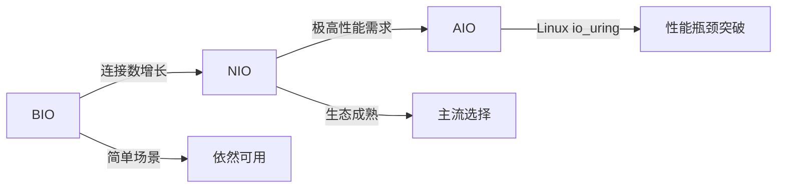
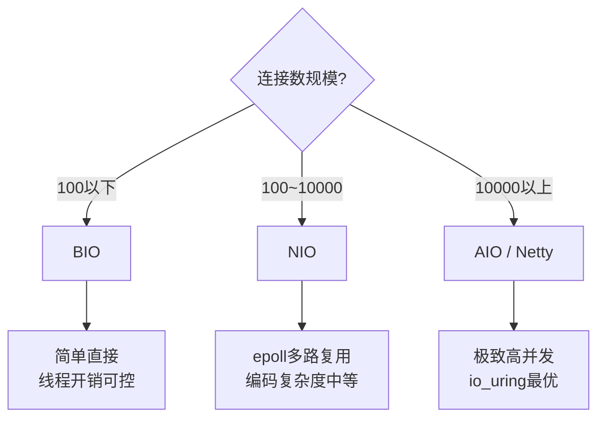

阿里P7面试间，候选人小郑一路过关斩将，刚刚分析完ConcurrentHashMap的源码，面试官放下简历，深吸一口气：

"好，来道综合题。你画图画一下，BIO、NIO、AIO的区别。"

小郑拿起白板笔，画了三个框，分别写了"BIO"、"NIO"、"AIO"，然后在下面写"同步阻塞"、"同步非阻塞"、"异步非阻塞"。

面试官看了看，说："你知道为什么大部分服务器从BIO切换到NIO吗？你知道为什么有些场景NIO不如BIO吗？你知道为什么Linux上AIO的性能其实没有比NIO好多少吗？"

小郑开始擦汗。

【面试官心理】
这道综合题我用来考验候选人的全局视野。BIO/NIO/AIO的区别90%的候选人都能背出来，但真正理解演进原因、知道各自适用场景的不到20%。这道题是P6/P7的分水岭。

## 一、三代IO模型的演进 🔴

### 1.1 为什么需要演进？

**C10K问题的诞生**：

```
时间线：
1999年 — C10K问题提出：同时处理10000个连接
2000年代 — Nginx用epoll解决C10K，成为Web服务器主流
2002年 — Java NIO（JDK 1.4）发布
2007年 — Java AIO（JDK 1.7）发布
2019年 — Linux io_uring成熟
```

BIO的致命问题不是"慢"，而是**线程资源的浪费**：

```java
// BIO的困境：一个线程同时只能处理一个连接的IO
// 10000个连接 = 10000个线程
// 10000个线程 × 1MB栈 = 10GB内存
// 10000个线程上下文切换 = 每次2-5ms，总计20-50秒的切换开销
```

### 1.2 核心维度对比

| 维度 | BIO | NIO | AIO |
| --- | --- | --- | --- |
| **全称** | Blocking IO | Non-Blocking IO | Asynchronous IO |
| **阻塞点** | accept() + read() 全阻塞 | accept()非阻塞，read()可非阻塞 | 全部非阻塞，IO完成回调 |
| **线程模型** | 一请求一线程 | 一个线程管理多路复用 | 系统完成IO，回调通知 |
| **核心机制** | 线程阻塞等待 | selector.select() | CompletionHandler |
| **JDK版本** | JDK 1.0 | JDK 1.4 | JDK 1.7 |
| **适用连接数** | `<1000` | `1000~10万` | `>10万` |
| **CPU空转** | 高（线程空等） | 低（epoll） | 极低（完全异步） |
| **编码复杂度** | 低 | 中 | 高 |



### 1.3 数据拷贝视角

```
BIO:
[网卡]─DMA─>[内核缓冲区]─CPU拷贝─>[用户缓冲区]─[线程]─处理
          ↑ 线程阻塞等DMA     ↑ 线程阻塞等CPU拷贝

NIO (select/poll):
[网卡]─DMA─>[内核缓冲区]─[epoll管理]─通知用户─CPU拷贝─>[用户缓冲区]
             ↑ 数据到达            ↑ 用户态主动发起拷贝

NIO (epoll LT):
[网卡]─DMA─>[内核缓冲区]─[epoll]─通知─[用户读数据]
            每次wait都通知        需完整消费

AIO (真异步):
[网卡]─DMA─>[内核缓冲区]─DMA拷贝─>[用户缓冲区]─回调通知
          ↑ 完全内核异步完成    ↑ 不占用用户线程

零拷贝 (sendfile):
[网卡]─DMA─>[内核缓冲区]─sendfile系统调用─>[socket缓冲区]─DMA─>[目标网卡]
            整个过程无需用户态介入
```

## 二、❌ 错误回答集中营 🔴

### 2.1 背书型错误

**"NIO比BIO快，因为NIO不用等待。"**

- 问题：NIO的`read()`在数据未就绪时也是阻塞的（或返回0），只是用了`Selector`把多个连接的等待合并了。
- 真相：在数据就绪的情况下，BIO和NIO的性能差异不大。NIO的优势在于**减少了线程数量**，而非加快了IO速度。

**"AIO就是Windows IOCP，Linux上没法用。"**

- 问题：Linux有原生AIO（libaio）和io_uring，Java NIO.2也支持AIO API。
- 真相：Linux原生AIO效率不如NIO+epoll是事实，但说"没法用"是不准确的。

**"BIO已经过时了，应该用NIO或AIO。"**

- 问题：BIO在低并发、简单场景下依然高效，切换模型带来的复杂度不是免费的。
- 真相：选型要根据场景来定，不是越"新"越好。

【面试官心理】
这道综合题我最怕听到的就是"同步非阻塞"和"异步非阻塞"这两个词的堆砌。能从**线程模型、数据拷贝、上下文切换**三个维度讲清楚区别的，说明是真的理解；只能背名词的，一追问就崩。

### 2.2 生产场景型错误

**"NIO一定比BIO好，所有项目都应该用NIO。"**

- 问题：NIO的编程复杂度是BIO的3倍以上，维护成本高。在连接数`<1000`的场景，BIO足够且更简单。
- 真相：Tomcat默认切换到NIO是在高并发场景下的优化，不是说BIO本身有错。

## 三、三大模型的适用场景 🟡

### 3.1 选型决策树



### 3.2 典型框架的IO模型选择

| 框架 | IO模型 | 原因 |
| --- | --- | --- |
| Tomcat 7及以前 | BIO | 简单、低并发场景够用 |
| Tomcat 8+ | NIO | NIOConnector 高并发 |
| Netty | NIO (epoll) | 成熟的EventLoop封装 |
| Nginx | epoll | Linux原生高性能 |
| Redis | IO多路复用 | 单线程 + epoll 高效 |
| Kafka | 批量IO + epoll | 网络层用NIO，业务层批量处理 |

:::tip 💡
面试加分点：能说出Redis的单线程模型为什么高效——不是因为单线程快，而是因为Redis是**内存数据库**，瓶颈在CPU而不是IO。单线程避免了锁开销，epoll处理网络IO恰到好处。
:::

## 四、生产避坑 🟡

### 4.1 BIO的OOM陷阱

**线上案例**：某服务用BIO实现长连接推送，10000个并发连接，JVM堆内存使用量飙到8GB，频繁Full GC。

**根因**：BIO每个连接一个线程，线程的本地缓存、本地变量都会占用堆外内存。

**排查**：
```bash
# 查看线程数
ps -eLf | grep java | wc -l
# 查看GC情况
jstat -gcutil <pid> 1000
```

### 4.2 NIO的空轮询Bug

JDK NIO在低并发时可能触发空轮询（selector返回0但无事件就绪），导致CPU 100%空转。

**解决**：升级到JDK 11+，或使用Netty替代直接使用JDK NIO。

### 4.3 AIO在Linux上的坑

Linux上JDK AIO底层使用的是线程池+epoll，**不是真正的异步IO**。在Java 21之前，Linux AIO性能未必比NIO好。

## 五、面试通关话术 🟢

**框架式回答**：

> BIO/NIO/AIO的演进是围绕**线程资源优化**展开的：
> - **BIO**：一请求一线程，线程阻塞在IO等待上。简单直接，但连接数`>1000`时线程开销成为瓶颈。
> - **NIO**：用Selector（epoll）把多个连接的IO就绪通知合并成一个阻塞点，单线程管理多连接。解决了线程数量问题，但IO操作本身仍是同步的。
> - **AIO**：彻底异步化，IO由操作系统完成，完成后回调通知。线程完全不参与IO等待，效率最高，但Linux原生AIO效率不如NIO+epoll。
>
> 选型建议：连接数`<1000`用BIO，`1000~10万`用NIO（Netty），`>10万`可以考虑AIO（配合io_uring）或Netty+epoll。

**追问应对：为什么Redis用单线程+NIO而不是多线程+BIO？**

> 因为Redis是内存数据库，数据操作极快，主要瓶颈不是CPU而是网络IO。单线程避免了锁开销，`epoll`处理高并发网络IO恰到好处。如果用多线程+BIO，线程切换和锁竞争的开销反而会拖累性能。
