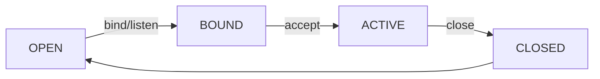

候选人小周在面试滴滴1-2级时，被问到Netty的线程模型后，面试官继续追问：

"Netty的数据从网卡到业务代码，要经过哪些组件？"

小周说："Channel、Pipeline、Handler。"面试官："Pipeline是怎么串联Handler的？Handler之间的数据怎么传递？Inbound和Outbound的顺序有什么区别？"

小周开始画图，边画边说："Pipeline是一个双向链表...Inbound是正向...Outbound是反向..."

面试官打断他："如果我在ChannelRead里写了一个耗时的数据库操作，会发生什么？"

小周说："Netty会...异步处理？"面试官："Netty怎么处理？你怎么让数据库操作不阻塞EventLoop？"

小周彻底说不出话了。

【面试官心理】
Netty三组件是基础，但Pipeline的执行顺序和Handler线程模型才是真正考验理解深度的地方。很多候选人能画出Pipeline的图，但说不清Inbound/Outbound的执行顺序、HandlerContext的write方法链式调用的原理，以及为什么不能阻塞EventLoop。

## 一、四大核心组件 🔴

### 1.1 组件全景

```
┌─────────────────────────────────────────────────────────────┐
│                         Channel                              │
│     （Socket的抽象，对底层IO的封装，持有fd）                    │
└───────────────────────────┬─────────────────────────────────┘
                            │
┌───────────────────────────▼─────────────────────────────────┐
│                     Pipeline                                  │
│  ┌─────────────────────────────────────────────────────────┐ │
│  │ HeadContext ←→ Handler3 ←→ Handler2 ←→ Handler1 ←→ Tail │ │
│  │  (Outbound)    (Mixed)   (Inbound)   (Inbound)          │ │
│  └─────────────────────────────────────────────────────────┘ │
└───────────────────────────┬─────────────────────────────────┘
                            │
┌───────────────────────────▼─────────────────────────────────┐
│                      EventLoop                                │
│     （绑定多个Channel，负责IO事件循环）                         │
└─────────────────────────────────────────────────────────────┘
```

### 1.2 Channel——连接封装

Channel是Netty对底层Socket的抽象：

```java
// 创建Channel
SocketChannel channel = new NioSocketChannel();

// 核心操作
channel.bind(new InetSocketAddress(8080));
channel.write(data);        // 写数据到对端
channel.read(buf);          // 从对端读数据
channel.close();            // 关闭连接
```

**Channel的核心状态**：



## 二、Pipeline——责任链模式 🟡

### 2.1 Pipeline的本质

Pipeline是**责任链模式**的典型应用：Inbound事件从Head到Tail正向传播，Outbound事件从Tail到Head反向传播。

```java
// Pipeline 的默认结构
// HeadContext → (用户Handler) → TailContext

// Inbound Handler（处理读数据）
public class MyInboundHandler extends ChannelInboundHandlerAdapter {
    @Override
    public void channelRead(ChannelHandlerContext ctx, Object msg) {
        // 处理读到的数据
        System.out.println("收到数据: " + msg);
        // 传递给下一个Handler
        ctx.fireChannelRead(msg);
    }
}

// Outbound Handler（处理写数据）
public class MyOutboundHandler extends ChannelOutboundHandlerAdapter {
    @Override
    public void write(ChannelHandlerContext ctx, Object msg, ChannelPromise promise) {
        // 处理要写出的数据
        ctx.write(msg, promise); // 传递给下一个Outbound Handler
    }
}
```

### 2.2 Inbound vs Outbound的执行顺序

```
Inbound顺序（从Head到Tail）：
  HeadContext
    ↓ channelRead()
  Handler1（Inbound）
    ↓ ctx.fireChannelRead()  ← 注意：传递的是原msg，不添加额外处理
  Handler2（Inbound）
    ↓
  Handler3（Inbound/Mixed）
    ↓
  TailContext

Outbound顺序（从Tail到Head）：
  TailContext
    ↓ write()
  Handler3（Mixed）
    ↓
  Handler2（Outbound）
    ↓
  Handler1（Outbound）
    ↓
  HeadContext
    ↓
  socket.write()
```

```java
// 添加Handler到Pipeline
ch.pipeline().addLast("encoder", new MessageToMessageEncoder<>() {});
ch.pipeline().addLast("decoder", new MessageToMessageDecoder<>() {});
ch.pipeline().addLast("businessHandler", new MyBusinessHandler());

// Pipeline中的顺序很重要！
// 如果 decoder 在 encoder 之后，数据就乱套了
```

:::warning ⚠️
Pipeline顺序翻车现场：有一次线上问题，HTTP请求处理正常但响应乱码。排查发现是因为`HttpServerCodec`先解码请求再编码响应，但Handler添加顺序写反了，导致请求解码后的数据被当成响应编码了。

### 2.3 ChannelHandlerContext——Handler的上下文

每个Handler都有自己的Context，通过Context可以操作Pipeline：

```java
public class MyHandler extends ChannelDuplexHandler {
    @Override
    public void channelRead(ChannelHandlerContext ctx, Object msg) {
        // 1. 传递给下一个Inbound Handler
        ctx.fireChannelRead(msg);

        // 2. 直接写回数据（跳过后面的Inbound，走到Outbound）
        ctx.writeAndFlush(msg);

        // 3. 动态添加/删除Handler
        ctx.pipeline().addLast("newHandler", new NewHandler());
        ctx.pipeline().remove("oldHandler");

        // 4. 获取Channel
        ctx.channel();

        // 5. 获取EventLoop
        ctx.executor();
    }
}
```

## 三、EventLoop——线程与循环 🟡

### 3.1 EventLoop的运行机制

```java
// NioEventLoop 的核心循环（简化）
public class NioEventLoop extends SingleThreadEventLoop {
    @Override
    protected void run() {
        for (;;) {
            try {
                // 1. 轮询IO事件（select）
                int readyOps = selector.select();

                // 2. 处理IO事件
                if (readyOps > 0) {
                    processSelectedKeys();
                }

                // 3. 执行普通任务（submit()提交的任务）
                runAllTasks();

            } catch (Exception e) {
                // 异常处理
            }
        }
    }

    private void processSelectedKeys() {
        // 对每个就绪的Channel，分发到对应的Handler
        for (SelectionKey key : selectedKeys) {
            Object a = key.attachment();
            // 处理accept/read/write事件
        }
        selectedKeys.clear(); // 必须手动清空！
    }
}
```

### 3.2 EventLoop的任务队列

EventLoop不仅处理IO事件，还能执行普通任务：

```java
// 向EventLoop提交任务
channel.eventLoop().execute(() -> {
    // 这个任务会在EventLoop线程中执行
    // 一定不会与IO事件并发（单线程保证）
});

channel.eventLoop().schedule(() -> {
    // 延迟任务
}, 5, TimeUnit.SECONDS);
```

:::tip 💡
面试加分点：能说出`execute()`和`submit()`的区别——`execute()`无返回值，`submit()`返回`Future`可以获取执行结果。两者都是在EventLoop线程中顺序执行的。

## 四、四大Handler类型 🔴

### 4.1 编解码Handler

Netty最常用的Handler是**编解码器**：

```java
// TCP粘包拆包问题的经典解决方案：固定长度解码
public class FixedLengthFrameDecoder extends ByteToMessageDecoder {
    private final int frameLength;

    @Override
    protected void decode(ChannelHandlerContext ctx, ByteBuf in, List<Object> out) {
        // 固定长度解析：如每帧100字节
        while (in.readableBytes() >= frameLength) {
            ByteBuf buf = in.readBytes(frameLength);
            out.add(buf);
        }
    }
}

// 行分隔符解码（按换行符分割）
public class LineBasedHandler extends ByteToMessageDecoder {
    // \n 或 \r\n 结尾的帧
}

// 长度字段解码（自定义协议）
public class LengthFieldBasedHandler extends ByteToMessageDecoder {
    // [4字节长度][数据]
}
```

### 4.2 ❌ 错误示范

**候选人原话1**："Pipeline就是Head到Tail的一条链。"

**问题诊断**：
- 不完整。Pipeline实际上是双向链表，Inbound从Head到Tail，Outbound从Tail到Head。很多人忽略了Outbound的反向顺序。

**候选人原话2**："Inbound和Outbound没有区别。"

**问题诊断**：
- 大错特错。Inbound处理读（`channelRead`），Outbound处理写（`write`/`flush`/`bind`/`connect`）。顺序不同，用法也不同。

【面试官心理】
Pipeline的追问我通常从"Inbound的channelRead和Outbound的write方法谁先执行"开始。能画出完整的数据流向图，说清楚HeadContext和TailContext的作用的，基本都是P6+水平。

## 五、生产避坑 🟡

### 5.1 Handler顺序写反

```java
// ❌ 错误顺序
ch.pipeline().addLast("decoder", new HttpRequestDecoder());
ch.pipeline().addLast("encoder", new HttpRequestEncoder());
ch.pipeline().addLast("handler", new BusinessHandler());

// Inbound: decoder → handler（正确）
// Outbound: handler → encoder（正确）

// 但如果是两个解码器/两个编码器，顺序就很重要了
// 解码器顺序：先处理的先注册
// 编码器顺序：后处理的后注册
```

### 5.2 Handler重复添加

```java
// ❌ 问题：同一个Handler实例不能多次添加到Pipeline
public class MyChannelInitializer extends ChannelInitializer<SocketChannel> {
    @Override
    protected void initChannel(SocketChannel ch) {
        MyHandler handler = new MyHandler();
        ch.pipeline().addLast(handler); // 第一次
        // ...
    }
}

// ✅ 正确：每次初始化创建新实例，或者检查是否已添加
ch.pipeline().addLast(new MyHandler());
```

### 5.3 内存泄漏

Netty的ByteBuf必须手动释放，否则内存泄漏：

```java
// ❌ 泄漏
public void channelRead(ChannelHandlerContext ctx, Object msg) {
    ByteBuf buf = (ByteBuf) msg;
    System.out.println(buf.toString(StandardCharsets.UTF_8));
    // 没有释放buf！
}

// ✅ 正确：手动释放
public void channelRead(ChannelHandlerContext ctx, Object msg) {
    ByteBuf buf = (ByteBuf) msg;
    try {
        System.out.println(buf.toString(StandardCharsets.UTF_8));
    } finally {
        ReferenceCountUtil.release(msg); // 必须释放
    }
}

// ✅ 更优雅：用SimpleChannelInboundHandler
public class MyHandler extends SimpleChannelInboundHandler<ByteBuf> {
    @Override
    protected void channelRead0(ChannelHandlerContext ctx, ByteBuf msg) {
        // 自动释放msg，无需手动处理
        System.out.println(msg.toString(StandardCharsets.UTF_8));
    }
}
```

:::details 📖 点击展开：内存泄漏检测
```java
// 开启Netty的泄漏检测级别
// 有四种级别：DISABLED（禁用）、SIMPLE（1%采样）、ADVANCED（详细）、PARANOID（每次都检测）
-Dio.netty.leakDetection.level=ADVANCED

// 泄漏检测输出示例：
// LEAK: ByteBuf.release() was not called before it's garbage-collected
// See http://netty.io/wiki/reference-counted-objects.html
```
:::

## 六、面试通关话术

**开场**：
> Netty的四大核心组件是Channel、Pipeline、ChannelHandler、EventLoop。Channel是对底层Socket的封装，Pipeline是责任链模式管理Handler，Handler是处理逻辑的单元，EventLoop是绑定Channel的IO线程。数据从网卡到业务代码的流程是：EventLoop轮询到read事件 → HeadContext.fireChannelRead() → Pipeline链式传播 → TailContext。

**被追问Inbound/Outbound顺序**：
> Inbound事件（channelRead）从Head到Tail传播，Outbound事件（write）从Tail到Head传播。Head和Tail是Pipeline的两端，它们分别负责与底层IO交互。Inbound先解码后给业务Handler，Outbound先给业务Handler再编码。

**被追问Handler中的阻塞**：
> Handler中的耗时操作（如数据库查询）必须放到业务线程池，不能阻塞EventLoop。Netty提供了`ctx.executor()`或`ctx.channel().eventLoop().execute()`来提交异步任务。
