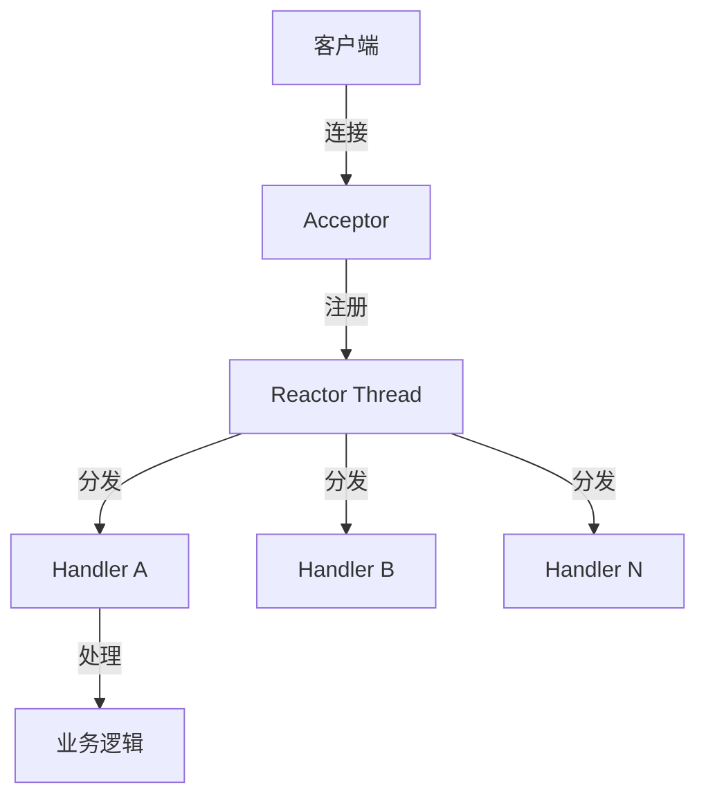
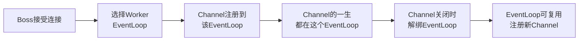

美团P6面试间，候选人小冯正在讲述Netty的使用经验，面试官突然打断：

"你用的Netty是几线程模型？"

小冯说："有Boss和Worker两个线程池。"面试官："那Boss线程和Worker线程分别干什么？"

小冯说："Boss处理连接，Worker处理读写。"

面试官追问："一个Worker线程管理多少个连接？如果有10000个连接，是不是只有一个Worker在处理？"

小冯说："应该是...多个Worker？"面试官："那你详细说说，一个连接的数据读写，从头到尾是怎么走的？"

小冯开始模糊。

面试官继续追问："你听说过'线程安全'问题吗？在Netty里，一个Channel的数据读写，在什么情况下会有线程安全问题？"

小冯彻底卡住。

【面试官心理】
这道题我用来筛选有没有深入理解Netty线程模型的候选人。Boss/Worker分工是最基础的，但能说出"Channel绑定到EventLoop的生命周期"和"Handler的线程安全问题"的不到30%。能说清楚Netty为什么选择这种模型的，基本都有过生产调优经验。

## 一、Reactor模式的核心思想 🔴

### 1.1 为什么需要Reactor

BIO的问题我们知道了：每个连接一个线程，线程太贵。

解决思路是什么？**用少量线程管理大量连接**。

```
BIO思路：1个连接 = 1个线程
        10000连接 = 10000线程 → 崩溃

Reactor思路：1个线程 = N个连接的事件监听
             少量线程 + epoll = 管理10000连接
```

Reactor（反应器）模式的核心：**把"主动轮询IO状态"这件事交给Selector，线程只处理已就绪的事件**。

### 1.2 单线程Reactor模型



```java
// 伪代码：单线程Reactor
Selector selector = Selector.open();
serverChannel.register(selector, SelectionKey.OP_ACCEPT);

while (true) {
    selector.select(); // 阻塞等待事件
    Set<SelectionKey> keys = selector.selectedKeys();

    for (SelectionKey key : keys) {
        if (key.isAcceptable()) {
            // 处理新连接
            SocketChannel client = serverChannel.accept();
            client.register(selector, SelectionKey.OP_READ);
        }
        if (key.isReadable()) {
            // 处理读写
            handler.handle(key);
        }
    }
}
```

**单线程Reactor的问题**：业务逻辑和IO处理共用一个线程，如果业务处理耗时（如数据库查询），整个Reactor线程被阻塞，所有其他连接都在等待。

### 1.3 多线程Reactor模型

**Netty使用的改进版**：

```
Boss线程组（通常1个）：监听OP_ACCEPT事件，只负责accept
    │
    │ accept到的连接
    ▼
Worker线程组（N个）：监听OP_READ/OP_WRITE事件，处理IO读写
    │
    ├── EventLoop 1：管理 1000 个 Channel
    ├── EventLoop 2：管理 1000 个 Channel
    └── EventLoop N：管理 1000 个 Channel
```

```java
// Netty 标准写法
EventLoopGroup bossGroup = new NioEventLoopGroup(1);  // Boss: 通常1个
EventLoopGroup workerGroup = new NioEventLoopGroup();  // Worker: 默认 CPU*2

ServerBootstrap bootstrap = new ServerBootstrap();
bootstrap.group(bossGroup, workerGroup)
         .channel(NioServerSocketChannel.class)
         .childHandler(new ChannelInitializer<SocketChannel>() {
             @Override
             protected void initChannel(SocketChannel ch) {
                 ch.pipeline().addLast(new MyHandler());
             }
         });

ChannelFuture f = bootstrap.bind(8080).sync();
```

## 二、Netty的Boss/Worker线程分工 🔴

### 2.1 Boss线程职责

**Boss线程只做一件事**：接收客户端连接（`OP_ACCEPT`）。

```java
// Boss线程处理 accept
// 伪代码（来自 NioServerSocketChannel）
@Override
public void accept(ChannelHandlerContext ctx) {
    // 获取客户端连接
    SocketChannel ch = javaChannel().accept();
    // 将连接注册到 Worker
    registerAcceptedChannel(ch, ctx);
}
```

为什么Boss只需要1个？因为`ServerSocketChannel.accept()`本身是快速的（TCP握手已完成），不需要并发。多个Boss没有意义，反而增加复杂度。

:::tip 💡
面试加分点：如果候选人能说出`bossGroup`设置为1的原因，以及如何通过`childGroup`调整worker数量，说明有实际调优经验。

### 2.2 Worker线程职责

**Worker线程做三件事**：
1. 监听IO事件（`OP_READ`、`OP_WRITE`）
2. 读取数据到ByteBuf
3. 分发到Pipeline处理

```java
// Worker线程处理 read/write
// 伪代码（来自 NioSocketChannel）
@Override
protected void read() {
    ByteBuf buf = alloc().buffer();
    int bytes = javaChannel().read(buf.nioBuffer());
    // 分发到Pipeline的Handler
    pipeline().fireChannelRead(buf);
}
```

**关键设计**：每个`Channel`被绑定到**一个固定的EventLoop**（从注册开始直到Channel关闭）。这意味着：
- 一个连接的所有IO事件都在同一个线程处理
- **天然避免了线程安全问题**：同一个Channel的数据不会并发处理
- 但Handler中如果执行了阻塞操作，会影响该EventLoop上所有其他Channel

### 2.3 ❌ 错误示范

**候选人原话1**："Worker线程数默认是CPU核数。"

**问题诊断**：
- 半对半错。Netty 4.x默认是`CPU核数 * 2`（`Runtime.getRuntime().availableProcessors() * 2`）。
- Netty 3.x默认是`CPU核数 + 1`。
- 版本差异不说清楚，会被追问到崩溃。

**候选人原话2**："Netty是多线程处理请求的，每个Handler都在不同线程。"

**问题诊断**：
- 恰恰相反！同一个Channel的Handler链在**同一个EventLoop线程**中顺序执行。
- 这就是Netty的"无锁化"设计：避免了Handler之间的同步开销。

**候选人原话3**："Boss和Worker可以共享一个线程池。"

**问题诊断**：
- 可以，但不要这么做。`bootstrap.group(bossGroup, workerGroup)`传同一个Group，所有线程混在一起，职责不明。
- 最佳实践是分开：`bossGroup`1个线程，`workerGroup`多个线程。

【面试官心理】
Boss/Worker分工是最基础的问题。但追问到"为什么一个Channel要固定在一个EventLoop上"和"Handler中能不能用synchronized"，就能看出理解深度。前者是为了避免并发，后者是为了避免阻塞EventLoop。

## 三、Channel与EventLoop的绑定机制 🟡

### 3.1 绑定时机与生命周期



**绑定规则**（`NioEventLoopGroup`）：

```java
// WorkerGroup 中选择 EventLoop 的策略：Round Robin（轮询）
// 伪代码
private AtomicInteger nextId = new AtomicInteger(0);

EventLoop next() {
    int id = nextId.getAndIncrement() % children.length;
    return children[id];
}
```

**绑定后的保证**：

```java
// Channel 被固定到一个 EventLoop
// 这段代码在同一个线程中执行
channel.eventLoop().execute(() -> {
    // 这里的代码一定在 EventLoop 线程中
    // 对 ChannelHandlerContext 的操作是线程安全的
});
```

### 3.2 阻塞操作——Netty的头号敌人

**在Handler中执行阻塞操作，会导致整个EventLoop被阻塞**：

```java
// ❌ 错误：在Handler中执行阻塞操作
public class MyHandler extends ChannelInboundHandlerAdapter {
    @Override
    public void channelRead(ChannelHandlerContext ctx, Object msg) {
        // 阻塞数据库查询——这会阻塞整个EventLoop！
        User user = db.queryById(userId);
        ctx.writeAndFlush(user);
    }
}

// ✅ 正确：业务处理放到专门的业务线程池
public class MyHandler extends ChannelInboundHandlerAdapter {
    @Override
    public void channelRead(ChannelHandlerContext ctx, Object msg) {
        // 提交到业务线程池，不阻塞EventLoop
        businessExecutor.submit(() -> {
            User user = db.queryById(userId);
            ctx.writeAndFlush(user); // 注意：这里回到EventLoop线程
        });
    }
}
```

:::warning ⚠️
生产翻车点：很多新手在Netty Handler中直接写同步数据库查询或HTTP请求，导致Netty线程被阻塞，QPS从10万瞬间掉到几百。排查时`jstack`看EventLoop线程堆栈即可发现问题。

## 四、生产调优：线程数配置 🟡

### 4.1 线程数配置公式

```
Worker线程数 = CPU核数 * 2（JDK NIO默认值）
              或 CPU核数 * 2 * (1 + 某个等待时间比例)
```

IO密集型场景：`CPU核数 * 2`是保守配置。如果每个连接有较多等待时间（如慢查询、外部API调用），可以增加到`CPU核数 * 2 * 2`。

```java
// IO密集型：CPU*2 + 一个等待时间修正
EventLoopGroup workerGroup = new NioEventLoopGroup(
    Math.min(32, Runtime.getRuntime().availableProcessors() * 2)
);
```

### 4.2 内存优化：ByteBuf池

```java
// 配置 ByteBuf 内存池，减少 GC 压力
// 默认使用 PooledByteBufAllocator
bootstrap.option(ChannelOption.ALLOCATOR, PooledByteBufAllocator.DEFAULT)
         .childOption(ChannelOption.ALLOCATOR, PooledByteBufAllocator.DEFAULT);
```

| 配置 | 适用场景 |
| --- | --- |
| `PooledByteBufAllocator`（默认） | 高并发、低延迟 |
| `UnpooledByteBufAllocator` | 低并发、调试阶段 |

### 4.3 连接超时配置

```java
bootstrap.option(ChannelOption.CONNECT_TIMEOUT_MILLIS, 3000)  // 连接超时 3s
         .option(ChannelOption.SO_KEEPALIVE, true)           // TCP保活
         .option(ChannelOption.TCP_NODELAY, true);            // 禁用Nagle
```

## 五、Netty vs Tomcat 线程模型对比 🟢

| 维度 | Netty | Tomcat（NIO） |
| --- | --- | --- |
| 连接管理 | BossGroup接受，Worker处理 | Tomcat用Servlet线程处理业务 |
| 线程复用 | EventLoop固定Channel | 线程池按需分配 |
| IO模型 | 基于NIO+epoll | 基于NIO+Tomcat自定义NIO |
| Handler链 | Pipeline无锁化 | FilterChain |
| 长连接 | 天然支持 | 需配置 |
| 性能 | 极高（无锁化） | 高（同步Servlet模型） |

## 六、面试通关话术

**开场**：
> Netty使用的是改进版Reactor模型：1个Boss线程负责accept连接，N个Worker线程（默认CPU*2）负责IO读写。每个Channel从创建到关闭，都固定在一个EventLoop线程中处理，**同一个Channel的所有Handler都在同一个线程**，天然避免了并发问题。如果业务处理耗时，需要放到专门的业务线程池中，不能阻塞EventLoop。

**被追问为什么Channel要固定EventLoop**：
> 这是Netty实现无锁化的关键。避免了多线程并发访问同一个Channel的Handler链，不需要额外的同步开销。如果一个连接的数据在多个EventLoop中乱窜，就需要加锁，Netty的性能优势就不存在了。

**被追问Handler线程安全**：
> Channel绑定EventLoop意味着同一个Channel的Handler链是单线程执行的，不需要加锁。但跨Channel的数据共享（如全局计数器、共享连接池）仍然需要线程安全。Handler中的业务逻辑如果执行时间长，必须放到线程池，否则会阻塞EventLoop。
