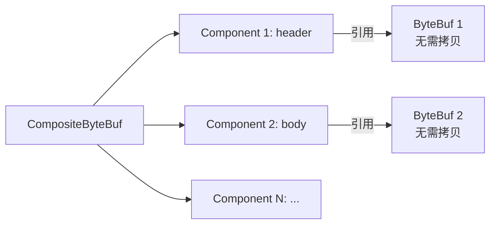

候选人小吴在面试快手2-2级别时，被问到Netty的性能优化，面试官问：

"Netty是怎么实现零拷贝的？"

小吴说："用DirectBuffer。"面试官："DirectBuffer为什么算零拷贝？"

小吴说："因为不需要JVM堆..."面试官追问："那CompositeByteBuf呢？它和普通ByteBuf有什么区别？"

小吴说："...组合？"面试官继续追问："Netty的零拷贝和Linux的sendfile零拷贝有什么区别？Netty能用到sendfile吗？"

小吴彻底沉默了。

【面试官心理】
Netty的零拷贝是P6+的高频考点。很多候选人知道"零拷贝"三个字，但说不清Netty零拷贝的具体手段。BIO/NIO/AIO讲的是IO模型，Netty零拷贝讲的是内存优化，两者维度不同但互相关联。

## 一、Netty零拷贝的四个维度 🔴

### 1.1 为什么需要零拷贝

在Netty中，数据经过多个Handler时，会涉及大量**ByteBuf的创建、复制和销毁**：

```
HTTP请求数据：
  Socket缓冲区 → ByteBuf (decode)
    → ByteBuf (gzip解压)
      → ByteBuf (业务处理)
        → ByteBuf (gzip压缩)
          → ByteBuf (encode)
            → Socket缓冲区

每次复制/创建 ByteBuf 都有成本：
- JVM堆分配：Minor GC压力
- 直接内存分配：堆外内存管理开销
- 数据拷贝：CPU参与的数据搬运
```

Netty的零拷贝策略：**能合并不合并、能复用不创建、能用直接内存就不用堆内存**。

### 1.2 Netty零拷贝的四把武器

| 手段 | 作用 | 解决的问题 |
| --- | --- | --- |
| `CompositeByteBuf` | 合并多个ByteBuf为一个逻辑Buffer | 避免数据合并时的拷贝 |
| `DirectBuffer` | 直接内存操作 | 避免堆内外数据拷贝 |
| `FileRegion` | 文件传输零拷贝 | 利用Linux sendfile |
| `slice()`/`duplicate()` | 零拷贝视图 | 共享数据避免复制 |

## 二、CompositeByteBuf——逻辑合并 🔴

### 2.1 传统合并的问题

```java
// ❌ 传统方式：合并两个ByteBuf，需要创建新缓冲区并拷贝数据
ByteBuf buf1 = Unpooled.buffer(10);
buf1.writeBytes("Hello".getBytes());

ByteBuf buf2 = Unpooled.buffer(10);
buf2.writeBytes("World".getBytes());

// 创建新缓冲区并拷贝（一次额外的数据拷贝）
ByteBuf merged = Unpooled.buffer(buf1.readableBytes() + buf2.readableBytes());
merged.writeBytes(buf1);
merged.writeBytes(buf2);
```

### 2.2 CompositeByteBuf的合并

```java
// ✅ CompositeByteBuf：逻辑上合并，无需数据拷贝
CompositeByteBuf composite = Unpooled.compositeBuffer();

ByteBuf header = Unpooled.buffer(20);
header.writeBytes("HTTP/1.1 200 OK\r\n".getBytes());

ByteBuf body = Unpooled.buffer(100);
body.writeBytes("Hello World".getBytes());

composite.addComponents(header, body);
// composite现在"看起来"是一个完整的ByteBuf
// 实际上内部维护着两个ByteBuf的引用，没有数据拷贝！

// 写入Channel
ctx.write(composite);
```

**CompositeByteBuf的内部结构**：



:::tip 💡
CompositeByteBuf的适用场景：HTTP响应头+响应体、协议头+协议体、固定头+变长体。每次合并不需要额外拷贝数据，但读取时会按顺序遍历所有组件。

### 2.3 ❌ 错误示范

**候选人原话**："CompositeByteBuf就是把所有ByteBuf合成一个大ByteBuf了。"

**问题诊断**：
- 错误理解了合并机制。CompositeByteBuf**不移动任何数据**，只是在逻辑上"串联"多个ByteBuf。
- 如果CompositeByteBuf把所有数据合成一个大ByteBuf，那就跟传统方式没有区别了。

【面试官心理】
能说出CompositeByteBuf内部是"逻辑串联而非物理合并"的候选人，基本都看过Netty源码或写过大量代码验证过。这是P6+的加分项。

## 三、DirectBuffer与堆外内存 🟡

### 3.1 堆内vs堆外的区别

```java
// 堆内Buffer（JVM堆）
ByteBuf heapBuffer = Unpooled.buffer(1024);
// 存储在byte[]数组中，GC会回收，但IO时需要拷贝到堆外

// 直接内存（堆外）
ByteBuf directBuffer = Unpooled.directBuffer(1024);
// 存储在操作系统直接内存，IO时无需额外拷贝
```

**IO流程对比**：

```
堆内Buffer发送数据：
  byte[] → 堆内内存 → JDK临时分配的直接内存 → Socket缓冲区
                    ↑ 额外拷贝

直接内存发送数据：
  直接内存 → Socket缓冲区
  ↑ 无额外拷贝
```

### 3.2 Netty的ByteBuf分配策略

Netty默认使用直接内存（`PooledByteBufAllocator.DEFAULT`）：

```java
// Netty ByteBuf分配器
// 1. 池化（Pooled）：复用ByteBuf对象，减少GC
// 2. 直接内存（Direct）：减少堆内外拷贝

// 默认配置：池化 + 直接内存
// PooledByteBufAllocator.DEFAULT
//  - 使用直接内存
//  - 内存池复用
//  - 最大容量：约16MB（JVM堆外内存限制）

// 如果JVM堆外内存不够，可以调整
-Dio.netty.maxDirectMemory=2g
```

### 3.3 何时用堆内，何时用堆外

| 场景 | 推荐类型 | 原因 |
| --- | --- | --- |
| 网络IO（发送/接收） | DirectBuffer | 减少堆内外拷贝 |
| 临时数据处理 | HeapBuffer | 分配快，GC自动回收 |
| 文件IO（mmap） | DirectBuffer | mmap本身是直接内存 |
| 协议编解码 | HeapBuffer | 编解码逻辑简单，分配快更重要 |

## 四、FileRegion——文件零拷贝 🟡

### 4.1 FileRegion的原理

FileRegion利用Linux的`sendfile`系统调用，实现**文件数据到网卡的直接传输**：

```java
// 传统方式：需要先把文件读入ByteBuf，再发送
// ❌ 数据需要从磁盘→内核缓冲区→用户缓冲区→Socket缓冲区→网卡
FileInputStream fis = new FileInputStream("file.txt");
ByteBuf buf = Unpooled.buffer();
buf.writeBytes(Files.readAllBytes(Paths.get("file.txt")));
channel.writeAndFlush(buf);

// FileRegion方式：直接调用sendfile
// ✅ 数据从磁盘→内核缓冲区→Socket缓冲区→网卡（完全跳过用户态）
FileRegion region = new DefaultFileRegion(
    new FileInputStream("file.txt").getChannel(), 0, file.length()
);
channel.writeAndFlush(region);
```

### 4.2 FileRegion的内部机制

```java
// DefaultFileRegion 内部实现
@Override
public long transferTo(WritableByteChannel target, long position, long count) {
    // 调用底层Channel的transferTo
    return fileChannel.transferTo(position, count, target);
    // 底层对应操作系统的 sendfile() 系统调用
}
```

### 4.3 ChunkedFile——大文件分块传输

对于超大文件，`FileRegion`配合`ChunkedFile`实现分块零拷贝：

```java
// 大文件分块传输：避免一次性加载整个文件到内存
ChunkedFile chunkedFile = new ChunkedFile(file, chunkSize);
channel.writeAndFlush(new ChunkedWriteHandler().writeChunked(channel, chunkedFile));
// 每块4KB，自动分块，通过FileRegion逐块零拷贝发送
```

:::warning ⚠️
FileRegion的限制：只能传输文件到Socket，不能修改文件内容（因为是零拷贝，数据不经过用户态）。如果需要边读边处理（如添加HTTP头），不能用FileRegion，需要用传统ByteBuf方式。

## 五、slice()与duplicate() 🟢

### 5.1 零拷贝视图

```java
ByteBuf original = Unpooled.directBuffer(1024);
original.writeBytes("Hello World".getBytes());

// slice(): 创建一个共享原数据的"视图"，不拷贝数据
ByteBuf slice = original.slice(0, 5); // 共享"Hello"部分
slice.setByte(0, 'J');              // 修改会影响original
System.out.println(original.toString(StandardCharsets.UTF_8)); // Jello World

// duplicate(): 复制整个ByteBuf的"视图"
ByteBuf dup = original.duplicate(); // 共享所有数据
dup.setByte(6, 'Z');                // 修改也会影响original
System.out.println(original.toString(StandardCharsets.UTF_8)); // Hello Zorld
```

**区别对比**：

| 方法 | 共享范围 | 独立读写位置 | 独立引用计数 |
| --- | --- | --- | --- |
| `slice(start, end)` | 指定范围 | ✅ 独立position | ✅ 独立 |
| `duplicate()` | 全部 | ✅ 独立position | ✅ 独立 |
| `copy()` | 全部 | ✅ 独立position | ✅ 独立 |

:::tip 💡
面试加分点：slice和duplicate都实现了"零拷贝"——不复制底层数据，只是创建了不同的"视图"。copy()则是创建了一个全新的ByteBuf，包含完整的数据拷贝。

## 六、Netty零拷贝与Linux零拷贝的关系 🟡

### 6.1 两者的关系

```
Netty零拷贝：应用层优化（ByteBuf层面）
  - CompositeByteBuf: 多个Buffer逻辑合并
  - DirectBuffer: 减少堆内外拷贝
  - slice/duplicate: 视图共享
  - FileRegion: 配合Linux sendfile

Linux零拷贝：操作系统层面优化（系统调用层面）
  - sendfile: 内核空间直接传输
  - mmap: 文件映射到用户态
  - io_uring: 完全异步IO

两者可以叠加：
  FileRegion（Netty） → Linux sendfile → 极致零拷贝
```

### 6.2 Netty为什么选择DirectBuffer而非总是用sendfile

sendfile虽然极致，但它有两个限制：

1. **不能修改数据**：数据不经过用户态，无法在传输过程中修改（如添加HTTP头）
2. **只适合文件到Socket**：不适合"内存数据→Socket"场景

Netty的策略是：
- 文件传输：用`FileRegion` + sendfile
- 普通数据传输：用`DirectBuffer` + 池化

## 七、生产避坑 🟢

### 7.1 直接内存泄漏

```java
// ❌ 泄漏：忘记释放DirectBuffer
ByteBuf buf = Unpooled.directBuffer(1024);
buf.writeBytes(data);
channel.writeAndFlush(buf);
// channelWrite后，Netty自动释放buf
// 但如果在flush之前抛异常，buf就不会被释放

// ✅ 正确：使用ReferenceCountUtil
try {
    ByteBuf buf = Unpooled.directBuffer(1024);
    buf.writeBytes(data);
    ctx.writeAndFlush(buf);
} catch (Exception e) {
    ReferenceCountUtil.release(buf); // 异常时手动释放
}
```

### 7.2 CompositeByteBuf的内存碎片

如果频繁添加/移除组件，CompositeByteBuf内部会产生碎片。Netty提供了`consolidate()`方法来合并碎片：

```java
// 合并碎片
composite.consolidate();

// 合并后再检查容量
composite.ensureWritable(100);
```

## 八、面试通关话术

**开场**：
> Netty的零拷贝是从四个维度实现的：CompositeByteBuf通过逻辑合并多个Buffer避免数据拷贝；DirectBuffer利用堆外内存避免JVM堆内外拷贝；FileRegion通过Linux sendfile实现文件到网卡的内核直传；slice/duplicate通过创建视图共享底层数据而不是复制。这四个手段可以叠加使用。

**被追问CompositeByteBuf和sendfile的区别**：
> 两者是不同的维度。CompositeByteBuf是应用层的"逻辑合并"，解决的是多个ByteBuf要不要合、怎么合的问题。sendfile是操作系统的"系统调用优化"，解决的是数据要不要经过用户态的问题。Netty的FileRegion就是在应用层调用sendfile，把两者结合起来了。

**被追问实际优化案例**：
> 我们线上有个文件推送服务，原来用ByteBuffer读取文件再发送，QPS只有3000。后来改用FileChannel.transferTo()配合Netty的FileRegion，QPS直接提升到20000+，CPU使用率反而下降了40%。数据量越大，零拷贝的优势越明显。
