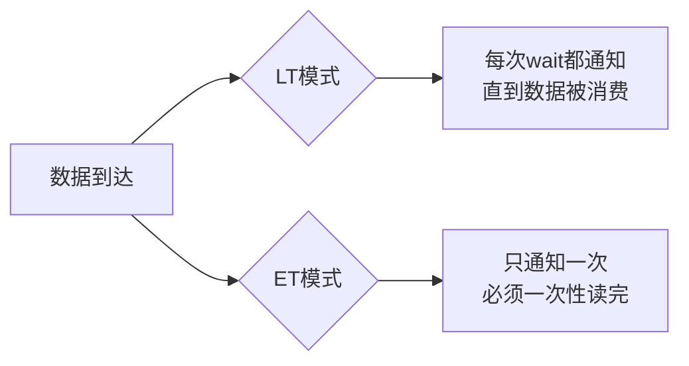

美团L7面试间里，候选人小孙刚回答完BIO的线程模型，面试官把话题一转：

"好，那你知道NIO吗？"

小孙松了口气："知道，New IO嘛，Non-Blocking IO。"

面试官："Channel、Buffer、Selector，这三个核心组件说一下。"

小孙开始背诵："Channel是通道，Buffer是缓冲区，Selector是选择器..."面试官打断他："那Buffer的底层数据结构是什么？"

小孙："...数组？"面试官："什么数组？ByteBuffer和LongBuffer是一样的结构吗？"

小孙卡住了。

面试官继续追问："Selector的底层实现是什么？select/poll/epoll三者有什么区别？"

小孙彻底沉默。

【面试官心理】
这题我用来区分P5和P6。BIO背熟了只能说明基础还行，但NIO才是真正考验理解深度的地方。能把Channel/Buffer/Selector三者的协作关系讲清楚、能说出select/poll/epoll差异的候选人，基本都有过生产环境排查问题的经验。

## 一、NIO核心三组件 🔴

### 1.1 整体架构概览

```
┌──────────────────────────────────────────────────────┐
│                    Selector                          │
│         （单线程管理多个连接的事件分发器）               │
└──────────────┬───────────────────┬───────────────────┘
               │                   │
    ┌──────────▼──────┐   ┌───────▼────────┐
    │    Channel     │   │    Channel     │
    │  (SocketChannel)│   │  (ServerSocket)│
    └────────┬───────┘   └───────┬────────┘
             │                   │
      ┌──────▼──────┐     ┌──────▼──────┐
      │   Buffer    │     │   Buffer    │
      │ (HeapBuffer)│     │ (DirectBuffer)│
      └─────────────┘     └─────────────┘
```

NIO的核心思想是：**用单线程管理多个连接**，把"线程阻塞等待"换成"事件驱动"。

### 1.2 Channel——数据通道

**Channel（通道）**是连接用户缓冲区和内核缓冲区的桥梁。数据从网卡到程序，路径是：网卡→内核缓冲区→Channel→Buffer→程序。

```java
// 服务端NIO初始化
ServerSocketChannel serverChannel = ServerSocketChannel.open();
serverChannel.socket().bind(new InetSocketAddress(8080));
serverChannel.configureBlocking(false); // 关键：设为非阻塞

Selector selector = Selector.open();
serverChannel.register(selector, SelectionKey.OP_ACCEPT);
```

**关键点**：`configureBlocking(false)`把Channel从阻塞模式切换到非阻塞模式。在阻塞模式下，`accept()`会等待连接；在非阻塞模式下，如果没有连接，`accept()`立即返回`null`。

**Channel的类型**：
- `FileChannel`：文件IO，只能阻塞
- `SocketChannel`：TCP客户端IO，非阻塞
- `ServerSocketChannel`：TCP服务端监听，非阻塞
- `DatagramChannel`：UDP IO

### 1.3 Buffer——缓冲区

**Buffer是NIO的核心数据结构**，它不是简单的数组，而是一个有**读写位置指针**的环形数组。

```java
// Buffer 的内部结构
public abstract class Buffer {
    // 标记：备忘位置
    private int mark = -1;
    // 位置：下一个读写的位置
    private int position = 0;
    // 上限：有效数据的边界
    private int limit;
    // 容量：数组大小
    private int capacity;
}
```

四个指针的关系：**`0 <= mark <= position <= limit <= capacity`**

```java
ByteBuffer buffer = ByteBuffer.allocate(10);

// 初始状态
// capacity=10, limit=10, position=0, mark=-1

buffer.put((byte) 1);
buffer.put((byte) 2);
buffer.put((byte) 3);
// capacity=10, limit=10, position=3, mark=-1

// 切换读模式之前必须调用 flip()
buffer.flip();
// capacity=10, limit=3, position=0

// 读取数据
byte b1 = buffer.get(); // position=1
byte b2 = buffer.get(); // position=2

// compact() 压缩：未读数据移到开头
buffer.compact();
// 未读数据(第3个字节)移到开头，position=1, limit=10

// clear() 清空：全部回到初始状态
buffer.clear();
// capacity=10, limit=10, position=0, mark=-1
```

:::tip 💡
面试加分点：能说出`flip()`、`compact()`、`clear()`的区别和适用场景。`flip()`用于切换读写，`compact()`用于部分消费后保留未读数据，`clear()`用于清空整个缓冲区。
:::

**Buffer的两种实现**：

| 类型 | 实现 | 特点 |
| --- | --- | --- |
| HeapBuffer | `allocate()` | 在JVM堆上分配，速度快，但IO时需要拷贝到直接内存 |
| DirectBuffer | `allocateDirect()` | 直接在OS内存分配，IO时零拷贝，但创建销毁慢 |

```java
// HeapBuffer：JVM堆内存
ByteBuffer heapBuffer = ByteBuffer.allocate(1024);

// DirectBuffer：直接内存（OS级别）
ByteBuffer directBuffer = ByteBuffer.allocateDirect(1024);
```

### 1.4 Selector——多路复用器

**Selector是NIO的灵魂**。它用**一个线程管理多个Channel**的IO事件，避免了BIO中每个连接一个线程的问题。

```java
Selector selector = Selector.open();

// Channel 注册到 Selector，监听 OP_ACCEPT 事件
serverChannel.register(selector, SelectionKey.OP_ACCEPT);

while (true) {
    // 阻塞等待就绪事件（这里"阻塞"的是selector本身，不是Channel）
    selector.select();

    // 获取所有就绪事件
    Set<SelectionKey> keys = selector.selectedKeys();
    Iterator<SelectionKey> it = keys.iterator();

    while (it.hasNext()) {
        SelectionKey key = it.next();
        it.remove(); // 必须移除，否则会重复处理

        if (key.isAcceptable()) {
            // OP_ACCEPT就绪
            ServerSocketChannel server = (ServerSocketChannel) key.channel();
            SocketChannel client = server.accept();
            client.configureBlocking(false);
            client.register(selector, SelectionKey.OP_READ);
        }

        if (key.isReadable()) {
            // OP_READ就绪
            SocketChannel client = (SocketChannel) key.channel();
            ByteBuffer buffer = ByteBuffer.allocate(1024);
            client.read(buffer);
        }
    }
}
```

### 1.5 ❌ 错误示范

**候选人原话1**："Selector就是用来避免阻塞的。"

**问题诊断**：
- 说法不准确：Selector本身是阻塞的（`selector.select()`会阻塞），但它把多个Channel的阻塞合并成一个阻塞点。
- 真正避免阻塞的是：**IO操作本身变成了非阻塞的**，多个连接可以复用同一个线程。

**候选人原话2**："Buffer就是数组，读写直接操作就行了。"

**问题诊断**：
- 忽略了position/limit/capacity的指针机制。
- 不知道`flip()`的必要性：不调用`flip()`直接读，读不到任何数据（position已经在末尾了）。

**候选人原话3**："NIO就是比BIO快，因为不用创建那么多线程。"

**问题诊断**：
- 只知其一不知其二：NIO快的核心原因是**IO多路复用**，减少了线程阻塞和上下文切换。
- 不知道NIO的劣势：编程复杂度大幅增加，需要维护连接状态。

【面试官心理】
NIO三组件的追问，我通常从Buffer的内部结构入手。很多人只知道Buffer是缓冲区，但说不清position/limit/capacity的含义。能讲清楚flip/compact/clear区别的，说明真正写过代码。

## 二、select/poll/epoll 的本质差异 🟡

### 2.1 三者对比

这是NIO中最容易被忽略但面试官最爱问的深水区。

| 维度 | select | poll | epoll |
| --- | --- | --- | --- |
| 数据结构 | bitmap（`fd_set`） | 动态数组（`pollfd`） | 红黑树 + 链表 |
| 最大fd限制 | 1024（`FD_SETSIZE`） | 无限制（动态数组） | 无限制 |
| 时间复杂度 | `O(n)` 遍历全部fd | `O(n)` 遍历全部fd | `O(1)` 只遍历就绪的 |
| FD复制 | 每次调用都要从用户态拷贝到内核态 | 每次调用都要拷贝 | 只在注册时拷贝一次 |
| 触发方式 | 水平触发（LT） | 水平触发（LT） | 支持边缘触发（ET）+ LT |

**select的致命问题**：
- `fd_set`是固定大小的bitmap（通常1024），连接数超过1024就崩溃
- 每次调用`select()`，都要把整个fd数组从用户态拷贝到内核态（`O(n)`拷贝）
- 内核返回后，需要遍历所有fd找到就绪的（`O(n)`遍历）

```c
// select 的问题：每次调用都要全量拷贝+全量遍历
fd_set readfds;
FD_ZERO(&readfds);
FD_SET(fd1, &readfds);
FD_SET(fd2, &readfds);
// ... 每次调用都要重新设置
select(max_fd + 1, &readfds, NULL, NULL, NULL);
// 返回后，需要遍历所有fd判断是否就绪
for (int i = 0; i < max_fd; i++) {
    if (FD_ISSET(i, &readfds)) {
        // 处理就绪的fd
    }
}
```

**epoll的优势**：

```c
// epoll 的核心思路：减少不必要的遍历
// 1. 创建 epoll 实例（只在开始时调用一次）
int epfd = epoll_create1(0);

// 2. 注册要监听的fd（只拷贝一次）
struct epoll_event ev;
ev.events = EPOLLIN;
ev.data.fd = fd;
epoll_ctl(epfd, EPOLL_CTL_ADD, fd, &ev);

// 3. 等待就绪事件（只返回就绪的fd）
struct epoll_event events[MAX_EVENTS];
int n = epoll_wait(epfd, events, MAX_EVENTS, -1);
// n 是就绪fd的数量，直接遍历 events[0..n] 即可
```

**epoll的LT vs ET模式**：



- **LT（水平触发）**：数据就绪后，如果应用程序没有处理，下次`epoll_wait`还会通知。编程简单，但可能多次触发。
- **ET（边缘触发）**：数据就绪后只通知一次，应用程序必须一次性处理完所有数据。效率更高，但编程复杂度增加（容易漏数据）。

:::warning ⚠️
生产翻车点：Netty默认使用LT模式。如果在高并发场景下使用了ET模式但没有一次性读完数据，会导致连接"饿死"——数据卡在缓冲区无人处理。
:::

## 三、NIO的缺陷与应对 🟡

### 3.1 NIO不是银弹

NIO解决了BIO的线程开销问题，但引入了新的复杂性：

1. **空轮询Bug**：JDK NIO在某些低并发场景下，`selector.select()`会突然返回0（没有就绪事件），导致CPU空转。JDK 1.6~1.7存在此Bug，1.8后修复。
2. **Selector空转**：如果所有Channel都没有事件，`selector.select()`会一直阻塞。如果不小心把`select()`包装在`if`里而不是`while`里，会漏事件。
3. **连接状态管理**：BIO时代每个连接一个线程，状态天然隔离。NIO需要自己维护每个连接的状态（读了一半、写了一半）。

### 3.2 空轮询Bug与解决

```java
// ❌ 有Bug的写法
while (true) {
    int ready = selector.select();
    if (ready == 0) {
        // JDK NIO 空轮询Bug：这里不会阻塞，直接返回0
        // 如果不处理，CPU会空转
        continue; // 或者做其他事情
    }
    // 处理事件...
}

// ✅ 更好的写法：设置超时
while (true) {
    int ready = selector.select(1000); // 1秒超时
    if (ready == 0) {
        // 检查是否有问题
        checkSelector();
        continue;
    }
    // 处理事件...
}
```

## 四、生产避坑

**线上案例**：某服务用NIO实现推送功能，10万个长连接。线上观察CPU正常，但推送延迟极高。排查发现：`selector.select()`返回了所有就绪的SelectionKey，但在处理时用了串行处理，每个连接的读操作耗时不稳定，导致部分连接饥饿。

**排查方法**：
- `jstack` 查看主线程状态，看是否卡在`selector.select()`
- 用`SelectorProvider`打印注册信息，看Channel数量
- 用`Netstat`查看连接状态分布

**核心解决方案**：Netty封装了JDK NIO的很多坑，用Netty替代直接使用JDK NIO是生产环境的最佳实践。

:::details 📖 点击展开：Buffer 的 scatter/gather 模式
```java
// scatter：把一个 Channel 的数据分散到多个 Buffer
ByteBuffer header = ByteBuffer.allocate(128);
ByteBuffer body = ByteBuffer.allocate(1024);
ByteBuffer[] buffers = {header, body};
channel.read(buffers); // 数据按顺序填入 header，再填入 body

// gather：把多个 Buffer 的数据合并写入一个 Channel
ByteBuffer buf1 = ByteBuffer.allocate(32);
ByteBuffer buf2 = ByteBuffer.allocate(64);
buf1.put("Hello".getBytes());
buf2.put("World".getBytes());
buf1.flip();
buf2.flip();
channel.write(new ByteBuffer[]{buf1, buf2});
// 两个缓冲区的内容会合并后一次性写出
```
:::

## 五、面试通关话术

**开场**：
> NIO的三大组件是Channel、Buffer、Selector。Channel是数据通道，连接内外缓冲区；Buffer是有读写指针的缓冲区数组；Selector是多路复用器，用单线程管理多个Channel的IO事件。

**被追问Buffer细节**：
> Buffer内部有四个指针：capacity是数组容量，limit是有效数据边界，position是当前位置，mark是备忘位置。最关键的是flip()方法——写完数据后调用flip()，会把position移到开头、limit移到position位置，这样读取时才能读到有效数据。

**被追问Selector底层**：
> JDK NIO底层依赖操作系统的多路复用器。select有1024个fd的上限和全量拷贝的问题，poll解决了上限但仍有拷贝问题，epoll用红黑树管理fd、只拷贝就绪事件，真正实现了O(1)的事件通知效率。
