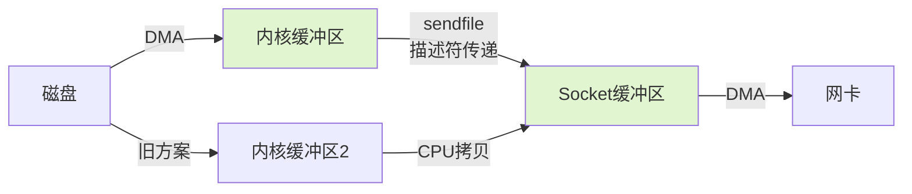

字节跳动1-3面试间，候选人小钱刚刚讲完Netty的线程模型，面试官突然问：

"你知道Kafka为什么这么快吗？"

小钱说："用的是顺序写，零拷贝。"面试官："那你把零拷贝的原理讲一下，从数据从磁盘到网络经历了多少次拷贝？"

小钱说："好像是...4次？"面试官："哪4次？能不能具体说说？"

小钱开始语无伦次。

面试官继续追问："mmap和sendfile有什么区别？Kafka用的是哪个？RocketMQ呢？"

小钱彻底崩溃。

【面试官心理】
零拷贝这道题我通常用来筛选有没有性能优化实战经验的候选人。Kafka、Netty、RocketMQ都在用零拷贝，但90%的候选人只会说"零拷贝就是减少拷贝次数"，说不清楚具体机制。BIO/NIO/AIO是基础知识，零拷贝是工程能力。

## 一、为什么需要零拷贝 🔴

### 1.1 传统IO的数据拷贝流程

在传统IO模型中，数据从磁盘到网卡的流程如下：

```
磁盘 ──DMA──> 内核缓冲区 ──CPU拷贝──> 用户缓冲区 ──CPU拷贝──> socket缓冲区 ──DMA──> 网卡
  DMA①      CPU②        CPU③      DMA④
```

**4次拷贝，2次上下文切换**：

| 阶段 | 拷贝类型 | 参与者 | 耗时 |
| --- | --- | --- | --- |
| ① 磁盘→内核缓冲区 | DMA拷贝 | 硬件DMA控制器 | ~1ms/文件块 |
| ② 内核缓冲区→用户缓冲区 | CPU拷贝 | CPU | ~1-5us/KB |
| ③ 用户缓冲区→socket缓冲区 | CPU拷贝 | CPU | ~1-5us/KB |
| ④ socket缓冲区→网卡 | DMA拷贝 | 硬件DMA控制器 | ~1ms/文件块 |

**上下文切换**：
1. 用户态→内核态（read调用）
2. 内核态→用户态（read返回）
3. 用户态→内核态（write调用）
4. 内核态→用户态（write返回）

:::warning ⚠️
关键问题：**两次CPU拷贝是最慢的环节**。DMA拷贝可以并行执行，但CPU拷贝必须串行。如果传输100MB文件，CPU拷贝环节可能占用数十毫秒。

### 1.2 ❌ 错误示范

**候选人原话1**："零拷贝就是没有拷贝了。"

**问题诊断**：
- 字面理解错误。零拷贝不是说数据不拷贝了，而是**减少不必要的CPU拷贝，让DMA代替CPU完成数据搬运**。
- 数据从磁盘到网卡物理上必须经过网卡和内存，零拷贝解决的是"中间环节能否省掉"的问题。

**候选人原话2**："零拷贝比普通IO快，因为它不需要CPU。"

**问题诊断**：
- 忽略了DMA仍然需要时间，且零拷贝有适用条件（不能随意修改数据）。
- 零拷贝适合大文件传输，小文件反而可能更慢（因为少了数据处理的灵活性）。

【面试官心理】
零拷贝的追问链通常是：为什么需要零拷贝→传统IO几次拷贝→mmap/sendfile怎么减少拷贝→Kafka/RocketMQ具体用哪个→用户能不能修改数据。回答到这个深度的人，基本都看过Kafka或Netty的源码。

## 二、mmap：共享内存映射 🟡

### 2.1 mmap的核心思想

`mmap()`（内存映射）通过映射磁盘文件到用户进程地址空间，避免了**内核缓冲区到用户缓冲区**的CPU拷贝：

```
磁盘 ──DMA──> 内核缓冲区 ──[映射]──> 用户进程地址空间 ──处理──> socket缓冲区 ──DMA──> 网卡
  DMA①        (直接映射)          ② 无额外拷贝            CPU③        DMA④
```

```c
// 传统read
char buf[1024];
read(fd, buf, 1024);        // CPU拷贝: 内核缓冲区→用户缓冲区
write(sockfd, buf, 1024);   // CPU拷贝: 用户缓冲区→socket缓冲区

// mmap
char *buf = mmap(fd, 1024);  // 映射: 无拷贝，通过指针直接访问
write(sockfd, buf, 1024);    // CPU拷贝: 只需一次
```

**Java中的mmap实现**（使用`MappedByteBuffer`）：

```java
// 用FileChannel的map方法获取mmap
RandomAccessFile file = new RandomAccessFile("data.txt", "rw");
FileChannel channel = file.getChannel();

// MappedByteBuffer: 文件映射到堆外内存
MappedByteBuffer buffer = channel.map(
    FileChannel.MapMode.READ_WRITE,  // 读写模式
    0,                                // 文件起始位置
    channel.size()                    // 映射大小
);

// 直接操作内存，操作系统负责同步到磁盘
buffer.put(0, (byte) 'x');
buffer.force(); // 强制刷盘

file.close();
```

### 2.2 mmap的优缺点

| 优点 | 缺点 |
| --- | --- |
| 减少一次CPU拷贝 | 映射区域有大小限制（通常`INT_MAX`） |
| 读写文件像操作内存一样简单 | 多进程共享同一个文件映射时需要同步 |
| 操作系统自动管理页缓存 | 机器突然断电，未刷盘的数据可能丢失 |
| 适合大文件随机读写 | `mmap()`创建有开销，不适合频繁创建销毁 |

### 2.3 RocketMQ的消息存储

RocketMQ的`MappedFile`封装了mmap：

```java
// RocketMQ 的 mmap 使用场景
// CommitLog（消息存储文件）使用 mmap
// 每个 CommitLog 大小 1GB，通过 mmap 映射
MappedFile mappedFile = new MappedFile(
    "/store/commitlog/0000000000",
    1024 * 1024 * 1024 // 1GB
);
```

:::tip 💡
RocketMQ用mmap的原因是：消息写入是高并发、顺序写的场景，mmap避免了频繁的CPU拷贝，同时利用顺序写的局部性原理，性能极高。

## 三、sendfile：内核空间直传 🟡

### 3.1 sendfile的核心思想

`sendfile()`更进一步：**完全绕过用户缓冲区**，数据从内核缓冲区直接传到socket缓冲区：

```
磁盘 ──DMA──> 内核缓冲区 ──[sendfile]──> socket缓冲区 ──DMA──> 网卡
  DMA①                    ② 零CPU拷贝      DMA③
```

```c
// sendfile 系统调用
// 数据从磁盘文件直接传到socket，跳过用户态
#include <sys/sendfile.h>

int fd = open("file.txt", O_RDONLY);
int sock = socket(...);

// sendfile(out_fd, in_fd, offset, count)
// 数据从 fd 直接传到 sock，全程内核态
sendfile(sock, fd, NULL, file_size);

close(fd);
close(sock);
```

### 3.2 sendfile的演进

**Linux 2.2之前**：sendfile需要一次CPU拷贝
```
磁盘 ──DMA─> 内核缓冲区 ──CPU拷贝─> socket缓冲区 ──DMA─> 网卡
```

**Linux 2.4+（支持TCP checksum offload）**：真正的零拷贝
```
磁盘 ──DMA─> 内核缓冲区 ──[描述符传递]─> socket缓冲区 ──DMA─> 网卡
                                                  ↑
                                        DMA控制器直接从内核缓冲区拉数据
```



### 3.3 Java中的sendfile

```java
// Java 1.4+ 的 sendfile
FileChannel channel = new RandomAccessFile("data.txt", "r").getChannel();
SocketAddress address = new InetSocketAddress("127.0.0.1", 8080);
SocketChannel socketChannel = SocketChannel.open(address);

// transferTo() 内部调用 sendfile
long bytesTransferred = channel.transferTo(0, channel.size(), socketChannel);
```

:::warning ⚠️
生产翻车点：`transferTo()`在Linux上如果目标socket缓冲区满了，会返回实际传输的字节数（可能小于请求数），需要循环调用处理。但相比传统IO，已经减少了大量CPU拷贝。

## 四、mmap vs sendfile 对比 🟢

| 维度 | mmap | sendfile |
| --- | --- | --- |
| **适用场景** | 需要在用户态处理数据 | 数据直接转发，不需要修改 |
| **CPU拷贝次数** | 1次（写回时） | 0次 |
| **用户态参与** | 必须（读写数据） | 不需要（纯转发） |
| **典型应用** | RocketMQ消息存储 | Kafka文件传输、Nginx静态资源 |
| **数据可修改性** | 可以修改（写回磁盘） | 不可修改（只读转发） |
| **文件大小限制** | 有（受虚拟内存限制） | 无限制 |

## 五、Kafka的零拷贝实践 🟡

### 5.1 Kafka为什么选择sendfile

Kafka的核心场景是：**读取磁盘文件，通过网络发送出去**。数据**不需要在用户态被修改**，只需要原样转发。

这正是`sendfile`的完美适用场景：

```java
// Kafka 的Produce流程（简化）
// 消息写入日志文件后，消费时使用 sendfile

// Linux: FileChannel.transferTo() → sendfile()
FileChannel fileChannel = ...;
SocketChannel socketChannel = ...;

// 0次CPU拷贝：内核→内核→网卡
fileChannel.transferTo(position, size, socketChannel);
```

**Kafka的文件分段+顺序读配合sendfile**：

1. 日志文件按`messageSetSize`分段，每段`~1GB`
2. 消费者读取时，先读索引文件定位到数据位置
3. 调用`transferTo()`将数据直接发送到网卡
4. 全程只有DMA拷贝，没有CPU参与数据搬运

### 5.2 性能数据

Kafka官方测试数据：

| 操作 | 传统IO | sendfile | 提升 |
| --- | --- | --- | --- |
| 传输1GB文件 | ~2000ms | ~200ms | **10倍** |
| CPU利用率 | 30-40% | 5-10% | **降低70%** |

:::details 📖 点击展开：Kafka零拷贝全景
```
传统IO流程（4次拷贝，4次上下文切换）：
  磁盘 → 内核缓冲区(read) → 用户缓冲区 → socket缓冲区 → 网卡

Kafka+sendfile（2次DMA拷贝，0次CPU拷贝）：
  磁盘 → 内核缓冲区(sendfile) → socket缓冲区 → 网卡

关键优化点：
1. DMA代替CPU搬运
2. 跳过用户态缓冲区
3. 上下文切换从4次降到2次
```
:::

## 六、生产避坑 🟢

### 6.1 mmap的文件大小陷阱

```java
// ❌ 错误：mmap映射的文件大小超出限制
MappedByteBuffer buffer = channel.map(
    MapMode.READ_ONLY,
    0,
    10L * 1024 * 1024 * 1024  // 10GB，32位系统会失败
);

// ✅ 正确：分段映射大文件
for (long offset = 0; offset < fileSize; offset += CHUNK_SIZE) {
    MappedByteBuffer chunk = channel.map(
        MapMode.READ_ONLY,
        offset,
        CHUNK_SIZE
    );
    // 处理每个chunk
}
```

### 6.2 sendfile不适用修改场景

sendfile只能用于**只读转发**，如果数据需要在用户态修改，必须用mmap或传统IO。

## 七、面试通关话术

**开场**：
> 零拷贝解决的是"数据从磁盘到网卡的过程中，不必要的CPU拷贝能不能省掉"这个问题。传统IO需要4次拷贝（磁盘→内核缓冲区→用户缓冲区→socket缓冲区→网卡），其中2次是CPU拷贝，最耗时。

**被追问mmap和sendfile区别**：
> mmap通过内存映射让用户态直接操作内核缓冲区文件，减少了内核→用户的CPU拷贝，但写入时仍需要刷回磁盘。sendfile更进一步，直接在内核空间把数据从文件缓冲区传到socket缓冲区，**完全绕过用户态，零CPU拷贝**。sendfile适合"只读转发"场景（Kafka、Nginx），mmap适合"需要用户态处理"的场景（RocketMQ消息存储）。

**被追问Kafka为什么快**：
> Kafka快的原因有三个：顺序写减少磁盘寻道时间、日志分段配合稀疏索引实现O(1)定位、以及sendfile零拷贝减少CPU参与。三者缺一不可。
