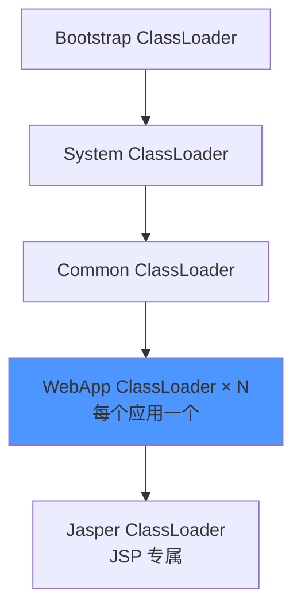

面试官问："什么情况下需要打破双亲委派？"

候选人小吴说："当自定义 ClassLoader 需要加载特定类的时候，重写 loadClass 方法就可以了。"

面试官追问："那 Tomcat 为什么要打破双亲委派？JDBC 的 DriverManager 怎么加载驱动的？线程上下文类加载器是什么？"

小吴说："Tomcat...每个 Web 应用有自己的 ClassLoader..."

面试官继续追问："每个 Web 应用有自己的 ClassLoader 是怎么实现的？Tomcat 的 StandardContext.loader 是干什么的？"

小吴彻底卡住了。

## 一、为什么需要打破双亲委派 🔴

### 1.1 问题拆解

双亲委派是 JVM 的默认行为，但某些场景下必须打破它。面试官追问"为什么打破"，其实在测试候选人对类加载机制在工程中应用的理解深度。

### 1.2 打破双亲委派的三个典型场景

1. **Tomcat**：每个 Web 应用隔离类加载
2. **JDBC SPI**：驱动由应用层加载，但需要在核心 API 层使用
3. **OSGi/热部署**：模块动态更新

---

## 二、Tomcat 的类加载器设计 🟡

### 2.1 Tomcat 的多层 ClassLoader



**Tomcat 类加载器层级**：

| 类加载器 | 加载范围 | 隔离级别 |
| --- | --- | --- |
| Bootstrap ClassLoader | JVM 核心类 | 全局共享 |
| System ClassLoader | `CLASSPATH` | 全局共享 |
| Common ClassLoader | `$CATALINA_HOME/lib` | 容器共享 |
| WebApp ClassLoader | `WEB-INF/lib` + `WEB-INF/classes` | **应用隔离** |
| Jasper ClassLoader | JSP 编译后的类 | JSP 隔离 |

### 2.2 WebAppClassLoader 的打破逻辑

Tomcat 的 `WebappClassLoader` 重写了 `loadClass()` 方法，打破双亲委派：

```java
// Tomcat WebappClassLoader.loadClass() 简化逻辑
public Class<?> loadClass(String name, boolean resolve) {
    // 1. 先检查自己是否已加载（缓存）
    Class<?> clazz = findLoadedClass0(name);
    if (clazz != null) return clazz;

    // 2. 尝试用自定义 ClassLoader 规则加载（打破！）
    //    - WEB-INF/classes
    //    - WEB-INF/lib/*.jar
    clazz = findClass(name);

    // 3. 如果找不到，委派给父类（Common ClassLoader）
    if (clazz == null) {
        clazz = super.loadClass(name, resolve);
    }

    return clazz;
}
```

### 2.3 ❌ 错误示范

**候选人原话**："Tomcat 打破双亲委派是因为它需要加载自己的类。"

【面试官心理】
这个候选人没有理解打破的真正原因。Tomcat 打破双亲委派的核心目的是**隔离**：两个 Web 应用可能都依赖不同版本的同一个库（如 Spring 3 vs Spring 5），如果不打破双亲委派，只能有一个版本被加载。打破后，每个 WebAppClassLoader 只加载自己 lib 下的类。

---

## 三、JDBC 的 SPI 机制 🟡

### 3.1 JDBC 的加载困境

```
问题：

DriverManager（由 Bootstrap ClassLoader 加载）
    ↓ 需要加载数据库驱动（MySQL Driver）
    ↓ MySQL Driver 由 Application ClassLoader 加载

由于双亲委派，Bootstrap ClassLoader 看不到 Application ClassLoader 加载的类
```

### 3.2 SPI 解决方案

```java
// JDK SPI: ServiceLoader
public class ServiceLoader<M> {
    public static <S> ServiceLoader<S> load(Class<S> service) {
        // 使用线程上下文类加载器加载 SPI 实现
        ClassLoader cl = Thread.currentThread().getContextClassLoader();
        return new ServiceLoader<>(service, cl);
    }
}

// JDBC 的实际流程：
// 1. mysql-connector-java.jar 中有 META-INF/services/java.sql.Driver 文件
//    内容是：com.mysql.cj.jdbc.Driver
// 2. DriverManager.loadInitialDrivers() 调用 ServiceLoader.load(Driver.class)
// 3. ServiceLoader 使用线程上下文类加载器加载 com.mysql.cj.jdbc.Driver
// 4. 驱动被 Application ClassLoader 加载，但在 Bootstrap 的 DriverManager 中注册
```

### 3.3 线程上下文类加载器（Thread Context ClassLoader）

```java
// 每个线程有一个上下文类加载器
Thread.currentThread().setContextClassLoader(myClassLoader);

// 默认值：启动线程时继承父线程的类加载器
// main 线程的上下文类加载器 = Application ClassLoader

// SPI 的标准用法：
ClassLoader cl = Thread.currentThread().getContextClassLoader();
Class<?> clazz = cl.loadClass("com.example.Driver");
```

**这是一种"反向委派"**：允许子层（如 JDBC API）通过线程上下文类加载器"穿透"到父层（如 Bootstrap），加载子层自己的实现类。

---

## 四、生产避坑 🟡

### 4.1 Tomcat 类加载导致的 ClassNotFoundException

**典型场景**：Spring 2.x 和 Spring 3.x 在同一 Tomcat 中冲突

```
应用A：依赖 Spring 2.0
应用B：依赖 Spring 5.0

没有隔离时：只加载一个 Spring 版本

隔离后：
  WebAppClassLoader-A 加载 Spring 2.0
  WebAppClassLoader-B 加载 Spring 5.0
  两者互不干扰
```

### 4.2 SPI 导致的三方库加载问题

```java
// 问题：模块 A 使用线程上下文类加载器加载了旧版驱动
// 但模块 B 期望使用新版驱动

// 解决方案：显式指定 ClassLoader
ClassLoader cl = MyLib.class.getClassLoader();
Thread.currentThread().setContextClassLoader(cl);
try {
    // 使用 cl 加载资源
} finally {
    Thread.currentThread().setContextClassLoader(original);
}
```

:::warning ⚠️
线程上下文类加载器是 JavaEE 容器和框架中最容易出问题的点之一。在 Spring、MyBatis、Hibernate 等框架中，大量使用 SPI 机制。理解线程上下文类加载器的传递链，对排查 ClassNotFoundException 至关重要。
:::

---

## 五、面试高频追问 🟡

### 5.1 追问：如何安全地打破双亲委派？

**正确做法**：

```java
public class MyClassLoader extends ClassLoader {
    @Override
    protected Class<?> loadClass(String name, boolean resolve)
            throws ClassNotFoundException {
        // 只对自己需要的类打破委派，不是全局打破
        if (name.startsWith("com.myapp.")) {
            // 只针对 com.myapp 包下的类自己加载
            Class<?> clazz = findLoadedClass(name);
            if (clazz == null) {
                clazz = findClass(name);
            }
            return clazz;
        }
        // 其他类走正常的双亲委派
        return super.loadClass(name, resolve);
    }
}
```

【面试官心理】
能说出"只对自己需要的类打破，而不是全局打破"的候选人，说明他理解打破双亲委派的风险——全局打破等于放弃安全保护。这种候选人在设计类加载器时会有正确的边界意识。
