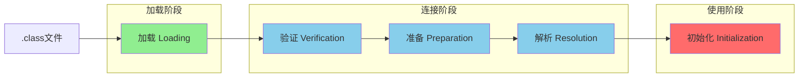
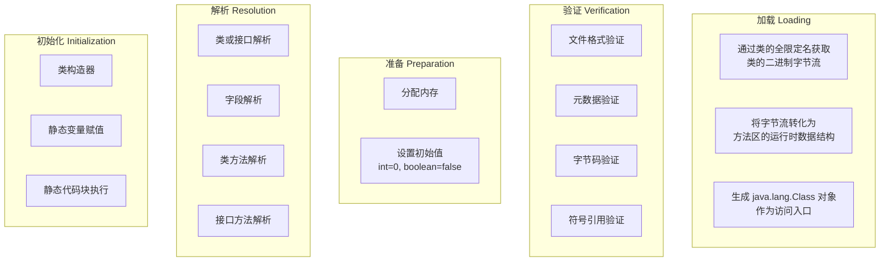
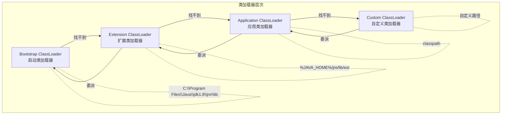
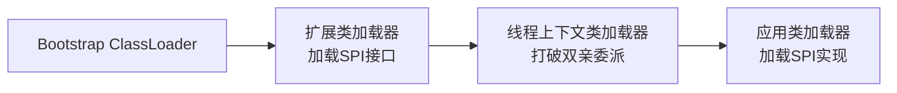
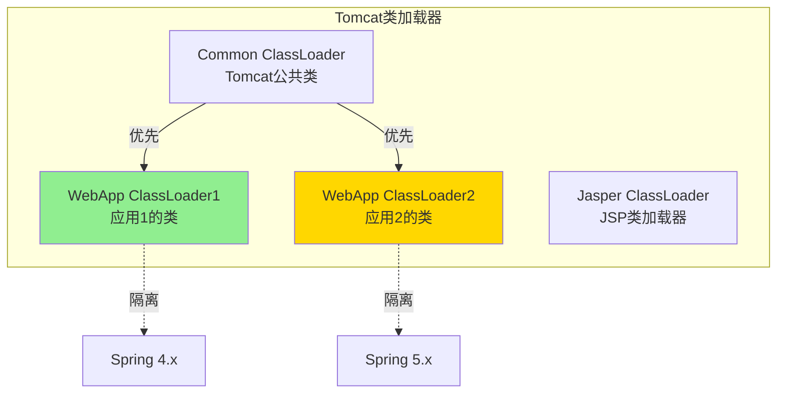

# 类加载机制

**目标级别**：P6

## 快速自测

面试官问：「什么是双亲委派模型？为什么需要它？如何打破双亲委派？」

你能回答到第几层？

---

## 一、核心问题

### 🔴 类加载的七个阶段



### 各阶段详解



---

## 二、双亲委派模型

### 🔴 什么是双亲委派模型？

当类加载器收到加载请求时，会将请求**委派给父类加载器**处理，直到最顶层的 Bootstrap ClassLoader。只有父加载器无法完成时，子加载器才尝试自己加载。



### 类加载器源码

```java title="ClassLoader.java"
protected Class<?> loadClass(String name, boolean resolve) throws ClassNotFoundException {
    synchronized (getClassLoadingLock(name)) {
        // 1. 检查是否已经加载
        Class<?> c = findLoadedClass(name);
        if (c != null) {
            return c;
        }
        
        try {
            // 2. 父加载器先加载
            if (parent != null) {
                c = parent.loadClass(name, false);
            } else {
                // 3. 没有父加载器，调用启动类加载器
                c = findBootstrapClassOrNull(name);
            }
        } catch (ClassNotFoundException e) {
            // 父加载器找不到
        }
        
        if (c == null) {
            // 4. 父加载器找不到，自己加载
            c = findClass(name);
        }
        
        return c;
    }
}
```

### 双亲委派模型的好处

| 作用 | 说明 | 示例 |
|------|------|------|
| **安全机制** | 防止核心类被篡改 | `java.lang.Object` 始终由 Bootstrap 加载 |
| **避免重复加载** | 父加载过的类不会重复加载 | 保证类的唯一性 |
| **类访问统一** | 所有类都使用相同的加载器 | 类 instanceof 判断一致 |

:::tip 为什么要防止篡改 java.lang.String？
如果自定义 `java.lang.String` 类，JVM 每次创建的 `String` 对象都是自定义版本，可能包含恶意代码。双亲委派模型保证核心 API 来自启动类加载器。
:::

---

## 三、打破双亲委派

### 场景一：SPI（Service Provider Interface）



#### JDBC 驱动加载原理

```java title="DriverManager.java"
public class DriverManager {
    static {
        // 加载 Driver 实现类
        // 这里打破了双亲委派！
        ServiceLoader<Driver> loadedDrivers = 
            ServiceLoader.load(Driver.class);
        
        // 使用线程上下文类加载器
        ClassLoader cl = Thread.currentThread()
                              .getContextClassLoader();
    }
}
```

### 场景二：Tomcat

Tomcat 需要同时运行多个 Web 应用，每个应用可能使用不同版本的同名类。Tomcat 通过**自定义类加载器**打破双亲委派。



### 场景三：OSGi

OSGi 模块化框架使用自己的类加载器，每个 Bundle 有独立的类加载器，可以精确控制类的可见性。

---

## 四、自定义类加载器

### 手写类加载器

```java title="MyClassLoader.java"
public class MyClassLoader extends ClassLoader {
    
    private String classPath;  // 自定义class文件路径
    
    public MyClassLoader(String classPath) {
        this.classPath = classPath;
    }
    
    @Override
    protected Class<?> findClass(String name) throws ClassNotFoundException {
        try {
            // 1. 读取class文件为字节数组
            byte[] classData = loadClassData(name);
            
            if (classData == null) {
                throw new ClassNotFoundException(name);
            }
            
            // 2. 调用父类的 defineClass
            return defineClass(name, classData, 0, classData.length);
        } catch (IOException e) {
            throw new ClassNotFoundException(name, e);
        }
    }
    
    private byte[] loadClassData(String name) throws IOException {
        String fileName = classPath + File.separator 
            + name.replace('.', File.separatorChar) + ".class";
        
        try (InputStream is = new FileInputStream(fileName);
             ByteArrayOutputStream baos = new ByteArrayOutputStream()) {
            
            byte[] buffer = new byte[4096];
            int len;
            while ((len = is.read(buffer)) != -1) {
                baos.write(buffer, 0, len);
            }
            return baos.toByteArray();
        }
    }
}
```

### 使用自定义类加载器

```java
public class ClassLoaderDemo {
    public static void main(String[] args) throws Exception {
        // 创建自定义类加载器
        MyClassLoader loader = new MyClassLoader("/Users/class");
        
        // 加载类
        Class<?> clazz = loader.loadClass("com.example.HotFix");
        
        // 创建实例
        Object obj = clazz.newInstance();
        System.out.println(obj);
    }
}
```

---

## 五、面试题精讲

### 🔴 第一层：类加载的过程

> **参考答案**：
>
> 1. **加载**：通过类名获取二进制字节流，生成 Class 对象
> 2. **验证**：验证字节流格式、元数据、字节码、符号引用
> 3. **准备**：为静态变量分配内存，设置初始值
> 4. **解析**：将符号引用转换为直接引用
> 5. **初始化**：执行 `<clinit>`，静态变量赋值、静态代码块执行

### 🟡 第二层：双亲委派模型

> **参考答案**：
>
> 类加载器有层级结构：启动类加载器 → 扩展类加载器 → 应用类加载器 → 自定义类加载器。当加载类时，先委派给父加载器处理，只有父加载器找不到时才自己加载。
>
> 好处：
> 1. 保证核心类的安全（如 `java.lang.Object`）
> 2. 避免类重复加载
> 3. 类 instanceof 判断一致

### 🟡 第三层：如何打破双亲委派？

> **参考答案**：
>
> 1. **自定义类加载器**：重写 `loadClass()` 方法，不委派给父加载器
> 2. **线程上下文类加载器**：JDBC、Tomcat 等通过 `Thread.currentThread().setContextClassLoader()` 打破
> 3. **OSGi**：每个模块有自己的类加载器

### 💡 第四层：为什么需要打破双亲委派？

> **参考答案**：
>
> 1. **SPI 机制**：JDBC 等需要加载第三方驱动，但驱动在应用类路径下，启动类加载器无法访问
> 2. **热部署/热修复**：Tomcat 需要加载同名类的不同版本，必须隔离
> 3. **模块化**：OSGi 需要精确控制类的可见性和依赖关系

---

## 六、常见错误与陷阱

### ⚠️ 陷阱 1：混淆类加载器和类

```java
// 类相同但类加载器不同，是不同的类！
ClassLoader loader1 = new MyClassLoader("/path1");
ClassLoader loader2 = new MyClassLoader("/path2");

Class<?> clazz1 = loader1.loadClass("com.example.User");
Class<?> clazz2 = loader2.loadClass("com.example.User");

// clazz1 != clazz2
// instanceof clazz1 不适用于 clazz2 实例
```

### ⚠️ 陷阱 2：静态变量初始化顺序

```java
public class StaticInitOrder {
    // 静态变量赋值顺序决定输出
    static int A = 1;
    static int B = A;  // B = 1
    
    static {
        System.out.println("B = " + B);  // B = 1
    }
    
    public static void main(String[] args) {
        System.out.println("A = " + A);  // A = 1
    }
}
```

### ⚠️ 陷阱 3：类初始化时机

```java
public class InitDemo {
    static int a = 1;
    
    static {
        // 只有主动使用类时才会执行
        System.out.println("Static init");
    }
    
    public static void main(String[] args) {
        // 不会触发初始化（被动引用）
        System.out.println(InitDemo.a);  // 直接访问静态字段
        
        // 会触发初始化
        Class<?> clazz = InitDemo.class;  // Class 对象引用不会初始化
    }
}
```

---

## 七、对比总结表

| 类加载器 | 负责范围 | 加载路径 |
|----------|----------|----------|
| Bootstrap ClassLoader | Java 核心库 | `jre/lib/rt.jar` |
| Extension ClassLoader | 扩展库 | `jre/lib/ext/*.jar` |
| Application ClassLoader | 应用 classpath | `classpath` |
| Custom ClassLoader | 自定义路径 | 用户指定 |

| 触发初始化 | 不触发初始化 |
|-----------|-------------|
| new 对象 | 访问 static 字段（final） |
| 调用 static 方法 | Class.forName() |
| 反射 | 继承/实现 |
| 子类初始化时 | 引用常量 |

---

## 八、扩展思考

> **追问**：如何理解符号引用和直接引用？

- **符号引用**：用字符串表示，如 `"java/lang/String"`、`"java/lang/System.out"`
- **直接引用**：内存地址、偏移量，能直接定位到目标

> **追问**：HotSpot 如何优化类加载？

1. **即时编译（JIT）**：热点代码编译成本地机器码
2. **类数据共享（CDS）**：BootClassLoader 加载的类在多个 JVM 间共享
3. **AppCDS**：JDK10+ 支持应用类共享

---

## 延伸阅读

- [双亲委派模型](./parent-delegation)
- [打破双亲委派场景](./break-delegation)
- [自定义类加载器](./custom-classloader)
- [JVM 运行时数据区](../jvm/runtime-data-area)
