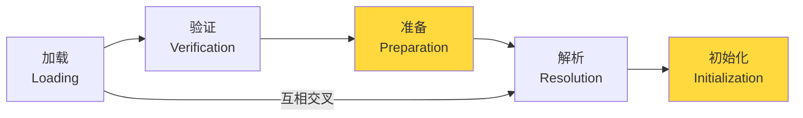

面试官问："类加载过程分哪几步？"

候选人小宋说："加载、验证、准备、解析、初始化。"

面试官追问："准备阶段和初始化阶段的区别是什么？解析是立即还是延迟的？类在什么时候会加载？"

小宋说："准备阶段是分配内存...初始化是执行静态代码块..."

面试官继续追问："那主动使用和被动使用呢？接口的初始化和类的初始化有什么区别？"

小宋答不上来了。

---

## 一、类加载的五个阶段 🔴

### 1.1 问题拆解

类加载机制是 JVM 模块的经典考点。五个阶段各有各的作用，准备和初始化的区分、解析的时机、初始化的触发条件——每个点都是面试官的追问方向。

### 1.2 五阶段概览



**注意**：加载、验证、准备、初始化、卸载的顺序是固定的，但**解析**可以在初始化之后再进行（晚期绑定）。

---

## 二、加载（Loading）🔴

### 2.1 加载阶段做什么

1. **通过类的全限定名获取类的二进制字节流**（从哪里获取：Class文件、JAR包、网络、动态代理、数据库）
2. **将字节流转化为方法区的运行时数据结构**
3. **在堆中生成一个 `java.lang.Class` 对象**，作为方法区数据的访问入口

```java
// Class 对象就是堆中的这个入口
Class<?> clazz = Class.forName("com.example.User");
// clazz 对象在堆中，指向方法区中的类元数据
```

### 2.2 类加载器

| 加载器 | 说明 | 加载路径 |
| --- | --- | --- |
| **Bootstrap ClassLoader** | 启动类加载器，C++实现 | `jre/lib/rt.jar` |
| **Extension ClassLoader** | 扩展类加载器 | `jre/lib/ext/*` |
| **Application ClassLoader** | 应用类加载器 | `CLASSPATH` |

**双亲委派模型**（见 [双亲委派模型](/java/jvm/parent-delegation)）。

---

## 三、验证（Verification）🔴

### 3.1 验证的四个阶段

验证阶段确保加载的 class 文件字节流符合 JVM 规范：

1. **文件格式验证**：魔数（`0xCAFEBABE`）、版本号、常量池类型
2. **元数据验证**：语法检查（是否有父类、final类是否被继承）
3. **字节码验证**：跳转指令是否越界、操作数栈类型是否匹配
4. **符号引用验证**：解析时检查符号引用对应的类/方法/字段是否存在

### 3.2 ❌ 错误示范

**候选人原话**："验证阶段可以省略，反正 class 文件都是编译器生成的。"

【面试官心理】
这个候选人没有安全意识。class 文件可以被手动构造（字节码工具），恶意 class 文件可能破坏 JVM 安全性。验证阶段是 JVM 的安全防线。

---

## 四、准备（Preparation）🟡

### 4.1 准备阶段做什么

准备阶段为**类变量**分配内存并设置**零值**：

```java
public class PrepareDemo {
    // 类变量（static 变量）
    public static int a = 100;  // 准备阶段：a = 0（零值）
    public static String b;       // 准备阶段：b = null
    public static final int c = 200; // 准备阶段：c = 200（编译期常量）

    static {
        // 初始化阶段才执行
        a = 100;
        System.out.println("静态代码块执行");
    }
}
```

### 4.2 准备阶段的两个易错点

**易错点一：final vs 非 final**

```java
public static final int A = 100;     // 编译期常量，准备阶段就赋值
public static int B = 100;            // 运行期常量，准备阶段零值
```

`public static final` 常量如果是基本类型或 String，且值在编译期确定，则在**准备阶段**就赋值（因为编译后常量池就存了这个值，不需要类加载）。

**易错点二：类变量 vs 实例变量**

```java
public class Example {
    int x = 10;          // 实例变量，分配在堆中，不在准备阶段
    static int y = 20;   // 类变量，分配在方法区，准备阶段零值
}
```

---

## 五、解析（Resolution）🟡

### 5.1 解析做什么

解析阶段将符号引用替换为直接引用：

```java
// 符号引用（编译时生成）
invokevirtual #12          // #12 是常量池中的符号引用

// 直接引用（运行时解析）
// 可能是：
// 1. 方法区的偏移量
// 2. 实例方法的 vtable 索引
// 3. 指向方法的句柄
```

### 5.2 解析的时机

**解析是晚期绑定（late binding）**：解析可以在初始化之后进行。

这意味着：
- 初始化阶段可能先执行
- 解析阶段需要的类可能还没加载

```java
public class LazyResolution {
    public static void main(String[] args) {
        // 这里会触发 SubClass 的初始化
        // 但父类的解析可能已经完成
        System.out.println(SubClass.value);
    }
}

class SuperClass {
    static {
        System.out.println("SuperClass 初始化");
    }
    static int value = 100;
}

class SubClass extends SuperClass {
    static {
        System.out.println("SubClass 初始化");
    }
}
```

输出顺序：`SuperClass 初始化` → `100`

### 5.3 四种符号引用解析

| 类型 | 解析目标 |
| --- | --- |
| 类/接口 | 当前类的 Class 对象 |
| 字段 | 字段的内存偏移量 |
| 方法 | 方法的 vtable 索引 |
| 方法类型 | 方法类型的具体化签名 |

---

## 六、初始化（Initialization）🔴

### 6.1 初始化的触发条件

**主动使用**（会触发初始化）：

```java
// 1. new 对象
new PrepareDemo();

// 2. 调用类的静态方法
PrepareDemo.invoke();

// 3. 读取/赋值类的静态字段（final 常量除外）
int x = PrepareDemo.a; // 触发
PrepareDemo.a = 200;   // 触发

// 4. 反射
Class.forName("PrepareDemo");

// 5. 初始化子类会触发父类
new SubClass(); // 先初始化 SuperClass

// 6. main 方法所在类（必定初始化）
```

**被动使用**（不触发初始化）：

```java
// 1. 子类引用父类的静态字段（只触发父类）
System.out.println(SubClass.value); // 只触发 SuperClass 初始化

// 2. 定义数组
PrepareDemo[] arr = new PrepareDemo[10]; // 不触发加载

// 3. 常量（编译期常量）
int x = PrepareDemo.CONST; // 不触发加载
```

### 6.2 接口的初始化

```java
interface I {
    int VALUE = 10;  // 准备阶段就赋值（隐式 final）
}

class Impl implements I {
    static {
        System.out.println("Impl 初始化");
    }
}

// 初始化 Impl 不触发 I 的初始化
// 但读取 I.VALUE 会触发 I 的初始化（因为 VALUE 不是编译期常量）
```

**接口的初始化规则**：
- 初始化类不初始化它实现的接口
- 初始化接口不初始化父接口
- 读取接口的编译期常量不触发初始化，读取非编译期常量触发

### 6.3 面试高频追问

【面试官心理】
能说清楚"主动使用 vs 被动使用"的候选人，说明他对类加载的触发机制有深入理解。能说出接口初始化特殊性的，已经超过了 90% 的候选人。

---

## 七、类卸载 🟢

### 7.1 类的生命周期结束

类被卸载的条件：
1. 该类所有实例都已回收
2. 该类的 ClassLoader 已回收
3. 该类的 Class 对象没有在任何地方被引用

```java
// Class 对象引用计数降为 0 时，类可以被卸载
// 通常只有自定义 ClassLoader 加载的类才能被卸载
// Bootstrap ClassLoader 加载的类不会被卸载
```

类卸载在实际生产中极少发生，但理解它有助于理解元空间 OOM（大量自定义 ClassLoader 导致类元数据累积）。
