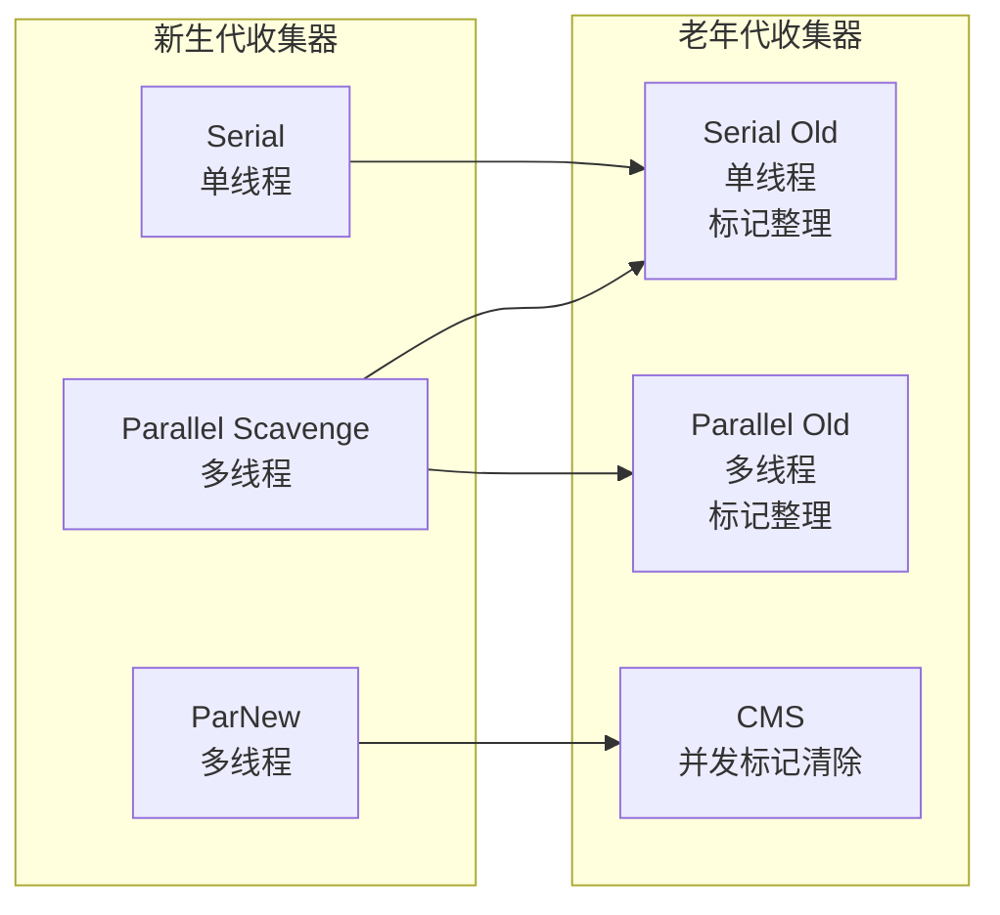
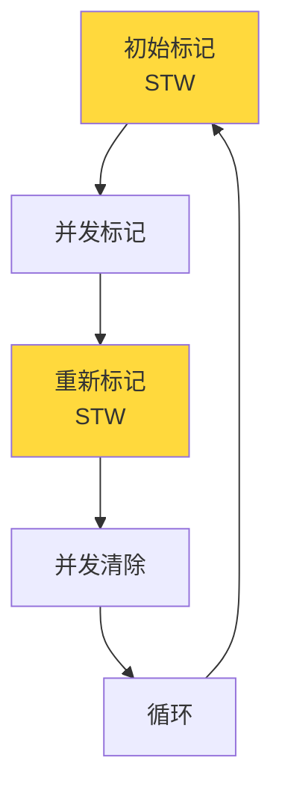

面试官问："JVM 有哪些垃圾收集器？它们有什么区别？"

候选人小郑说："有 Serial、Parallel、ParNew、CMS 四种。Serial 是单线程的，CMS 是并发的。"

面试官追问："Serial 和 Parallel 的区别是什么？ParNew 和 CMS 怎么配合使用？CMS 的老年代回收分哪几个阶段？"

小郑说："CMS 是并发标记清除...具体阶段记不太清了。"

---

## 一、收集器全景图 🔴

### 1.1 问题拆解

收集器是 JVM GC 模块的集大成者。每种收集器都是特定场景下的工程权衡。面试官追问"区别"，其实在测试候选人对 GC 性能优化的理解深度。

### 1.2 收集器与分代的对应关系



| 分代 | 收集器 | 线程 | 并发 | 停顿 | 适用场景 |
| --- | --- | --- | --- | --- | --- |
| 新生代 | Serial | 单 | 否 | stop-the-world | 客户端/单核 |
| 新生代 | ParNew | 多 | 否 | stop-the-world | 服务端多核 |
| 新生代 | Parallel Scavenge | 多 | 否 | stop-the-world | 吞吐量优先 |
| 老年代 | Serial Old | 单 | 否 | stop-the-world | 客户端/兜底 |
| 老年代 | Parallel Old | 多 | 否 | stop-the-world | 吞吐量优先 |
| 老年代 | CMS | 多 | 是（并发） | 短暂停顿 | 低延迟优先 |

---

## 二、新生代收集器 🟡

### 2.1 Serial 收集器

Serial 是最古老的收集器，也是其他所有收集器的"参照物"。

**特点**：
- 单线程执行 GC
- GC 时需要 stop-the-world（用户线程全部暂停）
- 简单高效，没有线程切换开销

```bash
# 开启 Serial 收集器
-XX:+UseSerialGC
# 等价于：-XX:+UseSerialGC -XX:+UseSerialOldGC
```

**为什么 Serial 还能存活？** 因为在单核 CPU 或极小堆（几十 MB）环境下，Serial 的效率反而最高——没有线程管理开销，没有同步开销，专注于 GC 本身。

### 2.2 ParNew 收集器

ParNew 是 Serial 的多线程版本，使用多个线程并发进行 Minor GC。

```bash
# 开启 ParNew 收集器
-XX:+UseParNewGC
```

**关键参数**：
- `-XX:ParallelGCThreads`：设置 GC 线程数，默认 = CPU 核心数
- `-XX:+UseConcMarkSweepGC`：使用 CMS 后，ParNew 自动成为新生代收集器

:::tip 💡
ParNew 和 Parallel Scavenge 的区别：ParNew 可以和 CMS 配合使用，Parallel Scavenge 不行。但 Parallel Scavège 有独特参数 `-XX:+UseAdaptiveSizePolicy`，能自动调整各代大小——这就是"自适应调节策略"。
:::

### 2.3 Parallel Scavenge 收集器

Parallel Scavenge 的目标是**吞吐量最大化**，而非低停顿。

**吞吐量 = 运行用户代码时间 / (运行用户代码时间 + GC 时间)**

```bash
# 吞吐量优先配置
-XX:+UseParallelGC
-XX:+UseParallelOldGC
-XX:MaxGCPauseMillis=100    # 最大 GC 停顿时间（软目标）
-XX:GCTimeRatio=19          # GC 时间占总时间的比例 = 1/(1+19) = 5%
```

### 2.4 ❌ 错误示范

**候选人原话**："Parallel Scavenge 比 ParNew 快，因为它是并行收集的。"

【面试官心理】
这个候选人把"并行"和"吞吐量"搞混了。两者都是并行的，区别在于优化目标：ParNew 优化停顿时间，Parallel Scavenge 优化吞吐量。停顿时间短不等于吞吐量大——如果每次停顿短但频率高，吞吐量反而可能更低。

---

## 三、CMS 收集器 🔴

### 3.1 CMS 工作流程

CMS（Concurrent Mark Sweep）是最早的并发收集器，目标是在低停顿的同时实现并发收集。

**四个阶段**：

| 阶段 | 说明 | 备注 |
| --- | --- | --- |
| 1. 初始标记（Initial Mark） | stop-the-world，标记 GC Roots 直接引用的对象 | 非常快 |
| 2. 并发标记（Concurrent Mark） | 用户线程和 GC 线程并发，遍历引用链 | 耗时最长，但不暂停用户 |
| 3. 重新标记（Remark） | stop-the-world，修正并发标记期间产生的变化 | 比初始标记慢，但远快于 Full GC |
| 4. 并发清除（Concurrent Sweep） | 用户线程和 GC 线程并发，清除垃圾 | 不暂停用户 |



### 3.2 CMS 的问题 🟡

**问题一：CPU 敏感**

CMS 使用 CPU 资源进行并发收集。在 CPU 资源紧张的场景下，并发标记会占用 CPU，导致应用性能下降。

```bash
# CMS 默认 GC 线程数 = (CPU数量 + 3) / 4
# 4 核 CPU：GC 线程 = (4+3)/4 = 1
# 8 核 CPU：GC 线程 = (8+3)/4 = 2
```

**问题二：浮动垃圾（Floating Garbage）**

并发清除阶段，用户线程还在运行，会产生新的垃圾（浮动垃圾）。这些垃圾只能等下一次 GC 回收。

**问题三：并发模式失败（Concurrent Mode Failure）**

CMS 运行期间，老年代碎片化严重，无法容纳新晋升的大对象。此时 CMS 放弃并发模式，触发一次"退化 Full GC"——使用 Serial Old 收集器进行单线程 Full GC，停顿时间可能达到数秒。

**问题四：内存碎片**

CMS 使用标记-清除算法，不整理内存。碎片化会导致：
- 大对象分配失败
- 提前触发 Full GC

:::warning ⚠️
CMS 的退化 Full GC 是生产环境中的大坑。一旦发生，应用可能停顿 5~10 秒。解决方案是设置 `-XX:+UseCMSCompactAtFullCollection`（默认开启）和 `-XX:CMSFullGCsBeforeCompaction=5`（5 次 Full GC 后整理一次）。
:::

### 3.3 CMS 参数配置

```bash
# 开启 CMS
-XX:+UseConcMarkSweepGC
-XX:+UseParNewGC

# 关键参数
-XX:CMSInitiatingOccupancyFraction=70  # 老年代使用率 70% 时开始回收
-XX:+UseCMSInitiatingOccupancyOnly     # 只用上面的阈值，不自适应调整
-XX:ParallelGCThreads=4                # 并行 GC 线程数
```

---

## 四、Serial Old 与 Parallel Old 🟢

### 4.1 Serial Old

Serial Old 是 Serial 的老年代版本，使用**标记-整理**算法。主要用途：
- 客户端模式（JDK 1.5 之前唯一选择）
- JDK 5 及之前与 Parallel Scavenge 配合
- CMS 的备选收集器（CMS 失败时兜底）

### 4.2 Parallel Old

Parallel Old 是 JDK 8 之后 Parallel Scavenge 的"黄金搭档"，使用**标记-整理**算法，填补了"Parallel Scavenge + Serial Old"组合中老年代单线程的性能短板。

**吞吐量优先的经典组合**：
```bash
-XX:+UseParallelGC        # 新生代：Parallel Scavenge
-XX:+UseParallelOldGC     # 老年代：Parallel Old
```

---

## 五、生产选型 🟡

### 5.1 收集器选型决策树

```
追求低延迟（响应时间敏感）？
  → JDK 8-：CMS
  → JDK 11+：ZGC / G1

追求吞吐量（批处理/计算密集）？
  → Parallel Scavenge + Parallel Old

单核/极小内存？
  → Serial + Serial Old

JDK 11+新项目？
  → G1（默认收集器）
  → 低延迟要求极高？
  → ZGC
```

【面试官心理】
能根据业务场景选择收集器的候选人，在 P6/P7 面试中最有价值。这说明他不只是会用工具，而是理解工具背后的权衡。
