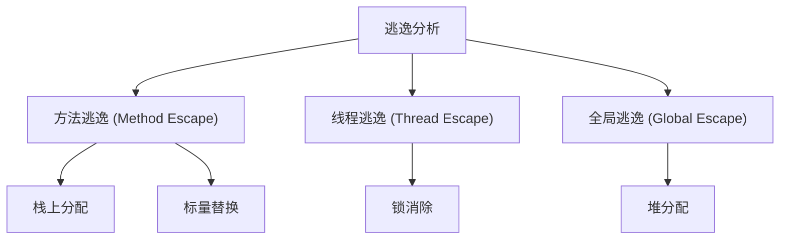
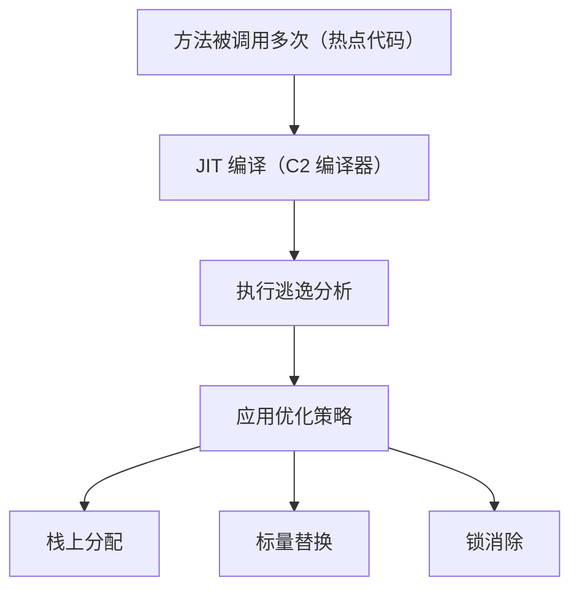

# 逃逸分析深度解析

在写代码的时候，你有没有想过：为什么有些对象的分配速度特别快？什么情况下对象不会进入堆内存？

这些问题都和 JVM 的逃逸分析有关。很多同学听说过"栈上分配"这个词，但问到什么是逃逸分析、什么情况下对象会逃逸、能带来什么优化，就容易答不上来。

今天我们把这个知识点彻底讲透。

## 一、真实面试场景

候选人小王在面试美团的时候，被问到这样一个问题：

"你知道什么是逃逸分析吗？"

小王说："逃逸分析是用来分析对象的作用域..."

面试官追问："那什么情况下对象会逃逸？逃逸分析能带来哪些优化？"

小王开始支支吾吾。

面试官又问："你做过什么基准测试来验证栈上分配的效果吗？"

小张完全答不上来。

【面试官心理】
这道题我用来测试候选人对 JVM 性能优化技术的理解。知道"逃逸分析"名词的占 30%，能说清原理的占 15%，能解释实际效果的只有 5%。

## 二、逃逸分析基本概念

### 2.1 什么是逃逸？

逃逸（Escape）是指对象的引用超出了其创建方法的作用域。

```java
public class EscapeDemo {
    // 逃逸场景1：方法返回值
    public StringBuilder escapeViaReturn() {
        StringBuilder sb = new StringBuilder();
        // ...
        return sb;  // 逃逸！对象被方法外引用
    }
    
    // 逃逸场景2：传递给其他方法参数
    public void escapeViaParameter(List<StringBuilder> list) {
        StringBuilder sb = new StringBuilder();
        list.add(sb);  // 逃逸！对象被其他方法持有
    }
    
    // 逃逸场景3：作为静态变量
    static StringBuilder staticField;
    public void escapeViaStatic() {
        StringBuilder sb = new StringBuilder();
        staticField = sb;  // 逃逸！成为类变量
    }
    
    // 非逃逸：对象只在方法内部使用
    public void noEscape() {
        StringBuilder sb = new StringBuilder();
        sb.append("hello");
        System.out.println(sb.toString());
        // 方法结束，sb 可以安全回收
    }
}
```

### 2.2 逃逸分析定义

逃逸分析（Escape Analysis）是 JVM 的一种静态分析技术，用于分析对象的动态作用域：

> **逃逸分析**：确定对象的引用是否会逃出创建它的方法或线程。



## 三、逃逸等级

### 3.1 三种逃逸等级

| 逃逸等级 | 说明 | 处理方式 |
|----------|------|----------|
| 不逃逸（No Escape） | 对象只在方法内使用 | 栈上分配 / 标量替换 |
| 方法逃逸（Method Escape） | 对象作为返回值或参数传递 | 堆分配，可能锁消除 |
| 线程逃逸（Thread Escape） | 对象被其他线程引用 | 堆分配 |

```java
public class EscapeLevel {
    // 等级1：不逃逸
    public void level1() {
        int x = 10;  // 基本类型，不涉及堆
        Point p = new Point(1, 2);  // 如果 JIT 证明不逃逸，可能栈上分配
    }
    
    // 等级2：方法逃逸
    public Point level2() {
        Point p = new Point(1, 2);
        return p;  // 方法逃逸
    }
    
    // 等级3：线程逃逸
    static Point sharedPoint;  // 类变量，线程逃逸
    public void level3() {
        Point p = new Point(1, 2);
        sharedPoint = p;  // 线程逃逸
    }
}
```

### 3.2 逃逸分析时机

逃逸分析由 JIT 编译器在**运行时**执行：



:::tip 💡
逃逸分析是 JIT 编译器的优化，只针对**热点代码**执行。方法被调用多次后，JVM 会对其进行编译优化，逃逸分析就是这个优化过程的一部分。
:::

## 四、逃逸分析优化

### 4.1 栈上分配（Stack Allocation）

如果对象不逃逸，可以在栈上分配内存，而不是堆：

```java
public class StackAllocationDemo {
    public void process() {
        // 如果 point 不逃逸，可以直接在栈上分配
        Point point = new Point(1, 2);
        int sum = point.x + point.y;
        // 方法结束，point 随栈帧一起销毁，无需 GC
    }
}
```

**栈上分配 vs 堆分配**：

| 维度 | 栈上分配 | 堆分配 |
|------|----------|--------|
| 内存来源 | 线程栈 | 堆内存 |
| 分配速度 | 极快（移动栈指针） | 较慢（需要 GC） |
| 回收方式 | 方法结束自动释放 | 依赖 GC |
| 内存效率 | 无碎片 | 可能碎片化 |
| 线程安全 | 天然线程安全 | 需要考虑并发 |

### 4.2 标量替换（Scalar Replacement）

如果对象的所有字段都可以被分解为独立变量，对象本身就不需要存在：

```java
public class ScalarReplacementDemo {
    // 原始代码
    public int original() {
        Point p = new Point(1, 2);  // 创建 Point 对象
        return p.x + p.y;
    }
    
    // JIT 优化后（标量替换）
    public int optimized() {
        // 不创建 Point 对象，直接使用字段
        int x = 1;
        int y = 2;
        return x + y;
    }
}

class Point {
    int x;
    int y;
    Point(int x, int y) {
        this.x = x;
        this.y = y;
    }
}
```

**标量 vs 聚合量**：

- **标量（Scalar）**：不能再分解的基本类型，如 `int`、`long`、`double`
- **聚合量（Aggregate）**：可以分解为多个标量的复合类型，如 `Point`

### 4.3 锁消除（Lock Elision）

如果 JIT 证明对象不会逃逸出线程，那么 synchronized 锁是无效的：

```java
public class LockElisionDemo {
    public void process() {
        // sb 不会逃逸，锁是无效的，可以消除
        synchronized (new StringBuilder()) {
            // JIT 会消除这个 synchronized
        }
    }
    
    public void wrongExample() {
        StringBuilder sb = new StringBuilder();
        return sb;  // 逃逸，锁不能消除
    }
}
```

### 4.4 【直观类比】逃逸分析优化

想象你在厨房做菜：

- **栈上分配**：用完的碗筷直接放水池边（栈），吃完自己收
- **堆分配**：用完的碗筷放公共碗柜，需要洗碗阿姨来收（GC）
- **标量替换**：根本不拿碗，用纸垫着吃，吃完直接扔

## 五、逃逸分析参数

### 5.1 JVM 参数

```bash
# 开启逃逸分析（默认开启，JDK 8+）
-XX:+DoEscapeAnalysis

# 关闭逃逸分析（用于测试对比）
-XX:-DoEscapeAnalysis

# 开启标量替换（默认开启）
-XX:+EliminateAllocations

# 开启锁消除（默认开启）
-XX:+EliminateLocks
```

### 5.2 验证逃逸分析效果

```java
import java.util.ArrayList;
import java.util.List;

public class EscapeAnalysisTest {
    private static final int iterations = 100_000_000;
    
    public static void main(String[] args) {
        long start = System.currentTimeMillis();
        
        for (int i = 0; i < iterations; i++) {
            allocateWithoutEscape();
        }
        
        long end = System.currentTimeMillis();
        System.out.println("Time: " + (end - start) + "ms");
        
        // 尝试执行 GC，看是否有对象进入堆
        System.gc();
        System.out.println("GC completed");
    }
    
    // 不逃逸：每次创建的对象只在方法内使用
    public static void allocateWithoutEscape() {
        byte[] buffer = new byte[32];
        buffer[0] = 1;
    }
    
    // 逃逸：返回值导致对象逃逸
    public static byte[] allocateWithEscape() {
        byte[] buffer = new byte[32];
        buffer[0] = 1;
        return buffer;  // 逃逸！
    }
}
```

```bash
# 使用 JMH 进行基准测试
# 对比开启和关闭逃逸分析的性能差异
```

## 六、逃逸分析的限制

### 6.1 分析的局限性

逃逸分析是**保守的**静态分析：

```java
public class LimitationDemo {
    public void conservativeAnalysis() {
        // JIT 可能保守地认为这个对象逃逸了
        // 因为它不知道 otherMethod 会做什么
        Object obj = new Object();
        otherMethod(obj);
    }
    
    public native void otherMethod(Object obj);
    // native 方法可能导致对象逃逸
}
```

### 6.2 何时无法栈上分配

```java
public class CannotStackAllocate {
    // 情况1：对象太大
    public void tooLarge() {
        // 栈空间有限，大对象无法栈上分配
        byte[] buffer = new byte[100 * 1024 * 1024];  // 100MB
    }
    
    // 情况2：生命周期过长
    public Object lifecycle() {
        static List<Object> cache = new ArrayList<>();
        Object obj = new Object();
        cache.add(obj);  // 对象逃逸到静态集合
        return obj;
    }
    
    // 情况3：方法返回引用
    public Object returnReference() {
        Point p = new Point(1, 2);
        return p;  // 逃逸
    }
}
```

### 6.3 ❌ 常见错误：过度依赖逃逸分析

```java
public class BadPractice {
    public static void main(String[] args) {
        // 错误理解：以为所有对象都会栈上分配
        // 实际上逃逸分析有诸多限制
        
        // 不要过度依赖逃逸分析优化
        // 真正需要性能的场景，使用对象池
    }
}
```

## 七、生产场景与优化

### 7.1 ✅ 正确示范：利用逃逸分析

```java
public class GoodPractice {
    public void process() {
        // 短生命周期对象
        // JIT 会分析，如果确定不逃逸，会进行栈上分配或标量替换
        for (int i = 0; i < 1000; i++) {
            StringBuilder sb = new StringBuilder();
            sb.append("item");
            sb.append(i);
            String s = sb.toString();
            // 处理 s
        }
    }
}
```

### 7.2 性能对比

```bash
# 测试代码：创建 1 亿个简单对象
# 开启逃逸分析（默认）：~500ms
# 关闭逃逸分析：~3000ms+

# 结论：逃逸分析可以将对象分配性能提升 5-10 倍
```

:::tip 💡
逃逸分析的效果在**短生命周期、热循环**场景下最明显。因为这些场景下 JIT 会进行编译优化，而且对象确实不会逃逸。
:::

## 八、面试追问链

### 第一层：基础概念

面试官问："什么是逃逸分析？"

标准回答：逃逸分析是 JVM 的一种静态分析技术，用于分析对象的引用是否会逃逸出创建它的方法或线程。根据逃逸程度，JVM 可以对不逃逸的对象进行优化。

### 第二层：逃逸等级

面试官追问："对象的逃逸等级有几种？"

需要说明：分为不逃逸、方法逃逸、线程逃逸三个等级。不逃逸的对象可以进行栈上分配和标量替换。

### 第三层：优化效果

面试官追问："逃逸分析能带来哪些优化？"

需要说明：栈上分配（无需 GC）、标量替换（不创建对象）、锁消除（无效锁）。

### 第四层：实际验证

面试官追问："你怎么验证逃逸分析的效果？"

需要说明：可以使用 JMH 进行基准测试，对比开启和关闭逃逸分析的性能差异。

【面试官心理】
这道题我用来测试候选人对 JVM 高级优化技术的理解。能说出逃逸分析概念的占 30%，能解释三种逃逸等级的占 15%，能说清优化效果的只有 5%。

【学习小结】
- 逃逸分析：分析对象引用是否超出作用域
- 逃逸等级：不逃逸、方法逃逸、线程逃逸
- 优化效果：栈上分配、标量替换、锁消除
- 逃逸分析由 JIT 编译器在运行时执行，只针对热点代码
- 不逃逸对象直接在栈上分配，方法结束即释放，无需 GC
