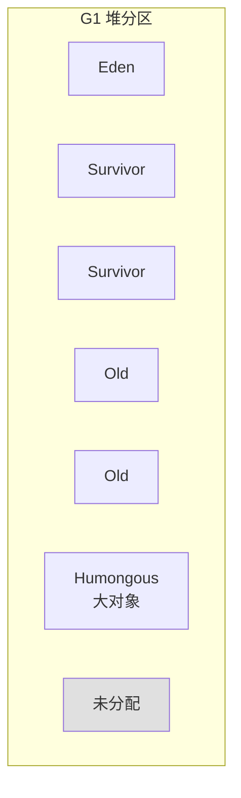
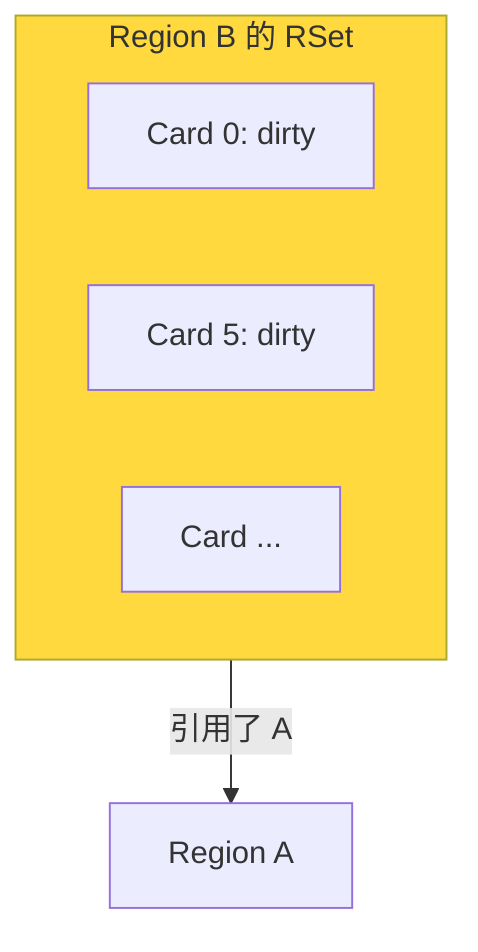
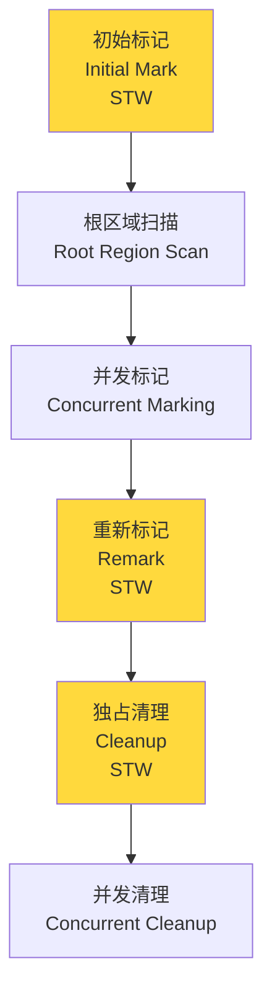

面试官问："G1 收集器了解吗？它和 CMS 有什么区别？"

候选人小冯说："G1 是面向服务器的收集器，用 Region 分区。CMS 是标记清除，G1 是标记整理。"

面试官追问："G1 的 Region 大小是多少？RSet 是什么？为什么 G1 能预测停顿时间？"

小冯说："RSet 是...Remembered Set？用来记录引用关系的？"

面试官继续追问："Young GC 和 Mixed GC 的区别是什么？G1 的并发标记阶段用的是三色标记，为什么不用之前 CMS 的算法？"

小冯彻底卡住了。

---

## 一、G1 的核心设计理念 🔴

### 1.1 问题拆解

G1 是 JDK 9+ 的默认收集器，也是现代 JVM 最复杂的收集器。面试官追问 G1，不是考你背概念，是看你能否理解 G1 如何解决 CMS 的碎片和停顿时间不可控问题。

### 1.2 G1 的设计目标

CMS 的两个致命问题：
1. **内存碎片**：标记-清除导致碎片，最终触发 Full GC
2. **停顿不可控**：CMS 只能控制停顿阶段的时间，但并发阶段仍在消耗 CPU

G1 的设计目标：
- **停顿时间可控**：可设定 `-XX:MaxGCPauseMillis`（默认 200ms）
- **消除内存碎片**：基于 Region 的标记-整理
- **高吞吐量**：在停顿时间约束下最大化吞吐量

### 1.3 Region 分区

G1 将堆划分为多个大小相等的 Region，每个 Region 1MB~32MB：



**Region 类型**：
- **Eden Region**：新对象分配区
- **Survivor Region**：存活对象区
- **Old Region**：老年代对象区
- **Humongous Region**：大对象区（超过 Region 50% 的对象）

---

## 二、RSet（Remembered Set）🔴

### 2.1 RSet 的作用

RSet 是 G1 解决跨代引用问题的核心数据结构。每个 Region 都有一个 RSet，记录"谁引用了我"。

```
Region A 的 RSet 记录：
  - Region B 中有对象引用了 A 中的对象
  - Region C 中有对象引用了 A 中的对象

GC 时：
  只需扫描 RSet 中标记的 Region
  无需扫描整个堆
```

### 2.2 RSet 的实现

RSet 使用**卡表（Card Table）**实现，和 CMS 类似，但每个 Region 有自己的卡表：



### 2.3 写屏障与 RSet 维护

和 CMS 一样，G1 也使用写屏障维护 RSet：

```java
// 写屏障示意
void write_field_barrier() {
    // 原始写操作
    *field = new_value;

    // G1 写屏障：将引用来源的卡页标记为 dirty
    if (src_region != dst_region) {
        enqueue_card_to_rs(src_region, card);
    }
}
```

---

## 三、G1 的 GC 阶段 🟡

### 3.1 Young GC

当 Eden Region 满了时触发。

```
Young GC 流程：
1. 启动 STW（停顿）
2. 扫描 GC Roots（虚拟机栈、全局变量等）
3. 更新 RSet（处理并发期间的跨代引用变化）
4. 遍历 RSet，确定存活对象
5. 复制存活对象到 Survivor Region
6. 处理 Humongous 对象
7. 释放 Eden Region
```

**G1 的复制策略**：G1 会选择回收价值最高的 Region 进行收集（"Garbage First" 的由来）。价值 = 可回收空间 × 回收收益。

### 3.2 Mixed GC

当老年代占用比例超过阈值（`InitiatingHeapOccupancyPercent`，默认 45%）时触发。

Mixed GC 收集：
- 所有新生代 Region
- 一部分老年代 Region（价值最高的）

### 3.3 并发标记周期 🔴

G1 的并发标记周期分为四个阶段：



**G1 和 CMS 的区别**：G1 在并发标记结束后，额外增加了"独占清理"阶段，在 STW 期间统计各 Region 的存活比例并标记回收价值。这是 G1 能预测停顿时间的核心。

---

## 四、停顿预测模型 🟡

### 4.1 如何预测停顿时间

G1 维护了一个停顿预测模型，记录每次 GC 的停顿时间历史：

```
停顿预测模型：
  - 每个 Region 的回收成本（存活对象数量）
  - 历史停顿时间
  - 目标停顿时间（-XX:MaxGCPauseMillis）

G1 选择 Region 时：
  贪心策略：选择"价值/成本"比最高的 Region
  约束条件：总回收成本不超过目标停顿时间
```

```bash
-XX:MaxGCPauseMillis=200  # 默认 200ms
# G1 会尽量满足这个目标，但不保证
# 如果无法满足，会尽量接近

-XX:GCPauseIntervalMillis=1000  # 停顿间隔，默认等于 MaxGCPauseMillis
```

### 4.2 ❌ 错误示范

**候选人原话**："设置 MaxGCPauseMillis=100，G1 就能保证每次停顿不超过 100ms。"

【面试官心理】
这个候选人完全误解了 MaxGCPauseMillis 的含义。这是一个"软目标"（soft goal），不是硬约束。如果业务负载极高，或者堆碎片化严重，G1 可能无法达到这个目标。把它理解为"保证"的候选人，说明对 G1 的设计理念理解不深。

---

## 五、生产调优参数 🟡

### 5.1 核心参数

```bash
# 开启 G1
-XX:+UseG1GC

# 关键调优参数
-XX:MaxGCPauseMillis=200      # 目标停顿时间
-XX:G1HeapRegionSize=4m        # Region 大小（2的幂次，1MB~32MB）
-XX:InitiatingHeapOccupancyPercent=45  # 触发 Mixed GC 的老年代占用阈值
-XX:G1NewSizePercent=5         # 新生代最小比例（默认 5%）
-XX:G1MaxNewSizePercent=60     # 新生代最大比例（默认 60%）
-XX:G1HeapWastePercent=5       # 允许的浪费空间比例
```

### 5.2 G1 vs CMS 选型

| 维度 | G1 | CMS |
| --- | --- | --- |
| **停顿时间** | 可预测（停顿模型） | 不可预测 |
| **内存碎片** | 标记-整理，无碎片 | 标记-清除，有碎片 |
| **并发开销** | 较低（CMS 的 1/2~1/3） | 较高（占用 25% CPU） |
| **内存占用** | 较高（RSet 开销） | 较低 |
| **适用场景** | JDK 9+ 默认，通用 | JDK 8 及之前 |
| **Full GC** | 退化 G1（单线程整理） | 退化 Serial Old |

:::tip 💡
G1 不是万能药。在内存很小（`Xmx < 4GB`）或对象分配极快的场景下，CMS 的表现可能更好。G1 的 RSet 本身也占用内存，对于小堆来说可能得不偿失。
:::

【面试官心理】
能说出 G1 和 CMS 各自适用场景的候选人，说明他对 GC 的选型有过深入思考。在 P7 面试中，这种基于场景的工程判断力比背概念更重要。
