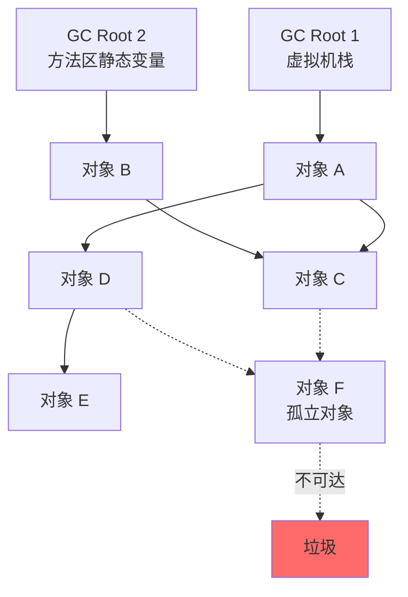
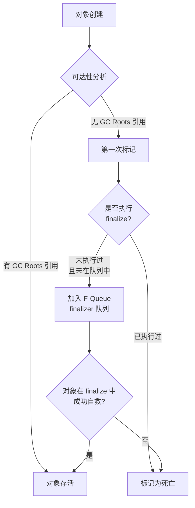

面试官问："JVM 怎么判断一个对象是否需要被回收？"

候选人小赵答："通过 GC Roots 遍历，如果一个对象到 GC Roots 没有引用链，那就是垃圾。"

面试官点点头，继续追问："那引用计数法呢？为什么 JVM 不用引用计数法？有没有办法解决引用计数的循环引用问题？"

小赵说："引用计数是另一种算法...循环引用会导致无法回收..."

面试官追问："那 PhantomReference 呢？它的引用计数怎么处理？"

小赵彻底卡住了。

---

## 一、垃圾判定：两种方法 🔴

### 1.1 问题拆解

这道题考察的是候选人对垃圾回收基础理论的掌握。表面问的是"JVM 怎么判断垃圾"，深层是在测试候选人对两种基本算法的理解深度，以及是否理解为什么 JVM 选择可达性分析而非引用计数。

### 1.2 方法一：引用计数法（Reference Counting）

每个对象维护一个引用计数器。当有新的引用指向它时，计数器加 1；引用失效时，计数器减 1。当计数器为 0 时，对象立即被标记为垃圾。

```java
// 引用计数示意
class RefCountDemo {
    static class Node {
        int refCount = 0; // 引用计数器
    }

    public static void main(String[] args) {
        Node a = new Node(); // a.refCount = 1
        Node b = new Node(); // b.refCount = 1

        a.next = b;           // b.refCount = 2
        b.next = a;           // a.refCount = 2

        a = null;             // a.refCount = 1
        b = null;             // b.refCount = 0 → 可回收

        // 表面上看 a 和 b 都没有外部引用了
        // 但它们互相引用，refCount 都不为 0
        // 引用计数法无法回收这两个对象！
    }
}
```

### 1.3 方法二：可达性分析（Reachability Analysis）🔴

可达性分析从 GC Roots 出发，遍历所有对象的引用链。能到达的对象是"活的"，不能到达的对象是垃圾。



**为什么 JVM 选择可达性分析？**
1. **解决循环引用**：可达性分析不依赖引用计数，即使两个对象互相引用，只要从 GC Roots 不可达，就是垃圾
2. **统一管理**：GC Roots 作为统一的起点，方便管理
3. **间接引用处理**：可达性分析天然处理软引用、弱引用、虚引用等特殊引用类型

---

## 二、JVM 中的 GC Roots 🔴

### 2.1 标准 GC Roots 组成

| GC Roots 类型 | 包含内容 | 生命周期 |
| --- | --- | --- |
| 虚拟机栈中引用的对象 | 局部变量表中的 reference 类型 | 线程存活期间 |
| 方法区中类静态属性引用的对象 | 类的静态变量（static） | 应用运行期间 |
| 方法区中常量引用的对象 | 字符串常量池中的 String 对象 | 应用运行期间 |
| 本地方法栈中 JNI 引用的对象 | native 方法中的 reference | 线程存活期间 |
| JVM 内部引用 | ClassLoader、异常对象（OutOfMemoryError） | 进程运行期间 |
| 同步锁（synchronized）持有的对象 | 被 synchronized 修饰的对象 | 锁持有期间 |

### 2.2 ❌ 错误示范

**候选人原话**："GC Roots 就是全局变量和静态变量。"

【面试官心理】
这个候选人对 GC Roots 的理解太片面了。静态变量只是 GC Roots 的一种。虚拟机栈中的局部变量、本地方法栈中的 native 引用、同步锁持有的对象——这些都是 GC Roots。只知道一半的候选人，面试官会继续追问直到他崩溃。

**候选人原话 2**："可达性分析需要 stop-the-world，所以会有停顿。"

追问："那有没有办法减少停顿时间？"

候选人："...用 G1？"

面试官继续追问 G1 的具体机制，候选人答不上来。

---

## 三、对象引用与 GC 判定 🟡

### 3.1 引用强度的分类

Java 中的引用按强度从强到弱分为四种：

| 引用类型 | GC 行为 | 典型用途 |
| --- | --- | --- |
| 强引用（Strong Reference） | 永远不回收，`o = null` 后才可能回收 | 常规对象引用 |
| 软引用（Soft Reference） | 内存不足时回收 |缓存（Memory-sensitive cache） |
| 弱引用（Weak Reference） | 每次 GC 时回收 | 规范化映射（WeakHashMap） |
| 虚引用（Phantom Reference） | 随时可回收，不影响 GC 判定 | 追踪对象回收 |

### 3.2 finalize() 的作用与陷阱

每个对象在 GC 前会调用 `finalize()` 方法，这是对象逃脱被回收的最后机会：

```java
public class FinalizeEscape {
    static FinalizeEscape SAVE_HOOK = null;

    @Override
    protected void finalize() throws Throwable {
        super.finalize();
        System.out.println("finalize called!");
        SAVE_HOOK = this; // 把自己赋值给静态变量，逃脱 GC
    }

    public static void main(String[] args) throws InterruptedException {
        SAVE_HOOK = new FinalizeEscape();
        SAVE_HOOK = null;           // 解除引用
        System.gc();                // 触发 GC
        Thread.sleep(500);          // 等待 finalize 执行
        if (SAVE_HOOK != null) {
            System.out.println("对象逃过了 GC！");
        }
        // 第二次 GC，这个对象将真正被回收（finalize 只会调用一次）
        SAVE_HOOK = null;
        System.gc();
    }
}
```

:::warning ⚠️
`finalize()` 的问题：
1. **只调用一次**：第二次 GC 时不会再调用 `finalize()`
2. **不确定性**：GC 时间不确定，`finalize()` 执行时间也不确定
3. **性能差**：JVM 需要额外的开销来追踪 `finalize()` 调用
4. **已废弃**：从 JDK 9 开始标记为 `@Deprecated`

最佳实践：**永远不要使用 `finalize()`**。用 `try-with-resources`、弱引用或 ` Cleaner` 代替。
:::

---

## 四、两次标记与可达性分析 🟡

### 4.1 对象的"死亡"判定过程



JVM 对每个对象做两次标记：
1. **第一次标记**：不可达的对象被标记，并检查是否有 `finalize()` 方法且未执行过
2. **第二次标记**：执行过 `finalize()` 但仍然不可达的对象，被标记为"死亡"，等待 GC

### 4.2 安全点（Safe Point）

可达性分析需要"一致性快照"——在分析过程中，对象引用关系不能变化。JVM 通过**安全点**机制实现这一点。

安全点是代码中的一些特定位置，JVM 保证在这些位置可以暂停：
- 方法返回前
- 循环末尾
- 抛出异常前
- 字节码指令边界

```java
// 典型安全点位置
for (int i = 0; i < 100000; i++) {
    // 循环体中间 → 安全点
    // 循环体末尾 → 安全点
    // 方法返回前 → 安全点
    doSomething(i);
}
// 循环体中如果有大对象分配，安全点决定 GC 能否及时触发
```

**为什么安全点很重要？** 如果线程在 sleep 或阻塞状态，JVM 无法等待它进入安全点。这种情况下的线程状态称为**Off-VM**。JVM 需要特殊处理这些线程，通常通过**抢安全点（Preempt）**机制。

---

## 五、面试高频追问 🟡

### 5.1 追问：为什么引用计数法无法处理循环引用？

```java
// 循环引用示意
Node a = new Node(); // a.refCount = 1
Node b = new Node(); // b.refCount = 1
a.next = b;          // b.refCount = 2
b.next = a;          // a.refCount = 2

a = null;             // a.refCount = 1（仍被b引用）
b = null;             // b.refCount = 1（仍被a引用）

// 引用计数：a.refCount=1, b.refCount=1 → 不为0 → 不回收
// 可达性分析：a和b都无法从GC Roots到达 → 回收
```

### 5.2 追问：哪些对象可以作为 GC Roots？

这个话题我在另一篇文章 [GC Roots 有哪些](/java/jvm/gc-roots) 中有详细分析。

【面试官心理】
面试官追问 GC Roots，是在测试候选人的广度。能把所有 6 种 GC Roots 类型都说出来的候选人，说明他对 JVM 内存管理有系统性认知。
