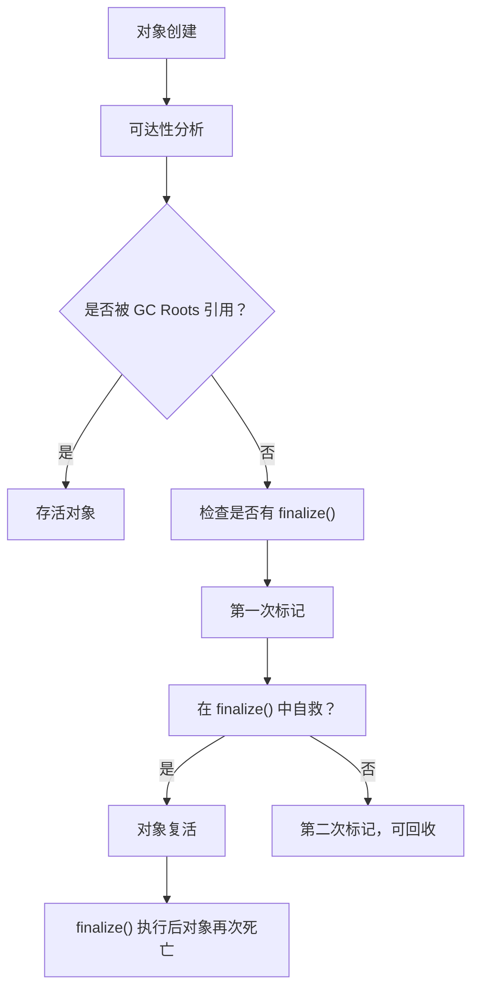

# 垃圾回收判定算法

在写代码的时候，你有没有想过：JVM 怎么知道哪些对象是"垃圾"？它是怎么判断一个对象是否还在使用的？

这些问题都和垃圾回收判定算法有关。很多同学知道 GC 会回收"无用对象"，但问到具体怎么判定、引用计数和可达性分析的区别、哪些对象不能被回收，就容易答不上来。

今天我们把这个知识点彻底讲透。

## 一、真实面试场景

候选人小张在面试阿里的时候，被问到这样一个问题：

"JVM 怎么判断一个对象是否需要被回收？"

小张说："用引用计数法，如果有对象引用它就活着，否则回收..."

面试官追问："那为什么 Java 不用引用计数法？"

小张说："因为...性能问题？"

面试官又问："那 Java 用的是什么算法？"

小张开始支支吾吾。

【面试官心理】
这道题我用来测试候选人对垃圾回收原理的理解。只知道"引用计数"名词的占 50%，能说清两种算法区别的占 30%，能解释为什么 Java 选择可达性分析的只有 10%。

## 二、引用计数法（Reference Counting）

### 2.1 算法原理

引用计数法是一种简单直观的垃圾判定算法：每个对象都有一个引用计数器，当有新的引用指向它时，计数器加 1；当引用失效时，计数器减 1。当计数器为 0 时，对象即可被回收。

```java
public class ReferenceCountingDemo {
    public static void main(String[] args) {
        Object obj1 = new Object();  // 计数器 = 1
        Object obj2 = obj1;          // 计数器 = 2
        
        obj1 = null;                 // 计数器 = 1
        
        obj2 = null;                 // 计数器 = 0，对象可回收
    }
}
```

### 2.2 优缺点分析

| 优点 | 缺点 |
|------|------|
| 实现简单 | 无法处理循环引用 |
| 判定效率高（O(1)） | 需要额外的计数器字段 |
| 回收及时（计数器为 0 立即回收） | 并发环境下计数器更新需要同步 |

### 2.3 循环引用问题

```java
public class CircularReference {
    public static void main(String[] args) {
        // 创建两个对象，互相引用
        ObjectA a = new ObjectA();
        ObjectB b = new ObjectB();
        
        a.ref = b;  // a 持有 b 的引用
        b.ref = a;  // b 持有 a 的引用
        
        // 此时 a 和 b 的引用计数都是 1
        
        // 但如果外部不再持有 a 和 b 的引用
        a = null;
        b = null;
        
        // a 和 b 已经不可达，但引用计数都是 1
        // 引用计数法无法回收这两个对象！
    }
}

class ObjectA {
    ObjectB ref;
}

class ObjectB {
    ObjectA ref;
}
```

:::warning ⚠️
Python、Perl 等语言使用引用计数法，但它们通过额外的机制（如 GC 周期）来解决循环引用问题。引用计数法本身无法处理循环引用。
:::

## 三、可达性分析算法（Reachability Analysis）

### 3.1 算法原理

Java 使用的是可达性分析算法，也称为"根搜索算法"。它的核心思想是：从一系列"GC Roots"出发，沿着引用链（Reference Chain）向下搜索。所有能够被 GC Roots 到达的对象都是存活对象，其余的都是垃圾。

```mermaid
graph TB
    ROOT["GC Roots"]
    ROOT --> A["对象 A"]
    A --> B["对象 B"]
    A --> C["对象 C"]
    B --> D["对象 D"]
    C --> D
    
    E["对象 E"]  # 不被 GC Roots 引用
    
    style E fill:#ff9999
```

在上面的例子中：
- 对象 A、B、C、D 都被 GC Roots 引用，是存活对象
- 对象 E 不被任何 GC Roots 引用，是垃圾对象

### 3.2 GC Roots 有哪些？

| GC Roots 类型 | 说明 |
|---------------|------|
| 虚拟机栈（栈帧中的本地变量表） | 方法中使用的局部变量 |
| 方法区中的静态属性引用 | static 修饰的成员变量 |
| 方法区中的常量引用 | final 常量池中的引用 |
| 本地方法栈中 JNI 引用 | native 方法中的引用 |
| JVM 内部引用 | 如 Class 对象、异常对象 |
| 同步锁持有的对象 | synchronized 锁住的对象 |

```java
public class GCRootsDemo {
    // 1. 静态属性（静态变量）
    static Object staticObj = new Object();
    
    // 2. 常量
    static final Object CONSTANT_OBJ = new Object();
    
    public void method() {
        // 3. 栈帧中的局部变量
        Object localObj = new Object();
        
        // 4. 锁对象
        synchronized (localObj) {
            // 正在被锁住的对象也是 GC Root
        }
    }
}
```

### 3.3 引用链追踪过程

```java
public class TracingDemo {
    public static void main(String[] args) {
        // 1. 方法中的局部变量是 GC Root
        Object root = new Object();
        
        // 2. 创建引用链
        Object a = new Object();
        Object b = new Object();
        Object c = new Object();
        
        a.ref = b;
        b.ref = c;
        c.ref = a;
        
        // 3. 此时 a -> b -> c 形成循环
        // 但它们都被 root 引用，所以都是存活的
        
        // 4. 断开引用链
        root = null;
        a = null;
        b = null;
        c = null;
        
        // 5. 现在 a、b、c 都不被 GC Roots 引用
        // 即使它们内部相互引用，也会被回收
    }
}
```

## 四、两种算法的对比

### 4.1 核心区别

| 维度 | 引用计数法 | 可达性分析 |
|------|------------|------------|
| 判定方式 | 计数器是否为 0 | 是否被 GC Roots 引用 |
| 循环引用 | 无法处理 | 可以处理 |
| 额外开销 | 需要计数器字段 | 需要遍历对象图 |
| 实时性 | 立即回收 | GC 时才回收 |
| 并发开销 | 计数器更新需要同步 | 遍历过程需要 STW |

### 4.2 Java 为什么选择可达性分析？

**1. 解决循环引用问题**

```java
public class WhyReachability {
    public static void main(String[] args) {
        // 可达性分析可以正确处理循环引用
        Node a = new Node();
        Node b = new Node();
        a.next = b;
        b.next = a;
        
        // 即使 a 和 b 相互引用
        // 如果它们不再被 GC Roots 引用，就会被回收
    }
}
```

**2. 适应多线程环境**

引用计数法的计数器更新需要同步，而可达性分析不需要在每次引用变化时都更新。

**3. 更好的吞吐量**

虽然可达性分析需要 Stop-The-World，但它是一次性的，适合配合各种 GC 算法使用。

:::tip 💡
Python 实际上使用引用计数 + 周期性 GC 的混合方案。引用计数负责即时回收，周期性 GC 负责处理循环引用。Java 选择纯可达性分析是因为它的"Stop-The-World"机制更可控。
:::

## 五、引用类型与可达性

### 5.1 强引用（Strong Reference）

```java
public class StrongReference {
    public static void main(String[] args) {
        // 强引用：永远不会 GC
        Object obj = new Object();  // 强引用
        
        obj = null;  // 断开引用，对象才可能被回收
        
        // 即使内存不足，JVM 抛出 OOM，也不会回收强引用对象
    }
}
```

### 5.2 软引用（Soft Reference）

```java
import java.lang.ref.SoftReference;

public class SoftReferenceDemo {
    public static void main(String[] args) {
        // 软引用：内存不足时才会回收
        SoftReference<byte[]> softRef = new SoftReference<>(new byte[1024 * 1024 * 10]);
        
        // 软引用常用于缓存
        // 当内存充足时，对象保留；内存不足时，对象被回收
    }
}
```

### 5.3 弱引用（Weak Reference）

```java
import java.lang.ref.WeakReference;

public class WeakReferenceDemo {
    public static void main(String[] args) {
        // 弱引用：下一次 GC 时一定会回收
        WeakReference<Object> weakRef = new WeakReference<>(new Object());
        
        // 下一次 GC 时，无论内存是否充足，对象都会被回收
    }
}
```

### 5.4 虚引用（Phantom Reference）

```java
import java.lang.ref.PhantomReference;
import java.lang.ref.ReferenceQueue;

public class PhantomReferenceDemo {
    public static void main(String[] args) {
        ReferenceQueue<Object> queue = new ReferenceQueue<>();
        
        // 虚引用：无法通过 get() 获取对象
        // 唯一作用是追踪对象被回收的时机
        PhantomReference<Object> phantomRef = new PhantomReference<>(new Object(), queue);
        
        // 当对象被回收时，phantomRef 会被加入 queue
    }
}
```

## 六、常见面试题解析

### 6.1 对象死亡判定过程



```java
public class FinalizeEscape {
    static Object object;
    
    public static void main(String[] args) throws InterruptedException {
        object = new Object();
        
        // 第一次 GC
        object = null;
        System.gc();
        Thread.sleep(500);
        
        if (object != null) {
            System.out.println("对象复活了！");
        }
        
        // 第二次 GC
        object = null;
        System.gc();
        Thread.sleep(500);
        
        if (object == null) {
            System.out.println("对象最终死亡");
        }
    }
    
    // 重写 finalize()，尝试自救
    @Override
    protected void finalize() throws Throwable {
        object = this;  // 自救：将 this 赋值给静态变量
        System.out.println("finalize() 被调用，尝试自救");
    }
}
```

:::warning ⚠️
不推荐使用 `finalize()` 进行资源清理！它执行时机不确定，且一个对象的 `finalize()` 只会执行一次。
:::

### 6.2 ❌ 错误示范：依赖 finalize() 自救

```java
public class BadFinalizePractice {
    public static void main(String[] args) {
        // 错误：finalize() 执行时机不确定
        // 错误：只会被调用一次
        // 正确做法：使用 try-with-resources 或主动清理
    }
}
```

## 七、面试追问链

### 第一层：基础概念

面试官问："JVM 怎么判断一个对象是否需要被回收？"

标准回答：JVM 使用可达性分析算法。从 GC Roots 开始，沿着引用链向下搜索。所有能够被 GC Roots 到达的对象都是存活的，其余的都是垃圾。

### 第二层：GC Roots

面试官追问："GC Roots 有哪些？"

需要说明：虚拟机栈中的局部变量、方法区中的静态属性、方法区中的常量、本地方法栈中的 JNI 引用、同步锁持有的对象等。

### 第三层：算法对比

面试官追问："为什么 Java 不用引用计数法？"

需要说明：引用计数法无法处理循环引用，而可达性分析可以。Java 选择可达性分析是因为它能正确处理循环引用。

### 第四层：引用类型

面试官追问："软引用、弱引用在可达性分析中是什么角色？"

需要说明：软引用和弱引用本身不会成为 GC Roots，但它们引用的对象需要通过可达性分析来判断是否可回收。虚引用不能通过 get() 获取对象，主要用于追踪回收时机。

【面试官心理】
这道题我用来测试候选人对垃圾回收核心原理的理解。能说出"可达性分析"名词的占 50%，能解释 GC Roots 组成的占 30%，能对比两种算法并说明原因的只有 10%。

【学习小结】
- 引用计数法：计数器为 0 即回收，但无法处理循环引用
- 可达性分析：从 GC Roots 出发，能到达的对象存活，不能到达的回收
- GC Roots 包括：虚拟机栈变量、方法区静态/常量、锁对象、JNI 引用等
- Java 选择可达性分析是因为它能正确处理循环引用
- 四种引用类型：强引用（永不回收）、软引用（内存不足回收）、弱引用（下次 GC 回收）、虚引用（仅追踪）
