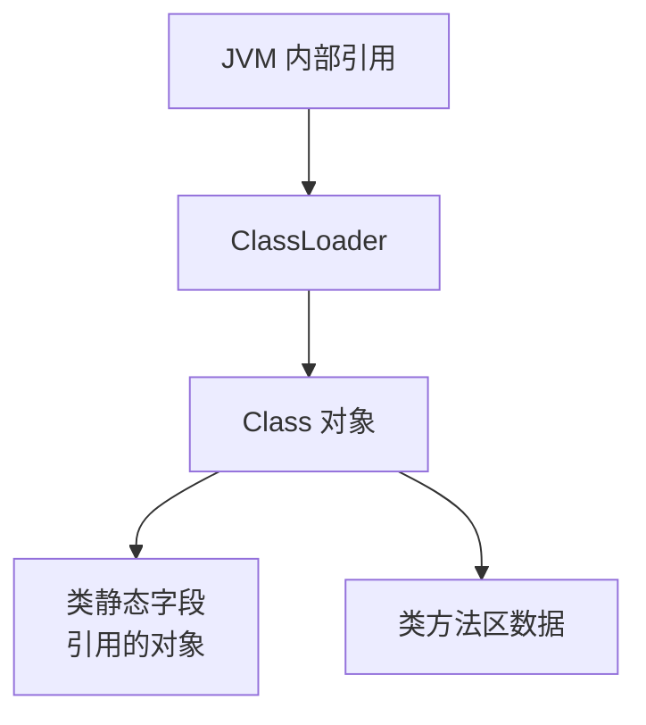

面试官问："什么对象可以作为 GC Roots？"

候选人小刘说："虚拟机栈中的对象、方法区中的静态变量，还有字符串常量池。"

面试官追问："那本地方法栈中 native 方法引用的对象算吗？同步锁持有的对象呢？Class 对象本身呢？"

小刘越说越没底气。

---

## 一、GC Roots 六种类型 🔴

### 1.1 问题拆解

GC Roots 是可达性分析的起点，是垃圾回收判定中最关键的概念。面试官问"哪些对象可以作为 GC Roots"，实际上在测试候选人对 JVM 内存管理全貌的理解。6 种 GC Roots 类型，每一种背后都有其存在的原因。

### 1.2 完整分类

| 序号 | GC Roots 类型 | 具体内容 | 判定依据 |
| --- | --- | --- | --- |
| 1 | 虚拟机栈（栈帧局部变量表）中引用的对象 | 方法参数、局部变量 | 线程活跃，栈帧存活期间对象必存活 |
| 2 | 方法区中类静态属性引用的对象 | 类的 `static` 字段引用的对象 | 方法区与堆共存亡 |
| 3 | 方法区中常量引用的对象 | 字符串常量池、final 常量 | 方法区与堆共存亡 |
| 4 | 本地方法栈中 JNI 引用的对象 | native 方法中的 reference | 同虚拟机栈 |
| 5 | JVM 内部引用 | ClassLoader、异常对象、系统类加载器 | 进程存活期间永不回收 |
| 6 | 被 synchronized 持有的对象 | 当前正在执行 `synchronized` 块的对象 | 锁生命周期 |

### 1.3 逐一详解

#### 类型一：虚拟机栈中的 reference

```java
public void method() {
    User user = new User(); // user 是局部变量，存在栈帧局部变量表中
    // user 作为局部变量，是当前栈帧的 GC Root
    // 只要当前栈帧存活，user 指向的对象就不会被回收
}
```

栈帧的局部变量表中存储的是 reference 类型，而不是对象本身。**栈帧存活 = 局部变量存活 = 局部变量引用的对象不会被回收**。

#### 类型二：方法区静态属性引用

```java
public class StaticRef {
    private static User user = new User(); // 静态变量是 GC Root
    private static final String CONST = "constant"; // 字符串常量也是 GC Root
}
```

静态变量的生命周期与类加载器绑定。类卸载极少发生（除非自定义 ClassLoader），所以静态变量引用的对象存活时间非常长。

#### 类型三：本地方法栈中的 JNI 引用

```java
public class JNIExample {
    // native 方法中可能持有 Java 对象的引用
    private native void nativeMethod(Object obj);
    // native 方法内部创建的对象引用，也会成为 GC Root
}
```

JNI（Java Native Interface）允许 Java 调用 C/C++ 代码。这些 native 代码中的引用在 JVM 看来是"外部引用"，和虚拟机栈中的 reference 具有同等地位。

#### 类型四：被 synchronized 持有的对象

```java
public void lockDemo() {
    Object lock = new Object(); // lock 对象被创建
    synchronized (lock) {       // lock 对象被当前线程持有
        // 在 synchronized 块执行期间，lock 对象是 GC Root
        // 其他线程无法 GC 这个对象
    }
}
```

只要线程持有对象的锁，这个对象就是"活跃"的——它的 Mark Word 中记录了持有者的线程 ID。JVM 不会回收正在被锁保护的对象。

### 1.4 ❌ 错误示范

**候选人原话**："GC Roots 就是堆外对象。"

【面试官心理】
这个候选人完全说错了。GC Roots 恰恰是从堆内出发寻找的那些"根"——虚拟机栈在堆内，方法区在堆外，native 栈在堆外。能说出"堆外"的是没理解 GC Roots 的判定逻辑。

**候选人原话 2**："字符串常量池中的对象是 GC Roots。"

追问："那字符串常量池在 JDK 7 和 JDK 8 中的位置有什么不同？字符串常量池对象作为 GC Root 的判断依据是什么？"

候选人："...JDK 7 移到了堆里？"

继续追问："那 JDK 8 里字符串常量池对象的 GC Root 判定和 JDK 7 有区别吗？"

能说出"JDK 8 中字符串常量池在堆中，但常量池中的对象仍然是 GC Roots——因为方法区常量引用仍然存在"的候选人，对版本演进有深入了解。

---

## 二、常见面试追问 🟡

### 2.1 追问：Class 对象本身是 GC Root 吗？

**不是。** Class 对象本身是在堆中分配的。但 Class 对象被**类加载器引用**，而类加载器被 JVM 内部引用，所以 Class 对象通过 GC Roots 间接可达，不会被意外回收。



### 2.2 追问：局部变量是 GC Root 吗？

**局部变量本身不是 GC Root。** GC Root 是局部变量**引用的对象**。更准确地说，是**栈帧局部变量表中的 reference 类型槽位**。

```java
public void rootOrNot() {
    Object a = new Object();     // a 引用（槽位）是 GC Root，a 引用的对象通过 a 可达
    Object b = null;             // b 引用（槽位）仍是 GC Root，但 b = null 后
                                 // 之前 b 引用的对象变为不可达
    int c = 42;                  // 基本类型，不是 reference，不是 GC Root
}
```

### 2.3 追问：为什么静态变量作为 GC Root 存活时间那么长？

因为类加载器不卸载，静态变量引用的对象就永远可达。这是一个双刃剑：
- **好处**：静态常量不用关心回收问题
- **坏处**：静态缓存如果持续增长，会造成永久的内存占用

---

## 三、生产避坑 🟡

### 3.1 静态集合导致的内存泄漏

```java
public class StaticMemoryLeak {
    // 静态 HashMap 持续增长，永不回收
    private static Map<Long, User> cache = new HashMap<>();

    public void addUser(Long id, User user) {
        cache.put(id, user); // 只要 cache 是 GC Root，cache 中的所有对象都不会被回收
    }

    // 如果不清理，cache 中的对象会一直占用内存
    // 解决方案：定期清理 cache，或用 WeakHashMap 做缓存
}
```

### 3.2 监听器注册未注销

```java
public class ListenerLeak {
    private static List<EventListener> listeners = new ArrayList<>();

    public void registerListener(EventListener listener) {
        listeners.add(listener); // 监听器被 GC Root 引用
        // 如果没有对应的 removeListener() 调用
        // 监听器对象永远无法被回收
    }
}
```

:::tip 💡
生产环境中排查内存泄漏时，GC Roots 分析是最重要的手段。用 MAT（Memory Analyzer Tool）或 `jmap` 导出堆转储后，搜索"GC Roots 引用链"可以定位哪些对象为什么不能被回收。
:::

---

## 四、与 GC 判定算法的关系 🟢

GC Roots 和 [垃圾回收判定算法](/java/jvm/gc-judgment) 是两个层面的概念：
- **GC Roots**：可达性分析的"起点"集合
- **判定算法**：从起点出发遍历的方式（引用计数 or 可达性分析）

没有 GC Roots，判定算法无法开始；没有判定算法，GC Roots 没有意义。两者共同构成了 JVM 的垃圾判定体系。
