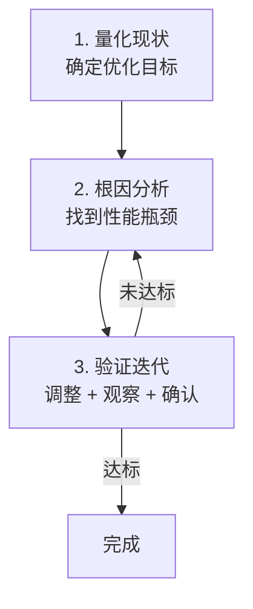

面试官问："你们生产环境遇到过 GC 问题吗？怎么排查和解决的？"

候选人小马说："遇到过，用 jstat 看 GC 情况，然后调整堆大小。"

面试官追问："调整的哪个参数？怎么判断调整方向的？有没有遇到过 CMS 退化 Full GC？怎么处理的？"

小马支支吾吾答不上来。

---

## 一、GC 调优方法论 🔴

### 1.1 问题拆解

GC 调优不是"调参数"，而是"找根因 + 选方案 + 验证"。面试官追问调优经历，是在测试候选人的问题解决能力和工程判断力。

### 1.2 调优三步法



**第一步：量化现状**

```
确定优化目标（SMART 原则）：
  Specific：GC 停顿 < 200ms
  Measurable：99th 分位 < 200ms
  Achievable：当前 1500ms → 200ms
  Relevant：业务用户体验提升
  Time-bound：2周内完成
```

**第二步：根因分析**

常见 GC 性能问题的根因分类：

| 症状 | 根因 | 快速判断 |
| --- | --- | --- |
| Full GC 频繁 | 内存泄漏/大对象 | 堆使用量只升不降 |
| Young GC 频繁 | 对象分配速率过高 | Minor GC 间隔 < 100ms |
| GC 停顿时间长 | 老年代碎片/大堆 | Full GC 时间随堆增长 |
| CMS 退化 Full GC | 老年代碎片化 | 并发模式失败日志 |
| 元空间 OOM | 类加载过多 | Metaspace 使用率 > 90% |

**第三步：验证迭代**

调优后必须用同样的负载重新测试，不能凭感觉。

---

## 二、典型调优案例 🟡

### 2.1 案例一：电商促销系统 Full GC 频繁

**背景**：双十一前，某电商订单系统 Full GC 频率从 1次/10分钟 飙升到 1次/分钟，每次停顿 3 秒。

**排查过程**：

```bash
# 1. 查看 GC 日志
grep "Full GC" gc.log | awk '{print $4}' | tail -50
# 结果：老年代使用量从 500MB 持续增长到 2GB（满）

# 2. jstat 实时观察
jstat -gcutil <pid> 1000
# S0 S1 O M   --> O(Old) 使用率持续 95%+

# 3. 导出堆转储
jmap -dump:format=b,file=heap.bin <pid>

# 4. MAT 分析
# 发现：HashMap<Long, Order> 订单缓存没有清理机制
# 缓存对象持续增长，占用老年代 80% 空间
```

**解决方案**：

1. 短期：增大老年代 `-Xmx=4g -Xms=4g`
2. 中期：添加缓存清理机制，设置 TTL（Time To Live）
3. 长期：引入 Redis 分布式缓存替代本地缓存

```java
// 修复代码
public class OrderCache {
    // 使用 WeakHashMap：键不再被引用时自动清理
    private Map<Long, WeakReference<Order>> cache = new WeakHashMap<>();

    // 或使用带 TTL 的缓存（推荐）
    private LoadingCache<Long, Order> cache = Caffeine.newBuilder()
        .maximumSize(10_000)
        .expireAfterWrite(Duration.ofMinutes(5))
        .build(Order::loadFromDB);
}
```

### 2.2 案例二：CMS 退化 Full GC 导致服务抖动 🟡

**背景**：某搜索服务使用 CMS GC，老年代空间充足但碎片化严重，频繁触发并发模式失败。

**关键日志**：

```
[CMS-concurrent-mark: 1.234/1.456s]
[CMS: abort preclean due to time]
[Full GC (Allocation Failure) ...]  <-- 退化 Full GC，停顿 8 秒
```

**排查过程**：

```bash
# 1. 检查碎片化程度
jstat -gc <pid> | awk '{print $6/$5}'  # Old区的GC前使用/总大小

# 2. 观察 CMS 回收频率
grep "Full GC" gc.log | wc -l

# 3. 分析老年代对象年龄分布
# 发现大量年龄 1~5 的对象，说明 Survivor 区不够用，大量对象提前晋升
```

**解决方案**：

```bash
# 参数调整
-XX:+UseCMSInitiatingOccupancyOnly
-XX:CMSInitiatingOccupancyFraction=60    # 降低触发阈值，提前回收
-XX:+UseCMSCompactAtFullCollection      # Full GC 时整理（默认开启）
-XX:CMSFullGCsBeforeCompaction=3         # 3次Full GC后整理一次

# 更大改动：切换到 G1
-XX:+UseG1GC
-XX:MaxGCPauseMillis=200
```

### 2.3 案例三：Young GC 时间过长 🟡

**背景**：某大数据处理任务，Young GC 停顿时间从 50ms 飙升到 500ms。

**排查**：

```bash
# 查看 Young GC 耗时分布
grep "Allocation Failure" gc.log | awk -F'[,[:space:]]+' '{print $NF}' | sort -n

# 发现：堆很大（32GB），但 Survivor 区只有 200MB
# 存活对象 > Survivor 容量，导致大量对象直接晋升老年代
# 但更关键的是：扫描 Survivor 区的 RSet 时间过长
```

**解决方案**：

```bash
# 减小堆大小（反而能提升 GC 效率）
-Xmx8g -Xms8g -Xmn2g
-XX:SurvivorRatio=8

# 或切换到 G1
-XX:+UseG1GC
-XX:G1HeapRegionSize=4m
```

:::warning ⚠️
**大堆的陷阱**：很多人认为"堆越大越好"。实际上，当堆超过一定大小（> 16GB）后，GC 的绝对时间会变长。对于要求低延迟的服务，推荐使用 8GB 以下的堆。如果必须用大堆，选择 G1 或 ZGC。
:::

---

## 三、调优参数速查表 🟡

### 3.1 通用调优参数

| 场景 | 推荐参数 | 说明 |
| --- | --- | --- |
| 低延迟优先 | `-XX:+UseG1GC -XX:MaxGCPauseMillis=200` | G1 自适应调优 |
| 吞吐量优先 | `-XX:+UseParallelGC -XX:+UseParallelOldGC -XX:GCTimeRatio=19` | Parallel Scavenge |
| 低延迟 + 大堆 | `-XX:+UseZGC -XX:MaxGCPauseMillis=1 -Xmx32g` | ZGC（需 JDK 11+） |
| 通用配置 | `-Xmx=4g -Xms=4g -Xmn=1g -XX:SurvivorRatio=8` | 保守配置 |

### 3.2 CMS 调优参数

```bash
# 降低触发阈值，提前回收，避免碎片化
-XX:CMSInitiatingOccupancyFraction=70

# 强制使用设定的阈值，不自适应
-XX:+UseCMSInitiatingOccupancyOnly

# Full GC 整理
-XX:CMSFullGCsBeforeCompaction=3

# 并发线程数（默认自动）
-XX:ParallelCMSThreads=4
```

### 3.3 G1 调优参数

```bash
# 目标停顿时间（最重要）
-XX:MaxGCPauseMillis=200

# Region 大小
-XX:G1HeapRegionSize=4m

# 触发 Mixed GC 的老年代阈值
-XX:InitiatingHeapOccupancyPercent=45

# Mixed GC 收集的老年代比例
-XX:G1NewSizePercent=5
-XX:G1MaxNewSizePercent=60
```

---

## 四、面试高频追问 🟡

### 4.1 追问：如何选择 GC 收集器？

**标准答案**：

| 场景 | 推荐收集器 | 原因 |
| --- | --- | --- |
| JDK 8，通用服务 | CMS / G1 | 吞吐量和停顿时间平衡 |
| JDK 11+，低延迟 | ZGC | 亚毫秒停顿 |
| JDK 11+，通用 | G1 | 默认，成熟 |
| 批处理，吞吐量优先 | Parallel Scavenge + Parallel Old | 最大化吞吐量 |
| 极小内存（< 2GB） | Serial + Serial Old | 无线程开销 |

### 4.2 追问：频繁 Young GC 怎么调优？

```
1. 增大 Eden 区：-Xmn 或 -XX:NewRatio
2. 减少对象晋升：增大 Survivor 区 -XX:SurvivorRatio
3. 检查对象分配速率：分析代码中的临时对象
4. 切换到 G1：-XX:+UseG1GC（自适应调整新生代大小）
```

【面试官心理】
能说出一套完整调优方法的候选人，说明他有实际的生产经验。能从"量化→分析→方案→验证"闭环的，在 P7 面试中最有价值。
