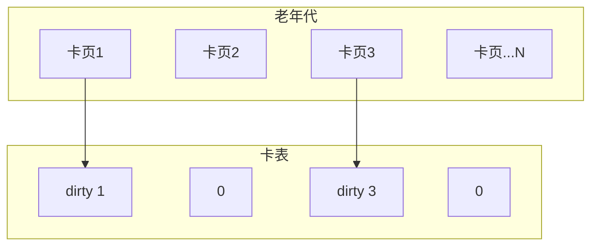

面试官问："JVM 为什么要分代？分代收集的核心理论是什么？"

候选人小杨说："因为不同对象生命周期不同，年轻对象容易被回收，老对象存活时间长。"

面试官追问："那这个结论是怎么得出的？有实验数据支撑吗？弱分代假说和强分代假说有什么区别？"

小杨答不上来。

---

## 一、分代收集的理论基础 🔴

### 1.1 问题拆解

分代收集不是拍脑袋的设计，而是建立在两个经过大量生产环境验证的假说之上。面试官追问"假说"，是在测试候选人是"知其然"还是"知其所以然"。

### 1.2 两个核心假说

**假说一：弱分代假说（Weak Generational Hypothesis）**

> 大多数对象都是朝生夕死的。

**假说二：强分代假说（Strong Generational Hypothesis）**

> 熬过多次垃圾回收的对象，倾向于继续存活。

这两个假说都来自长期的系统运行观察，而非理论推导。IBM 在 J9 虚拟机中做过大规模数据采集，验证了这两个假说的普遍性。

### 1.3 分代的意义

基于上述假说，JVM 的设计者提出了分代收集策略：

```
┌─────────────────────────────────────┐
│        分代收集的核心洞察            │
├─────────────────────────────────────┤
│  大量对象 → 死亡快 → 集中在新生代 → 频繁 Minor GC（复制成本低）│
│  少量对象 → 存活久 → 集中在老年代 → 较少 Full GC（收集成本高）│
└─────────────────────────────────────┘
```

### 1.4 分代带来的两个关键问题

分代收集引入了两个需要解决的问题：

**问题一：跨代引用**

```
新生代对象可能持有老年代对象的引用（跨代引用）
进行 Minor GC 时，需要知道哪些老年代对象引用了新生代对象

如果不处理：
  → 需要扫描整个老年代才能确定新生代对象是否存活
  → 老年代很大时，扫描成本极高

解决方案：卡表（Card Table）
```

**问题二：Minor GC 的晋升失败**

```
Minor GC 时，如果 Survivor 区放不下存活对象
→ 对象直接晋升老年代
→ 老年代空间不足时，触发 Full GC

这是分代收集的副作用，需要调优参数控制
```

---

## 二、卡表（Card Table）机制 🟡

### 2.1 什么是卡表

卡表是 HotSpot 用于解决跨代引用问题的数据结构。它将老年代划分为固定大小的"卡页"（Card Page），每个卡页 512 字节。卡表是一个字节数组，每个卡页对应一个字节。



### 2.2 写屏障（Write Barrier）

当老年代对象引用新生代对象时，JVM 通过写屏障将对应卡页标记为 dirty：

```java
// 写屏障示意（JIT 编译时注入）
void oop_field_store(oop* field, oop new_value) {
    *field = new_value; // 实际写操作

    // 写屏障：检查是否跨代引用
    if (field's card is in young gen) {
        card_table[card_index] = DIRTY;
    }
}
```

### 2.3 Minor GC 的优化

有了卡表，Minor GC 不需要扫描整个老年代：

```
Minor GC 时：
1. 枚举 GC Roots
2. 遍历 GC Roots 的引用，更新卡表
3. 扫描卡表中 dirty 的卡页对应的跨代引用
4. 复制新生代存活对象

扫描范围：卡表中 dirty 的卡页，而非整个老年代
```

:::tip 💡
卡表使得 Minor GC 的成本从"O(老年代大小)"降为"O(被修改的卡页数量)"。在大多数业务场景中，一次 Minor GC 可能只需要扫描几十个卡页，而非整个老年代。
:::

---

## 三、面试高频追问 🟡

### 3.1 追问：永久代/元空间算分代吗？

不算。分代是堆的逻辑划分。永久代/元空间是方法区的实现，和堆是并列关系。

```
JVM 内存模型（堆视角）：
┌─────────────────────┐
│     堆（Heap）       │  ← 分代在这里
├─────────────────────┤
│ 方法区（Method Area）│  ← 元空间 / 永久代
├─────────────────────┤
│  虚拟机栈（Stacks）  │
└─────────────────────┘
```

### 3.2 追问：G1 还分代吗？

G1 仍然保留了分代逻辑，但用了全新的物理实现：

- 堆被划分为多个大小相等的 Region（1MB~32MB）
- 部分 Region 标记为 Eden、Survivor、Old
- 回收时以 Region 为单位，而非整个堆

G1 的优势在于：可以预测停顿时间（通过设置 `-XX:MaxGCPauseMillis`），让 GC 尽量只收集部分 Region。

【面试官心理】
能区分"逻辑分代"和"物理分代"的候选人，对 GC 演进的理解更深。G1 不是消灭了分代，而是用 Region 重新实现了分代。
