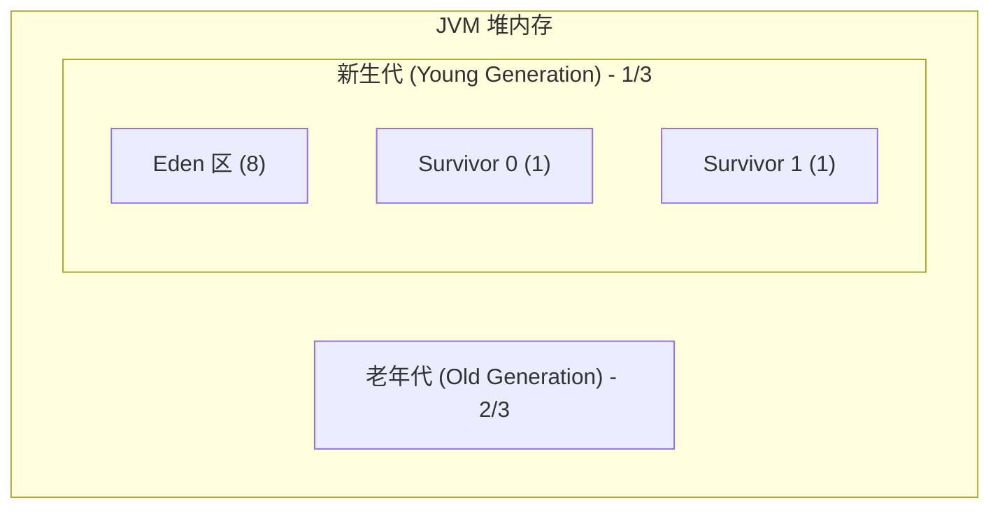
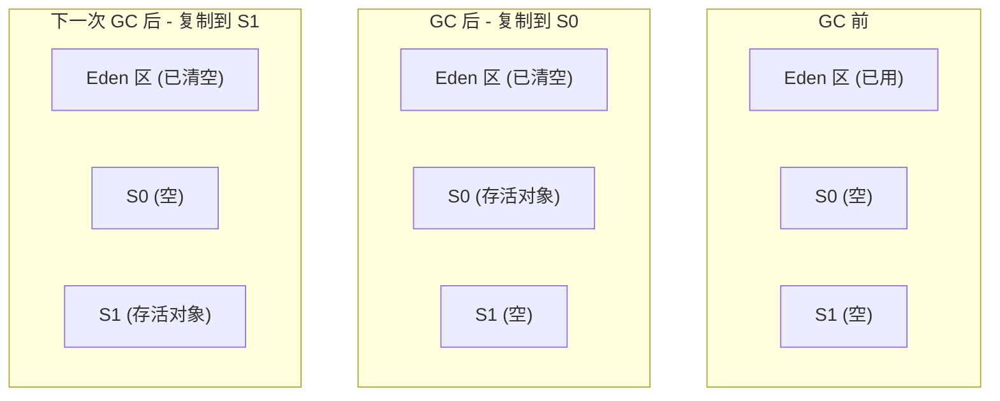
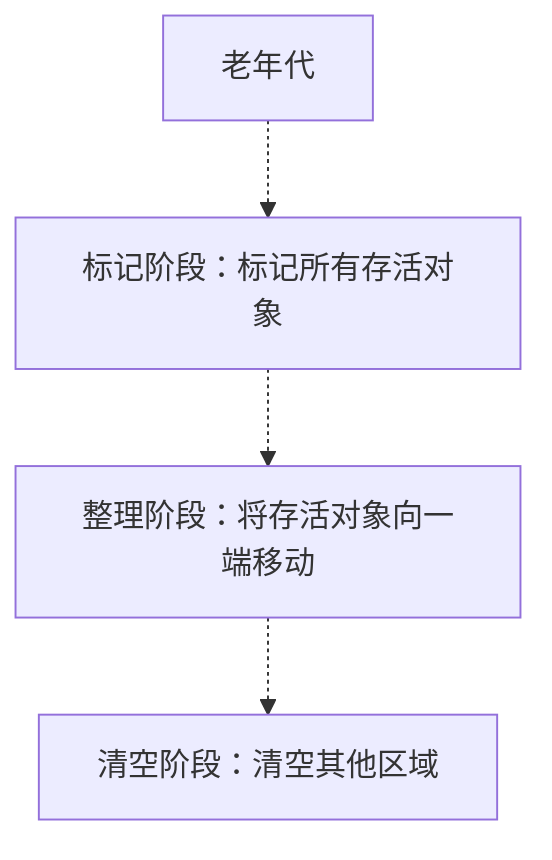

# 堆内存分代详解

很多同学知道 JVM 堆内存分为新生代和老年代，但问到具体比例是多少、对象什么时候进入老年代、Survivor 区怎么工作，很多人就答不上来了。

在实际开发中，如果你不了解堆分代，写出来的代码可能会导致频繁的 Minor GC 或者 Full GC，影响系统性能。

今天我们把这个知识点彻底讲透。

## 一、真实面试场景

候选人小李在面试美团的时候，被问到这样一个问题：

"你的服务频繁发生 Full GC，你觉得可能是什么原因？"

小李说："可能是老年代对象太多，GC 来不及回收..."

面试官追问："那为什么老年代对象会太多？你怎么排查？"

小李开始支支吾吾，说不清楚。

面试官又问："你知道对象的晋升机制吗？什么情况下对象会进入老年代？"

小张完全答不上来。

【面试官心理】
这道题我用来测试候选人是否有实际的 GC 调优经验。只知道"堆分代"三个字的占 60%，能说清楚晋升机制的占 30%，能结合生产案例分析的只有 10%。

## 二、堆分代的基本原理

### 2.1 为什么要分代？

JVM 为什么选择分代而不是对整个堆使用统一的回收策略？答案在于**弱分代假说**：

> **弱分代假说（Weak Generational Hypothesis）**：大多数对象都是朝生夕灭的，只有少数对象会长期存活。

基于这个假说，JVM 将堆分为新生代和老年代：
- **新生代**：存放生命周期短的对象，回收频率高
- **老年代**：存放生命周期长的对象，回收频率低



### 2.2 默认比例

在 HotSpot 虚拟机中，新生代和老年代的默认比例是 **1:2**，即：

- 新生代：堆的 1/3
- 老年代：堆的 2/3

新生代内部，Eden 区和 Survivor 区的默认比例是 **8:1:1**：
- Eden 区：8/10
- Survivor 0：1/10
- Survivor 1：1/10

### 2.3 相关 JVM 参数

| 参数 | 默认值 | 说明 |
|------|--------|------|
| `-Xms` | - | 堆初始大小 |
| `-Xmx` | - | 堆最大大小 |
| `-Xmn` | - | 新生代大小 |
| `-XX:NewRatio` | 2 | 老年代/新生代比例 |
| `-XX:SurvivorRatio` | 8 | Eden/Survivor 比例 |

```bash
# 示例：设置堆大小为 2GB，新生代为 512MB
java -Xms2g -Xmx2g -Xmn512m -jar app.jar
```

## 三、新生代详解

### 3.1 Eden 区

Eden 区是对象的出生地。当创建一个新对象时，首先在 Eden 区分配内存。

```java
public class EdenDemo {
    public static void main(String[] args) {
        // 所有 new 出来的对象首先分配在 Eden 区
        Object obj1 = new Object();
        User user = new User();
        String str = new String("Hello");
        
        // 如果 Eden 区放不下，触发 Minor GC
    }
}
```

### 3.2 Survivor 区

Survivor 区是新生代中的"缓冲区"，有 S0 和 S1 两个，**同一时间只有一个区是有数据的，另一个是空的**。



### 3.3 Minor GC 的工作流程

当 Eden 区空间不足时，触发 Minor GC：

1. **标记**：从 GC Roots 开始，标记 Eden 区和 S1 区（如果 S1 有数据的话）中的存活对象
2. **复制**：将存活对象复制到 S0 区
3. **清空**：清空 Eden 区和 S1 区的内存
4. **交换**：S0 和 S1 角色互换

```java
public class MinorGCDemo {
    public static void main(String[] args) {
        // 场景：Eden 区只有 obj1 和 obj2 存活
        Object obj1 = new Object();  // 在 Eden 区
        Object obj2 = new Object();  // 在 Eden 区
        
        // Minor GC 后，obj1 和 obj2 被复制到 S0
        // Eden 区和 S1 被清空
        // S0 和 S1 交换角色
    }
}
```

### 3.4 【直观类比】Survivor 区的工作方式

想象宿舍的垃圾分类：

- **Eden 区**：每天产生的垃圾
- **Survivor 0**：第一个垃圾桶
- **Survivor 1**：第二个垃圾桶

每天（Minor GC）产生的垃圾（Eden 区死亡对象）被扔掉，少数存活的物品（存活对象）复制到第一个垃圾桶（Survivor 0）。第二天垃圾桶满了（再次 Minor GC），把第一个垃圾桶里还有用的东西复制到第二个垃圾桶（Survivor 1），然后清空第一个垃圾桶。

如果一个对象在垃圾桶之间反复"活过来"（躲过多次 Minor GC），说明它可能是个"长期住户"，就应该搬到老年代去了。

## 四、老年代详解

### 4.1 什么时候进入老年代？

对象进入老年代的几种情况：

**1. 正常晋升**

每次 Minor GC 后，存活的对象 age（年龄计数器）增加 1。当 age 达到 `-XX:MaxTenuringThreshold`（默认 15）时，晋升到老年代。

```java
public class TenuringDemo {
    // age 达到阈值后晋升老年代
    // 默认阈值是 15，可通过 -XX:MaxTenuringThreshold 调整
}
```

**2. 大对象直接进入老年代**

大于 `-XX:PretenureSizeThreshold`（默认 0，表示关闭）的对象直接在老年代分配。

```java
public class LargeObjectDemo {
    public static void main(String[] args) {
        // 大对象（如大数组）直接分配在老年代
        byte[] largeArray = new byte[10 * 1024 * 1024];  // 10MB
    }
}
```

**3. 动态年龄判断**

即使年龄没有达到阈值，如果 Survivor 区中相同年龄的所有对象大小之和超过 Survivor 区的 50%，则年龄 >= 该年龄的对象进入老年代。

:::tip 💡
这个机制是为了解决 Survivor 区空间不均匀的问题。如果一批对象年龄相同且占用空间较大，可以让它们提前进入老年代，避免在 Survivor 区之间来回复制。
:::

**4. Survivor 区空间不足**

如果 Survivor 区无法容纳存活对象，这些对象直接进入老年代。

### 4.2 老年代的回收

老年代的空间通常比新生代大，但对象存活率更高，因此老年代一般使用**标记-整理算法**（Mark-Compact），而不是复制算法。



## 五、常见问题与调优

### 5.1 ❌ 错误示范：频繁 Full GC

```java
public class BadPractice {
    private static List<Object> cache = new ArrayList<>();
    
    public static void main(String[] args) {
        while (true) {
            // 不断添加对象到缓存，但从不清理
            cache.add(new Object());
        }
    }
}
```

问题分析：
- 这些对象进入老年代后不会被回收
- 老年代满了之后触发 Full GC
- 如果对象还在不断增长，Full GC 无法回收，导致 OOM

### 5.2 ✅ 正确示范：合理设置缓存大小

```java
public class GoodPractice {
    // 使用 WeakHashMap，当内存不足时自动回收
    private static Map<String, Object> cache = new WeakHashMap<>();
    
    // 或者使用带过期时间的缓存
    private static LoadingCache<String, Object> loadingCache = 
        Caffeine.newBuilder()
                .expireAfterWrite(10, TimeUnit.MINUTES)
                .maximumSize(1000)
                .build();
}
```

### 5.3 生产调优案例

**案例：订单系统频繁 Full GC**

```
GC 日志：
[Full GC (Allocation Failure) [CMS: 1083745K->895421K(2097152K)], 2.345s]
```

原因分析：
1. 订单对象生命周期较长，大量进入老年代
2. 老年代空间不足，触发 Full GC
3. 频繁 Full GC 导致系统停顿时间过长

优化方案：
```bash
# 方案1：增大老年代空间
java -Xms4g -Xmx4g -Xmn1g -XX:NewRatio=3

# 方案2：调整对象晋升阈值
java -Xms4g -Xmx4g -Xmn1g -XX:MaxTenuringThreshold=10

# 方案3：使用 G1 收集器
java -Xms4g -Xmx4g -XX:+UseG1GC -XX:MaxGCPauseMillis=200
```

## 六、面试追问链

### 第一层：基础概念

面试官问："堆内存为什么需要分代？"

标准回答：基于弱分代假说，大多数对象都是朝生夕灭的。分代后可以对不同代使用不同的垃圾回收策略，提高回收效率。新生代对象多、死亡快，使用复制算法；老年代对象少、存活久，使用标记-整理算法。

### 第二层：分代比例

面试官追问："新生代和老年代的默认比例是多少？"

需要说明：默认 NewRatio=2，即老年代是新生代的 2 倍。新生代中 Eden:Survivor:Survivor = 8:1:1。

### 第三层：晋升机制

面试官追问："什么情况下对象会进入老年代？"

需要说明：1）对象 age 达到 MaxTenuringThreshold（默认 15）；2）大对象直接进入老年代；3）Survivor 区相同年龄对象大小之和超过 50%。

### 第四层：生产调优

面试官追问："你在项目中遇到过什么分代相关的问题吗？"

可以举实际案例：如缓存未清理导致老年代占满、大对象频繁分配导致频繁 Full GC 等。

【面试官心理】
这道题我用来测试候选人对 JVM 内存管理的理解深度。只知道"新生代和老年代"五个字的占大多数，能说清楚晋升机制的占一半，能结合生产案例分析的只有少数。真正理解分代原理的候选人，才能在后续的 GC 调优中得心应手。

【学习小结】
- 新生代默认比例：Eden:Survivor:Survivor = 8:1:1
- 老年代默认比例：堆的 2/3
- 对象晋升老年代的条件：age 达到阈值、大对象直接分配、Survivor 区空间不足
- Minor GC：只回收新生代，频率高，停顿短
- Full GC：回收整个堆，频率低，停顿长
