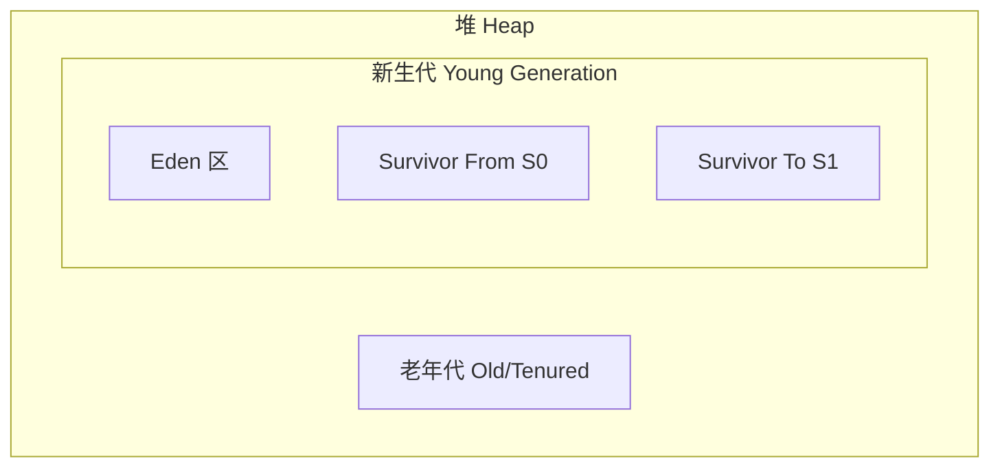
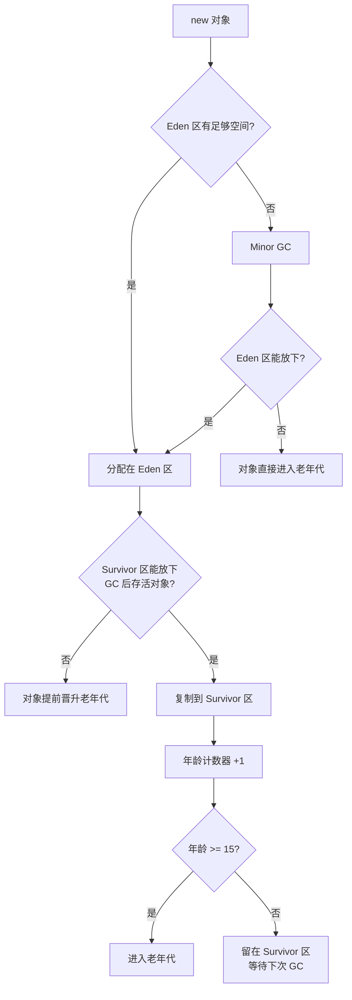

面试官问："JVM 堆分哪几块？为什么需要分代？"

小李答："分新生代和老年代。新生代里有 Eden 区和两个 Survivor 区。分代是因为不同对象生命周期不同，GC 效率更高。"

面试官点点头，继续追问："那 Survivor 区的作用是什么？为什么是两个不是一个？Eden 和 Survivor 的比例是多少？对象什么时候会直接进入老年代？"

小李开始紧张了。

---

## 一、堆的分代结构 🔴

### 1.1 问题拆解

这道题是 JVM 模块的最高频考点之一。表面问的是"分哪几块"，深层考察的是候选人对 GC 效率优化原理的理解深度。面试官会从"分代"的概念出发，层层追问，直到摸到你对生产调优的认知边界。

### 1.2 堆的物理结构

JVM 堆的逻辑结构分为三大部分：



**容量比例**（HotSpot 默认）：
- 新生代 : 老年代 = 1 : 2
- Eden : Survivor From : Survivor To = 8 : 1 : 1
- 即 `-Xmx=3g` 时，新生代约 1g（Eden 800m，各 Survivor 100m），老年代 2g

### 1.3 ❌ 错误示范

**候选人原话**："堆分新生代和老年代，新生代用复制算法，老年代用标记整理。"

面试官追问："为什么新生代用复制算法？"

候选人："因为...新生代对象存活时间短？"

追问："那 Eden 和 Survivor 的比例为什么是 8:1？调成 4:1 行不行？"

候选人："...应该也行？"

【面试官心理】
这个候选人知道"是什么"，但不知道"为什么"。8:1 这个比例是 JDK 团队经过大量生产数据分析得出的——98% 的对象朝生夕死，8:1 能保证 Survivor 区足够容纳短命对象，同时不浪费太多空间。能说出这个数据的，基本都看过 GC 论文或源码注释。

### 1.4 Survivor 区的作用

**标准回答**：Survivor 区（From 和 To）用于存放新生代GC后存活的对象。

对象分配在 Eden 区，GC 后：
- 存活对象 < Survivor 容量 → 复制到 To 区
- 存活对象 ≥ Survivor 容量 → 直接进入老年代（premature promotion）

**为什么需要两个 Survivor？**

因为复制算法需要一块"空白"区域作为目的地。From 和 To 角色互换——每次 GC 后，From 区清空，变成 To 区，等待下一次 GC 作为目的地。这就是经典的"FROM-To"交换。

:::tip 💡
"From Survivor"和"To Survivor"不是固定的，是角色互换的。第一次 GC 后，原来空的 S1 变成 To 区；第二次 GC 后，S1 变成 From 区。这张图里谁是谁不重要，重要的是"交换"这个动作。
:::

---

## 二、对象分配与晋升 🔴

### 2.1 对象分配流程



### 2.2 _age 计数器与晋升阈值

对象头中的 GC 年龄（age）计数器记录对象经历 Minor GC 的次数。每经历一次 Survivor GC 且存活，age 加 1。当 age 达到 `-XX:MaxTenuringThreshold`（默认 15）时，对象晋升老年代。

**JDK 6 及之前**：`_age` 在对象头的 Mark Word 中，占 4 bits，最大值 15。
**JDK 7 及之后**：`_age` 移到了对象头的类 `oopDesc` 结构中，但仍受 MaxTenuringThreshold 限制。

### 2.3 直接进入老年代的条件 🟡

以下情况，对象会直接进入老年代，而不是经过 Survivor 区：

1. **大对象**：`-XX:PretenureSizeThreshold`（默认 0，表示禁用），大于该阈值的对象直接在老年代分配。典型场景：大数组、`StringBuilder` 拼接的巨型字符串。

2. **长期存活对象**：年龄达到 MaxTenuringThreshold（默认 15）。

3. **Survivor 空间担保失败**：Minor GC 时，Survivor 区无法容纳存活对象，这些对象提前晋升老年代（premature promotion）。

4. **动态年龄判断**：HotSpot 会根据 Survivor 区的存活对象年龄分布，如果相同年龄的所有对象大小之和超过 Survivor 空间的 50%，则 age >= 该年龄的对象直接进入老年代。这是对抗"群体年龄"效应的机制。

:::warning ⚠️
**群体年龄效应（Age Thresholding）** 是面试高频深水区。如果 Survivor 区有一批年龄 10 的对象，虽然年龄 10 远小于 15，但它们的总大小加起来超过了 Survivor 的 50%，那么年龄 >= 10 的所有对象都会直接晋升老年代。这可能导致老年代增长过快。
:::

### 2.4 ❌ 错误示范

**候选人原话**："对象优先分配在 Eden 区，经过 15 次 Minor GC 后进入老年代。"

面试官追问："什么情况下对象会不到 15 次就进入老年代？"

候选人沉默。

【面试官心理】
这道题我用来试探他对"Survivor 担保"和"动态年龄判断"的理解。只知道 15 这个数字的占 60%，知道动态年龄判断的占 20%，能说出 Survivor 空间担保失败的占 5%。

---

## 三、HotSpot 堆布局源码分析 🟡

### 3.1 堆内存参数的对应关系

| 参数 | 默认值 | 含义 |
| --- | --- | --- |
| `-Xms` | 物理内存/64 | 堆最小值 |
| `-Xmx` | 物理内存/4 | 堆最大值 |
| `-Xmn` | - | 新生代大小（设置后 Eden = Xmn × 8/10） |
| `-XX:NewRatio` | 2 | 老年代/新生代比例，默认老年代是新生代的 2 倍 |
| `-XX:SurvivorRatio` | 8 | Eden/单个 Survivor = 8 |
| `-XX:MaxTenuringThreshold` | 15 | 晋升阈值 |

### 3.2 实际参数计算

```
-Xmx=3g -Xms=3g -Xmn=1g -XX:SurvivorRatio=8

新生代 = 1g
  Eden = 1g × 8/(8+1+1) = 800m
  S0 = 1g × 1/10 = 100m
  S1 = 100m
老年代 = 3g - 1g = 2g
```

---

## 四、生产避坑 🟡

### 4.1 老年代增长过快

**典型场景**：某电商促销系统，每秒创建大量短期对象，虽然大部分被 Minor GC 回收，但由于 Survivor 空间设置过小，大量对象触发动态年龄判断提前晋升老年代，导致老年代 FGC 频率增加。

**排查步骤**：
1. 查看 GC 日志，确认是否频繁 Full GC：`grep "Full GC" gc.log | wc -l`
2. 使用 `jstat -gcutil <pid> 1000` 观察老年代使用率变化
3. 如果老年代增长和 Survivor 区使用率不匹配，检查是否触发动态年龄判断

**解决方案**：增大 Survivor 区或直接设置 `-XX:MaxTenuringThreshold=8` 缩短晋升周期。

### 4.2 对象分配速率估算

```java
// 估算公式：对象分配速率 = 新生代大小 / Minor GC间隔
// 例如：Eden = 800m，每 100ms 填满一次，则分配速率 = 8GB/s
// 如果 Minor GC 后存活对象 > 100m，则大量对象会晋升老年代
```

:::tip 💡
生产环境推荐用 `jstat -gc <pid>` 定期采样，观察 Eden 区使用率变化曲线。如果发现 Eden 区填满速度越来越快，说明对象分配速率在增加，可能是流量上涨或代码中存在大量临时对象泄漏。
:::

---

## 五、元空间与堆的关系 🟢

### 5.1 重要区分

| 维度 | 堆（Heap） | 元空间（Metaspace） |
| --- | --- | --- |
| 存储内容 | 对象实例、数组 | 类元信息、常量池、 JIT 代码 |
| 内存来源 | JVM 堆内存 | 本地内存（Native Memory） |
| GC | 有垃圾回收（Minor/Major/Full GC） | 有类加载器卸载回收 |
| OOM | HeapDumpOutOfMemoryError | MetaspaceOutOfMemoryError |
| 默认上限 | -Xmx | 无硬性上限（可用 -XX:MaxMetaspaceSize 限制） |
| JDK 8 前 | 包含永久代 | 无（用 PermGen 代替） |

### 5.2 面试关键点

**为什么 JDK 8 要去掉永久代，改用元空间？**

两个核心原因：
1. **字符串常量池**：永久代受 JVM 堆大小限制，字符串常量池在永久代里，容易引发 PermGen OOM。元空间使用本地内存，大小取决于机器物理内存。
2. **类加载器**：HotSpot 的类加载器结构天然适配元空间设计，且元空间的 GC 逻辑更简单。

【面试官心理】
这道题我通常用来测试候选人对 JDK 版本演进的了解。只知道"元空间用直接内存"的占 50%，能说出"字符串常量池迁移"的占 20%，能同时说出两个原因的只有 10%。
