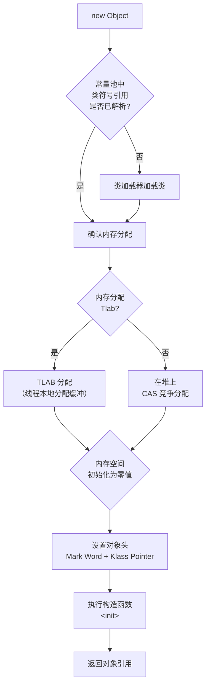

面试官问："一个 Java 对象是怎么创建出来的？new 关键字背后发生了什么？"

候选人小周说："先检查类是否加载，然后分配内存，执行构造函数。"

面试官追问："分配的内存怎么初始化？TLAB 是什么？构造函数执行前，对象的字段有默认值吗？"

小周说："有，int 是 0，引用是 null..."

面试官打断："那对象头呢？对象头在构造函数里初始化吗？"

小周停顿了三秒。

## 一、对象创建全流程 🔴

### 1.1 完整流程图



### 1.2 分步详解

#### 第一步：类加载检查

遇到 `new` 关键字时，JVM 先检查这个类的符号引用是否已在常量池中存在：
- **已存在**：进入内存分配阶段
- **不存在**：触发类加载（加载→验证→准备→解析→初始化），完成后再进入分配阶段

这是很多人忽略的细节——`new Object()` 在第一次执行时，可能触发整个类加载流程。

#### 第二步：内存分配

对象所需内存大小在类加载后就是确定的（由类结构决定）。内存分配有两种策略：

**策略一：指针碰撞（Bump the Pointer）**

适用于堆内存规整（没有碎片）的情况：

```java
// 指针碰撞示意
class BumpThePointer {
    private static memory[] heap = new memory[HEAP_SIZE]; // 堆起始地址
    private static long nextFreePointer = HEAP_START;     // 下一个可用地址指针

    public static Object allocate(long size) {
        Object obj = nextFreePointer;    // 记录当前指针位置
        nextFreePointer += size;         // 指针向后移动size
        return obj;
    }
}
```

- **Serial GC / ParNew GC**：堆规整，用指针碰撞
- **CMS GC**：由于标记-清除产生碎片，也可能用空闲列表

**策略二：空闲列表（Free List）**

适用于堆内存不规整的情况：

```java
// 空闲列表示意
class FreeList {
    // 维护一个可用内存块的链表
    static Map<Long, Long> freeBlocks; // 起始地址 → 结束地址

    public static Object allocate(long size) {
        for (entry : freeBlocks) {
            if (entry.size >= size) {
                // 分配，剩余部分继续留在链表中
                return allocateFrom(entry, size);
            }
        }
        throw new OutOfMemoryError();
    }
}
```

- **G1 GC**：使用 Region 机制，混合使用两种策略

#### 第三步：TLAB（Thread Local Allocation Buffer）

TLAB 是每个线程在 Eden 区私有的小块内存区域，用于对象分配。TLAB 解决的是多线程并发分配时的竞争问题。

```
TLAB 工作原理：

线程A:  [TLAB-A: 100KB]  ─→  在自己的 TLAB 内无锁分配
线程B:  [TLAB-B: 100KB]  ─→  在自己的 TLAB 内无锁分配
线程C:  [TLAB-C: 100KB]  ─→  在自己的 TLAB 内无锁分配
                      ─→  如果 TLAB 满了，通过加锁在公共 Eden 区分配
```

**为什么需要 TLAB？** 如果多个线程同时在堆上分配内存，需要 CAS 竞争。TLAB 让每个线程在自己的区域无锁分配，极大提升了分配效率。HotSpot 统计显示，98% 的对象在 TLAB 内完成分配。

参数控制：
- `-XX:+UseTLAB`：开启 TLAB（默认开启）
- `-XX:TLABSize`：设置 TLAB 大小
- `-XX:+ResizeTLAB`：自动调整 TLAB 大小（默认开启）

:::warning ⚠️
TLAB 满了之后，线程会通过加锁在公共 Eden 区分配，所以 TLAB 不是完全无锁的。而且 TLAB 分配的对象不算"真正在 Eden 区分配"——它们在 TLAB 区域内的 Eden 区。
:::

### 1.3 第四步：零值初始化

对象内存分配完成后，JVM **立即**将内存空间初始化为零值（不包括对象头）：

```java
// 这一步在构造函数执行之前就完成了
// 所以即使构造函数里没有给字段赋值，以下代码也是安全的：
public class ZeroInit {
    int a;           // 0
    String reference; // null
    boolean flag;    // false
    int[] array;     // null

    public ZeroInit() {
        // 此时字段已经有零值了
        // a = 0, reference = null
        System.out.println(a); // 输出 0
    }
}
```

**这解释了为什么局部变量需要显式赋值，而实例字段不需要**：局部变量在栈上，不经过零值初始化路径；实例字段在堆上，分配时自动零值初始化。

### 1.4 第五步：设置对象头

零值初始化后，JVM 设置对象头：
- **Mark Word**：初始状态为未锁定状态
- **Klass Pointer**：指向类的元数据
- **数组长度**（如果是数组）：设置数组长度

### 1.5 第六步：执行构造函数

这是真正执行 `<init>` 方法的阶段：
1. 父类构造函数先执行（隐式调用 `super()`）
2. 实例字段初始化语句按声明顺序执行
3. 当前构造函数体执行

```java
public class ConstructorOrder extends Parent {
    int a = 1;           // 第2步执行
    int b = compute();   // 第2步执行

    public ConstructorOrder() {
        // 第3步：当前构造函数体
        // 此时 a 和 b 已经初始化完毕
    }
}
```

---

## 二、面试高频追问 🟡

### 2.1 追问：对象创建在哪个区域？

绝大多数对象在 **Eden 区**分配。大对象直接进入 **老年代**（通过 `-XX:PretenureSizeThreshold` 控制）。Survivor 区只存放 Minor GC 后存活的对象，不直接分配新对象。

### 2.2 追问：TLAB 满了怎么办？

TLAB 满了后，当前线程会在公共 Eden 区使用 CAS 加锁的方式分配。这会导致分配性能下降，所以 TLAB 大小需要合理配置。

### 2.3 追问：构造函数能返回 null 吗？

不能。构造函数的返回类型固定为 `void`（对于实例初始化方法 `<init>`）或类本身（对于工厂方法返回类型）。但构造函数可以抛出异常导致对象创建失败。

---

## 三、对象创建的内存分配算法 🟡

### 3.1 指针碰撞 vs 空闲列表的取舍

| 维度 | 指针碰撞 | 空闲列表 |
| --- | --- | --- |
| 适用 GC | 标记-整理/复制算法（内存规整） | 标记-清除算法（有碎片） |
| 分配效率 | 高（只需移动指针） | 低（需要查找链表） |
| 并发安全 | 需要 CAS 或 TLAB | 需要 CAS |
| 代表 GC | Serial, ParNew, G1 | CMS |

:::tip 💡
G1 的 Region 机制下，每个 Region 要么全空要么全满。回收时，整个 Region 的存活对象复制到另一个 Region，原 Region 清空。所以 G1 也是"规整"的，用指针碰撞的思想。但 G1 内部维护了每个 Region 的可用空间，所以也可以看作"分区化的空闲列表"。
:::

---

## 四、生产避坑

### 4.1 短命对象导致的分配压力

```java
// 反模式：大量短命中间对象
public List<Integer> process(List<Integer> input) {
    List<Integer> result = new ArrayList<>(); // 每次调用都创建新集合
    for (Integer n : input) {
        // 每轮循环创建临时对象
        result.add(n * 2 + 1); // Integer 自动装箱
    }
    return result;
}
```

**问题**：每次调用都创建大量临时对象，增加 GC 压力。优化方案：
1. 预估大小，避免扩容
2. 避免自动装箱，改用 `int[]` 或原始类型集合
3. 对象池化（但要注意对象复用带来的其他问题）

### 4.2 大对象直接进入老年代

```java
// 反模式：大数组在eden区频繁创建
byte[] buffer = new byte[10 * 1024 * 1024]; // 10MB，超过阈值直接进老年代
```

如果这个对象频繁创建/销毁，会导致老年代抖动。解决方案：使用对象池或直接内存（`ByteBuffer.allocateDirect()`）代替堆内大数组。

---

## 五、工程选型 🟢

### 5.1 对象创建成本估算

```java
// 粗略估算
class AllocationCost {
    public static void main(String[] args) {
        long start = System.nanoTime();
        for (int i = 0; i < 1_000_000; i++) {
            new Object();
        }
        long end = System.nanoTime();
        // 在现代 JVM 上，1M 个 Object 约 10-30ms
        // 平均每个 Object 分配约 10-30 纳秒
        System.out.println("1M allocations: " + (end - start) / 1_000_000 + "ms");
    }
}
```

### 5.2 什么情况下对象在栈上分配？

JIT 编译器在**逃逸分析**后，如果确定对象不会逃逸出方法线程，会进行**栈上分配**（Scalar Substitution，标量替换）。但 HotSpot 没有真正的"栈上分配"机制（和 JVM 规范不同），而是直接省略了对象创建，在栈帧的局部变量表中保存对象的字段值。
