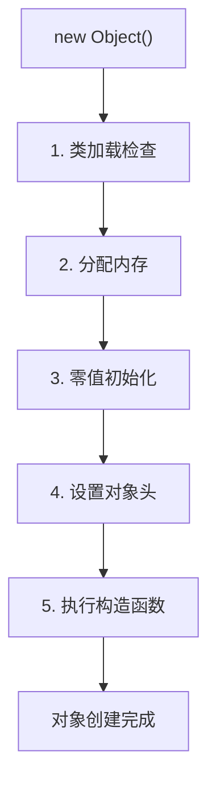
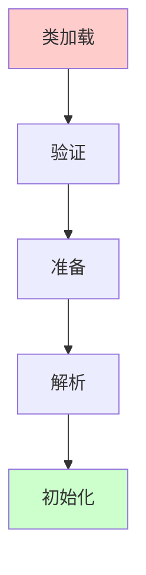
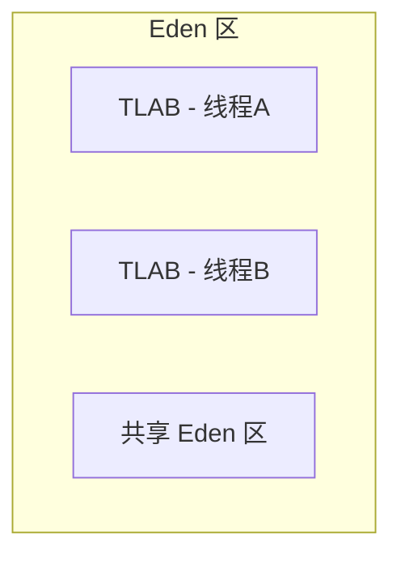

# 对象创建流程深度解析

在写代码的时候，你有没有想过：`new Object()` 到底发生了什么？内存是怎么分配的？对象创建过程中为什么要零值初始化？

这些问题都和 JVM 对象创建流程有关。很多同学知道"new 创建对象"，但问到具体步骤、TLAB 是什么、指针碰撞和空闲列表的区别，就容易答不上来。

今天我们把这个知识点彻底讲透。

## 一、真实面试场景

候选人小李在面试字节跳动的时候，被问到这样一个问题：

"你知道一个对象是怎么创建出来的吗？"

小李说："用 new 关键字创建对象..."

面试官追问："那 new 关键字底层做了什么？"

小李说："分配内存，初始化对象..."

面试官又问："TLAB 是什么？为什么需要 TLAB？"

小张开始支支吾吾。

【面试官心理】
这道题我用来测试候选人对 JVM 对象创建机制的深入理解。知道"new 分配内存"的占 60%，能说出完整步骤的占 30%，能解释 TLAB 和分配优化的只有 10%。

## 二、对象创建流程概览

当执行 `new Object()` 时，JVM 经历了以下步骤：



| 步骤 | 说明 |
|------|------|
| 1. 类加载检查 | 检查类是否已加载，未加载则先加载 |
| 2. 分配内存 | 从堆中分配对象所需内存 |
| 3. 零值初始化 | 将分配的空间初始化为零值 |
| 4. 设置对象头 | 设置 Mark Word、Class Pointer |
| 5. 执行构造函数 | 调用 `<init>` 方法 |

## 三、第一步：类加载检查

### 3.1 检查类是否已加载

在分配内存之前，JVM 需要确保对象的类已经被加载：

```java
public class ClassLoadCheck {
    public static void main(String[] args) {
        // new 之前，JVM 会检查 User 类是否已加载
        User user = new User();
        
        // 如果 User 类还没有被加载
        // JVM 会执行类加载过程：
        // 加载 -> 验证 -> 准备 -> 解析 -> 初始化
    }
}
```

### 3.2 类加载过程



| 阶段 | 说明 |
|------|------|
| 加载 | 将类的二进制数据读入 JVM |
| 验证 | 确保字节码文件的正确性 |
| 准备 | 为类的静态变量分配内存并设置初始值 |
| 解析 | 将符号引用转换为直接引用 |
| 初始化 | 执行 static 初始化代码 |

## 四、第二步：分配内存

### 4.1 内存分配方式

JVM 有两种内存分配方式：**指针碰撞**和**空闲列表**。

**1. 指针碰撞（Bump the Pointer）**

适用于 Serial、ParNew 等带空间压缩的收集器：

```
分配前：
┌────────────────────────────┬────────────────────────────┐
│         已分配区域          │         空闲区域            │
└────────────────────────────┴────────────────────────────┘
                                            ↑
                                         指针位置

分配后：
┌────────────────────────────┬──────────────┬──────────────┤
│         已分配区域          │   新对象     │   空闲区域    │
└────────────────────────────┴──────────────┴──────────────┘
                                                    ↑
                                                 指针位置
```

```java
public class BumpThePointer {
    public static void main(String[] args) {
        // 指针碰撞：每次分配只需要移动指针
        // 类似于在白纸上写字，写完一个字挪到下一个位置
        // 效率非常高：O(1) 时间复杂度
    }
}
```

**2. 空闲列表（Free List）**

适用于 CMS 等不带空间压缩的收集器：

```
空闲列表：
┌────────────┐   ┌────────────┐   ┌────────────┐
│ 空闲块1   │   │ 空闲块2    │   │ 空闲块3    │
│ 100字节   │   │ 200字节    │   │ 150字节    │
└────────────┘   └────────────┘   └────────────┘
```

```java
public class FreeList {
    public static void main(String[] args) {
        // 空闲列表：维护一个可用内存块列表
        // 分配时需要遍历列表找到合适的块
        // 释放时将内存块加入列表
        // 复杂度较高：需要考虑内存碎片
    }
}
```

### 4.2 并发分配问题

如果多个线程同时分配内存，可能会导致指针碰撞的并发问题：

```
线程A：分配对象 A，指针移动中...
线程B：分配对象 B，指针也移动中...
可能问题：两个对象分配到同一个位置！
```

### 4.3 TLAB（Thread Local Allocation Buffer）

TLAB 是 JVM 为每个线程预分配的 Eden 区缓冲区，用于解决并发分配问题：



```java
public class TLABDemo {
    public static void main(String[] args) {
        // 每个线程有自己的 TLAB
        // 线程在自己的 TLAB 中分配对象
        // 无需加锁，效率很高
        
        // TLAB 大小：默认为 Eden 区的 1%
        // 可通过 -XX:TLABSize 参数调整
    }
}
```

TLAB 工作流程：

1. 线程首次分配对象时，在 Eden 区分配一块 TLAB
2. 线程在 TLAB 中分配对象，使用指针碰撞
3. TLAB 满了，分配新的 TLAB
4. 如果 TLAB 无法分配大对象，则在共享 Eden 区分配

```bash
# 查看 TLAB 信息
-XX:+PrintTLAB
```

:::tip 💡
TLAB 是 JDK 6 引入的优化机制。开启 TLAB（默认）后，单线程分配不需要同步，多线程分配也只需偶尔同步（分配新 TLAB 时）。这是 JVM 对象分配性能的关键优化之一。
:::

### 4.4 ❌ 常见错误：忽视 TLAB 导致的问题

```java
public class BadTLABPractice {
    public static void main(String[] args) {
        // 场景：大量线程同时分配大对象
        // 如果 TLAB 大小不够，每个对象都要在共享区分配
        // 会导致频繁的 TLAB 分配和竞争
        
        // 解决：适当增大 TLAB 大小
        // -XX:TLABSize=1m
    }
}
```

## 五、第三步：零值初始化

### 5.1 为什么要零值初始化？

分配内存后，JVM 会将内存空间初始化为零值（不包括对象头）：

| 类型 | 零值 |
|------|------|
| int、short、byte | 0 |
| long | 0L |
| float、double | 0.0 |
| boolean | false |
| 引用类型 | null |

```java
public class ZeroInitDemo {
    public static void main(String[] args) {
        User user = new User();
        
        // 此时 user 对象的所有字段都已经是零值：
        // user.id = 0
        // user.name = null
        // user.age = 0
        // user.enabled = false
        
        // 这就是为什么可以用无参构造函数创建对象
        // 即使没有显式赋值，字段也有默认值
    }
}

class User {
    int id;
    String name;
    int age;
    boolean enabled;
}
```

### 5.2 TLAB 与零值初始化

TLAB 的零值初始化可以"合并"到 TLAB 分配过程中：

```java
public class TLABZeroInit {
    public static void main(String[] args) {
        // 如果使用 TLAB：
        // 分配 TLAB 时，整个 TLAB 区域已经被零值初始化
        // TLAB 内分配的对象天然就是零值，无需额外初始化
        
        // 如果不使用 TLAB（分配大对象）：
        // 需要显式执行 zero() 操作
    }
}
```

## 六、第四步：设置对象头

### 6.1 对象头设置

零值初始化后，JVM 会设置对象头：

```java
public class HeaderSetup {
    public static void main(String[] args) {
        Object obj = new Object();
        
        // 对象头包含：
        // 1. Mark Word（8字节）：存储哈希码、GC年龄、锁信息等
        // 2. Class Pointer（4/8字节）：指向类元数据
        
        // 初始状态：
        // Mark Word: 无状态（new 对象）
        // Class Pointer: 指向 Object.class
    }
}
```

### 6.2 对象头状态


## 七、第五步：执行构造函数

### 7.1 构造函数执行

对象头设置完成后，JVM 开始执行构造函数：

```java
public class ConstructorExecution {
    public static void main(String[] args) {
        User user = new User("张三", 25);
        
        // 构造函数执行：
        // 1. 调用父类构造函数（如果有）
        // 2. 执行实例字段初始化
        // 3. 执行构造函数体
    }
}

class User {
    String name;
    int age;
    
    // 构造函数
    public User(String name, int age) {
        // 1. 隐式调用 Object() 父类构造函数
        // 2. 初始化字段（name = null, age = 0）
        this.name = name;  // 3. 执行赋值
        this.age = age;
    }
}
```

### 7.2 构造函数执行顺序

```java
public class ConstructorOrder {
    public static void main(String[] args) {
        Child child = new Child();
    }
}

class Parent {
    String parentField = "Parent";
    
    Parent() {
        System.out.println("Parent constructor");
    }
}

class Child extends Parent {
    String childField = "Child";
    
    Child() {
        // 隐式 super() 调用父类构造函数
        System.out.println("Child constructor");
    }
}

// 输出顺序：
// Parent constructor
// Child constructor
```

## 八、【直观类比】对象创建流程

想象你要建一栋房子：

1. **类加载检查**：确认建筑图纸已经审核通过
2. **分配内存**：从空地上划出一块地皮
3. **零值初始化**：把地皮平整好（初始状态）
4. **设置对象头**：立好门牌号、标记房屋信息
5. **执行构造函数**：按照图纸建造房屋、安装家具


## 九、生产场景与优化

### 9.1 ❌ 错误示范：频繁创建大对象

```java
public class BadObjectCreation {
    public static void main(String[] args) {
        while (true) {
            // 错误：大对象直接在老年代分配（除非 TLAB 够大）
            // 频繁创建会导致频繁 GC
            byte[] buffer = new byte[10 * 1024 * 1024];  // 10MB
        }
    }
}
```

### 9.2 ✅ 正确示范：对象复用

```java
public class GoodObjectCreation {
    // 使用对象池复用对象
    private static final ByteBuffer buffer = ByteBuffer.allocateDirect(1024);
    
    public static void process() {
        // 复用 buffer，而不是每次创建新的
        buffer.clear();
        buffer.put("data".getBytes());
    }
}
```

### 9.3 分配内存调优

```bash
# TLAB 相关参数
-XX:+UseTLAB          # 启用 TLAB（默认开启）
-XX:TLABSize=512k     # TLAB 大小
-XX:-ZeroTLAB         # TLAB 不零值初始化

# 对象分配跟踪
-XX:+TraceClassLoading
-XX:+TraceClassInitialization
```

## 十、面试追问链

### 第一层：基础概念

面试官问："new Object() 底层做了什么？"

标准回答：new 对象时，JVM 先检查类是否已加载，然后分配内存（使用 TLAB 或指针碰撞），接着零值初始化，设置对象头，最后执行构造函数。

### 第二层：内存分配

面试官追问："TLAB 是什么？为什么需要 TLAB？"

需要说明：TLAB 是线程本地分配缓冲区，每个线程在 Eden 区有自己的 TLAB。TLAB 解决了多线程并发分配对象时的竞争问题。

### 第三层：分配方式

面试官追问："指针碰撞和空闲列表有什么区别？"

需要说明：指针碰撞适用于带空间压缩的 GC（Serial、ParNew），空闲列表适用于不压缩的 GC（CMS）。

### 第四层：细节追问

面试官追问："零值初始化的作用是什么？"

需要说明：零值初始化确保对象的字段有默认值，无需显式赋值就可以使用。

【面试官心理】
这道题我用来测试候选人对 JVM 对象创建全流程的理解。能说出大致步骤的占一半，能解释 TLAB 和并发分配的占 30%，能讲清内存分配细节的只有 10%。

【学习小结】
- 对象创建流程：类加载检查 → 分配内存 → 零值初始化 → 设置对象头 → 执行构造函数
- 内存分配方式：指针碰撞（带压缩的 GC）、空闲列表（不压缩的 GC）
- TLAB：线程本地分配缓冲区，解决并发分配问题
- 零值初始化：确保对象字段有默认值
- 构造函数执行：先父类后子类，先字段后构造体
