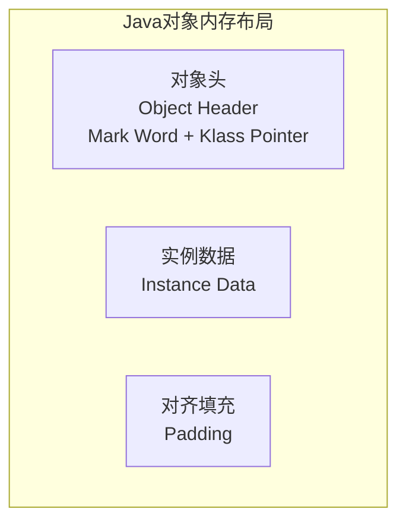
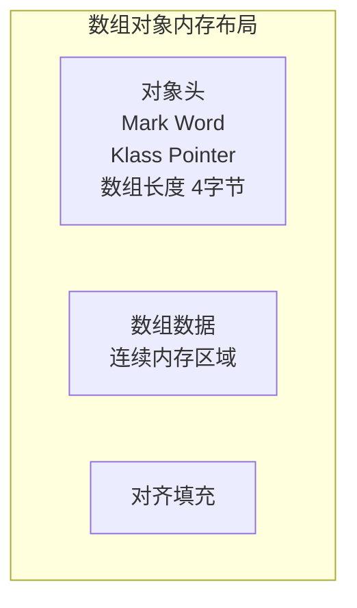

面试官问："Java 对象的内存布局是什么样的？"

候选人小孙说："对象由对象头、实例数据和对齐填充组成。"

面试官点点头，在纸上画了一个 Mark Word 的结构图（64位），问道："64位 JVM 里，Mark Word 有多少个字节？GC 年龄、偏向锁标识、锁状态分别在哪几位？"

小孙愣住了。

## 一、对象的内存布局 🔴

### 1.1 标准布局

一个 Java 对象在 HotSpot 堆中的内存布局分为三部分：



**总大小 = 对象头 + 实例数据 + 对齐填充**（对齐填充保证对象大小是 8 字节的倍数）

### 1.2 对象头（Object Header）详解

对象头分为两部分，在 64 位 JVM 中：

| 组成部分 | 32位系统 | 64位系统（未开启指针压缩） | 64位系统（开启指针压缩） |
| --- | --- | --- | --- |
| Mark Word | 4 字节（32 bit） | 8 字节（64 bit） | 8 字节（但实际存40 bit） |
| Klass Pointer | 4 字节 | 8 字节 | 4 字节（Compressed Class Pointers） |
| 数组长度（仅数组） | 4 字节 | 4 字节 | 4 字节 |

**Mark Word 的前世今生**：

Mark Word 是对象头的核心区域，在 64 位 JVM 中占 8 字节。它在不同状态下存储不同的信息：

```
未开启压缩指针的64位 JVM Mark Word 结构：

[  偏向锁(1bit)  锁状态(2bit)  分代年龄(4bit)  哈希码(31bit)  偏向线程ID(54bit)  Epoch(2bit)  ]

锁状态分布：
┌─────────────────────┬────────────────────────────────┐
│ 无锁/偏向锁/轻量级锁/重量级锁 → Mark Word 内容不同       │
└─────────────────────┴────────────────────────────────┘
```

具体来说，Mark Word 的内容随对象锁状态变化：

| 锁状态 | Mark Word 内容（64位） |
| --- | --- |
| 无锁 | 哈希码(31bit) + 分代年龄(4bit) + 偏向标志(1bit) + 锁标志(2bit) |
| 偏向锁 | 偏向线程ID(54bit) + Epoch(2bit) + 分代年龄(4bit) + 偏向标志(1bit) + 锁标志(2bit) |
| 轻量级锁 | 指向栈中锁记录的指针(62bit) + 锁标志(2bit) |
| 重量级锁 | 指向互斥量(监视器)的指针(62bit) + 锁标志(2bit) |
| GC 标记 | 空(62bit) + 锁标志(2bit) = 11 |

:::tip 💡
注意到没有？**哈希码只存在于无锁状态下**。当对象被偏向锁或更重的锁持有时，原本存哈希码的空间被其他信息占用了。这也是为什么 `Object.hashCode()` 在偏向锁撤销后会重新计算。
:::

### 1.3 ❌ 错误示范

**候选人原话**："对象头包含 Mark Word 和类型指针，Mark Word 存的是 GC 信息和锁信息。"

面试官追问："Mark Word 在不同锁状态下存的内容一样吗？"

候选人："...一样吧？"

【面试官心理】
这个候选人把 Mark Word 理解成了一个"静态结构"。实际上 Mark Word 是一个"变形金刚"——无锁存哈希码，偏向锁存线程ID，轻量级锁存栈指针，重量级锁存监视器指针。能说出这个动态变化的才是真正理解了的。

**候选人原话 2**："64位 JVM 里，Mark Word 占 8 个字节，所以对象头最小 16 字节（加上 8 字节 Klass Pointer）。"

面试官追问："那如果开了指针压缩呢？"

候选人答不上来。

能说出指针压缩后 Klass Pointer 从 8 字节变成 4 字节的候选人，已经超过了 80% 的人。

---

## 二、Klass Pointer 与 OOP 体系 🟡

### 2.1 类元数据指针

Klass Pointer（也叫类元数据指针）是对象头中指向类元数据的指针。在 HotSpot 中，`oopDesc`（ordinary object pointer）表示对象实例，`Klass` 表示类的元信息。

```
oop（对象）→ Klass Pointer → Klass（类元数据）
```

**Klass 的核心数据**：
- 类的继承关系
- 字段信息（偏移量、类型）
- 方法信息（虚函数表 vtable）
- 常量池
- 编译时常量
- 反射数据

### 2.2 指针压缩（Compressed Class Pointers）

JDK 6 之后，默认开启指针压缩（`-XX:+UseCompressedOops`，JDK 9+ 默认开启）。

压缩效果：
- 对象头中的 Klass Pointer：从 8 字节 → 4 字节
- 所有引用类型（对象引用、数组引用）：从 8 字节 → 4 字节
- 对象大小显著减小（平均节省 20%~30% 堆空间）

**压缩边界**：当堆超过 ~32GB 时（`4GB × 8` 对齐），指针压缩失效，因为 4 字节无法寻址更大的空间。

---

## 三、实例数据与对齐填充 🟡

### 3.1 实例数据（Instance Data）

实例数据存储对象的字段内容。HotSpot 按以下顺序排列：

```
父类字段 → 子类字段
相同类型按源码声明顺序排列
```

**字段排列规则**（HotSpot 的字段重排）：

```java
public class FieldLayout {
    long a;      // 8字节
    int b;       // 4字节
    int c;       // 4字节
    long d;      // 8字节
}
```

如果按声明顺序排放：a(8) + b(4) + c(4) + d(8) = 24字节

HotSpot 优化后会重排字段顺序（字段重排列，Fields Reordering），利用对齐填充最小化间隙：

优化后布局：a(8) + 填充(4) + b(4) + c(4) + d(8) = 24字节（实际上已经是 8 的倍数，无需额外填充）

但如果是：b(4) + a(8) + c(4) + d(8)，重排后变成 a(8) + b(4) + c(4) + d(8) = 24字节，节省了可能的 4 字节填充。

:::warning ⚠️
字段重排由 `-XX:FieldsAllocationStyle=1`（默认）控制。注意：**相同类型的字段不一定相邻**！HotSpot 的目标是最大化空间利用率，而不是代码可读性。反射访问时，字段顺序可能和源码声明不一致。
:::

### 3.2 对齐填充（Padding）

HotSpot 要求对象大小是 8 字节的倍数。对齐填充就是用空字节填充到 8 的倍数。

**为什么要 8 字节对齐？**

因为 CPU 的缓存行（Cache Line）大小通常为 64 字节，8 字节对齐确保对象起始地址是缓存行友好访问的。同时，对齐也简化了指针运算——对象的起始地址总是 8 的倍数。

**实际计算示例**：

```java
public class SimpleObject {
    byte a;      // 1字节
    long b;      // 8字节（起始地址需是8的倍数，自动填充7字节）
    int c;       // 4字节
    boolean d;   // 1字节
}
```

最坏情况布局：a(1) + 填充(7) + b(8) + c(4) + d(1) + 填充(3) = 24 字节

HotSpot 重排后：b(8) + c(4) + d(1) + 填充(3) = 16 字节

---

## 四、数组对象布局 🟡

数组对象比普通对象多一个"数组长度"字段：



```java
int[] arr = new int[5];
// arr.length 在对象头中（不是实例数据）
// 数组元素：5 × 4 = 20字节
// 总大小：12(头) + 20(数据) + 0(已对齐) = 32字节
```

---

## 五、生产避坑

### 5.1 对象大小的误区

```java
// 错误估算：直接相加字段大小
class User {
    int id;        // 4
    String name;   // 引用 8
    int age;       // 4
}
// 误算：4 + 8 + 4 = 16字节
// 实际：对象头(12) + id(4) + name引用(4) + age(4) + 填充(0) = 24字节
// 如果String对象另算：String对象头(12) + 实例数据(实际内容) + 对齐填充
```

**快速估算公式**：

```
对象大小 = 对象头(12) + 字段总大小 + 对齐填充(补到8的倍数)
```

### 5.2 数组的内存陷阱

```java
// 场景：创建一个包含 100万个 int 的数组
int[] bigArray = new int[1_000_000];

// 估算大小：
// 对象头 12 + 数组数据 4,000,000 + 填充 0 = 4,000,012 ≈ 4MB
// 但实际占用还包括数组对象本身的引用开销

// 如果改成 Integer[]（包装类型）：
Integer[] boxedArray = new Integer[1_000_000];
// 每个 Integer 对象 ~16字节（开启压缩指针）
// 总内存：12(数组头) + 8×1M(引用) + 16×1M(Integer对象) + 对齐 ≈ 24MB
// 差距：6 倍！
```

这就是为什么在高性能场景下要避免自动装箱和 `Integer[]` 而使用 `int[]`。

:::tip 💡
生产环境用 `jol-core` 库可以打印对象的真实内存布局：

```java
System.out.println(ClassLayout.parseClass(User.class).toPrintable());
```
:::

---

## 六、面试高频追问 🟡

### 6.1 追问：偏向锁撤销时 Mark Word 怎么变化？

1. 偏向锁被其他线程尝试获取 → 偏向锁撤销
2. 暂停拥有偏向锁的线程，检查其是否在同步块中
3. **在同步块中**：升级为轻量级锁，将 Mark Word 复制到线程栈的锁记录中
4. **不在同步块中**：退回无锁状态，Mark Word 恢复为无锁状态（重新存储哈希码）
5. 暂停时间通常在一个安全点（Safe Point）完成

### 6.2 追问：对象头里能存真正的对象数据吗？

不能，但可以用 `sun.misc.Contended`（JDK 8 注解）让字段和对象头一起填充到缓存行隔离：

```java
@sun.misc.Contended
public class PaddedAtomicLong {
    private volatile long value;
}
```

这样 `value` 字段被填充到独立的缓存行，避免伪共享（False Sharing）。这是 JDK 并发包中 `LongAdder` 等类高性能的秘密。

【面试官心理】
能答出 `Contended` 和伪共享的候选人，已经到达了 P7 级别。这类候选人要么看过 JDK 源码，要么在生产中踩过伪共享的性能坑。
