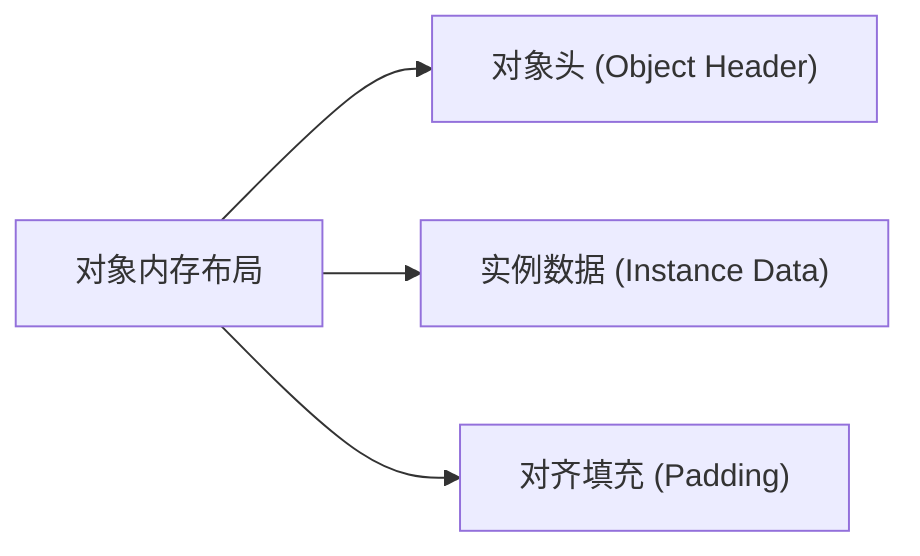
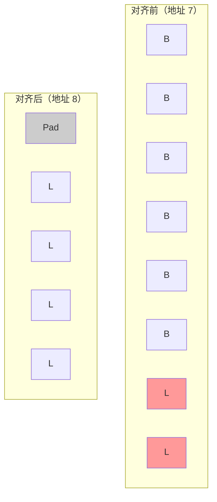
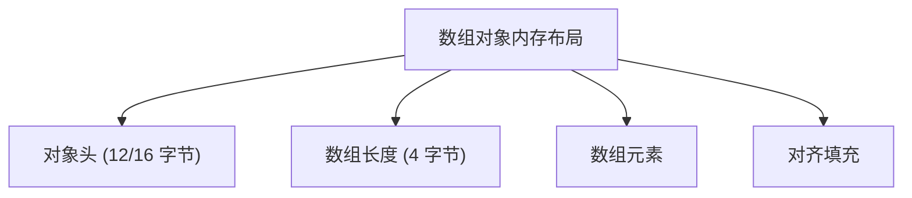

# 对象内存布局深度解析

在写代码的时候，你有没有想过：一个 Java 对象到底占多少内存？`new Object()` 真的只占用 16 字节吗？为什么要对齐填充？

这些问题都和 JVM 对象的内存布局有关。很多同学知道对象存在堆里，但问到对象头包含什么、字段怎么排列、为什么要对齐，就容易答不上来。

今天我们把这个知识点彻底讲透。

## 一、真实面试场景

候选人小张在面试阿里的时候，被问到这样一个问题：

"你知道一个对象在内存中是怎么布局的吗？"

小张说："对象存在堆里，有对象头和实例数据..."

面试官追问："对象头包含什么？Mark Word 是什么？"

小张开始支支吾吾。

面试官又问："那为什么要对齐填充？为什么对象大小要是 8 的倍数？"

小张完全答不上来。

【面试官心理】
这道题我用来测试候选人对 JVM 底层机制的深入理解。知道"对象头"的占 50%，能说清 Mark Word 结构的占 20%，能解释对齐填充原因的只有 10%。

## 二、对象内存布局总览

在 HotSpot 虚拟机中，一个 Java 对象的内存布局分为三部分：



| 部分 | 说明 | 大小 |
|------|------|------|
| 对象头 | 存储对象自身运行时的数据 | Mark Word (8字节) + Class Pointer (4/8字节) |
| 实例数据 | 存储对象的字段数据 | 根据字段类型而定 |
| 对齐填充 | 确保对象大小是 8 的倍数 | 0-7 字节 |

## 三、对象头（Object Header）

### 3.1 Mark Word

Mark Word 是对象头中最核心的部分，占 8 字节（64位 JVM）。它是一个"可变"的数据结构，用于存储对象自身运行时的数据：

| 状态 | Mark Word 内容（64位） |
|------|------------------------|
| 无状态（new） | 对象哈希码(25位) + GC年龄(4位) + 锁标志位(4位) + 1(偏向锁标志) |
| 偏向锁 | 偏向线程ID(54位) + Epoch(2位) + GC年龄(4位) + 1 + 锁标志位 |
| 轻量级锁 | 指向栈中锁记录的指针(62位) + 锁标志位(01) |
| 重量级锁 | 指向互斥量(重量级锁)的指针(62位) + 锁标志位(10) |
| GC标记 | 空(62位) + 锁标志位(00) |

```java
public class MarkWordDemo {
    public static void main(String[] args) {
        Object obj = new Object();
        
        // Object 对象在没有偏向锁/轻量级锁的情况下：
        // Mark Word 存储：对象哈希码(25位) + GC年龄(4位) + 锁标志位(4位) + 偏向锁标志(1位)
        
        // 当对象被用作锁对象时，Mark Word 会根据锁状态发生变化
        synchronized (obj) {
            // 进入同步块，Mark Word 可能变成轻量级锁或偏向锁
        }
    }
}
```

### 3.2 Class Pointer（类型指针）

Class Pointer 指向对象的类元数据（方法区中的 Class 对象），JVM 通过这个指针确定对象是哪个类的实例。

| JVM 配置 | 指针大小 |
|----------|----------|
| 未开启压缩指针 (`-XX:-UseCompressedOops`) | 8 字节 |
| 开启压缩指针 (默认，堆 < 32GB) | 4 字节 |

```java
public class ClassPointerDemo {
    public static void main(String[] args) {
        User user = new User();
        
        // user 对象的 Class Pointer 指向 User.class 元数据
        // JVM 通过这个指针确定 user 是 User 类的实例
        
        System.out.println(user.getClass());  // class User
    }
}
```

### 3.3 对象头大小总结

| 配置 | 对象头大小 |
|------|-----------|
| 开启压缩指针（默认） | 12 字节（Mark Word 8 + Class Pointer 4） |
| 未开启压缩指针 | 16 字节（Mark Word 8 + Class Pointer 8） |

## 四、实例数据（Instance Data）

### 4.1 字段排列规则

HotSpot 虚拟机默认按照以下顺序排列字段：

1. 父类字段（按照继承顺序，从最顶层父类开始）
2. 子类字段
3. 同一类中，按照声明顺序排列

**字段排序原则**：为了减少对齐填充，字段按照以下优先级排列：
- 宽类型在前：long、double
- 中等类型：int、float
-窄类型：char、short、byte、boolean
- 引用类型

```java
public class FieldAlignment {
    // 父类
    String name;      // 引用类型
    int id;           // int
    
    public static void main(String[] args) {
        // 实际内存布局（开启压缩指针）：
        // 对象头：12 字节
        // id (int): 4 字节
        // name (引用): 4 字节（如果是对象引用）
        // 对齐填充：0-3 字节，确保总大小是 8 的倍数
    }
}
```

### 4.2 各类型字段大小

| 类型 | 占用空间 |
|------|----------|
| byte、boolean | 1 字节 |
| short、char | 2 字节 |
| int、float | 4 字节 |
| long、double | 8 字节 |
| 引用类型（开启压缩） | 4 字节 |
| 引用类型（未开启压缩） | 8 字节 |

### 4.3 ❌ 常见错误：字段排列导致的内存浪费

```java
public class BadFieldOrder {
    // 错误排列：窄类型在前，导致大量对齐填充
    boolean flag1;
    boolean flag2;
    boolean flag3;
    long id;      // 前面 3 个 boolean 需要 3 字节，long 需要对齐到 8
    // 对齐填充 5 字节
    
    // 实际占用：(3 + 5) + 8 = 16 字节的填充
}
```

正确排列：

```java
public class GoodFieldOrder {
    // 正确排列：宽类型在前
    long id;          // 8 字节
    boolean flag1;    // 1 字节
    boolean flag2;    // 1 字节
    boolean flag3;    // 1 字节
    // 对齐填充：1 字节
    // 总共：12 字节
    
    // 相比错误排列节省了 4 字节
}
```

## 五、对齐填充（Padding）

### 5.1 为什么需要对齐？

CPU 访问内存时，以字长（如 64 位 = 8 字节）为单位访问效率最高。如果对象的起始地址不对齐，访问一个 8 字节的 long 类型可能需要两次内存访问。



### 5.2 对齐规则

HotSpot 要求对象大小是 8 字节的倍数。如果对象头 + 实例数据不是 8 的倍数，则添加对齐填充。

```java
public class PaddingDemo {
    public static void main(String[] args) {
        // 开启压缩指针时：
        // new Object() 占用 16 字节
        // 对象头：12 字节
        // 对齐填充：4 字节
        // 总共：16 字节
        
        Object obj = new Object();
        
        // new Integer(0) 占用多少？
        // 对象头：12 字节
        // int value：4 字节
        // 对齐填充：0 字节（12 + 4 = 16）
        // 总共：16 字节
    }
}
```

## 六、数组对象布局

数组对象比普通对象多一个 `length` 字段：



```java
public class ArrayLayoutDemo {
    public static void main(String[] args) {
        // int[] 数组的内存布局（开启压缩指针）：
        // 对象头：12 字节
        // 数组长度：4 字节
        // 元素：n * 4 字节
        // 对齐填充：确保总大小是 8 的倍数
        
        int[] arr = new int[10];
        // 大小：12 + 4 + 40 = 56 字节
    }
}
```

## 七、压缩指针（Compressed Oops）

### 7.1 什么是压缩指针？

在 64 位 JVM 中，引用类型占用 8 字节。但如果开启了压缩指针（`-XX:+UseCompressedOops`，JDK 8 默认开启），引用类型可以压缩到 4 字节。

### 7.2 压缩指针的限制

| 堆大小 | 是否压缩 |
|--------|----------|
| < 4GB | 自动开启压缩 |
| 4GB - 32GB | 开启压缩指针可节省内存 |
| > 32GB | 关闭压缩指针（无法用 4 字节表示） |

```bash
# 开启压缩指针（默认）
java -XX:+UseCompressedOops -Xmx30g -jar app.jar

# 关闭压缩指针
java -XX:-UseCompressedOops -Xmx30g -jar app.jar
```

:::tip 💡
如果你的堆大小在 4GB-32GB 之间，建议开启压缩指针，可以显著减少对象引用占用的内存。但注意，这会增加 CPU 开销，因为每次访问引用都需要解压缩。
:::

## 八、生产场景与优化

### 8.1 ❌ 错误示范：忽视对象大小

```java
public class BadCache {
    // 使用 ArrayList 存储数百万个 Point 对象
    private List<Point> cache = new ArrayList<>();
    
    public void addPoints() {
        for (int i = 0; i < 1_000_000; i++) {
            // Point 类有两个 int 字段
            // 每个 Point 对象：12(头) + 4 + 4 + 4(对齐) = 24 字节
            // 100万个 Point：24MB
            cache.add(new Point(i, i));
        }
    }
}

class Point {
    int x;
    int y;
}
```

### 8.2 ✅ 正确示范：优化对象布局

```java
public class GoodCache {
    // 方案1：使用基本类型数组
    private int[] xCoords;
    private int[] yCoords;
    
    // 方案2：使用压缩数据类
    // 如果对象大小是 8 的倍数，可以节省对齐填充
    class Point {
        long xy;  // 将两个 int 合并为一个 long
        // 8 字节，无对齐填充
        
        public int getX() {
            return (int) (xy & 0xFFFFFFFFL);
        }
        
        public int getY() {
            return (int) (xy >> 32);
        }
    }
}
```

### 8.3 工具推荐

使用 Jol（Java Object Layout）查看对象布局：

```java
import org.openjdk.jol.info.ClassLayout;
import org.openjdk.jol.vm.VM;

public class JolDemo {
    public static void main(String[] args) {
        System.out.println(VM.current().details());
        System.out.println(ClassLayout.parseInstance(new Object()).toPrintable());
        System.out.println(ClassLayout.parseInstance(new int[0]).toPrintable());
    }
}
```

输出示例：

```
# WARNING: Unable to instrument all classes. HotSpot debugging VM required.
java.lang.Object object internals:
OFF  SZ               TYPE DESCRIPTION
  0   8                    (object header: mark)
  8   4                    (object header: class)
 12   4                    (object header: array length)
 12   0                    (object header: instance size)
 12   4                    (object header: alignment/padding gap)
Instance size: 16 bytes
```

## 九、面试追问链

### 第一层：基础概念

面试官问："一个对象在内存中的布局是什么样的？"

标准回答：对象内存布局分为三部分：对象头（Mark Word + Class Pointer）、实例数据、对齐填充。对象头用于存储对象运行时的状态信息和类型指针。

### 第二层：Mark Word

面试官追问："Mark Word 包含什么？它是如何变化的？"

需要说明：Mark Word 包含哈希码、GC 年龄、锁状态等信息。当对象被用作锁时，Mark Word 会根据锁类型（偏向锁、轻量级锁、重量级锁）发生变化。

### 第三层：对齐填充

面试官追问："为什么要对齐填充？"

需要说明：CPU 以字长为单位访问内存效率最高，对齐可以确保对象大小是 8 的倍数，减少访问内存的次数。

### 第四层：压缩指针

面试官追问："什么是压缩指针？有什么限制？"

需要说明：压缩指针将 8 字节的引用压缩为 4 字节，适用于堆大小 < 32GB 的情况。

【面试官心理】
这道题我用来测试候选人对 JVM 底层实现细节的理解程度。能说出对象头组成的占一半，能解释 Mark Word 变化的占 30%，能分析字段排列和对齐填充的只有 10%。这道题虽然偏底层，但对于性能调优很有帮助。

【学习小结】
- 对象内存布局：对象头 + 实例数据 + 对齐填充
- 对象头：Mark Word (8字节) + Class Pointer (4/8字节)
- Mark Word：存储哈希码、GC年龄、锁状态等信息
- 实例数据：字段按宽窄排序，减少对齐填充
- 对齐填充：确保对象大小是 8 的倍数
- 开启压缩指针（默认）可将引用压缩到 4 字节
