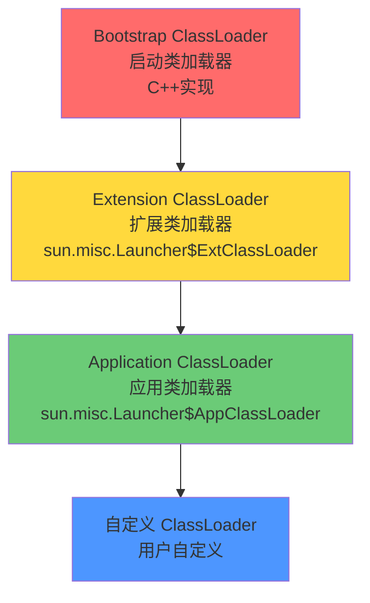

面试官问："什么是双亲委派模型？为什么要用双亲委派？"

候选人小陈说："当类加载时，先让父类加载器加载，如果父类加载不了才自己加载。这样可以避免类的重复加载。"

面试官追问："那如果父类加载器加载不了，子类加载器会怎样？自定义 ClassLoader 怎么破坏双亲委派？"

小陈说："继承 ClassLoader，重写 loadClass 方法..."

面试官继续追问："那如果两个不同的 ClassLoader 加载同一个类，它们是同一个类吗？"

小陈支支吾吾答不上来。

## 一、双亲委派模型原理 🔴

### 1.1 问题拆解

双亲委派模型是 JVM 类加载机制的核心。表面问的是"怎么工作"，深层在测试候选人是否理解这种设计的**安全意义**和**版本隔离**价值。

### 1.2 模型结构



### 1.3 工作流程

```
类加载请求流程：

Application ClassLoader 收到加载请求
    ↓
检查是否已加载（findLoadedClass）
    ↓ 已加载 → 直接返回
    ↓ 未加载
委派给父类加载器 Extension ClassLoader
    ↓
检查是否已加载
    ↓ 已加载 → 直接返回
    ↓ 未加载
委派给父类加载器 Bootstrap ClassLoader
    ↓
尝试用 Bootstrap 加载
    ↓ 加载失败
返回给 Extension ClassLoader
    ↓
尝试用 Extension 加载
    ↓ 加载失败
返回给 Application ClassLoader
    ↓
调用 findClass() 自己加载
```

---

## 二、源码实现 🟡

### 2.1 ClassLoader.loadClass()

```java
// ClassLoader.loadClass() 源码（JDK 8）
protected Class<?> loadClass(String name, boolean resolve) throws ClassNotFoundException {
    // 第一步：检查是否已加载
    Class<?> c = findLoadedClass(name);
    if (c != null) {
        return c; // 已加载，直接返回
    }

    // 第二步：委派给父类加载器
    ClassLoader parent = this.parent;
    if (parent != null) {
        c = parent.loadClass(name, false); // 递归调用父类的 loadClass
    } else {
        // 没有父类（Bootstrap），尝试 Bootstrap 加载
        c = findBootstrapClassOrNull(name);
    }

    // 第三步：父类无法加载，自己来
    if (c == null) {
        c = findClass(name); // 调用自己的 findClass
    }

    return c;
}
```

### 2.2 ❌ 错误示范

**候选人原话**："双亲委派就是先让父类加载器加载。"

【面试官心理】
这个候选人只理解了一半。双亲委派的关键是"检查已加载 + 委派 + 自己加载"三步缺一不可。只背"父类先加载"的，在源码追问面前必崩。

**候选人原话 2**："所有类都要通过双亲委派加载。"

追问："那 JDBC 的 DriverManager 呢？它是怎么加载各个数据库驱动的？"

JDBC 使用 SPI（Service Provider Interface）机制，通过 `ServiceLoader.load()` 打破双亲委派，在 Application ClassLoader 层加载实现类。

---

## 三、为什么需要双亲委派 🔴

### 3.1 原因一：类的唯一性保证

```java
// 不同 ClassLoader 加载同一个类，结果不同
ClassLoader cl1 = new CustomClassLoader();
ClassLoader cl2 = new CustomClassLoader();

Class<?> c1 = cl1.loadClass("com.example.User");
Class<?> c2 = cl2.loadClass("com.example.User");

c1 == c2; // false！两个 Class 对象不相等
c1.equals(c2); // false
c1.getClassLoader(); // cl1
c2.getClassLoader(); // cl2
```

**类的唯一性 = ClassLoader + 全限定名**。同一个类，不同 ClassLoader 加载，就是两个不同的类。

### 3.2 原因二：安全性保证

**攻击场景**：如果不用双亲委派

```java
// 恶意代码：自定义 String 类
package java.lang;  // 和 JDK 的 String 同包同名

public class String {
    // 恶意代码：在静态块中执行破坏操作
    static {
        System.out.println("正在破坏系统...");
    }
}

// 如果没有双亲委派，这个自定义 String 类可能被加载
// 执行 java.lang.String 的逻辑，安全体系被破坏
```

**双亲委派的保护**：由于 Bootstrap ClassLoader 先加载 `java.lang.String`，后续所有对 `java.lang.String` 的引用都指向 JDK 的 String。自定义的"恶意" String 永远不会被加载。

### 3.3 原因三：类的层级结构一致性

核心类（`java.lang.*`）由 Bootstrap 加载，核心 API 无法被篡改。用户代码只能"看到"被 Application/Extension 加载的类，确保了 Java API 的完整性。

---

## 四、ClassLoader 的类相等性 🟡

### 4.1 instanceof 的坑

```java
class MyClassLoader extends ClassLoader {}

MyClassLoader cl1 = new MyClassLoader();
MyClassLoader cl2 = new MyClassLoader();

Class<?> c1 = cl1.loadClass("com.example.Test");
Class<?> c2 = cl2.loadClass("com.example.Test");

Object obj = c1.newInstance();

obj instanceof Test; // false！编译时 Test.class 由 AppClassLoader 加载
// 运行时的 obj 是由 cl1 加载的 Test
```

### 4.2 解决方案

```java
// 正确做法：使用 ClassLoader 判断
obj.getClass().getClassLoader() == Test.class.getClassLoader();

// 或者：不跨 ClassLoader 做 instanceof 判断
// 使用 Class.getName() + ClassLoader 判断
```

---

## 五、面试高频追问 🟡

### 5.1 追问：为什么需要自定义 ClassLoader？

典型场景：
1. **热部署**：不重启应用加载新类（OSGi、Tomcat）
2. **模块隔离**：不同模块使用不同的 ClassLoader 避免冲突
3. **动态生成**：运行时动态生成类（CGLib、ASM）
4. **加密保护**：对 class 文件加密，使用解密 ClassLoader 加载

【面试官心理】
能说出热部署或模块隔离场景的候选人，说明他对 ClassLoader 的工程价值有实战理解。这种候选人在需要 OSGi、Tomcat 自定义加载的场景中最有价值。
