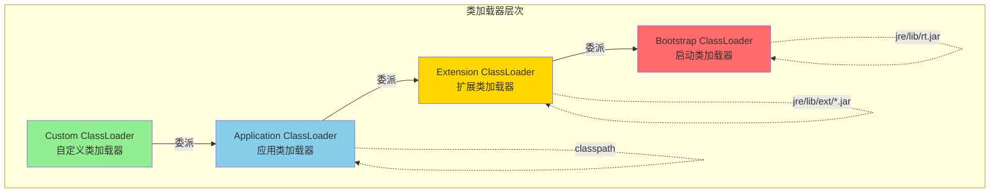
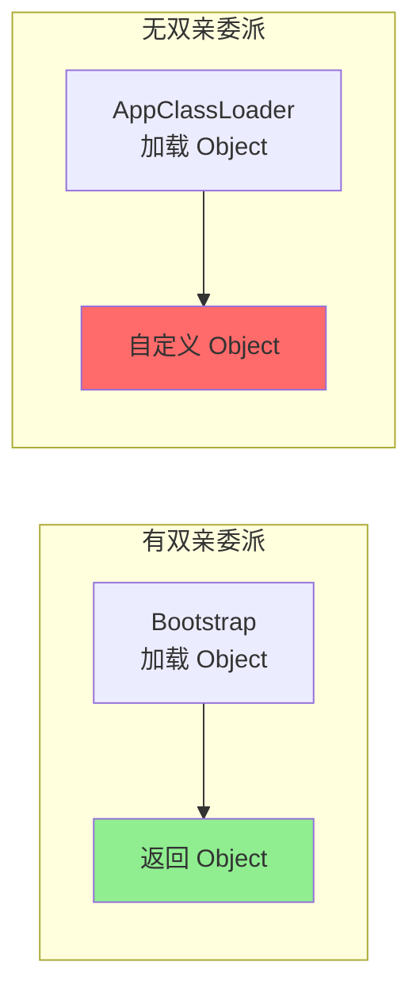
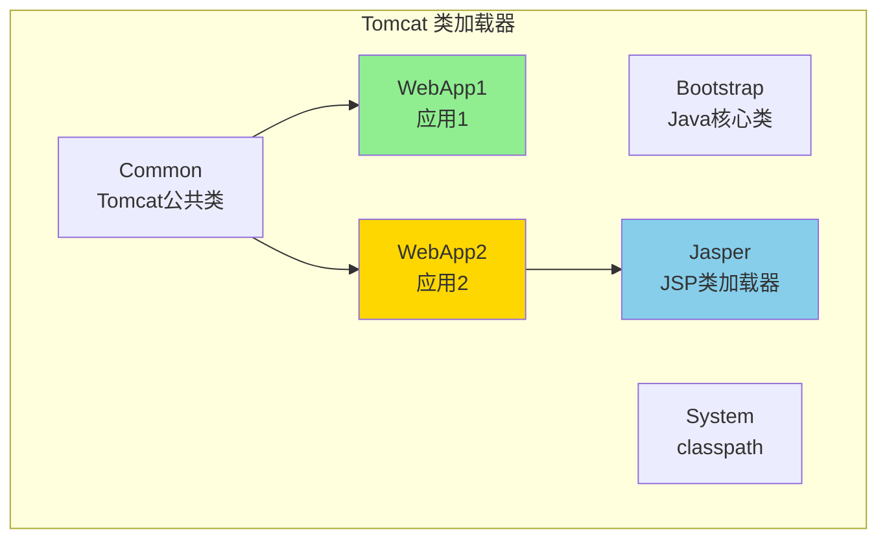

# 双亲委派模型

**目标级别**：P6

## 快速自测

面试官问：「什么是双亲委派模型？为什么需要它？JDBC 和 Tomcat 是如何打破的？」

你能回答到第几层？

---

## 一、核心问题

### 🔴 什么是双亲委派模型？

当类加载器收到加载请求时，会将请求**委派给父类加载器**处理，直到最顶层的 Bootstrap ClassLoader。只有父加载器无法完成时，子加载器才尝试自己加载。

### 类加载器层次



### 各类加载器职责

| 类加载器 | 英文 | 负责路径 | 加载内容 |
|----------|------|----------|----------|
| **Bootstrap** | BootstrapClassLoader | `JAVA_HOME/jre/lib` | 核心类库（rt.jar） |
| **Extension** | ExtClassLoader | `JAVA_HOME/jre/lib/ext` | 扩展类库 |
| **Application** | AppClassLoader | classpath | 应用类 |
| **Custom** | 自定义 | 用户指定 | 用户自定义类 |

---

## 二、loadClass 源码解析

### 🔴 双亲委派实现

```java title="ClassLoader.java"
protected Class<?> loadClass(String name, boolean resolve) 
        throws ClassNotFoundException {
    synchronized (getClassLoadingLock(name)) {
        // 1. 检查是否已经加载过
        Class<?> c = findLoadedClass(name);
        if (c != null) {
            return c;  // 直接返回缓存
        }
        
        try {
            // 2. 有父加载器，优先使用父加载器
            if (parent != null) {
                c = parent.loadClass(name, false);
            } else {
                // 3. 没有父加载器，使用 Bootstrap
                c = findBootstrapClassOrNull(name);
            }
        } catch (ClassNotFoundException e) {
            // 父加载器找不到
        }
        
        // 4. 父加载器找不到，自己加载
        if (c == null) {
            c = findClass(name);
        }
        
        return c;
    }
}
```

### 双亲委派流程图

```mermaid
flowchart TD
    A["loadClass()"] --> B{findLoadedClass<br/>已加载?}
    B -->|是| C[返回缓存类]
    B -->|否| D{parent != null}
    
    D -->|是| E[parent.loadClass()]
    D -->|否| F[findBootstrapClass()]
    
    E --> G{找到?}
    G -->|是| C
    G -->|否| H{findClass<br/>自己加载?}
    F --> G
    
    H -->|是| I[defineClass<br/>定义类]
    H -->|否| J[ClassNotFoundException]
    
    I --> C
    
    style C fill:#90EE90
    style J fill:#FF6B6B
```

---

## 三、为什么要双亲委派？

### 安全机制

```java
// 假设没有双亲委派
// 恶意代码可能定义 java.lang.String

// 使用双亲委派：
// 1. BootstrapClassLoader 加载 java.lang.String
// 2. 其他 ClassLoader 加载 java.lang.String 时，优先使用 Bootstrap 的
// 3. 无法自定义 String 类

// 保护了核心类库不被篡改
```

### 类的唯一性保证



| 好处 | 说明 |
|------|------|
| **安全** | 核心类库由 Bootstrap 加载，防止篡改 |
| **唯一性** | 父加载器加载的类不会被子加载器覆盖 |
| **一致性** | `instanceof` 判断结果一致 |

---

## 四、打破双亲委派

### 场景一：SPI（Service Provider Interface）

#### 问题

JDBC 驱动需要动态加载，但驱动在 classpath，启动类加载器无法访问。

```java
// JDBC 驱动加载
Class.forName("com.mysql.jdbc.Driver");

// 实际上：
// 1. BootstrapClassLoader 加载 java.sql.DriverManager
// 2. DriverManager 需要加载驱动类
// 3. 驱动类在 classpath，Bootstrap 无法加载
```

#### 解决方案：线程上下文类加载器

```java
// DriverManager 内部代码
public class DriverManager {
    static {
        // 使用线程上下文类加载器加载驱动
        ClassLoader cl = Thread.currentThread()
                              .getContextClassLoader();
        if (cl != null) {
            Class.forName(driverClassName, true, cl);
        }
    }
}
```

#### SPI 流程图


### 场景二：Tomcat

#### Tomcat 类加载器模型



#### Tomcat 打破双亲委派的原因

| 需求 | 说明 |
|------|------|
| **隔离性** | 不同应用可能使用不同版本的同名类 |
| **热部署** | 需要卸载旧类加载器，加载新类 |
| **优先级** | WebApp 类优先于 System 类 |

#### Tomcat 源码

```java
// WebappClassLoader.java
public Class<?> loadClass(String name, boolean resolve) {
    // 1. 先检查缓存
    Class<?> clazz = findLoadedClass0(name);
    if (clazz != null) return clazz;
    
    // 2. 使用 system 类加载器（打破双亲委派）
    clazz = system.loadClass(name);
    if (clazz != null) return clazz;
    
    // 3. 自定义加载（WebAppClassLoaderBase）
    clazz = findClassInternal(name);
    if (clazz != null) return clazz;
    
    // 4. 委托给父加载器
    clazz = getParent().loadClass(name);
    // ...
}
```

### 场景三：OSGi

OSGi 每个 Bundle 有独立的类加载器，通过 Import-Package、Export-Package 控制类的可见性。

---

## 五、自定义类加载器

### 打破双亲委派示例

```java title="MyClassLoader.java"
public class MyClassLoader extends ClassLoader {
    
    @Override
    protected Class<?> loadClass(String name, boolean resolve)
            throws ClassNotFoundException {
        
        // 只对自己定义的类打破双亲委派
        if (name.startsWith("com.myapp.")) {
            // 直接自己加载，不委托给父加载器
            return findClass(name);
        }
        
        // 其他类仍然使用双亲委派
        return super.loadClass(name, resolve);
    }
    
    @Override
    protected Class<?> findClass(String name) 
            throws ClassNotFoundException {
        // 读取 class 文件
        String path = name.replace('.', '/') + ".class";
        InputStream is = getResourceAsStream(path);
        
        if (is == null) {
            throw new ClassNotFoundException(name);
        }
        
        byte[] classData = is.readAllBytes();
        return defineClass(name, classData, 0, classData.length);
    }
}
```

---

## 六、面试题精讲

### 🔴 第一层：什么是双亲委派模型？

> **参考答案**：
>
> 双亲委派模型是指类加载器在加载类时，先将请求委托给父加载器处理，直到最顶层的 Bootstrap ClassLoader。只有父加载器找不到时，子加载器才尝试自己加载。

### 🟡 第二层：为什么要双亲委派？

> **参考答案**：
>
> 1. **安全**：防止核心类被篡改，如自定义 `java.lang.String`
> 2. **唯一性**：保证类的唯一性，父加载器加载的类不会被覆盖
> 3. **一致性**：`instanceof` 判断结果一致

### 🟡 第三层：如何打破双亲委派？

> **参考答案**：
>
> 1. **自定义类加载器**：重写 `loadClass()` 方法
> 2. **线程上下文类加载器**：JDBC 等 SPI 使用
> 3. **Tomcat**：WebAppClassLoader 先查找本地，再委托父加载器
> 4. **OSGi**：每个 Bundle 独立加载

### 💡 第四层：JDBC 为什么需要打破双亲委派？

> **参考答案**：
>
> JDBC 的 `DriverManager` 由 BootstrapClassLoader 加载，但 MySQL/Oracle 驱动在 classpath（ApplicationClassLoader 加载范围）。Bootstrap 无法加载 classpath 中的类，所以使用线程上下文类加载器来加载驱动实现类。

---

## 七、常见错误与陷阱

### ⚠️ 陷阱 1：混淆类加载器和类

```java
// 类相同但类加载器不同，是不同的类！
ClassLoader loader1 = new MyClassLoader("/path1");
ClassLoader loader2 = new MyClassLoader("/path2");

Class<?> clazz1 = loader1.loadClass("com.example.User");
Class<?> clazz2 = loader2.loadClass("com.example.User");

// clazz1 != clazz2
// instanceof clazz1 的对象不能赋值给 clazz2
```

### ⚠️ 陷阱 2：静态变量初始化顺序

```java
public class InitOrder {
    static int A = 1;
    static int B = A;  // B = 1
    
    static {
        System.out.println("B = " + B);  // B = 1
    }
}
```

### ⚠️ 陷阱 3：不理解类卸载

```java
// 类不会被卸载，因为 ClassLoader 被引用
// 如果需要卸载类，必须解除 ClassLoader 的引用

ClassLoader loader = new MyClassLoader();
Class<?> clazz = loader.loadClass("com.example.MyClass");
// 使用完后：
// clazz = null;
// loader = null;
// 等待 GC 回收
```

---

## 八、对比总结表

| 类加载器 | 加载范围 | 双亲委派 |
|----------|----------|----------|
| **Bootstrap** | 核心类库（rt.jar） | 无父加载器 |
| **Extension** | `jre/lib/ext/*.jar` | Bootstrap |
| **Application** | classpath | Extension |
| **Custom** | 用户指定 | Application |

| 打破场景 | 原因 | 方式 |
|---------|------|------|
| **JDBC** | 驱动在 classpath | 线程上下文类加载器 |
| **Tomcat** | 应用隔离、热部署 | 自定义类加载器 |
| **OSGi** | 模块化 | BundleClassLoader |

---

## 九、扩展思考

> **追问**：类加载器-parent 属性是继承还是组合？

是**组合**关系，`ClassLoader` 有一个 `parent` 字段：

```java
public abstract class ClassLoader {
    // 父加载器
    private final ClassLoader parent;
    
    protected ClassLoader(ClassLoader parent) {
        this(checkCreateClassLoader(), parent);
    }
}
```

> **追问**：如何强制使用某个类加载器加载类？

```java
// 已知类加载器
ClassLoader loader = MyClassLoader.getInstance();

// 加载类
Class<?> clazz = loader.loadClass("com.example.MyClass");

// 创建实例
Object obj = clazz.newInstance();
```

---

## 延伸阅读

- [类加载机制](./class-loading)
- [打破双亲委派场景](./break-delegation)
- [自定义类加载器](./custom-classloader)
- [JVM 运行时数据区](../jvm/runtime-data-area)
