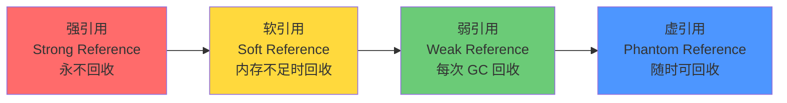

面试官问："Java 有哪几种引用类型？它们在 GC 时有什么区别？"

候选人小钱说："有强引用、软引用、弱引用和虚引用。强引用不会被回收，软引用内存不足时回收，弱引用每次 GC 都回收，虚引用随时可以回收。"

面试官追问："那 WeakHashMap 的底层实现是什么？为什么它适合做缓存？虚引用怎么用来追踪对象回收？"

小钱沉默了一会儿，说："WeakHashMap...键是弱引用？"

面试官继续："那你用过虚引用吗？什么场景下会用到？"

小钱彻底答不上来了。

## 一、四种引用类型全解析 🔴

### 1.1 问题拆解

四种引用类型是 JVM GC 模块的高频考点。这道题的区分度很高——能背出四种引用的占 80%，能说出软引用和弱引用区别的占 40%，能讲清虚引用实际用途的只有 10%。

### 1.2 四种引用的强度阶梯



| 引用类型 | GC 时机 | 典型用途 | 构造函数参数 |
| --- | --- | --- | --- |
| **强引用** | 永不自动回收（`o = null` 除外） | 常规对象 | 无 |
| **软引用** | 内存不足时回收（第一次机会） | 内存敏感缓存 | ReferenceQueue（可选） |
| **弱引用** | 每次 GC 时回收 | 规范化映射 | ReferenceQueue（可选） |
| **虚引用** | 不影响 GC 判定，随时可回收 | 对象回收追踪 | ReferenceQueue（必须） |

### 1.3 ReferenceQueue 的作用

所有非强引用都可以关联一个 ReferenceQueue。对象被 GC 回收后，引用会被加入这个队列，程序员可以通过轮询队列知道对象何时被回收。

```java
public class ReferenceQueueDemo {
    public static void main(String[] args) {
        ReferenceQueue<Object> queue = new ReferenceQueue<>();
        WeakReference<Object> ref = new WeakReference<>(new Object(), queue);

        System.out.println("ref.get() = " + ref.get()); // 有值

        System.gc(); // 触发 GC

        // 手动检查引用是否被加入队列
        try {
            Thread.sleep(100);
            Reference<?> removed = queue.remove(1000);
            if (removed != null) {
                System.out.println("对象被 GC 回收，引用被加入队列");
            }
        } catch (InterruptedException e) {
            e.printStackTrace();
        }
    }
}
```

---

## 二、软引用（Soft Reference）🔴

### 2.1 软引用的 GC 行为

软引用在内存不足时被回收。JVM 会根据以下条件决定是否回收软引用：

```java
// 软引用示例：图片缓存
public class ImageCache {
    // 使用软引用缓存图片，内存不足时自动释放
    private static Map<String, SoftReference<Bitmap>> cache =
        new HashMap<>();

    public static Bitmap getImage(String path) {
        SoftReference<Bitmap> ref = cache.get(path);
        if (ref != null) {
            Bitmap bitmap = ref.get();
            if (bitmap != null) return bitmap;
        }
        // 软引用已被回收，重新加载
        Bitmap bitmap = loadBitmap(path);
        cache.put(path, new SoftReference<>(bitmap));
        return bitmap;
    }
}
```

**软引用的回收策略**（JDK 11+）：

```
软引用存活时间 = FreeHeap / SoftRefLRUPolicyMSPerMB
```

- `SoftRefLRUPolicyMSPerMB`：每 MB 空闲堆允许软引用存活的时间（默认 1000ms）
- 空闲堆越大，软引用存活越久

参数控制：
- `-XX:SoftRefLRUPolicyMSPerMB=0`：更激进地回收软引用
- `-XX:SoftRefLRUPolicyMSPerMB=10000`：软引用存活更久

### 2.2 ❌ 错误示范

**候选人原话**："软引用在 GC 时一定会被回收。"

【面试官心理】
这个候选人把软引用和弱引用搞混了。软引用的回收条件是"内存不足"，不是"每次 GC"。在内存充足的环境下，软引用可以存活很长时间。只背概念不区分的候选人，在追问下必崩。

---

## 三、弱引用（Weak Reference）🔴

### 3.1 弱引用的 GC 行为

弱引用在**每次 GC 时**都会被回收，无论内存是否充足。

**WeakHashMap 的实现原理**：

```java
// WeakHashMap 的 key 使用弱引用
// 当 key 不再被 GC Roots 引用时，GC 过程中 key 被回收
// WeakHashMap 内部自动清理 value
public class WeakHashMapDemo {
    public static void main(String[] args) {
        WeakHashMap<String, String> map = new WeakHashMap<>();
        String key = new String("tempKey"); // 局部变量，强引用
        map.put(key, "value");

        System.out.println(map.size()); // 1

        key = null; // 解除强引用
        System.gc(); // 触发 GC

        // 弱引用被回收，entry 自动从 map 中移除
        System.out.println(map.size()); // 0
    }
}
```

### 3.2 典型应用场景

```java
// 场景1：规范化映射（Canoncial Mapping）
// 每个 String 只保存一份，所有相同内容的 String 共享引用
// WeakHashMap 确保不再使用的 key 自动清理

// 场景2：缓存中的短期数据
public class WeakCache<K, V> {
    private Map<K, WeakReference<V>> cache = new WeakHashMap<>();

    public V get(K key) {
        WeakReference<V> ref = cache.get(key);
        return ref != null ? ref.get() : null;
    }

    public void put(K key, V value) {
        cache.put(key, new WeakReference<>(value));
    }
}
```

---

## 四、虚引用（Phantom Reference）🟡

### 4.1 虚引用的特殊性

虚引用是最"弱"的引用——**它完全不影响 GC 判定**。GC 可以在任何时候回收虚引用指向的对象。

虚引用的唯一作用：**追踪对象何时从堆中回收**。

```java
// 虚引用必须关联 ReferenceQueue
public class PhantomReferenceDemo {
    public static void main(String[] args) throws InterruptedException {
        ReferenceQueue<Object> queue = new ReferenceQueue<>();
        Object obj = new Object();
        PhantomReference<Object> phantom = new PhantomReference<>(obj, queue);

        System.out.println("phantom.get() = " + phantom.get());
        // 输出：null —— 虚引用的 get() 永远返回 null！

        obj = null; // 解除强引用
        System.gc();

        Thread.sleep(100);
        Reference<?> ref = queue.poll();
        if (ref != null) {
            System.out.println("对象被 GC 回收，虚引用进入队列");
        }
    }
}
```

### 4.2 虚引用的实际用途

**用途一：堆外内存管理（NIO DirectByteBuffer）**

```java
// DirectByteBuffer 使用堆外内存（直接内存）
// 虚引用追踪对象回收，回收时通知释放堆外内存

// 简化原理：
public class CleanerDemo {
    // Cleaner 内部使用虚引用
    // 当 DirectByteBuffer 对象被 GC 回收时
    // Cleaner 的 run() 方法被调用，释放堆外内存
    private static Cleaner cleaner = Cleaner.create(this, new Deallocator());
}
```

**用途二：监控与日志**

```java
// 对象回收监控
public class ObjectTracker {
    private static ReferenceQueue<Object> queue = new ReferenceQueue<>();
    private static Set<PhantomReference<Object>> refs = new HashSet<>();

    public static void track(Object obj) {
        refs.add(new PhantomReference<>(obj, queue));
    }

    public static void processQueue() {
        Reference<?> ref;
        while ((ref = queue.poll()) != null) {
            System.out.println("对象被回收：" + ref);
            refs.remove(ref);
        }
    }
}
```

---

## 五、面试高频追问 🟡

### 5.1 追问：ThreadLocal 的 key 为什么用弱引用？

ThreadLocalMap 中 Entry 的 key（ThreadLocal）使用弱引用，value（存储的值）使用强引用：

```java
// ThreadLocalMap.Entry 简化实现
static class Entry extends WeakReference<ThreadLocal<?>> {
    Object value;

    Entry(ThreadLocal<?> k, Object v) {
        super(k); // key 是弱引用
        value = v; // value 是强引用
    }
}
```

**为什么 key 用弱引用？** 如果 key 是强引用，ThreadLocal 对象不再被使用时（外部无引用），由于 Entry 持有 key 的强引用，ThreadLocal 永远无法被 GC，造成内存泄漏。弱引用使得 key 可以被 GC 回收。

**但为什么还会有内存泄漏？** 因为 value 是强引用！如果 ThreadLocal 被 GC 后，key = null，但 value 仍然被 Entry 持有，造成 value 泄漏。这就是 ThreadLocal 的经典"内存泄漏陷阱"。

**解决方案**：`ThreadLocal.remove()` 在不使用时显式清理。

:::warning ⚠️
ThreadLocal 的内存泄漏是生产环境中非常常见的坑。当线程复用（如线程池）时，如果 ThreadLocal 不清理，旧线程的 ThreadLocalMap 中的 Entry 不会被 GC，形成内存泄漏。
:::

### 5.2 追问：WeakHashMap vs HashMap + 弱引用 Key

```java
// WeakHashMap：键自动清理
WeakHashMap<String, String> wm = new WeakHashMap<>();
wm.put("key", "value"); // key 弱引用，自动清理

// 手写实现（不推荐）
Map<String, String> hm = new HashMap<>();
hm.put("key", "value"); // 需要手动清理

// 面试要点：WeakHashMap 内部处理了清理逻辑
// HashMap 需要开发者自己管理弱引用
```

【面试官心理】
能答出 ThreadLocal 内存泄漏机制的候选人，在 P6 面试中已经是加分项。能说清楚 WeakHashMap 原理的，基本是看过源码的。这种候选人在阿里/字节的面试中很有竞争力。
