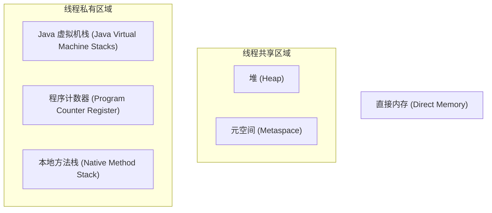
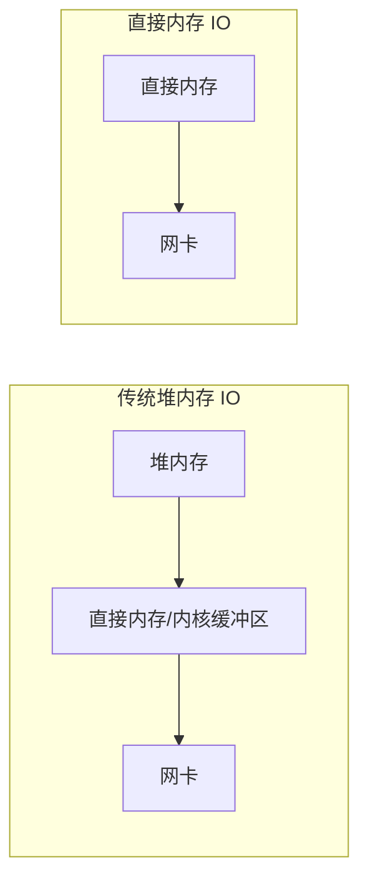

# JVM 运行时数据区

在写 Java 代码的时候，你有没有想过：创建的对象存在哪里？方法调用时局部变量存在哪里？类信息又存在哪里？

这些问题都和 JVM 的运行时数据区有关。很多同学对 JVM 内存模型的理解只停留在"堆和栈"两个字上，但面试官一问"元空间和永久代的区别"、"直接内存是什么"，就容易翻车。

今天我们把这个知识点彻底讲透。

## 一、真实面试场景

候选人小张在面试阿里的时候，被问到这样一个问题：

"JVM 的运行时数据区有哪些？"

小张回答："有堆和栈。堆存对象，栈存方法调用和局部变量。"

面试官点点头，继续追问："那元空间呢？和永久代有什么区别？"

小张说："元空间是 JDK 8 引入的，用来替代永久代..."

面试官又问："那直接内存是什么？和堆内存有什么关系？"

小张开始支支吾吾。

【面试官心理】
这道题我用来测试候选人对 JVM 内存模型的掌握程度。只知道堆和栈的占 60%，能说出元空间的占 30%，能讲清楚直接内存的只有 10%。这道题看似简单，但实际上涵盖了 JVM 内存管理的核心概念。

## 二、JVM 运行时数据区全景图

JVM 运行时数据区可以分为两大部分：**线程共享区域**和**线程私有区域**。



### 2.1 线程私有区域：每个线程独享

**程序计数器（Program Counter Register）**

```java
public class Test {
    public static void main(String[] args) {
        int x = 10;        // PC 指向这条指令
        int y = 20;        // 下一条指令
        int z = x + y;     // 再下一条指令
    }
}
```

程序计数器是一块很小的内存空间，用于记录当前线程正在执行的字节码指令地址。每个线程都有自己的程序计数器，互不影响。

:::tip 💡
程序计数器是唯一一块不会发生 OutOfMemoryError 的区域。因为它是线程私有的，大小在编译时就已经确定。
:::

**Java 虚拟机栈（Java Virtual Machine Stack）**

```java
public class StackDemo {
    public static void main(String[] args) {
        int result = calculate(10, 20);
    }
    
    public static int calculate(int a, int b) {
        int sum = a + b;  // 局部变量，存在于栈帧中
        return sum;
    }
}
```

虚拟机栈描述的是 Java 方法执行的内存模型：每个方法在执行时都会创建一个栈帧（Stack Frame），用于存储局部变量表、操作数栈、动态链接、方法出口等信息。

:::warning ⚠️
栈内存溢出（StackOverflowError）通常由递归调用过深导致。可以使用 `-Xss` 参数调整栈大小。
:::

**本地方法栈（Native Method Stack）**

本地方法栈与虚拟机栈类似，区别在于：虚拟机栈为 Java 方法（字节码）服务，本地方法栈为 native 方法服务。在 JDK 7 及之前，HotSpot 虚拟机将两者合并实现。

### 2.2 线程共享区域：所有线程共享

**堆（Heap）**

```java
public class HeapDemo {
    public static void main(String[] args) {
        // 所有 new 出来的对象都存放在堆中
        String str = new String("Hello");
        List<Integer> list = new ArrayList<>();
        User user = new User();
        
        // 局部变量 str、list、user 本身存在栈中
        // 但它们引用的对象存在于堆中
    }
}
```

堆是 JVM 最大的一块内存区域，被所有线程共享。几乎所有的对象实例和数组都要在堆上分配（但不是绝对的，后面会讲到逃逸分析）。GC 的主要工作区域就在堆中。

**元空间（Metaspace）**

```java
public class MetaspaceDemo {
    // 类的元信息：类名、方法信息、字段信息
    // 存储在元空间中
    public void doSomething() {
        // 方法的字节码指令
    }
}
```

元空间用于存储类信息、方法信息、字段信息、字节码、即时编译器优化后的代码等。在 JDK 8 之前，这部分数据存储在"永久代"中。

## 三、堆与栈的区别

### 3.1 核心区别

| 维度 | 堆 (Heap) | 栈 (Stack) |
|------|-----------|------------|
| 内存大小 | 通常较大，可通过 `-Xms/-Xmx` 调整 | 相对较小，可通过 `-Xss` 调整 |
| 存储内容 | 对象实例、数组 | 方法调用、局部变量 |
| 线程共享 | 是，所有线程共享 | 否，线程私有 |
| 垃圾回收 | 需要 GC 管理 | 无需 GC，方法结束自动释放 |
| 分配方式 | 动态分配 | 静态分配（编译时确定） |
| 异常类型 | OutOfMemoryError | StackOverflowError |

### 3.2 【直观类比】堆和栈的关系

想象一个图书馆：

- **堆**就像图书馆的书库，存放着所有的书籍（对象）。书库是共享的，所有人（线程）都可以借阅。

- **栈**就像每个人手里的借书清单，记录了你借了哪些书（局部变量引用）。清单是你私人的，别人看不到。

```java
public class LibraryDemo {
    public static void main(String[] args) {
        // "借书清单"在栈中
        Book book1 = new Book("Java核心技术");  // book1 是清单上的一个条目
        Book book2 = new Book("Effective Java");  // book2 是另一个条目
        
        // 实际的书籍在"书库"（堆）中
        // 清单上的条目指向书库中的实际书籍
    }
}
```

### 3.3 ❌ 常见错误：混淆堆和栈的职责

```java
public class ConfusionDemo {
    public static void main(String[] args) {
        // 错误理解：把局部变量当成存在堆里
        int a = 10;  // a 是基本类型，存在栈中
        int[] arr = new int[10];  // arr 变量在栈中，new 出的数组在堆中
    }
}
```

正确理解：
- `a` 作为局部变量，存在**栈**中
- `arr` 作为局部变量（引用类型），存在**栈**中，它存储的是数组对象在**堆**中的地址

## 四、元空间 vs 永久代

### 4.1 为什么要替换？

在 JDK 8 之前，JVM 使用永久代来存储类的元信息。但永久代有几个严重问题：

1. **大小固定，难以调整**：永久代的大小在 JVM 启动时就固定了，不容易调优。
2. **容易 OutOfMemoryError**：如果动态生成很多类（如使用 CGLIB、JSP），永久代容易满。
3. **GC 复杂**：永久代的 GC 和堆的 GC 是分离的，增加了复杂度。

### 4.2 关键区别

| 维度 | 永久代 (PermGen) | 元空间 (Metaspace) |
|------|------------------|---------------------|
| JDK 版本 | JDK 7 及之前 | JDK 8 及之后 |
| 存储位置 | JVM 进程内存（堆的一部分） | 本地内存（Native Memory） |
| 大小限制 | 固定，难以调整 | 动态扩展，受 `-XX:MaxMetaspaceSize` 限制 |
| OutOfMemoryError | PermGen space | Metaspace |
| 字符串常量池 | 永久代中 | 移至堆中（JDK 7） |

### 4.3 生产环境注意

:::warning ⚠️
如果你的应用大量使用动态代理、CGLIB、字节码生成技术（如 Spring、Hibernate、RPC 框架），需要关注元空间大小。如果无限增长，可能导致系统内存耗尽。

推荐配置：` -XX:MaxMetaspaceSize=256m -XX:MetaspaceSize=128m`
:::

## 五、直接内存

### 5.1 什么是直接内存？

直接内存（Direct Memory）不是 JVM 运行时数据区的一部分，而是操作系统本机内存。但 Java 可以通过 `ByteBuffer.allocateDirect()` 分配直接内存，这部分内存不受 JVM 堆大小限制。

```java
public class DirectMemoryDemo {
    public static void main(String[] args) {
        // 分配 1GB 直接内存
        ByteBuffer buffer = ByteBuffer.allocateDirect(1024 * 1024 * 1024);
    }
}
```

### 5.2 为什么需要直接内存？

传统的堆内存数据如果要写入 socket，需要先复制到直接内存，再从直接内存发送到网卡。直接内存可以避免这个复制过程，提高 IO 效率。



### 5.3 生产环境注意

:::tip 💡
NIO（如 FileChannel、SocketChannel）默认使用直接内存。如果直接内存配置过小，会导致频繁 GC；如果过大，可能导致系统可用内存不足。

常见配置：`-XX:MaxDirectMemorySize=512m`
:::

## 六、常见面试题解析

### 6.1 JVM 内存区域哪些是线程安全的？

**线程私有**（天然线程安全）：
- 程序计数器
- Java 虚拟机栈
- 本地方法栈

**线程共享**（需要考虑线程安全）：
- 堆
- 元空间

### 6.2 什么情况下会栈溢出？

```java
public class StackOverflow {
    public static void main(String[] args) {
        recursiveMethod();
    }
    
    public static void recursiveMethod() {
        // 递归调用没有终止条件
        recursiveMethod();  // StackOverflowError
    }
}
```

可以通过 `-Xss` 参数调整栈大小，但根本解决方案是检查递归逻辑是否正确。

### 6.3 什么情况下会堆溢出？

```java
public class HeapOverflow {
    public static void main(String[] args) {
        List<byte[]> list = new ArrayList<>();
        while (true) {
            list.add(new byte[1024 * 1024]);  // 不断分配，触发 OOM
        }
    }
}
```

## 七、面试追问链

### 第一层：基础概念

面试官问："JVM 运行时数据区有哪些？"

标准回答：线程私有区域包括程序计数器、Java 虚拟机栈、本地方法栈；线程共享区域包括堆和元空间。此外还有直接内存。

### 第二层：堆和栈的区别

面试官追问："堆和栈有什么区别？"

需要说明：堆是线程共享的，存储对象实例；栈是线程私有的，存储方法调用和局部变量。堆需要 GC 管理，栈随方法结束自动释放。

### 第三层：元空间

面试官追问："元空间和永久代有什么区别？为什么 JDK 8 要用元空间替代永久代？"

需要说明：元空间使用本地内存而不是堆内存，可以动态扩展，避免了永久代的 OutOfMemoryError 问题。

### 第四层：直接内存

面试官追问："直接内存是什么？和堆内存有什么关系？"

需要说明：直接内存是操作系统本地内存，Java 可以通过 ByteBuffer.allocateDirect() 分配。NIO 使用直接内存可以提高 IO 效率。

【面试官心理】
这道题我通常用来测试候选人对 JVM 内存模型的完整理解。能说出堆和栈的占大多数，能说清元空间和永久代的区别的占一半左右，能讲明白直接内存的只有少数。真正理解 JVM 内存模型的候选人，才能在后续的 GC 调优、OOM 排查等场景中得心应手。

【学习小结】
- 线程私有区域：程序计数器、虚拟机栈、本地方法栈
- 线程共享区域：堆、元空间
- 堆：存储对象实例，是 GC 的主要工作区
- 栈：存储方法调用、局部变量，线程私有
- 元空间：JDK 8+ 用于替代永久代，存储类元信息，使用本地内存
- 直接内存：NIO 使用，不受堆大小限制
