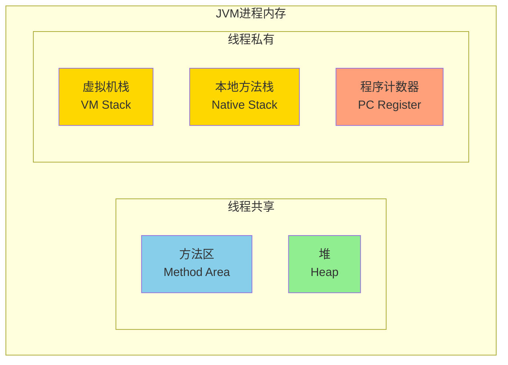
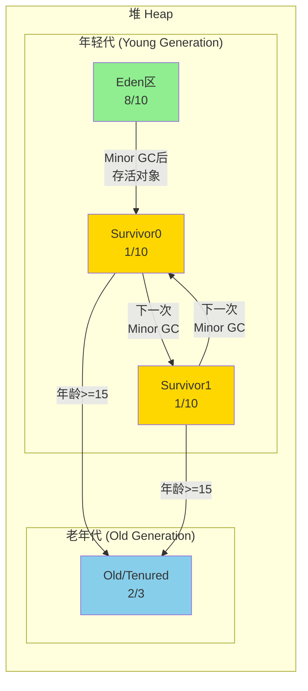
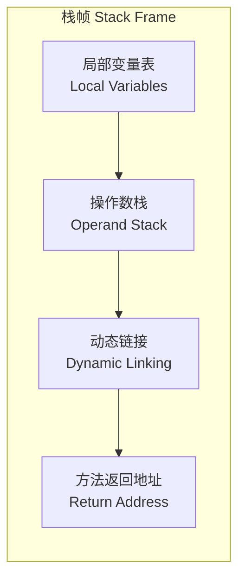
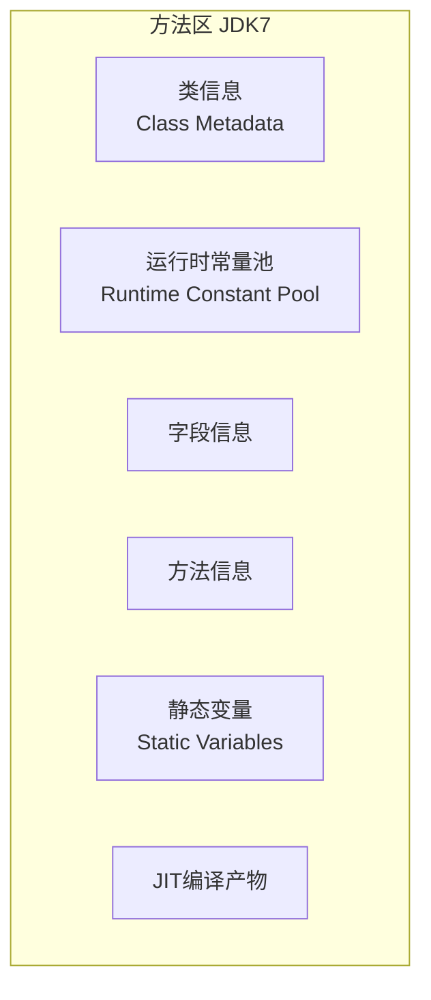
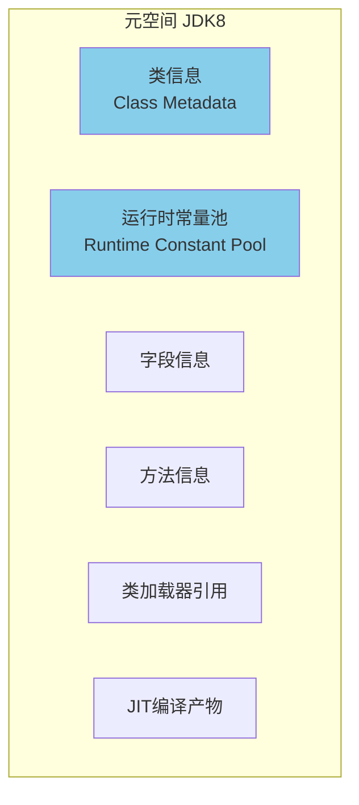

# JVM 运行时数据区

**目标级别**：P5 / P6

## 快速自测

面试官问：「JVM 运行时数据区有哪些？堆和栈的区别是什么？」

你能回答到第几层？

---

## 一、核心问题

### 🔴 JVM 运行时数据区有哪些？



### 区域划分总览

| 区域 | 线程共享 | 存储内容 | 异常 |
|------|----------|----------|------|
| **堆（Heap）** | 是 | 对象实例、数组 | OutOfMemoryError |
| **方法区（Method Area）** | 是 | 类信息、常量、静态变量、JIT编译产物 | OutOfMemoryError |
| **虚拟机栈（VM Stack）** | 否 | 方法调用、局部变量 | StackOverflowError / OutOfMemoryError |
| **本地方法栈（Native Stack）** | 否 | Native方法调用 | StackOverflowError / OutOfMemoryError |
| **程序计数器（PC Register）** | 否 | 当前字节码行号 | 无 |

---

## 二、堆（Heap）

### 堆结构图解



### JDK7 vs JDK8 堆结构

| 版本 | 永久代 | 元空间 |
|------|--------|--------|
| JDK7 | 有（PermGen） | 无 |
| JDK8 | 无 | 有（Metaspace） |
| 位置 | 堆内 | 堆外（本地内存） |
| 大小 | 固定（容易 OOM） | 动态（可用本地内存） |

### 堆参数配置

```bash
# 初始堆大小
-Xms256m

# 最大堆大小
-Xmx512m

# 年轻代大小
-Xmn128m

# Eden/Survivor比例
-XX:SurvivorRatio=8

# 查看GC日志
-verbose:gc -XX:+PrintGCDetails
```

---

## 三、虚拟机栈（VM Stack）

### 栈帧结构



### 局部变量表

```java title="局部变量表示例"
public void method(int num) {
    int a = 1;              // slot 1
    long b = 2L;            // slot 2, 3 (占用2个slot)
    String c = "hello";     // slot 4
    
    // this 占用 slot 0（实例方法）
    // num 占用 slot 1
    
    if (num > 10) {
        int d = 3;          // slot 5
    }
}
```

### 常见错误

```java
// StackOverflowError：栈深度过大
public class StackOverflowDemo {
    // 递归没有终止条件
    public static void recursion() {
        recursion();  // 无限递归
    }
    
    public static void main(String[] args) {
        recursion();
    }
}
```

```bash
# 调整栈大小
-Xss256k   # 较小栈，递归深度深但内存占用少
-Xss2m     # 较大栈，递归深度浅但内存占用多
```

---

## 四、方法区（Method Area）

### JDK7 方法区结构



### JDK8 元空间



### 元空间参数

```bash
# 元空间初始大小
-XX:MetaspaceSize=128m

# 元空间最大大小（无上限受物理内存限制）
-XX:MaxMetaspaceSize=256m

# 压缩类指针（开启可以减少元空间占用）
-XX:+UseCompressedClassPointers
```

:::tip 为什么 JDK8 要移除永久代？
永久代大小固定，容易出现 OutOfMemoryError。Full GC 时还会扫描永久代，影响 GC 性能。元空间使用本地内存，可以动态扩展，避免了这些问题。
:::

---

## 五、程序计数器（PC Register）

### 作用

- 记录当前线程执行的**字节码行号**
- 执行 Java 方法：记录字节码指令地址
- 执行 Native 方法：记录 undefined
- 线程私有，每个线程独立拥有一份

### 为什么需要？

```java
// 多线程切换时，需要知道从哪里恢复执行
public class PCRole {
    public static void main(String[] args) {
        Thread t1 = new Thread(() -> {
            // 线程1执行到第5行
            System.out.println("线程1");  // PC = 5
        });
        
        Thread t2 = new Thread(() -> {
            // 线程2执行到第3行
            System.out.println("线程2");  // PC = 3
        });
        
        t1.start();
        t2.start();
        
        // CPU切换回线程1时，需要从PC=5继续执行
    }
}
```

---

## 六、运行时常量池

### StringTable

```java title="StringTable 示例"
public class StringTableDemo {
    public static void main(String[] args) {
        // 字面量"java"会放入StringTable
        String s1 = "java";
        String s2 = "java";
        
        // s1 == s2 为 true（StringTable复用）
        System.out.println(s1 == s2);  // true
        
        // new String不会复用
        String s3 = new String("java");
        System.out.println(s1 == s3);  // false
        
        // intern()会尝试复用StringTable
        String s4 = s3.intern();
        System.out.println(s1 == s4);  // true
    }
}
```

### StringTable 面试题

```java
// 经典面试题
String s1 = new String("a") + new String("b");
// 创建了几个对象？
// 1. new String("a")
// 2. new String("b")
// 3. StringBuilder (用于拼接)
// 4. new String("ab") （toString()生成）
// "a" 和 "b" 进入StringTable
// "ab" 不进入StringTable（需要手动调用intern）

String s2 = s1.intern();  // "ab" 进入StringTable
String s3 = "ab";          // 从StringTable获取

System.out.println(s2 == s3);  // true
```

### StringTable 大小配置

```bash
# JDK7+ StringTable大小
-XX:StringTableSize=60013

# 查看StringTable统计
-verbose:+ClassUnloading
```

---

## 七、面试题精讲

### 🔴 第一层：堆和栈的区别

> **参考答案**：
>
> | 维度 | 堆 | 栈 |
> |------|----|----|
> | **线程共享** | 是 | 否 |
> | **存储内容** | 对象实例、数组 | 方法调用、局部变量 |
> | **空间管理** | JVM自动管理（GC） | 线程自动分配释放 |
> | **异常** | OutOfMemoryError | StackOverflowError |
> | **空间大小** | 较大（GB级别） | 较小（MB级别） |
> | **分配方式** | 动态分配（new） | 连续内存（编译时确定） |

### 🟡 第二层：什么对象会进入老年代？

> **参考答案**：
>
> 1. **年龄达到阈值**：Minor GC后年龄 >= 15（`-XX:MaxTenuringThreshold`）
> 2. **大对象**：超过 `-XX:PretenureSizeThreshold` 的对象直接分配在老年代
> 3. ** Survivor 区放不下**：Minor GC 后 Survivor 区空间不够，分配担保进入老年代
> 4. **动态年龄判断**：Survivor 中相同年龄所有对象大小和 > Survivor 空间的一半，年龄 >= 该年龄的对象进入老年代

### 🟡 第三层：JDK7 和 JDK8 的区别

> **参考答案**：
>
> 最大的区别是**永久代被移除**，替换为**元空间**：
>
> 1. **位置**：永久代在堆内，元空间在本地内存
> 2. **大小**：永久代大小固定容易 OOM，元空间可动态扩展
> 3. **字符串常量池**：JDK7 移入堆，JDK8 仍在堆中
> 4. **静态变量**：JDK7 作为永久代的一部分，JDK8 移入堆

### 💡 第四层：逃逸分析与栈上分配

> **参考答案**：
>
> 逃逸分析是 JVM 的优化技术，分析对象的动态作用域：
>
> 1. **不逃逸**：对象只在方法内部使用，不会被外部访问 → 可以栈上分配
> 2. **方法逃逸**：对象作为返回值返回 → 不能栈上分配
> 3. **线程逃逸**：被赋值给类变量或被其他线程访问 → 不能栈上分配
>
> 栈上分配的对象随栈帧出栈而销毁，无需 GC 回收。

---

## 八、常见错误与陷阱

### ⚠️ 陷阱 1：堆溢出（OutOfMemoryError: Heap Space）

```java
// 不断创建对象不释放
List<byte[]> list = new ArrayList<>();
while (true) {
    list.add(new byte[1024 * 1024]);  // 1MB
}
```

### ⚠️ 陷阱 2：栈溢出（StackOverflowError）

```java
// 递归调用没有终止条件
public static void recursion() {
    int[] arr = new int[1024];  // 每次递归占用栈空间
    recursion();
}
```

### ⚠️ 陷阱 3：方法区溢出

```java
// JDK7 使用 CGLIB 不断生成类可能导致 PermGen OOM
// JDK8 使用 MetaspaceSize 控制，默认20MB
```

---

## 九、对比总结表

| 区域 | 线程共享 | 大小 | 异常 | 垃圾回收 |
|------|----------|------|------|----------|
| **堆** | 是 | 可扩展 | OOM | 是 |
| **方法区/元空间** | 是 | 可扩展 | OOM | 是（卸载类） |
| **虚拟机栈** | 否 | 固定 | SOF/OOM | 否 |
| **本地方法栈** | 否 | 固定 | SOF/OOM | 否 |
| **程序计数器** | 否 | 固定 | 无 | 否 |

---

## 十、扩展思考

> **追问**：对象创建后放在哪里？

1. **普通对象**：优先在 Eden 区分配
2. **大对象**：直接进入老年代（`-XX:PretenureSizeThreshold`）
3. **长期存活对象**：年龄达到 15 后进入老年代
4. **线程局部分配**：TLAB（Thread Local Allocation Buffer）优化

> **追问**：为什么需要 TLAB？

每个线程在 Eden 区有独立的 TLAB，避免多线程分配对象时的 CAS 竞争，提高分配效率。

```bash
# TLAB 大小
-XX:TLABSize=1024k
```

---

## 延伸阅读

- [堆内存分代结构](../jvm/heap)
- [对象创建流程](../jvm/object-creation)
- [对象内存布局](../jvm/object-layout)
- [逃逸分析](../jvm/escape-analysis)
