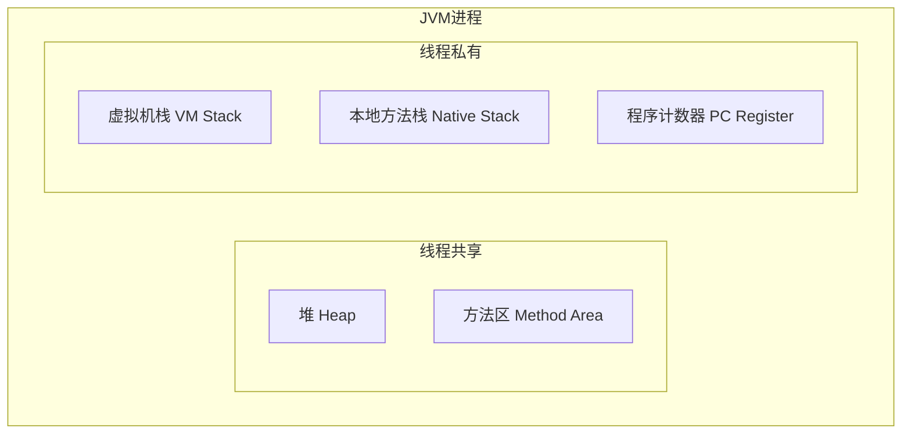
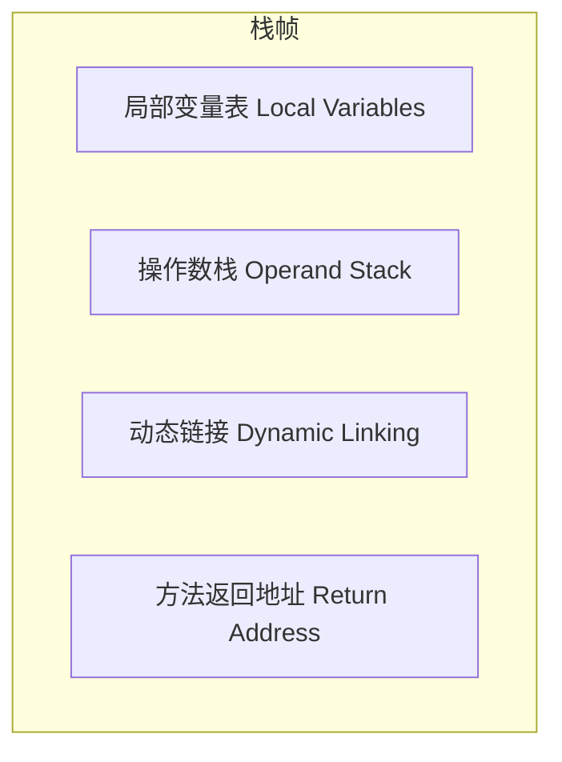

候选人小张坐在字节跳动1-2级别的面试间里，面试官翻到简历上"熟悉JVM内存结构"这一行，开口问道：

"JVM 的运行时数据区有哪些？"

小张脱口而出："堆、栈、方法区..."然后就卡住了。

面试官追问："堆里面分哪几块？栈帧里面有什么？程序计数器是干什么的？为什么需要它？"

小张开始擦汗。

## 一、JVM 运行时数据区分哪几块 🔴

### 1.1 问题拆解

这道题考察的是候选人对 JVM 内存模型的全局认知。面试官问的"有哪些"，其实在试探你知不知道每个区域干什么用、线程共享还是私有、以及各自的生命周期。

先上一张图，建立整体认知：



**标准回答**：JVM 运行时数据区分为 5 大块：
- **堆（Heap）**：线程共享，存放对象实例和数组
- **方法区（Method Area）**：线程共享，存放类信息、常量、静态变量、JIT 编译产物
- **虚拟机栈（VM Stack）**：线程私有，每个线程一个栈，每个方法调用创建一个栈帧
- **本地方法栈（Native Stack）**：线程私有，服务 Native 方法调用
- **程序计数器（PC Register）**：线程私有，记录当前线程执行的字节码行号

:::tip 💡
JDK 8 之后，方法区被元空间（Metaspace）替代，但堆的逻辑结构仍然包含"方法区"的概念。元空间使用直接内存，不再占用堆空间。
:::

### 1.2 ❌ 错误示范

**候选人原话 A**："JVM 内存分为堆和栈，堆里放对象，栈里放局部变量。"

**问题诊断**：这种回答只能得 40 分。"堆"和"栈"是外行人的说法——虚拟机栈和本地方法栈是两个东西，程序计数器和元空间也是两个独立区域。堆本身还有分代结构。这个回答暴露了候选人对 JVM 内存模型的理解只停留在表面。

**候选人原话 B**："JVM 内存有堆、栈、方法区、程序计数器、虚拟机栈..."

面试官追问："程序计数器是干什么的？"

候选人答："记录代码执行位置的。"

追问："那为什么需要它？多线程情况下每个线程都有自己独立的程序计数器吗？"

候选人："...是的？"

**问题诊断**：能说出名字但不理解原理。程序计数器是面试官最爱的追问点——它支撑了 CPU 时间片轮转时线程切换的精确恢复，不理解这个就无法理解为什么 Java 能实现精确跳转。

### 1.3 标准回答

【面试官心理】
我问他 JVM 运行时数据区，其实不是想听他背名字。我想知道两件事：第一，他脑子里有没有一张完整的内存地图，能不能把 5 大区域串成一张网；第二，他能不能说出为什么这么设计——比如为什么程序计数器是线程私有的，为什么堆要线程共享。这才是 P6 和 P5 的差距。

**完整回答模板（P6 级别）**：

"JVM 运行时数据区分为 5 大区域，从线程维度分，可以分为线程共享和线程私有两类。

线程共享的区域有：

- **堆（Heap）**：所有线程共享，存放对象实例和数组，是 GC 的主要管理区域。JDK 8 以后，方法区的实现从永久代改为元空间（Metaspace），使用直接内存。
- **方法区（Method Area）**：存储类的元信息（类名、修饰符、父类）、运行时常量池、静态变量、JIT 编译后的代码。在 JDK 8 之前用永久代实现，现在用元空间在本地内存中分配。

线程私有的区域有：

- **虚拟机栈（VM Stack）**：每个线程独立拥有一个虚拟机栈，线程每调用一个方法就会创建一个栈帧（Stack Frame），栈帧包含局部变量表、操作数栈、动态链接、方法返回地址。方法的调用和返回本质上就是栈帧的入栈和出栈。
- **本地方法栈（Native Stack）**：服务 JVM 的 Native 方法调用，和虚拟机栈功能类似，但专门用于 native 方法。JVM 实现可以选择把两者合一（如 HotSpot）。
- **程序计数器（PC Register）**：每个线程独立拥有一个程序计数器，记录当前线程正在执行的字节码指令地址。如果是 native 方法或执行引擎在执行本地代码，这个计数器值为 undefined。

为什么需要程序计数器？因为 CPU 的时间片轮转机制要求线程能精确恢复到被中断的执行位置。对于 Java 字节码来说，下一条要执行哪条指令取决于程序计数器的值——它就像每个线程的执行进度指针。"

### 1.4 追问升级

**P6/P7 拉开差距的追问**：

追问 1：**"虚拟机栈和本地方法栈有什么区别？HotSpot 实际上是怎么实现的？"**

能答 HotSpot 将两者合一的占 30%，能说出原因（native 方法不经过字节码）的占 15%。

追问 2：**"一个线程可以拥有多个虚拟机栈吗？"**

这道题其实在试探对线程模型的理解。答案是一个线程对应一个虚拟机栈，栈里面可以有多个栈帧。

追问 3：**"运行时数据区里哪些区域会发生 OOM？"**

这道题是高频深水区：
- 堆 OOM：对象分配无法满足，GC 后仍不足
- 虚拟机栈溢出：递归调用过深（StackOverflowError）或线程创建过多（OutOfMemoryError）
- 元空间 OOM：类加载过多（大量动态类生成，如 CGLib、Spring、热部署）
- 直接内存 OOM：NIO 使用堆外内存过多

能说出 4 种的候选人，基本都踩过生产 OOM 的坑。

---

## 二、线程私有区域深度剖析 🟡

### 2.1 虚拟机栈的栈帧结构

每个线程的虚拟机栈由多个栈帧组成，栈帧是方法调用时的数据结构：



- **局部变量表**：存放方法参数和局部变量。基本类型直接存值，引用类型存指针。slot 是最小单位，long/double 占 2 个 slot。
- **操作数栈**：也称为操作栈，字节码指令在此入栈出栈。比如 `iload_0` 将局部变量0压入栈顶，`iadd` 弹出两个 int 相加后压回栈顶。
- **动态链接**：每个栈帧包含一个指向常量池的引用，指向当前方法的符号引用，在运行时解析为直接引用。
- **方法返回地址**：方法正常返回或异常退出时，程序需要恢复到调用者的执行位置。

### 2.2 ❌ 错误示范

**候选人原话**："局部变量表里存的是方法的参数和局部变量，就这些。"

面试官追问："long 类型占几个 slot？"

候选人："...1个？"

面试官："HotSpot 的局部变量表中，long 和 double 占两个连续的 slot，这是 JVM 规范的要求。为什么这么规定？"

候选人答不上来。

【面试官心理】
这种追问是 P6/P7 的分水岭。知道 long/double 占两个 slot 的是 40%，能解释"因为 64 位值需要对齐访问"的只有 10%。

### 2.3 程序计数器的核心价值

程序计数器是最容易被忽略的区域，但它的设计恰恰体现了 JVM 的精巧：

- 字节码指令流是连续的，PC 记录当前位置
- 分支、循环、跳转由字节码指令修改 PC 实现
- 方法调用和返回通过 PC 恢复调用点
- CPU 切换线程时，JVM 通过保存/恢复 PC 实现精确恢复

:::warning ⚠️
如果程序计数器只支持当前执行位置，那线程等待锁时它在等什么？答案是：等待操作系统调度——JVM 的程序计数器只管"我的执行流在哪"，不管"CPU 什么时候轮到我"。
:::

---

## 三、生产避坑

### 3.1 栈溢出（StackOverflowError）

递归调用没有终止条件，是最容易触发栈溢出的场景：

```java
public class StackOverflowDemo {
    public static long count = 0;

    public static void recursive() {
        count++;
        recursive(); // 没有终止条件，无限递归
    }

    public static void main(String[] args) {
        try {
            recursive();
        } catch (StackOverflowError e) {
            System.out.println("Stack depth: " + count);
        }
    }
}
```

**实际生产场景**：一个复杂的工作流引擎，节点 A 调用节点 B，节点 B 调用节点 C...如果业务流程配置错误导致循环引用，每次方法调用都会入栈，最终触发 StackOverflowError。

**排查方法**：加 `-Xss256k` 参数调大栈大小（治标），找到递归终止条件缺失的代码（治本）。

### 3.2 元空间 OOM

这是 JDK 8 之后最常见的 OOM 类型之一：

```java
// 典型场景：动态类生成失控
public class MetaspaceOomDemo {
    public static void main(String[] args) {
        int count = 0;
        try {
            while (true) {
                // CGLib 动态生成类，每个类占用元空间
                Enhancer enhancer = new Enhancer();
                enhancer.setSuperclass(MetaspaceOomDemo.class);
                enhancer.setCallbackType(MethodInterceptor.class);
                enhancer.createClass();
                count++;
            }
        } catch (Error e) {
            System.out.println("Classes generated: " + count);
            e.printStackTrace();
        }
    }
}
```

**生产案例**：Spring Boot 应用在热部署或开发时频繁 reload，类加载器反复加载新类，而旧类的元空间数据没有被完全回收——这就是典型的元空间 OOM。解决方案是限制元空间大小（`-XX:MaxMetaspaceSize=256m`）并配合监控告警。

---

## 四、工程选型

### 4.1 什么场景关注什么区域

| 场景 | 关注区域 | 参数 |
| --- | --- | --- |
| 对象分配频繁 | 堆（Eden/Survivor/Old） | `-Xms/-Xmx`，GC 选型 |
| 递归/深度调用 | 虚拟机栈 | `-Xss` |
| 大量类加载 | 元空间 | `-XX:MaxMetaspaceSize` |
| NIO/直接内存 | 直接内存 | `-XX:MaxDirectMemorySize` |
| 多线程创建 | 虚拟机栈 + 堆 | `-Xss` + 线程数估算 |

### 4.2 面试高频追问：堆 vs 栈

面试官最爱的对比题：**"Java 里一个对象放在哪？局部变量呢？对象的引用呢？"**

标准回答：
- **new出来的对象**：在堆里分配内存
- **对象的引用**：在栈帧的局部变量表中（存的是指向堆的指针）
- **基本类型局部变量**：在栈帧的局部变量表中（直接存值）
- **静态变量/常量**：在方法区（元空间）

:::tip 💡
"引用在栈上，对象在堆上"——这句话要理解成"引用类型的变量在栈上（局部变量表），它指向的对象在堆上"。基本类型则不同：`int i = 5` 这个 5 就直接存在局部变量表的 slot 里了。
:::
