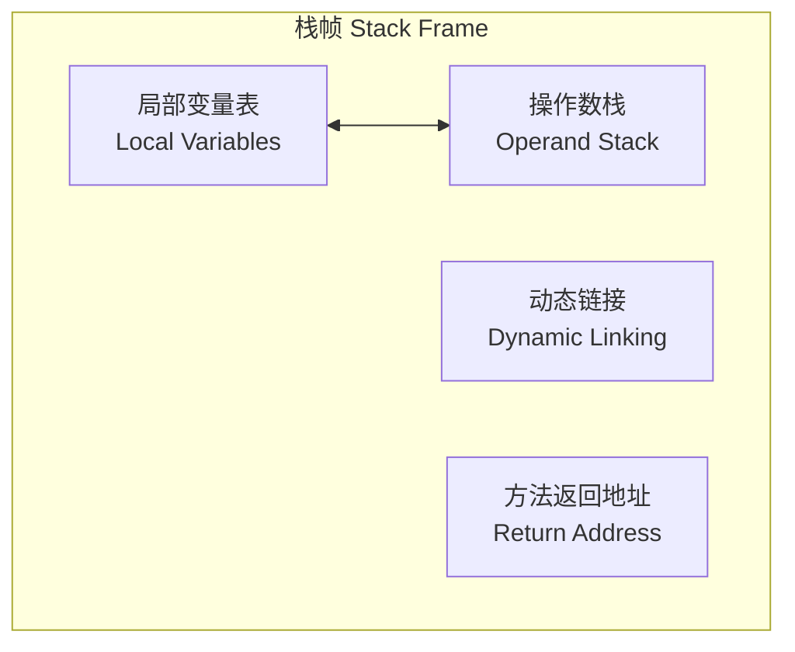
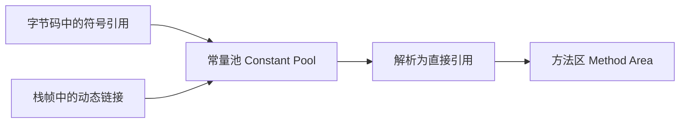

候选人小赵面试美团L7，面试官翻到简历上"熟悉 JVM 虚拟机栈"这一行，问了一个看似简单的问题：

"方法调用时，虚拟机栈里发生了什么？"

小赵说："方法调用时创建栈帧，栈帧里存放局部变量和操作数。"

面试官拿起笔，在纸上画了一段字节码：

```java
public int calc() {
    int a = 1;
    int b = 2;
    int c = a + b;
    return c;
}
```

面试官："这段代码对应的字节码指令序列是什么？每个指令操作数栈和局部变量表怎么变化的？"

小赵彻底卡住了。

## 一、栈帧的核心构成 🔴

### 1.1 问题拆解

栈帧是理解 JVM 字节码执行机制的核心。面试官问"方法调用时虚拟机栈发生了什么"，其实是希望你从字节码层面描述栈帧的创建过程。不懂栈帧结构的候选人，在字节码分析和面试题（比如"递归调用为什么会栈溢出"）面前毫无招架之力。

### 1.2 栈帧四大组件



每个方法调用对应一个栈帧入栈，方法返回时栈帧出栈。

### 1.3 局部变量表（Local Variables Table）

局部变量表是一组变量槽（Slot）的数组，用于存放方法参数和局部变量。

**槽的分配规则**：
- `int`、`short`、`byte`、`char`、`float`、`reference`、`returnAddress`：各占 1 个 Slot
- `long`、`double`：各占 2 个连续 Slot（先写低位，再写高位）

**索引方式**：
- `iload_0`：加载局部变量 0（隐含是 int 类型）
- `aload_1`：加载局部变量 1（reference 类型）
- `lload_2`：加载局部变量 2 的 long 值

```java
// 局部变量表索引分配示例
public void method(int a, Object b) {
    int c = 10;
    // a -> slot 1（slot 0 固定为本 this）
    // b -> slot 2
    // c -> slot 3
}
```

:::warning ⚠️
为什么 slot 0 要预留给 `this`？因为非静态方法的 `this` 引用需要能随时被访问到。`iload_0` 在实例方法中永远加载 `this`，在静态方法中才是第一个方法参数。这解释了为什么非静态方法的局部变量表索引总是比参数多 1。
:::

### 1.4 操作数栈（Operand Stack）

操作数栈是 JVM 的"临时工作台"。字节码指令从局部变量表或对象字段读取数据到栈顶，在栈上完成运算，结果放回栈顶，再存回局部变量表或作为返回值。

**典型运算过程**：

```java
// 源码
int a = 10;
int b = 20;
int c = a + b;
```

对应的字节码执行过程：

```java
// 操作数栈变化（用 [] 表示栈顶）
iload_1     // [] -> [10]       加载局部变量1(a=10)到栈顶
bipush 20   // [10] -> [10,20]  将常量20压栈
iadd        // [10,20] -> [30]  弹出两个int，相加，压回结果
istore_3    // [30] -> []       弹出栈顶30，存入局部变量3(c)
```

:::tip 💡
操作数栈的深度是有上限的，由方法编译时决定。可以理解为"这个方法最多需要多少层临时空间"。栈帧出栈后，操作数栈空间被释放。
:::

---

## 二、动态链接 🟡

### 2.1 什么是动态链接

每个栈帧包含一个指向常量池的引用。方法调用时，字节码中的符号引用（如 `java/lang/Object/toString`）通过动态链接解析为直接引用。

**符号引用 vs 直接引用**：
- **符号引用**：编译时生成的字符串常量池项，用名字定位，不涉及内存地址
- **直接引用**：运行时解析后的真实地址，可能是方法区的偏移量、实例方法的 vtable 索引、或句柄

### 2.2 方法区与栈帧的协作



在字节码中，方法调用指令如 `invokevirtual #12`，`#12` 就是常量池的索引。运行时，JVM 通过这个索引找到常量池条目，再解析出方法的真实地址。

---

## 三、方法返回地址 🟡

### 3.1 方法返回的两种情况

**正常返回（Normal Method Invocation）**：
- 执行 `ireturn`（返回 int）、`lreturn`（返回 long）、`areturn`（返回 reference）、`return`（void）
- 操作数栈顶的值作为返回值传递给调用者
- 程序计数器恢复到调用点下一条指令

**异常退出（Abrupt Method Invocation）**：
- 字节码athrow抛出异常，在异常表中查找匹配的catch块
- 如果没有匹配的catch块，当前栈帧出栈，异常传播给调用者
- 没有返回值

### 3.2 异常表（Exception Table）

```java
// 字节码中的异常表
public void method();
  descriptor: ()V
  flags:
  Code:
    stack=2, locals=3, args_size=1
    0: aload_0              // try 块开始
    1: getfield      #2
    4: ifnull        12
    7: aload_0
    8: invokevirtual #3
   11: return               // try 块结束，正常返回
   12: astore_1             // catch 块开始，捕获 NullPointerException
   13: aload_1
   14: invokirtual #4
   17: return               // catch 块结束
    Exception table:
     from  to  target type
       0    4   12    Class java/lang/NullPointerException
```

---

## 四、面试高频追问 🟡

### 4.1 追问：递归调用为什么会栈溢出？

理解了栈帧结构，这个问题就很简单了。递归调用没有终止条件时：

1. 每次递归调用 → 新栈帧入栈
2. 栈空间逐渐耗尽
3. `StackOverflowError`：栈帧数量超过最大深度（`-Xss` 决定）
4. 如果有终止条件 → 方法依次出栈返回 → 栈空间恢复

```java
// 典型递归溢出
public static long depth = 0;
public static void recurse() {
    depth++;
    recurse(); // 无限递归，每次调用都入栈一个栈帧
}
```

**关键点**：递归调用本身不会导致溢出，**没有终止条件**才会。如果递归有终止条件且返回值正确传递，栈空间会在返回时自动释放。

### 4.2 追问：局部变量表 slot 能复用吗？

能。JVM 允许在局部变量表中重复使用 slot。

```java
public void reuseSlot() {
    int a = 1;          // slot 1
    {                   // 进入新作用域
        int b = 2;      // slot 2
        System.out.println(a + b);
    }                   // slot 2 回收
    int c = a + 3;      // slot 2 被 c 复用
}
```

这段代码中，`b` 超出作用域后，slot 2 可以被 `c` 复用。但 `a` 仍然在作用域内，slot 1 继续有效。

### 4.3 ❌ 错误示范

**候选人原话**："操作数栈和局部变量表是同一个东西，都是用来存变量的。"

【面试官心理】
这个候选人完全混淆了两个概念。局部变量表是方法的"输入/输出参数仓库"，操作数栈是方法的"临时计算台"。理解不了这个区别的候选人，在字节码分析题面前必挂。

---

## 五、生产避坑

### 5.1 递归导致的性能问题

即使递归有终止条件，深度过大的递归也会导致性能问题：

```java
public class RecursiveProblem {
    // 虽然有终止条件，但深度过大会导致栈帧过多
    // 每个栈帧约 1KB，10000层递归 = 10MB 栈空间
    // 更严重的是，频繁的栈帧入栈/出栈操作带来巨大的函数调用开销

    public static long fibonacci(int n) {
        if (n <= 1) return n;
        return fibonacci(n - 1) + fibonacci(n - 2);
    }
    // fibonacci(40) ≈ 1亿次递归调用，栈帧爆炸
}
```

**优化方案**：尾递归优化（JVM 不支持，但 Scala 等语言支持）或改用迭代循环。

### 5.2 大量局部变量导致的栈帧过大

每个局部变量占用 slot，不必要的超大方法会导致栈帧过大：

```java
public class LargeFrame {
    // 错误做法：大量分散的局部变量
    public void badMethod() {
        Object o1 = create();
        Object o2 = create();
        Object o3 = create();
        Object o4 = create();
        // 每个都是独立的 slot，如果方法内对象过多，栈帧膨胀
    }
}
```

:::tip 💡
JVM 的 JIT 编译器会对局部变量进行优化，包括 slot 复用（超出作用域的变量释放 slot）和变量提升。但写代码时还是要注意方法不要过长、局部变量不要过多。
:::

---

## 六、工程选型

### 6.1 什么场景需要调整栈大小

| 场景 | 推荐参数 | 原因 |
| --- | --- | --- |
| 深度递归调用 | `-Xss512k` 或更大 | 增加栈深度容纳更多栈帧 |
| 大量线程 | `-Xss256k` 或更小 | 减小每个线程栈内存占用 |
| 微服务/容器环境 | 根据实际情况调整 | 容器内存有限，需要精确配置 |
| 大数据/HPC | 保守设置（256k） | 避免栈溢出，同时控制总内存 |

### 6.2 线程栈总内存估算

```
线程栈总内存 = -Xss × 线程数
例如: -Xss=256k, 200个线程 = 50MB 栈内存
```

在容器化部署中，如果总内存 512MB，堆占 300MB，元空间+线程栈+直接内存需要合理分配，否则 OOM。
