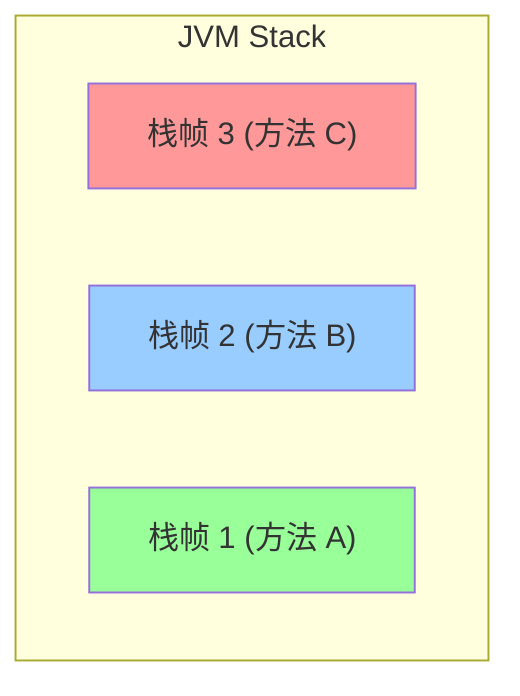
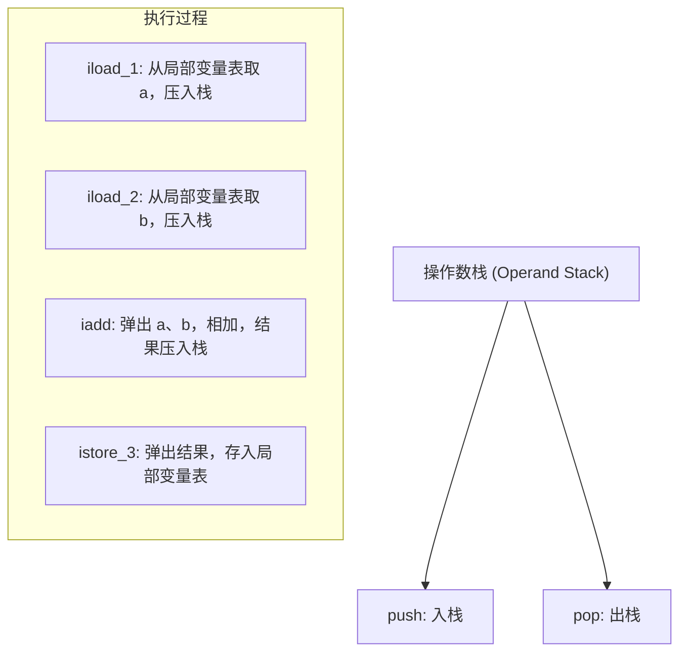

# 栈帧结构深度解析

在写代码的时候，你有没有想过：方法调用时发生了什么？局部变量存在哪里？表达式是怎么计算的？

这些问题都和 JVM 的栈帧有关。很多同学知道"栈"是用来存储方法调用和局部变量的，但问到栈帧的内部结构、局部变量表和操作数栈的具体工作机制，就容易卡壳。

今天我们把这个知识点彻底讲透。

## 一、真实面试场景

候选人小王在面试字节跳动的时候，被问到这样一个问题：

"你能画一下方法调用的栈帧结构吗？"

小王说："栈帧包含局部变量表、操作数栈..."

面试官追问："那局部变量表是怎么组织的？为什么实例方法的局部变量表 index 0 存储的是 this？"

小张开始支支吾吾。

面试官又问："操作数栈是什么？为什么它是 LIFO 结构？"

小张完全答不上来。

【面试官心理】
这道题我用来测试候选人对 JVM 字节码执行机制的深入理解。知道"局部变量表"和"操作数栈"名词的占 60%，能说清楚工作原理的占 30%，能画出栈帧结构图并解释 bytecode 执行的只有 10%。

## 二、栈帧的基本概念

### 2.1 什么是栈帧？

栈帧（Stack Frame）是 JVM 栈的基本单位。每个方法在调用时都会创建一个栈帧，方法执行完成后栈帧被销毁。



### 2.2 栈帧的组成

每个栈帧包含以下部分：

| 组成部分 | 说明 |
|----------|------|
| 局部变量表 | 存储方法参数和局部变量 |
| 操作数栈 | JVM 执行引擎的工作空间 |
| 动态链接 | 指向运行时常量池的引用 |
| 方法返回地址 | 方法正常或异常返回的地址 |

```java
public class StackFrameDemo {
    public static void main(String[] args) {
        int result = add(10, 20);
    }
    
    public static int add(int a, int b) {
        int sum = a + b;
        return sum;
    }
}
```

## 三、局部变量表

### 3.1 基本结构

局部变量表（Local Variable Table）是一个数组，用于存储方法的参数和局部变量。每个槽位（Slot）可以存储一个 32 位的数据类型（如 int、float、reference）。

```java
public class LocalVarDemo {
    // 实例方法：局部变量表
    public void instanceMethod(int p1, String p2) {
        long l1 = 100L;      // 占 2 个 slot (index 3, 4)
        double d1 = 3.14;   // 占 2 个 slot (index 5, 6)
        int i1 = 10;         // 占 1 个 slot (index 7)
    }
}
```

### 3.2 Slot 分配规则

1. **实例方法（非 static）**：index 0 存储的是 `this` 引用
2. **参数**：按照参数表顺序依次存储（index 从 0 或 1 开始）
3. **局部变量**：按照声明顺序依次存储
4. **长类型（long、double）**：占用 2 个连续的 Slot

```java
public class SlotAllocation {
    // 局部变量表布局分析
    public void method(int param1, long param2, double param3, Object param4) {
        int local1 = 1;
        long local2 = 2L;
        double local3 = 3.0;
        
        // 局部变量表索引分配：
        // 0: this (实例方法)
        // 1: param1 (int)
        // 2,3: param2 (long)
        // 4,5: param3 (double)
        // 6: param4 (reference)
        // 7: local1 (int)
        // 8,9: local2 (long)
        // 10,11: local3 (double)
    }
}
```

### 3.3 ❌ 常见错误：混淆索引

```java
public class WrongExample {
    public void wrongExample() {
        // 错误理解：long 只占一个 slot
        long l = 100L;
        // 实际上 long 占 2 个 slot
        // 如果后面声明 int i，它会使用 l 后面可用的 slot
        
        int i = 10;
        // 正确的 slot 分配：
        // slot 0: this
        // slot 1,2: l (long)
        // slot 3: i (int)
    }
}
```

### 3.4 Slot 重用

如果一个局部变量在方法执行过程中已经不再使用，其 slot 可能会被后续的局部变量复用。

```java
public class SlotReuse {
    public void reuseDemo() {
        {
            int a = 10;  // 使用 slot 1
            // a 的作用域结束
        }
        // slot 1 可以被复用
        int b = 20;  // 复用 slot 1
    }
}
```

## 四、操作数栈

### 4.1 什么是操作数栈？

操作数栈（Operand Stack）是一个 LIFO（后进先出）栈，用于字节码指令的操作数。当字节码指令需要操作数时，从操作数栈中弹出；产生结果时，压入操作数栈。



### 4.2 字节码执行示例

```java
public class OperandStackDemo {
    public int calculate(int a, int b) {
        return (a + b) * 2;
    }
}
```

对应的字节码：

```
// 局部变量表布局：
// 0: this
// 1: a
// 2: b

iload_1        // 将局部变量 a (index=1) 压入操作数栈
iload_2        // 将局部变量 b (index=2) 压入操作数栈
iadd           // 弹出栈顶两个值，相加，结果压入栈
iconst_2       // 将常量 2 压入操作数栈
imul           // 弹出栈顶两个值，相乘，结果压入栈
ireturn        // 返回栈顶值
```

执行过程：

```
初始状态：操作数栈为空

iload_1:     [a]           // a 入栈
iload_2:     [a, b]        // b 入栈
iadd:        [a+b]         // 弹出 a、b，压入和
iconst_2:    [a+b, 2]      // 常量 2 入栈
imul:        [(a+b)*2]      // 弹出相乘，压入结果
ireturn:     []            // 返回结果
```

### 4.3 【直观类比】操作数栈的工作方式

想象你在做数学运算时用的草稿纸：

1. 先写下 a 的值
2. 再写下 b 的值
3. 把两个值相加，写下结果
4. 再写下常量 2
5. 把结果和 2 相乘

操作数栈就是 JVM 的"草稿纸"，只不过它是 LIFO 结构，确保运算的顺序正确。

### 4.4 操作数栈深度

操作数栈的最大深度在编译时就已经确定，可以通过 `javap -c` 查看：

```java
public class StackDepth {
    public int maxDepth(int a, int b, int c) {
        return ((a + b) + c) * 2;
    }
}
```

```bash
$ javap -c StackDepth
public int maxDepth(int, int, int);
  descriptor: (III)I
  flags: (0x0000)
  Code:
    stack=3, locals=4, args_size=4  // stack=3 表示最大栈深度为 3
    // ...
```

## 五、动态链接

### 5.1 什么是动态链接？

每个栈帧都包含一个指向**运行时常量池**中该栈帧所属方法的符号引用。动态链接就是将这些符号引用转换为直接引用的过程。

```java
public class DynamicLinkDemo {
    public void doSomething() {
        // 当调用 println 方法时
        // 需要通过动态链接找到 System.out 的引用
        System.out.println("Hello");
    }
}
```

### 5.2 符号引用 vs 直接引用

- **符号引用**：编译时产生的符号，如 `"java/io/PrintStream.println"`
- **直接引用**：运行时确定的内存地址或偏移量

## 六、栈内存相关问题

### 6.1 StackOverflowError

当方法调用层次过深（如无限递归），会导致栈帧数量超过栈的容量，抛出 StackOverflowError。

```java
public class StackOverflowDemo {
    public static void main(String[] args) {
        recursive();
    }
    
    public static void recursive() {
        // 递归调用没有终止条件
        recursive();  // StackOverflowError
    }
}
```

### 6.2 栈大小调优

```bash
# 默认栈大小（取决于平台）
# Linux/x64: 1MB
# Windows: 取决于配置，通常更小

# 设置栈大小为 512KB
java -Xss512k -jar app.jar

# 设置栈大小为 2MB
java -Xss2m -jar app.jar
```

:::tip 💡
递归调用深度受两个因素影响：栈大小和每个栈帧的大小。如果 `-Xss` 设置过小，递归深度就会受限；如果代码中局部变量很多，每个栈帧也会更大。
:::

### 6.3 ❌ 错误示范：递归不设置终止条件

```java
public class BadRecursive {
    public int factorial(int n) {
        // 错误：没有终止条件
        return n * factorial(n - 1);
    }
}
```

正确做法：

```java
public class GoodRecursive {
    public int factorial(int n) {
        // 正确：有终止条件
        if (n <= 1) {
            return 1;
        }
        return n * factorial(n - 1);
    }
}
```

## 七、面试追问链

### 第一层：基础概念

面试官问："什么是栈帧？栈帧由哪些部分组成？"

标准回答：栈帧是 JVM 栈的基本单位，每个方法调用创建一个栈帧。栈帧由局部变量表、操作数栈、动态链接、方法返回地址四部分组成。

### 第二层：局部变量表

面试官追问："局部变量表是怎么组织的？为什么实例方法 index 0 存储 this？"

需要说明：局部变量表是一个数组，每个 slot 存储一个 32 位数据。实例方法 index 0 存储 this 是因为需要让方法能访问当前对象实例。

### 第三层：操作数栈

面试官追问："操作数栈是什么？为什么是 LIFO 结构？"

需要说明：操作数栈是字节码执行引擎的工作空间，用于存储操作数和运算结果。LIFO 结构保证了运算顺序的正确性。

### 第四层：实际应用

面试官追问："你了解过字节码吗？能分析一段简单代码的字节码吗？"

可以举例说明一个简单方法的字节码执行过程。

【面试官心理】
这道题我用来测试候选人对 JVM 底层机制的理解程度。能说出栈帧组成的占一半，能解释局部变量表和操作数栈工作原理的占 30%，能分析字节码执行的只有 10%。了解栈帧结构对于理解方法调用、性能优化、异常处理都有帮助。

【学习小结】
- 栈帧由四部分组成：局部变量表、操作数栈、动态链接、方法返回地址
- 局部变量表：存储方法参数和局部变量，index 0 是实例方法的 this
- 操作数栈：LIFO 结构，字节码执行引擎的工作空间
- long 和 double 占 2 个 slot
- 栈大小可通过 `-Xss` 参数调整
