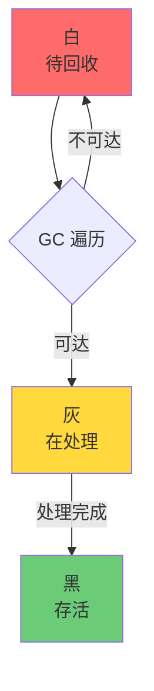

面试官问："ZGC 了解吗？它和 G1 的本质区别是什么？"

候选人小刘说："ZGC 是低延迟收集器，停顿时间很短。G1 是用 Region 分区的。"

面试官追问："ZGC 怎么做到亚毫秒停顿的？染色指针是什么？为什么叫 ZGC？"

小刘说："染色...是不是给对象着色？"

面试官继续追问："ZGC 的读屏障开销是多少？为什么 ZGC 不分代？"

小刘彻底答不上来了。

---

## 一、ZGC 的核心设计 🔴

### 1.1 问题拆解

ZGC（Z Garbage Collector）是 JDK 11 引入的低延迟垃圾收集器，目标是实现亚毫秒级的停顿时间。面试官追问 ZGC，是在测试候选人对"并发 + 染色指针"这一革命性设计的理解深度。

### 1.2 ZGC 的目标

**ZGC 的两大核心目标**：
1. **停顿时间不超过 1ms**（无论堆多大）
2. **停顿时间不随堆大小增长**（停顿时间可预测）

这和 G1 有本质区别：G1 试图在停顿时间和吞吐量之间找平衡，ZGC 则是用更高的并发开销换取更短的停顿。

### 1.3 为什么叫 ZGC？

ZGC 的 "Z" 代表 **Z**ero（零延迟），而非字母表排序。

---

## 二、染色指针（Colored Pointers）🔴

### 2.1 什么是染色指针

染色指针是一种**在指针上存储额外信息**的技术。ZGC 在 64 位指针中用 4 个 bit 存储对象的状态信息：

```
ZGC 指针结构（64位）：

┌────────┬────────────────────────────────────────┐
│ 4 bits │              60 bits                  │
│  颜色   │            实际地址                   │
└────────┴────────────────────────────────────────┘

颜色位含义：
  0br0011 = Finalizable（虚引用，正在被 finalize）
  0br0111 = Remapped（已重定位，非活跃）
  0br1011 = Marked0（标记阶段 0）
  0br1101 = Marked1（标记阶段 1）
```

**关键洞察**：染色指针存储在 **指针本身** 中，不需要额外的对象头空间。

### 2.2 染色指针的优势

**优势一：并发重定位**

CMS 和 G1 的对象移动是"先标记-后移动"，移动期间需要 stop-the-world。ZGC 的染色指针允许对象在**并发期间移动**：

```
ZGC 的并发重定位：
1. 对象还在原位置 → 指针是 Marked 颜色
2. 对象移动到新位置 → 指针是 Remapped 颜色
3. 旧位置存一个 forwarding 指针 → 间接访问
4. 读屏障检查颜色 → 必要时修正
```

**优势二：不需要对象头**

CMS/G1 需要在对象头中记录 GC 状态（Mark Word），对象头的修改需要同步。ZGC 的状态在指针里，读取对象时通过读屏障检查颜色，无需修改对象头。

### 2.3 ❌ 错误示范

**候选人原话**："染色指针是不是把对象涂成不同颜色？"

【面试官心理】
这个候选人根本没理解染色指针的概念。染色不是真的"涂颜色"，而是用指针的**额外 bit 位**存储元信息。这是操作系统层面的技巧，需要理解 CPU 指针结构和地址空间的背景知识。

**候选人原话 2**："ZGC 比 GGC 停顿时间短是因为它更智能。"

面试官追问："那 ZGC 的停顿时间和堆大小有关系吗？"

候选人："...有关系吧？"

能说出"ZGC 的停顿时间与堆大小无关"的候选人，说明他理解了 ZGC 的核心设计：用并发代替 stop-the-world，而不是靠算法更聪明。

---

## 三、ZGC 的并发处理机制 🟡

### 3.1 ZGC 的三色标记

和 CMS、G1 一样，ZGC 也使用三色标记：



**三色标记的问题**：并发标记期间，用户线程可能修改引用关系，导致"漏标"和"错标"。

**ZGC 的解决方案**：使用读屏障 + SATB（Snapshot-At-The-Beginning）。标记开始时对堆做一个快照，并发标记期间，所有"从白到灰"的引用变化都被记录。

### 3.2 ZGC 的 GC 阶段

ZGC 的完整 GC 周期分为多个阶段，大部分阶段并发执行：

| 阶段 | 类型 | STW？ | 说明 |
| --- | --- | --- | --- |
| **Pause Mark Start** | 初始标记 | 是（极短） | 标记 GC Roots 直接引用的对象 |
| **Concurrent Mark** | 并发标记 | 否 | 遍历对象图，标记所有可达对象 |
| **Pause Mark End** | 标记结束 | 是（极短） | 处理 SATB 记录，更新标记 |
| **Concurrent Prepare for Relocate** | 并发预备重分配 | 否 | 计算待回收的 Region，制定回收计划 |
| **Pause Relocate Start** | 重定位开始 | 是（极短） | 移动 GC Roots |
| **Concurrent Relocate** | 并发重定位 | 否 | 逐步移动对象，更新引用 |

**ZGC 的停顿时间来自哪里？**
1. Pause Mark Start（~0.1ms）
2. Pause Mark End（~0.1ms）
3. Pause Relocate Start（~0.1ms）

**总计：通常 < 1ms**，这就是 ZGC "亚毫秒停顿"的秘密。

---

## 四、读屏障的开销 🟡

### 4.1 读屏障的性能影响

读屏障在每次堆引用读取时都会执行：

```java
Object o = someObject.field; // 每次这样的读取，都触发读屏障
```

**ZGC 的读屏障极其精简**：

```assembly
; ZGC 读屏障示例（约 3~5 条 CPU 指令）
mov rax, [rsi+0x10]     ; 加载引用
test rax, 0x7           ; 检查低 3 位颜色位
jnz slow_path            ; 非零则跳转到慢路径（更新指针）
; 快速路径完成：直接返回
```

**实测数据**：
- ZGC 的读屏障开销约为 **0.5%~3%**
- 吞吐量损失比 G1 低约 5%

### 4.2 与 Shenandoah 的对比

Shenandoah（另一个低延迟收集器，也是 JDK 12+）也用染色指针，但实现不同：

| 维度 | ZGC | Shenandoah |
| --- | --- | --- |
| 着色位置 | 指针 | 指针 |
| 读屏障开销 | ~1% | ~5%~10% |
| 并发复制 | 是（并发重定位） | 是 |
| **JDK 支持** | JDK 11+（Oracle） | JDK 12+（RedHat） |
| **堆上限** | 16TB | 2TB |
| **分代** | 不分代 | 不分代 |

---

## 五、ZGC 参数与生产选型 🟡

### 5.1 核心参数

```bash
# 开启 ZGC（JDK 11+）
-XX:+UseZGC

# 核心参数
-Xmx16g              # ZGC 推荐大堆（16GB+）才能发挥优势
-XX:MaxGCPauseMillis=1   # 目标停顿时间（ZGC 的硬目标）
-XX:ConcGCThreads=4      # 并发 GC 线程数（默认 = CPU/8）
-XX:ZCollectionInterval=120  # GC 间隔（秒）
```

### 5.2 何时选 ZGC

```
何时选 ZGC：
  - 堆内存 > 8GB
  - 对停顿时间有严格要求（< 1ms）
  - 应用是长连接/实时系统
  - JDK 11+（生产推荐 JDK 17+）

何时不用 ZGC：
  - 堆内存很小（< 4GB）
  - 吞吐量优先（批处理）
  - JDK 8
```

:::tip 💡
ZGC 不分代！这是它和 G1 的本质区别。ZGC 用"颜色"和"并发"解决问题，而不是分代。代价是：对于大量短命对象的场景，ZGC 的吞吐量可能不如 G1。但对于低延迟场景，吞吐量的小损失是值得的。
:::

### 5.3 三大低延迟收集器对比

| 维度 | ZGC | G1 | CMS |
| --- | --- | --- | --- |
| **停顿时间** | < 1ms | 200~500ms | 500ms~2s |
| **吞吐量** | 中高 | 高 | 高 |
| **内存碎片** | 无 | 无 | 有 |
| **并发能力** | 强 | 中 | 中 |
| **JDK 默认** | JDK 17+ | JDK 9+ | JDK 14 后移除 |
| **堆上限** | 16TB | 受限 | 受限 |

【面试官心理】
能说出 ZGC 不分代这个特点的候选人，说明他对 ZGC 的设计原理理解到位了。ZGC 用并发和染色指针代替了分代——这是一个"用时间换空间"的反向工程思维。知道这个区别的候选人在 P7+ 面试中极具竞争力。
