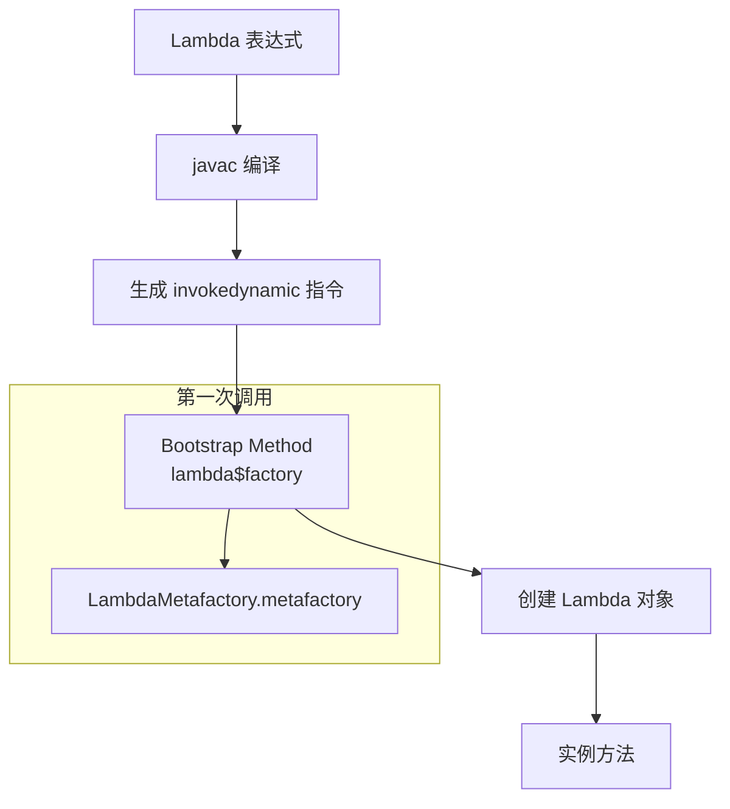

# Lambda 表达式原理

**目标级别**：P6

## 快速自测

面试官问：「Lambda 表达式是如何实现的？为什么 Lambda 比匿名内部类更高效？」

你能回答到第几层？

---

## 一、核心问题

### 🔴 Lambda 表达式是什么？

Lambda 表达式是 Java 8 引入的函数式编程语法糖，简化了函数式接口的实现。

```java
// 匿名内部类
Runnable r1 = new Runnable() {
    @Override
    public void run() {
        System.out.println("Hello");
    }
};

// Lambda 表达式
Runnable r2 = () -> System.out.println("Hello");

// 等价
r1.run();
r2.run();
```

### Lambda 语法

```java
// 无参数
() -> { }

// 单参数
x -> x * 2
(int x) -> x * 2

// 多参数
(x, y) -> x + y
(int x, int y) -> x + y

// 带返回
(x, y) -> {
    int sum = x + y;
    return sum;
}
```

---

## 二、Lambda 实现原理

### invokedynamic 指令

Java 7 引入了 `invokedynamic` 指令，允许运行时决定调用目标。

```java
// 编译后的字节码
// invokedynamic #lambda$0

// Lambda 表达式在第一次调用时才实例化
public static void main(String[] args) {
    Runnable r = () -> System.out.println("Hello");
    r.run();  // 第一次调用时创建 Lambda 对象
}
```

### Lambda .metafactory

```java
// Lambda 的引导方法
CallSite lambdaMetafactory(
    MethodHandles.Lookup caller,      // 调用者
    String invokedName,               // 方法名 (e.g., "run")
    MethodType invokedType,           // 方法类型
    MethodType samMethodType,         // 函数式接口方法类型
    MethodHandle implMethod,          // 实现方法句柄
    MethodType instantiatedMethodType // 实例化后的方法类型
) throws LambdaConversionException
```

### Lambda 转换流程



---

## 三、Lambda vs 匿名内部类

### 字节码对比

```java
// Lambda
Runnable r1 = () -> System.out.println("Lambda");

// 匿名内部类
Runnable r2 = new Runnable() {
    @Override
    public void run() {
        System.out.println("Anonymous");
    }
};
```

### 字节码差异

```java
// Lambda - 使用 invokedynamic
INVOKEDYNAMIC "run" : ()V
  [
    // 引导方法
    invokejava/lang/invoke/LambdaMetafactory.metafactory
  ]

// 匿名内部类 - 实际生成类
NEW InnerClassDemo$1
INVOKESPECIAL InnerClassDemo$1.<init> : ()V
```

### 性能对比

| 维度 | Lambda | 匿名内部类 |
|------|--------|-----------|
| **类加载** | 不生成新类 | 生成新类（.class） |
| **内存** | 更少（无类加载开销） | 每次实例化生成类 |
| **加载时机** | 运行时按需创建 | 编译时确定 |
| **this 引用** | 指向外围类 | 指向匿名内部类本身 |

---

## 四、Lambda 捕获机制

### 无捕获（静态）

```java
// 不捕获任何变量
Runnable r = () -> System.out.println("static");

// 编译后相当于
private static void lambda$0() {
    System.out.println("static");
}
```

### 捕获局部变量（有效 final）

```java
int x = 10;
Runnable r = () -> System.out.println(x);

// 编译后生成额外参数
private static void lambda$0(int x) {
    System.out.println(x);
}

// 调用时传入 x 的值
```

### 捕获实例字段

```java
class Example {
    int value = 10;
    
    Runnable r = () -> System.out.println(value);
    // 相当于: () -> System.out.println(this.value)
}
```

### 捕获规则

```java
// ✅ 有效 final
int x = 10;
Consumer<Integer> c = y -> System.out.println(x + y);

// ❌ 非有效 final（编译错误）
int x = 10;
x = 20;  // 修改后不再是 final
Consumer<Integer> c = y -> System.out.println(x + y);

// ✅ 可以先修改再使用
int x = 10;
Consumer<Integer> c = y -> {
    int tmp = x;  // 先复制
    System.out.println(tmp + y);
};
```

---

## 五、方法引用

### 四种方法引用

```java
// 1. 静态方法引用
Function<String, Integer> parser = Integer::parseInt;

// 2. 实例方法引用（特定对象）
String str = "hello";
Supplier<Integer> len = str::length;

// 3. 实例方法引用（任意对象）
Function<String, String> upper = String::toUpperCase;

// 4. 构造方法引用
Supplier<ArrayList> listFactory = ArrayList::new;
Function<Integer, ArrayList> listWithCap = ArrayList::new;
```

### 方法引用编译

```java
// String::toUpperCase 编译为
// 类型: Function<String, String>
CallSite metafactory(
    MethodHandle implMethod = String.toUpperCase()
)
```

---

## 六、函数式接口

### 常用函数式接口

```java
// Function<T, R> - 转换
Function<String, Integer> f1 = Integer::parseInt;

// Predicate<T> - 断言
Predicate<String> f2 = String::isEmpty;

// Consumer<T> - 消费
Consumer<String> f3 = System.out::println;

// Supplier<T> - 供给
Supplier<List<String>> f4 = ArrayList::new;

// BiFunction<T, U, R> - 接收两个参数
BiFunction<Integer, Integer, Integer> f5 = Integer::sum;

// UnaryOperator<T> - 一元操作
UnaryOperator<Integer> f6 = x -> x * 2;
```

### 原始类型特化

```java
// IntFunction<R>
IntFunction<String[]> arrayFactory = String[]::new;

// IntPredicate
IntPredicate isEven = x -> x % 2 == 0;

// IntUnaryOperator
IntUnaryOperator doubleValue = x -> x * 2;

// ObjIntConsumer<T>
ObjIntConsumer<String> printer = (s, n) -> System.out.println(s + n);
```

---

## 七、面试题精讲

### 🔴 第一层：Lambda 表达式是如何实现的？

> **参考答案**：
>
> Lambda 表达式通过 `invokedynamic` 指令实现：
> 1. 编译时生成 `invokedynamic` 指令和引导方法
> 2. 运行时第一次调用时，通过 `LambdaMetafactory.metafactory` 创建 Lambda 对象
> 3. Lambda 对象是函数式接口的实现，调用时执行实际逻辑

### 🟡 第二层：Lambda 和匿名内部类的区别？

> **参考答案**：
>
> | 维度 | Lambda | 匿名内部类 |
> |------|--------|-----------|
> | **类生成** | 不生成新类 | 生成新的 .class 文件 |
> | **this 指向** | 外围类 | 匿名内部类本身 |
> | **编译方式** | invokedynamic | 常规字节码 |
> | **性能** | 更好（按需创建） | 较差（类加载开销） |

### 🟡 第三层：Lambda 可以捕获哪些变量？

> **参考答案**：
>
> Lambda 可以捕获：
> 1. **有效 final 的局部变量**：变量在捕获后不再修改
> 2. **实例字段**：隐式捕获 `this`
> 3. **静态变量**：不需要捕获
>
> 不能捕获普通局部变量（编译错误）。

### 💡 第四层：Lambda 的优化技术

> **参考答案**：
>
> JVM 对 Lambda 有多种优化：
> 1. **常量折叠**：捕获常量表达式
> 2. **内联优化**：热点 Lambda 可能被 JIT 内联
> 3. **逃逸分析**：如果 Lambda 不逃逸，可能栈上分配

---

## 八、常见错误与陷阱

### ⚠️ 陷阱 1：Lambda 闭包陷阱

```java
// 错误：在循环中创建 Lambda 并引用循环变量
List<Runnable> runners = new ArrayList<>();
for (int i = 0; i < 3; i++) {
    runners.add(() -> System.out.println(i));  // 所有 Lambda 引用同一个 i
}

// 运行结果：3, 3, 3 而不是 0, 1, 2

// 正确：使用临时变量
for (int i = 0; i < 3; i++) {
    int temp = i;  // 捕获临时变量
    runners.add(() -> System.out.println(temp));
}
```

### ⚠️ 陷阱 2：方法引用 vs Lambda

```java
// 方法引用更清晰
list.stream()
    .map(String::toUpperCase)   // 方法引用
    .map(s -> s.toUpperCase())  // Lambda
    .forEach(System.out::println);

// 两者等价，但方法引用：
// - 意图更明确
// - 性能更好（JIT 优化）
```

### ⚠️ 陷阱 3：函数式接口的异常

```java
// Lambda 不能抛出检查异常
Function<String, FileInputStream> f = FileInputStream::new;
// 编译错误：Unhandled exception

// 解决：包装异常
Function<String, FileInputStream> f = path -> {
    try {
        return new FileInputStream(path);
    } catch (FileNotFoundException e) {
        throw new RuntimeException(e);
    }
};
```

---

## 九、对比总结表

| 方法引用 | 语法 | 示例 |
|---------|------|------|
| **静态方法** | `ClassName::method` | `String::valueOf` |
| **实例方法（特定对象）** | `object::method` | `str::length` |
| **实例方法（任意对象）** | `ClassName::method` | `String::toUpperCase` |
| **构造方法** | `ClassName::new` | `ArrayList::new` |

| 维度 | Lambda | 匿名内部类 |
|------|--------|-----------|
| **语法简洁度** | 高 | 低 |
| **类文件生成** | 无 | 有 |
| **编译期处理** | invokedynamic | 常规字节码 |
| **变量捕获** | 有效 final | 无限制 |
| **this 语义** | 外围类 | 自身 |

---

## 十、扩展思考

> **追问**：Lambda 表达式在 JDK 11 有哪些改进？

JDK 11 正式移除了 Java EE 模块，引入了新的语法改进和性能优化。Lambda 的类型推断也有改进。

> **追问**：Lambda 表达式会被 GC 回收吗？

如果 Lambda 对象没有逃逸，可以被 JIT 优化为栈上分配，不需要 GC。如果逃逸了，则由 GC 管理。

---

## 延伸阅读

- [Stream 流操作详解](./stream)
- [Optional 最佳实践](./optional)
- [新日期时间 API](./date-time)
- [接口默认方法](./default-method)
