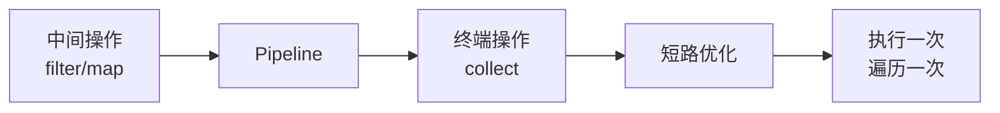
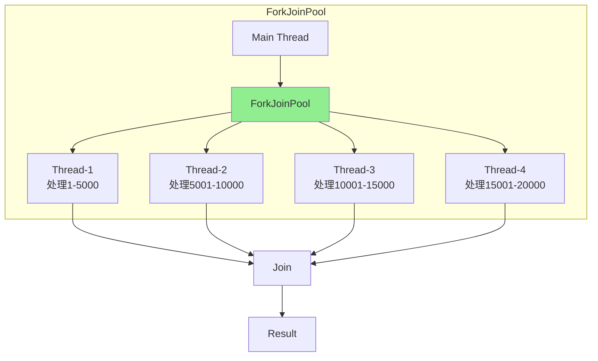

# Stream 流操作

**目标级别**：P6

## 快速自测

面试官问：「Stream 和 Collection 的区别是什么？为什么说 Stream 是延迟执行的？」

你能回答到第几层？

---

## 一、核心问题

### 🔴 Stream 是什么？

Stream 是 Java 8 引入的函数式编程 API，用于处理集合数据，支持链式操作。

```java
// 传统方式
List<String> names = new ArrayList<>();
for (User user : users) {
    if (user.getAge() > 18) {
        names.add(user.getName());
    }
}

// Stream 方式
List<String> names = users.stream()
    .filter(u -> u.getAge() > 18)
    .map(User::getName)
    .collect(Collectors.toList());
```

### Stream vs Collection

| 维度 | Collection | Stream |
|------|------------|--------|
| **存储** | 存储元素 | 不存储，只计算 |
| **操作** | 主动遍历（for-each） | 声明式（filter/map） |
| **遍历次数** | 多次 | 单次 |
| **执行时机** | 即时（ eager） | 延迟（lazy） |
| **并行** | 手动并行 | 自动并行（parallelStream） |

---

## 二、Stream 创建

### 创建方式

```java
// 1. 从 Collection 创建
List<String> list = Arrays.asList("a", "b", "c");
Stream<String> stream = list.stream();

// 2. 数组
String[] arr = {"a", "b", "c"};
Stream<String> stream1 = Arrays.stream(arr);
Stream<String> stream2 = Stream.of("a", "b", "c");

// 3. 无限流
Stream<Integer> infinite = Stream.iterate(0, n -> n + 2);  // 0, 2, 4...
Stream<Double> random = Stream.generate(Math::random);      // 随机数

// 4. IntStream, LongStream, DoubleStream
IntStream.range(1, 10);  // 1, 2, 3, ..., 9
IntStream.rangeClosed(1, 10);  // 1, 2, 3, ..., 10
```

---

## 三、核心操作

### 中间操作

```java
// filter：过滤
stream.filter(predicate)

// map：转换
stream.map(function)
stream.mapToInt/toLong/toDouble

// flatMap：扁平化
stream.flatMap(mapper)  // [[1,2], [3,4]] -> [1,2,3,4]

// distinct：去重
stream.distinct()

// sorted：排序
stream.sorted()
stream.sorted(comparator)

// limit/skip：截取/跳过
stream.limit(n)
stream.skip(n)

// peek：查看中间状态
stream.peek(consumer)
```

### 终端操作

```java
// 聚合操作
stream.count()       // 计数
stream.max(comparator)  // 最大
stream.min(comparator)  // 最小
stream.sum()         // 求和（IntStream）
stream.average()     // 平均值

// 短路操作
stream.findFirst()   // 第一个
stream.findAny()     // 任意一个
stream.anyMatch(predicate)  // 任意匹配
stream.allMatch(predicate)  // 全部匹配
stream.noneMatch(predicate)  // 都不匹配

// 收集
stream.collect(collector)
stream.toArray()

// 遍历
stream.forEach(consumer)
stream.forEachOrdered(consumer)
```

---

## 四、延迟执行

### 🔴 为什么 Stream 是延迟执行的？

Stream 的中间操作不会立即执行，只有遇到终端操作时才会执行。

```java
Stream<Integer> stream = list.stream()
    .filter(x -> {
        System.out.println("filter: " + x);
        return x > 0;
    })
    .map(x -> {
        System.out.println("map: " + x);
        return x * 2;
    });

// 此时不会输出任何内容！
// 还没有终端操作

stream.forEach(System.out::println);  // 开始执行
```

### 执行流程图



### 短路操作

```java
// findFirst 短路
list.stream()
    .filter(x -> x > 100)  // 找到第一个就停止
    .findFirst();

// allMatch 短路
users.stream()
    .allMatch(u -> u.getAge() > 18);  // 遇到 false 就停止
```

---

## 五、并行流

### 使用方式

```java
// 并行流
list.parallelStream()

// 或
stream.parallel()

// 串行流
stream.sequential()
```

### Fork/Join 框架



### 并行 vs 串行

| 维度 | parallelStream | stream |
|------|---------------|--------|
| **线程** | ForkJoinPool | 主线程 |
| **适用场景** | 大数据量、CPU 密集 | 小数据量、I/O |
| **性能** | 大数据量更快 | 小数据量更快 |
| **有序性** | 可能无序（unordered） | 有序 |

### 注意事项

```java
// 1. 并行流可能改变顺序
list.parallelStream()
    .forEach(System.out::println);  // 无序

list.parallelStream()
    .forEachOrdered(System.out::println);  // 有序但失去并行优势

// 2. 有状态操作不适合并行
// skip/limit 在大数据量时可能有问题
// distinct/sorted 是有状态的

// 3. 避免副作用
// 正确：使用 collect
List<String> result = list.parallelStream()
    .filter(...)
    .collect(Collectors.toList());

// 错误：使用外部变量
List<String> result = new ArrayList<>();  // 线程不安全！
list.parallelStream()
    .filter(...)
    .forEach(result::add);  // 可能出错
```

---

## 六、收集器

### 常用收集器

```java
// toList/toSet/toCollection
stream.collect(Collectors.toList())
stream.collect(Collectors.toSet())
stream.collect(Collectors.toCollection(ArrayList::new))

// counting/summingInt/averagingInt
long count = stream.collect(Collectors.counting())
int sum = stream.collect(Collectors.summingInt(User::getAge))

// joining
String names = stream.map(User::getName)
    .collect(Collectors.joining(", "))

// groupingBy
Map<String, List<User>> byCity = stream
    .collect(Collectors.groupingBy(User::getCity))

// partitioningBy
Map<Boolean, List<User>> byAge = stream
    .collect(Collectors.partitioningBy(u -> u.getAge() > 18))

// collectingAndThen
Integer count = stream.collect(
    Collectors.collectingAndThen(
        Collectors.counting(),
        Long::intValue
    )
)

// mapping
Map<String, Set<String>> namesByCity = stream
    .collect(Collectors.groupingBy(
        User::getCity,
        Collectors.mapping(User::getName, Collectors.toSet())
    ))
```

### 自定义收集器

```java
Collector<User, StringJoiner, String> nameCollector = 
    Collector.of(
        () -> new StringJoiner(", "),  // supplier
        (j, u) -> j.add(u.getName()), // accumulator
        (j1, j2) -> j1.merge(j2),     // combiner
        StringJoiner::toString          // finisher
    );

String names = users.stream().collect(nameCollector);
```

---

## 七、面试题精讲

### 🔴 第一层：Stream 和 Collection 的区别？

> **参考答案**：
>
> | 维度 | Collection | Stream |
> |------|------------|--------|
> | **存储** | 存储元素 | 不存储，只计算 |
> | **遍历** | for-each，可多次 | 只能一次 |
> | **执行** | 即时 | 延迟 |
> | **目的** | 操作数据 | 计算数据 |

### 🟡 第二层：为什么说 Stream 是延迟执行的？

> **参考答案**：
>
> Stream 的中间操作不会立即执行，只会构建操作管道。只有遇到终端操作时，才会触发整个管道的执行。这种设计：
> 1. 允许短路优化（如 findFirst 找到就停止）
> 2. 减少不必要的计算
> 3. 支持无限流

### 🟡 第三层：parallelStream 的注意事项？

> **参考答案**：
>
> 1. **数据量小不开并行**：线程创建和切换开销可能抵消收益
> 2. **有状态操作慎用**：distinct、sorted 等有状态操作在并行时需要全局同步
> 3. **避免副作用**：不要在并行流中使用共享变量
> 4. **顺序可能改变**：forEach 不保证顺序，用 forEachOrdered

---

## 八、常见错误与陷阱

### ⚠️ 陷阱 1：Stream 被重复使用

```java
Stream<String> stream = list.stream();
stream.forEach(System.out::println);
stream.forEach(System.out::println);  // 异常：流已关闭
```

### ⚠️ 陷阱 2：filter 后忘记 map

```java
// 错误：filter 返回的是 User 对象，不是名字
list.stream()
    .filter(u -> u.getAge() > 18)
    .forEach(System.out::println);  // 打印的是 User

// 正确
list.stream()
    .filter(u -> u.getAge() > 18)
    .map(User::getName)
    .forEach(System.out::println);
```

### ⚠️ 陷阱 3：无限流没有终端操作

```java
// 无限流没有终端操作会无限循环
Stream.iterate(0, i -> i + 1)
    .filter(x -> x > 0)
    .map(x -> x * 2);
    // 没有终端操作，不会停止

// 正确
Stream.iterate(0, i -> i + 1)
    .limit(100)
    .forEach(System.out::println);
```

---

## 延伸阅读

- [Lambda 表达式原理](../new-features/lambda)
- [Optional 最佳实践](../new-features/optional)
- [新日期时间 API](../new-features/date-time)
- [Fork/Join 框架](../concurrent/fork-join)
