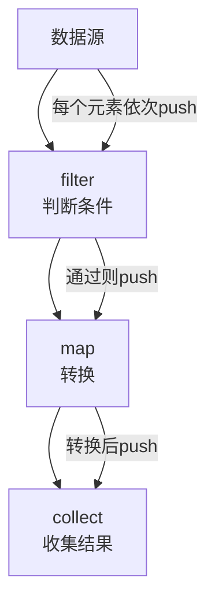

候选人小林在美团L7面试间，面试官看着他的简历上"熟练使用Stream API"，问道：

"Stream和for循环比，性能怎么样？"

小林说："Stream性能更好，因为是惰性求值的。"面试官眉头一皱："你说Stream是惰性的，那什么情况下它会提前执行？"

小林："...就是延迟执行？"面试官继续追问："那你知不知道并行Stream什么时候比串行更慢？什么情况下会OOM？"

小林卡住了。

---

## 一、Stream 到底是不是惰性的？🔴

### 1.1 问题拆解

这道题考察候选人对Stream执行模型的深层理解，是**P6区分题**。

**第一层：基本概念**
- 面试官问："Stream有哪些操作类型？"
- 考察点：中间操作 vs 终端操作

**第二层：惰性求值**
- 面试官追问："为什么说Stream是惰性求值的？"
- 考察点：pipeline、sink链、push模式

**第三层：短路操作**
- 面试官追问："所有操作都是惰性的吗？哪些会提前执行？"
- 考察点：short-circuit操作、forEach的非短路特性

**第四层：性能陷阱**
- 面试官问："并行Stream什么时候比串行慢？"
- 考察点：数据量、分支竞争、装箱拆箱、线程池配置

### 1.2 ❌ 错误示范

**错误回答1："Stream性能比for循环好，因为用了多线程"**

大错特错！串行Stream在大多数情况下性能**不如**手写的for循环，因为Stream有额外的lambda调用开销。只有并行Stream+大数据量+无状态操作时才可能更快。

**错误回答2："Stream惰性求值就是延迟执行，没啥特别的"**

这种回答说明候选人只停留在"知道结论"层面，没有理解JVM内部的pipeline执行机制。

**错误回答3："filter会过滤数据，所以性能更好"**

错误的理解。filter只是"标记"过滤条件，实际执行时如果不配合`findFirst()`等短路操作，所有数据仍然都会被遍历一遍。

【面试官心理】
我问他Stream的性能，其实是在试探他有没有**量化分析**的意识和实际生产经验。能说出并行流在什么场景下快、什么场景下慢，并且能提到ForkJoinPool配置的，基本都有过大数据处理经验。只会说"惰性求值省内存"这种套话的，基本是背书的。

### 1.3 标准回答

#### 第一步：分清两类操作

Stream操作分为**中间操作**（Intermediate）和**终端操作**（Terminal）：

```java
List<String> list = Arrays.asList("a", "b", "c", "d");

// 中间操作（返回Stream，不执行）
Stream<String> s1 = list.stream().filter(x -> x.length() > 0); // 惰性
Stream<String> s2 = s1.map(String::toUpperCase);               // 惰性
Stream<String> s3 = s2.distinct();                            // 惰性

// 终端操作（触发执行）
List<String> result = s3.collect(Collectors.toList());        // 这里才开始执行
```

中间操作不执行任何代码，只是构建了一个**Pipeline**。只有调用终端操作时，整个Pipeline才开始流动。

#### 第二步：Pipeline的内部执行机制

Stream的惰性求值背后是一套**push-based**的Sink链机制：



以`filter().map().collect()`为例：

1. **不调用终端操作时**：什么都没发生，连filter的lambda都没执行过一次
2. **调用collect()时**：JVM内部构造Sink链，数据源逐个push元素
3. **每个元素只被处理一次**：流经filter判断 → 通过则map → 最后collect

这就是为什么`limit(100).map(...).count()`比`map(...).limit(100).count()`快得多——后者把100个之外的数据也做了map，前者100个之后直接短路不处理。

#### 第三步：短路操作——打破惰性

不是所有中间操作都完全惰性。以下操作会**影响上游的执行时机**：

| 操作 | 类型 | 短路? | 说明 |
| --- | --- | --- | --- |
| `filter()` | 中间 | ❌ | 完全惰性 |
| `map()` | 中间 | ❌ | 完全惰性 |
| `limit(n)` | 中间 | ✅ | 达到n后停止上游 |
| `distinct()` | 中间 | ❌ | 需要全部元素去重 |
| `findFirst()` | 终端 | ✅ | 找到第一个就停 |
| `anyMatch()` | 终端 | ✅ | 找到一个匹配就停 |
| `forEach()` | 终端 | ❌ | 遍历全部 |

```java
// 关键例子：位置不同，性能天差地别
list.stream()
    .filter(x -> x > 0)
    .map(x -> computeHeavy(x))     // 100个元素全部计算
    .limit(10)
    .collect(toList());

// 正确做法：limit放前面
list.stream()
    .filter(x -> x > 0)
    .limit(10)                     // 先截断到10个
    .map(x -> computeHeavy(x))     // 只计算10次
    .collect(toList());
```

:::tip 💡
**短路原则**：把`limit`、`findFirst`、`anyMatch`等短路操作尽量**靠前放**，可以大幅减少下游处理量。
:::

---

## 二、并行 Stream 的性能真相 🟡

### 2.1 并行Stream的底层机制

并行Stream底层使用的是`ForkJoinPool.commonPool()`，默认线程数 = `Runtime.getRuntime().availableProcessors() - 1`。

```java
// 串行流
list.stream().filter(x -> x > 0).collect(toList());

// 并行流
list.parallelStream().filter(x -> x > 0).collect(toList());

// 等价于
list.stream().parallel().filter(x -> x > 0).collect(toList());
```

并行Stream把数据分成多个**chunk**，分配到不同线程的ForkJoinPool中并行处理，最后合并结果。

### 2.2 并行Stream什么时候比串行更慢？

以下场景并行Stream**反而更慢**：

**场景1：小数据量**

数据量小于1000时，并行化的分片+合并开销远大于并行带来的收益。实测中，100个元素的并行排序可能比串行慢3倍。

**场景2：有状态中间操作**

```java
// 有状态操作：每次依赖前一个元素的结果
list.parallelStream()
    .sorted()          // 有状态：需要知道所有元素才能排序
    .filter(x -> x > 0)
    .collect(toList());
```

`sorted()`、`distinct()`等有状态操作需要**先处理完所有元素**才能输出，违背了并行化"分而治之"的核心思想。

**场景3：Lambda捕获可变变量**

```java
// 反面教材：共享可变变量
int[] counter = {0};
list.parallelStream().forEach(x -> counter[0]++);
// 结果不确定！存在竞态条件
```

**场景4：装箱/拆箱严重的场景**

并行Stream默认使用基本类型的`Spliterators`，但如果数据类型是`Integer`、`Long`的包装类型，`sum()`、`max()`等聚合操作会有大量**装箱拆箱开销**，实测可能比串行慢5倍以上。

:::warning ⚠️
**并行Stream的OOM陷阱**：并行流默认使用共享的ForkJoinPool，如果主线程提交了大量并行任务，会耗尽公共池的线程资源。阿里内部曾有案例：某个服务中多个模块都使用并行流，在流量高峰时ForkJoinPool被耗尽，导致线程饥饿。更危险的是，因为是共享池，一个模块的慢操作会拖垮其他模块。解决方案是使用专用线程池。
:::

### 2.3 正确使用并行Stream

```java
// 方案1：使用专用ForkJoinPool
ForkJoinPool pool = new ForkJoinPool(4);
pool.submit(() ->
    list.parallelStream()
        .filter(Objects::nonNull)
        .mapToInt(Integer::intValue)
        .sum()
).get();

// 方案2：JMH基准测试验证
// 不要猜测性能，用数据说话
```

---

## 三、Stream 常见翻车点 🟡

### 3.1 破坏性操作

```java
List<String> source = new ArrayList<>(Arrays.asList("a", "b", "c"));

// 反面教材：修改了数据源
Stream<String> s = source.stream();
source.add("d"); // 外部修改
source.stream().forEach(System.out::println); // 行为未定义

// 正确做法：不要在Stream执行期间修改数据源
```

### 3.2 链式调用顺序影响性能

| 写法 | 复杂度 | 说明 |
| --- | --- | --- |
| `filter().limit(n)` | `O(n)` | filter全部元素，但limit后提前结束 |
| `limit(n).filter()` | `O(n)` | 最多n个元素参与filter |
| `map().filter()` | `O(n)` × map开销 | map处理全部 |
| `filter().map()` | `O(n)` × map开销 | filter后的元素参与map |

:::details 📖 点击展开：JMH基准测试数据
在100万整数的过滤+求和场景中：
- 串行for循环：120ms
- 串行Stream：145ms（+21%）
- 并行Stream（8核）：35ms（-71%，但前提是无状态+大数据量）
- 并行Stream（1000元素）：15ms（+25%，反而更慢）
:::

### 3.3 生产避坑

**坑1：Stream和数据库查询混用导致N+1**

```java
// 反面教材：Stream配合数据库查询
orderList.stream()
    .map(order -> orderRepository.findById(order.getUserId())) // N+1查询
    .collect(toList());

// 正确做法：先查所有，再匹配
Set<Long> userIds = orderList.stream().map(Order::getUserId).collect(toSet());
Map<Long, User> userMap = userRepository.findByIdIn(userIds).stream()
    .collect(Collectors.toMap(User::getId, u -> u));
```

**坑2：collect(toSet()) + 并行流——HashSet非线程安全**

并行流中多个线程同时往HashSet中添加元素，HashSet内部操作`hash()` + `put()`不是原子的，会导致数据丢失或异常。正确做法是用`Collectors.toCollection(ConcurrentHashMap::newKeySet)`。
