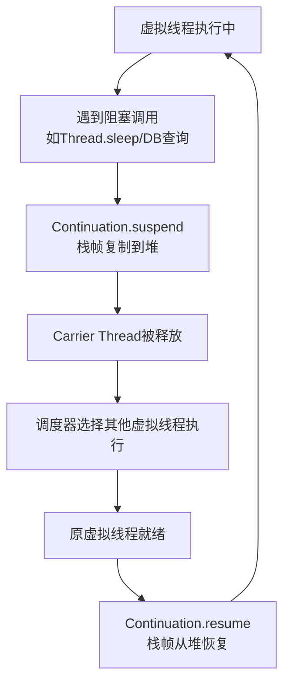

候选人老张在阿里P8面试间，面试官问：

"Java 21的虚拟线程你了解吗？它和传统线程有什么区别？"

老张说："虚拟线程是Project Loom的产物，比传统线程轻量，可以创建几百万个。"面试官点点头追问："那虚拟线程的挂起和恢复是怎么实现的？它的调度器是什么？"

老张："...是用Continuation实现的？"面试官继续："虚拟线程和协程有什么关系？和Go的goroutine比呢？"

老张没答全。

## 一、虚拟线程到底是什么？🔴

### 1.1 问题拆解

虚拟线程是Java 21的**里程碑特性**，是继Lambda之后Java最重要的并发模型变革。这道题是**P7/P8深度题**，考察候选人对JVM底层机制和现代并发模型的理解。

**第一层：设计动机**
- 面试官问："为什么需要虚拟线程？传统线程有什么问题？"
- 考察点：线程饥饿、JVM线程模型、1:1映射问题

**第二层：底层机制**
- 面试官追问："虚拟线程的挂起和恢复是怎么实现的？Continuation是什么？"
- 考察点：Stack Walks、JVM内部机制

**第三层：调度模型**
- 面试官继续问："虚拟线程的调度器是什么？怎么决定哪个虚拟线程运行在哪个CPU上？"
- 考察点：ForkJoinPool、工作窃取

**第四层：平台线程对比**
- 面试官问："虚拟线程和平台线程的关系是什么？可以同时用吗？"
- 考察点：1:1 vs M:N模型

### 1.2 ❌ 错误示范

**错误回答1："虚拟线程就是更轻量的线程，可以创建几百万个"**

这个回答只说对了表象。更重要的是：**虚拟线程的轻量性来自挂起机制**——当虚拟线程阻塞时，它会**释放Carrier Thread**，让其他虚拟线程使用。这意味着同一个Carrier Thread可以运行多个虚拟线程。

**错误回答2："虚拟线程解决了所有并发问题"**

虚拟线程只解决**I/O密集型**场景的线程饥饿问题。对于**CPU密集型**任务，传统线程+多核并行仍然是最佳选择。

**错误回答3："虚拟线程和goroutine完全一样"**

有相似之处，但实现机制不同。Go使用M:N调度（多个goroutine映射到少量系统线程），Java虚拟线程使用**工作窃取ForkJoinPool**调度，Carrier Thread数量默认等于CPU核数。

【面试官心理】
虚拟线程是Java 21的重量级特性，问这道题的面试官通常是想试探候选人对Java并发模型演进的深层理解。能说清Continuation机制的占10%，能说清Carrier Thread和工作窃取调度的占5%，能说出生产避坑点的几乎没有——因为虚拟线程生产实践还在早期探索阶段。

### 1.3 标准回答

#### 第一步：传统线程的问题——线程饥饿

```java
// 传统线程模型：1:1映射
Thread t1 = new Thread(() -> blockingIo());
Thread t2 = new Thread(() -> blockingIo());
Thread t3 = new Thread(() -> blockingIo());
// 每个线程占用~1MB栈空间
// 每个线程对应一个OS线程
// 如果有10000个I/O请求，就需要10000个线程
// 大多数时间线程在等待I/O，CPU空闲
// JVM线程成为瓶颈
```

关键问题：
- **内存开销**：每个平台线程~1MB栈空间，10000线程≈10GB内存
- **上下文切换**：OS线程切换成本高
- **线程饥饿**：线程数受限于系统资源，无法应对高并发I/O

#### 第二步：虚拟线程的核心——挂起机制

```java
// 虚拟线程的创建（Java 21+）
Thread vt = Thread.startVirtualThread(() -> {
    blockingIo(); // 阻塞时自动挂起
});

// 或者
try (VirtualThread vt = Thread.ofVirtual().start(() -> {
    blockingIo();
})) {
    // ...
}
```

虚拟线程的关键特性：**阻塞时挂起，释放Carrier Thread**。

```
传统线程模型（1:1）：
  虚拟线程A → OS线程1（阻塞时OS线程1也阻塞）
  虚拟线程B → OS线程2（等待）
  虚拟线程C → OS线程3（等待）
  ...

虚拟线程模型（M:N）：
  虚拟线程A ─┐
  虚拟线程B ─┼─→ Carrier线程池（数量=CUP核数）
  虚拟线程C ─┘   虚拟线程A阻塞时 → 挂起，Carrier线程调度虚拟线程B
              虚拟线程A就绪时   → 恢复，继续执行
```

**Carrier Thread**是承载虚拟线程执行的平台线程，它们来自`ForkJoinPool.commonPool()`（默认大小=`Runtime.availableProcessors()`）。

#### 第三步：Continuation——挂起的底层机制

虚拟线程的挂起依赖于**Continuation**（JDK内部API，非公开），原理是**栈帧复制**：



**Continuation的核心思想**：
- 挂起时：当前线程的栈帧被**序列化**到堆中
- 恢复时：栈帧从堆中**反序列化**回线程栈
- 挂起点是有**协作性的**——必须在安全点挂起（如I/O调用点）

:::tip 💡
**为什么不使用抢占式挂起？** 因为栈帧复制需要知道"在哪里切"。如果在线程执行中间任意时刻中断，栈帧状态是不一致的。Java虚拟线程依赖JVM的**Stack Walking**机制，在安全点（safepoint）挂起——类似于GC时的stop-the-world，但范围小得多。
:::

---

## 二、虚拟线程 vs 平台线程 🟡

### 2.1 关键对比

| 维度 | 平台线程 | 虚拟线程 |
| --- | --- | --- |
| 创建成本 | 高（~1MB栈+OS线程） | 极低（几百字节栈） |
| 数量上限 | 受系统资源限制（千级） | 可创建百万级 |
| 阻塞成本 | 高（阻塞OS线程） | 低（挂起，释放Carrier） |
| 调度 | OS调度 | ForkJoinPool工作窃取 |
| 调试 | 与普通线程相同 | 稍有不同（堆栈跟踪） |
| ThreadLocal | 原生支持 | ⚠️ 需用ScopedValue |
| synchronized | ⚠️ 使用系统锁 | ⚠️ 默认仍用系统锁（可pinning问题） |

### 2.2 虚拟线程的调度器

虚拟线程的调度器使用**ForkJoinPool的WORK_STEALING模式**：

```java
// 虚拟线程的调度（简化逻辑）
ForkJoinPool pool = ForkJoinPool.common(); // 默认大小=CPU核数

pool.submit(() -> {
    // 虚拟线程A在此Carrier线程上运行
    Thread.sleep(1000); // 挂起，栈帧复制到堆
    // 虚拟线程A让出Carrier
});

// ForkJoinPool的工作窃取：
// - 每个Carrier线程有自己的双端队列
// - 空闲的线程从其他队列尾部"偷"任务
// - 负载均衡更高效
```

### 2.3 虚拟线程的pinning问题

```java
// 问题：synchronized块会pin住Carrier线程
synchronized(lock) {
    // 虚拟线程在此被pin（钉住）
    // 无法挂起，阻塞时Carrier也被阻塞
    doSomething();
}

// 解决方案1：改用ReentrantLock
lock.lock();
try {
    doSomething();
} finally {
    lock.unlock();
}

// 解决方案2：-Djdk.tracePinnedThreads=true启动JVM
// 解决方案3：使用@Blocked注解标注同步块（实验性）
```

:::warning ⚠️
**Pinning陷阱**：当虚拟线程在`synchronized`块中阻塞时，它会pin住Carrier Thread，阻止其他虚拟线程使用该Carrier。生产中使用`ReentrantLock`替代`synchronized`是最佳实践。
:::

---

## 三、生产避坑 🟡

### 3.1 ThreadLocal的替代方案

```java
// ThreadLocal在虚拟线程中可能导致内存泄漏
// 因为虚拟线程数量巨大，每个线程都有ThreadLocal副本

// Java 21：ScopedValue（替代ThreadLocal）
public class RequestContext {
    private static final ScopedValue<String> USER_ID = ScopedValue.empty();

    public static void main() {
        ScopedValue.where(USER_ID, "user-123", () -> {
            // 在此闭包内可见
            String id = USER_ID.get();
            System.out.println(id);
        });
    }
}
```

### 3.2 虚拟线程不适合的场景

```java
// ❌ CPU密集型任务：用平台线程+并行流
// 虚拟线程的调度器是单核绑定的
long result = IntStream.range(0, 1_000_000)
    .parallel() // ForkJoinPool.commonParallelism
    .sum(); // 仍然需要平台线程执行

// ✅ I/O密集型任务：用虚拟线程
try (var executor = Executors.newVirtualThreadPerTaskExecutor()) {
    IntStream.range(0, 10_000)
        .forEach(i -> executor.submit(() -> httpClient.get(url)));
}
```

### 3.3 ExecutorService配置

```java
// 推荐：每个任务一个虚拟线程
try (var executor = Executors.newVirtualThreadPerTaskExecutor()) {
    List<Future<?>> futures = IntStream.range(0, 10000)
        .mapToObj(i -> executor.submit(() -> blockingIo()))
        .toList();
}

// 避免：固定数量虚拟线程的线程池
// 虚拟线程的优势在于数量，固定池大小等于没发挥优势
Executors.newFixedThreadPool(100); // ❌ 不适合虚拟线程
```

---

## 四、虚拟线程 vs 其他协程实现 🟢

### 4.1 对比Go goroutine

| 特性 | Java虚拟线程 | Go goroutine |
| --- | --- | --- |
| 调度模型 | ForkJoinPool WORK_STEALING | GMP模型（Go调度器） |
| 栈管理 | 动态增长/缩小（2KB初始） | 动态增长/缩小 |
| I/O阻塞处理 | 自动挂起 | 自动调度 |
| Channel | 无（用BlockingQueue） | 有 |
| 抢占式调度 | 部分（safepoint） | 完全抢占（cooperative+preemptive） |
| 成熟度 | Java 21 LTS | Go 1.x成熟 |
| 生态系统 | 新兴 | 成熟 |

### 4.2 选型建议

```
I/O密集型 + 高并发（万级+连接）→ 虚拟线程
CPU密集型 → 平台线程 + ForkJoinPool
混合型 → 混合调度
```
