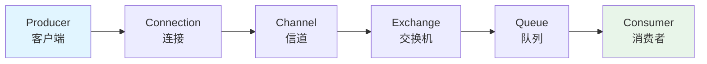

# RabbitMQ 生产者（Producer）核心原理

## 场景切入：为什么你的消息发不出去？

你有没有遇到过这种场景：本地测试好好的消息发送，上了生产环境后莫名其妙丢失？

问题往往不在发送代码本身，而在于你没有理解 RabbitMQ 生产者的核心机制——消息确认、路由规则、发送模式，每一环都有可能导致消息"有去无回"。

## 一、生产者的核心职责

生产者是 RabbitMQ 架构中的数据入口，负责将消息投递到指定的 Exchange。它的工作流程看似简单，实则涉及网络通信、消息序列化和 Broker 确认等多个环节。



一个 Connection（连接）可以包含多个 Channel（信道），这是因为 AMQP 协议推荐在同一个 TCP 连接上复用多个信道来减少建连开销。生产者和消费者各自持有自己的 Channel，不能混用。

---

## 二、生产者连接管理

### 2.1 连接建立流程

```java
// 1. 创建连接工厂
ConnectionFactory factory = new ConnectionFactory();
factory.setHost("127.0.0.1");
factory.setPort(5672);
factory.setUsername("guest");
factory.setPassword("guest");
factory.setVirtualHost("/");

// 2. 建立物理连接（TCP 连接）
Connection connection = factory.newConnection();

// 3. 从连接中创建信道
Channel channel = connection.createChannel();

// 4. 声明交换机（如果不存在则创建）
channel.exchangeDeclare("order-exchange", BuiltinExchangeType.DIRECT, true);

// 5. 发送消息
channel.basicPublish(
    "order-exchange",  // 交换机名
    "order.create",   // routing key
    MessageProperties.PERSISTENT_TEXT_PLAIN,  // 消息属性
    "订单数据".getBytes()  // 消息体
);

// 6. 关闭资源
channel.close();
connection.close();
```

连接建立涉及 TCP 三次握手、TLS 握手（如启用）和 AMQP 协议层握手，是一个相对昂贵的操作。生产环境中通常会使用连接池来复用连接，避免频繁建连带来的性能损耗。

### 2.2 连接池配置

```java
// 使用连接池管理连接
PooledConnectionProvider provider = new PooledConnectionProvider(
    new AbstractConnectionFactory() {
        @Override
        public Connection createConnection() {
            ConnectionFactory factory = new ConnectionFactory();
            factory.setHost("127.0.0.1");
            factory.setPort(5672);
            return factory.newConnection();
        }
    }
);

// 从连接池获取连接
Connection connection = provider.getConnection();
Channel channel = connection.createChannel();
```

---

## 三、消息属性与元数据

RabbitMQ 的消息不仅包含消息体（Body），还包括一系列元数据属性（Properties）。这些属性决定了消息的行为和 Broker 的处理方式。

### 3.1 消息属性一览

```java
AMQP.BasicProperties properties = new AMQP.BasicProperties.Builder()
    .deliveryMode(2)                    // 持久化消息（1=非持久，2=持久）
    .contentType("application/json")    // 内容类型
    .encoding("UTF-8")                  // 编码格式
    .timestamp(new Date())              // 时间戳
    .messageId(UUID.randomUUID().toString())  // 消息唯一标识
    .correlationId("corr-123")          // 关联 ID（用于请求/响应关联）
    .replyTo("callback-queue")          // 回复队列
    .expiration("5000")                // 消息过期时间（毫秒）
    .headers(new Map<String, Object>()) // 自定义头信息
    .priority(5)                       // 优先级（0-9）
    .build();
```

### 3.2 消息属性详解

| 属性 | 说明 | 典型场景 |
|---|---|---|
| `deliveryMode` | 持久化模式，`2` 表示持久化到磁盘 | 所有需要可靠投递的消息 |
| `contentType` | MIME 类型，如 `application/json` | 帮助消费者正确解析消息体 |
| `correlationId` | 关联 ID，用于 RPC 场景关联请求和响应 | RPC 调用、异步回调 |
| `replyTo` | 指定回复队列名 | RPC 响应队列 |
| `expiration` | 消息 TTL，过期后进入死信队列 | 限时任务、延迟处理 |
| `priority` | 消息优先级，`0-9`，需要队列开启优先级支持 | VIP 用户消息优先处理 |

---

## 四、发送模式与路由机制

### 4.1 基础发送模式

```java
// 最基础的发送方式（未指定交换机则使用默认交换机）
channel.basicPublish(
    "",           // 使用默认交换机
    "my-queue",   // routing key 即队列名
    false,        // mandatory（强制路由）
    null,         // properties
    message.getBytes()
);
```

### 4.2 指定交换机发送

RabbitMQ 的核心路由模型是：**交换机 + Binding 规则 + 队列**。生产者不直接发消息到队列，而是发给交换机，由交换机根据路由规则决定将消息投递到哪些队列。

```java
// 声明交换机和队列
channel.exchangeDeclare("order-exchange", BuiltinExchangeType.DIRECT, true);
channel.queueDeclare("order-queue", true, false, false, null);

// 绑定：交换机和队列之间的路由规则
channel.queueBind("order-queue", "order-exchange", "order.created");
channel.queueBind("order-queue", "order-exchange", "order.updated");

// 发送消息到交换机
channel.basicPublish(
    "order-exchange",  // 交换机名
    "order.created",   // routing key（决定路由到哪个队列）
    false,            // mandatory
    null,              // properties
    message.getBytes()
);
```

### 4.3 发送确认（Publisher Confirms）

消息发出去了，Broker 收到了吗？默认情况下，发送方并不知道。这就需要开启 **Publisher Confirms** 机制，让 Broker 明确告知发送方消息是否已经安全落盘。

```java
// 开启发送确认模式
channel.confirmSelect();

// 发送消息
channel.basicPublish("order-exchange", "order.created", null, message);

// 等待 Broker 确认
boolean success = channel.waitForConfirmsOrDie(5000);
System.out.println(success ? "消息发送成功" : "消息发送失败");
```

`waitForConfirmsOrDie()` 是一个阻塞方法，会等待 Broker 返回确认或超时。在高并发场景下，通常使用异步确认模式：

```java
// 异步确认监听器
channel.addConfirmListener(
    // 确认回调：消息已成功写入
    (deliveryTag, multiple) -> {
        System.out.println("消息确认: " + deliveryTag);
    },
    // 拒绝回调：消息写入失败
    (deliveryTag, multiple) -> {
        System.out.println("消息拒绝: " + deliveryTag);
        // 触发重发逻辑
    }
);

// 发送消息（异步确认，无需等待）
channel.basicPublish("order-exchange", "order.created", null, message);
```

### 4.4 强制路由（Mandatory）

`mandatory` 参数控制消息无法路由时的行为。当消息的 routing key 无法匹配任何队列时：

- `mandatory = false`：消息直接丢弃
- `mandatory = true`：消息返还给生产者，触发 Return 事件

```java
// 开启 Return 监听
channel.addReturnListener((replyCode, replyText, exchange, routingKey, properties, body) -> {
    System.out.println("消息无法路由到队列:");
    System.out.println("  ReplyCode: " + replyCode);
    System.out.println("  ReplyText: " + replyText);
    System.out.println("  Exchange: " + exchange);
    System.out.println("  RoutingKey: " + routingKey);
});

// mandatory 必须设为 true 才能收到 Return 事件
channel.basicPublish("order-exchange", "order.unknown", true, null, message.getBytes());
```

---

## 五、消息可靠投递方案

在生产环境中，消息丢失是不可接受的。以下是一个完整的消息可靠投递方案：

```java
public class ReliableProducer {

    private final Channel channel;
    private final String exchange;
    private final ConcurrentNavigableMap<Long, String> pendingConfirms = new ConcurrentSkipListMap<>();

    public ReliableProducer(Channel channel, String exchange) {
        this.channel = channel;
        this.exchange = exchange;
    }

    /**
     * 可靠发送消息：开启事务 + 发送确认 + 重试机制
     */
    public void reliableSend(String routingKey, String message) throws Exception {
        // 1. 开启发送确认
        channel.confirmSelect();

        // 2. 添加确认监听
        channel.addConfirmListener(
            (deliveryTag, multiple) -> {
                // 确认成功：从待确认队列中移除
                if (multiple) {
                    pendingConfirms.headMap(deliveryTag, true).clear();
                } else {
                    pendingConfirms.remove(deliveryTag);
                }
            },
            (deliveryTag, multiple) -> {
                // 确认失败：触发重试
                String failedMessage = pendingConfirms.remove(deliveryTag);
                if (failedMessage != null) {
                    retrySend(routingKey, failedMessage);
                }
            }
        );

        // 3. 记录待确认消息
        long deliveryTag = channel.getNextPublishSeqNo();
        pendingConfirms.put(deliveryTag, message);

        // 4. 发送消息
        channel.basicPublish(
            exchange,
            routingKey,
            MessageProperties.PERSISTENT_TEXT_PLAIN,
            message.getBytes()
        );
    }

    private void retrySend(String routingKey, String message) {
        try {
            Thread.sleep(1000);  // 延迟重试
            reliableSend(routingKey, message);
        } catch (Exception e) {
            // 记录到死信队列或告警
            System.err.println("消息发送重试失败: " + message);
        }
    }
}
```

### 可靠投递的四个关键环节

| 环节 | 保障措施 | 说明 |
|---|---|---|
| 生产者到 Broker | Publisher Confirms | Broker 确认消息已接收 |
| 交换机到队列 | mandatory + Return | 无法路由时得到通知 |
| 队列持久化 | deliveryMode = 2 | 消息写入磁盘 |
| 交换机持久化 | durable = true | 交换机重启不丢失 |

---

## 六、事务模式

RabbitMQ 还提供了事务模式来保证消息发送的原子性，但事务模式性能较差（一条消息会阻塞等待 Broker 处理完成），生产环境中很少使用。

```java
// 开启事务
channel.txSelect();

// 发送消息
channel.basicPublish("order-exchange", "order.created", null, message.getBytes());

// 提交事务
channel.txCommit();
```

开启事务后，每发送一条消息都需要等待 Broker 处理完成（同步等待），吞吐量会下降 2-10 倍。**生产环境推荐使用 Publisher Confirms 代替事务**，在保证可靠性的同时保持较高的吞吐量。

---

## 七、面试追问预判

### 追问一：如何保证消息不丢失？

从生产者角度，需要三个环节配合：
- 开启 `Publisher Confirms`，确保 Broker 收到了消息
- 设置 `mandatory = true`，处理无法路由的情况
- 消息 `deliveryMode = 2`，确保消息持久化到磁盘

### 追问二：事务模式和 Confirm 模式的区别是什么？

| 维度 | 事务模式 | Confirm 模式 |
|---|---|---|
| 性能 | 极差（同步阻塞） | 好（异步确认） |
| 原子性 | 消息发送是原子操作 | 不保证原子性 |
| 使用场景 | 不推荐生产使用 | 推荐生产使用 |
| API | `txSelect/txCommit/txRollback` | `confirmSelect/awaitConfirms` |

### 追问三：Confirm 模式和事务模式可以一起用吗？

技术上可以，但**强烈不推荐**。两者同时使用会产生双重阻塞（事务内每条消息都等 Confirm），性能雪崩。实际选型中，Confirm 模式已经能满足绝大多数可靠性需求。
