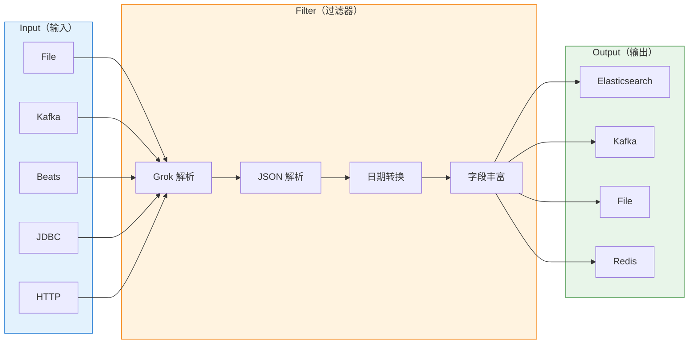
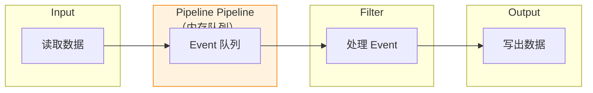

# Logstash 工作流程：Input → Filter → Output 管道模型

## 场景切入：一条日志从产生到入库，经历了什么？

你的 Java 应用产生了一条业务日志——`2024-01-15 10:23:45 ERROR order-service - 订单创建失败，订单号: ORDER123456`。

这条日志从应用代码 `log.info()` 到最终出现在 Kibana 仪表盘上，中间经历了什么？Logstash 在这条数据流中扮演了什么角色？

答案藏在 Logstash 的 **Input → Filter → Output** 管道模型中。

## 一、三阶段管道模型

Logstash 的数据处理流程分为三个阶段，数据像水一样从管道的一端流入，依次经过各阶段的处理器，最终从输出端流出。



### 三个阶段的核心职责

| 阶段 | 职责 | 关键词 |
|---|---|---|
| **Input** | 数据采集：从各种来源读取数据 | 文件、消息队列、数据库、网络 |
| **Filter** | 数据处理：解析、转换、丰富、过滤 | Grok、JSON、Date、Mutate |
| **Output** | 数据输出：将处理后的数据发送到目的地 | ES、Kafka、File |

---

## 二、事件对象（Event）

在 Logstash 中，每条数据都被封装为一个 **Event** 对象。Logstash 8.x 之后引入了 CAS（Cross-Pack Abstraction）支持，同时兼容 Logstash 7.x 的 `LogStash::Event` 和新的 `Hash`（Ruby Hash）结构。

### 2.1 Event 结构

```json
{
  "@timestamp": "2024-01-15T10:23:45.000Z",
  "@version": "1",
  "message": "订单创建失败，订单号: ORDER123456",
  "host": "192.168.1.100",
  "path": "/var/log/order-service/app.log",
  "level": "ERROR",
  "service": "order-service",
  "traceId": "abc123",
  "orderId": "ORDER123456"
}
```

Event 由两部分组成：
- **元数据字段**：以 `@` 开头的字段，如 `@timestamp`（日志时间）、`@version`（版本号）
- **自定义字段**：业务定义的字段，如 `level`、`service`、`orderId`

### 2.2 Event 操作

```ruby
# 在 filter 中操作 event
filter {
  # 访问字段
  if [level] == "ERROR" {
    # 添加字段
    mutate {
      add_field => { "alert" => "true" }
    }
    # 删除字段
    mutate {
      remove_field => ["password", "token"]
    }
  }
}
```

---

## 三、Input 阶段详解

### 3.1 常用 Input 插件

| 插件 | 说明 | 适用场景 |
|---|---|---|
| **file** | 监听文件变化，读取新行 | 日志文件 |
| **beats** | 接收来自 Filebeat、Metricbeat 的数据 | 配合 Beats 使用 |
| **kafka** | 从 Kafka 消费消息 | Kafka 数据同步 |
| **jdbc** | 轮询数据库查询结果 | 数据库同步 |
| **http** | 接收 HTTP POST 数据 | Webhook 接入 |
| **tcp** | 接收 TCP 数据流 | 自定义应用接入 |

### 3.2 File Input 详解

```conf
input {
  file {
    # 日志文件路径（支持通配符）
    path => "/var/log/**/*.log"

    # 扫描间隔（秒）
    sincedb_write_interval => 3

    # 编码格式
    codec => json

    # 起始位置（beginning 从头开始，end 从最新开始）
    start_position => "end"

    # 是否跟踪符号链接
    follow_symlinks => false

    # 文件多久没更新视为结束（秒）
    close_older => 3600

    # 添加文件路径为字段
    add_field => { "log_source" => "app-log" }
  }
}
```

### 3.3 Kafka Input 详解

```conf
input {
  kafka {
    # Kafka 连接地址
    bootstrap_servers => "kafka1:9092,kafka2:9092"

    # 消费组 ID
    group_id => "logstash-consumer-group"

    # 订阅的 Topic
    topics => ["app-log", "access-log"]

    # 从哪里开始消费
    auto_offset_reset => "latest"

    # 消费者线程数
    consumer_threads => 4

    # 编解码器
    codec => json

    # 消费者安全协议
    security_protocol => "PLAINTEXT"
  }
}
```

### 3.4 JDBC Input 详解

```conf
input {
  jdbc {
    # JDBC 连接串
    jdbc_connection_string => "jdbc:mysql://mysql:3306/orders"

    # 数据库账号密码
    jdbc_user => "logstash"
    jdbc_password => "password"

    # JDBC 驱动路径
    jdbc_driver_library => "/usr/share/logstash/mysql-connector-java.jar"
    jdbc_driver_class => "com.mysql.cj.jdbc.Driver"

    # SQL 查询语句
    statement => "SELECT * FROM orders WHERE update_time > :sql_last_value"

    # 定时执行（cron 表达式）
    schedule => "*/5 * * * *"

    # 使用时间戳列追踪增量
    use_column_value => true
    tracking_column => "update_time"
    tracking_column_type => "timestamp"

    # 持久化游标到文件
    last_run_metadata_path => "/usr/share/logstash/data/jdbc_last_run"
  }
}
```

---

## 四、Filter 阶段详解

Filter 是 Logstash 最强大的阶段，通过一系列插件对数据进行解析、转换、过滤和丰富。

### 4.1 Grok 正则解析

Grok 是 Logstash 最核心的解析插件，通过预定义的 pattern 组合将非结构化日志解析为结构化字段。

```conf
filter {
  grok {
    # 匹配 Apache 访问日志
    match => {
      "message" => '%{IP:client_ip} %{USER:ident} %{USER:auth} \[%{HTTPDATE:timestamp}\] "%{WORD:method} %{URIPATHPARAM:request} HTTP/%{NUMBER:http_version}" %{NUMBER:status:int} %{NUMBER:bytes:int} "%{GREEDYDATA:referrer}" "%{GREEDYDATA:user_agent}"'
    }

    # 如果匹配失败怎么办
    tag_on_failure => ["_grokparsefailure"]

    # 覆盖默认时间戳
    overwrite => ["message"]
  }
}
```

Grok 内置了大量预定义 pattern：

| Pattern | 说明 | 示例 |
|---|---|---|
| `%{IP}` | IP 地址 | 192.168.1.1 |
| `%{NUMBER}` | 数字 | 404 |
| `%{WORD}` | 单词 | GET |
| `%{URIPATHPARAM}` | URI 路径和参数 | `/api/users?id=1` |
| `%{HTTPDATE}` | HTTP 日期格式 | `15/Jan/2024:10:23:45 +0000` |
| `%{GREEDYDATA}` | 贪婪匹配任意字符 | `"Mozilla/5.0..."` |

### 4.2 JSON 解析

如果日志本身就是 JSON 格式，直接用 JSON 插件解析：

```conf
filter {
  json {
    # 要解析的字段
    source => "message"

    # 解析结果放到哪个字段
    target => "parsed"

    # 解析失败时执行
    skip_on_invalid_json => true
  }
}
```

解析后，原来的 JSON 字符串被展开为独立字段：

```
原始 message: {"orderId":"ORDER123","amount":99.9,"status":"paid"}
解析后:
  parsed.orderId = "ORDER123"
  parsed.amount = 99.9
  parsed.status = "paid"
```

### 4.3 Date 日期转换

Logstash 默认使用 `@timestamp` 为当前处理时间，但日志中的时间戳才是真正的业务时间：

```conf
filter {
  date {
    # 匹配哪些字段
    match => ["timestamp", "logTime", "createTime"]

    # 时间格式（与 Java SimpleDateFormat 一致）
    format => [
      "yyyy-MM-dd HH:mm:ss",
      "ISO8601",
      "dd/MMM/yyyy:HH:mm:ss Z"
    ]

    # 目标字段（覆盖默认的 @timestamp）
    target => "@timestamp"

    # 时区
    timezone => "Asia/Shanghai"
  }
}
```

### 4.4 Mutate 数据转换

Mutate 插件提供最常用的数据转换操作：

```conf
filter {
  mutate {
    # 重命名字段
    rename => {
      "host" => "server_name"
      "method" => "http_method"
    }

    # 类型转换
    convert => {
      "status" => "integer"
      "amount" => "float"
      "is_vip" => "boolean"
    }

    # 字符串操作
    gsub => [
      # 替换所有数字为 #
      "message", "[0-9]+", "#",
      # 替换多个空格为单个空格
      "message", " +", " "
    ]

    # 分割字符串
    split => {
      "request_path" => "/"
    }

    # 合并字段
    merge => { "message" => "error_details" }

    # 添加字段
    add_field => {
      "environment" => "production"
      "version" => "1.2.3"
    }

    # 删除字段
    remove_field => ["original_message", "debug_info"]

    # 处理大小写
    uppercase => ["http_method"]
    lowercase => ["user_agent"]
  }
}
```

### 4.5 GeoIP 丰富

根据 IP 地址获取地理位置信息：

```conf
filter {
  geoip {
    # 要查询的 IP 字段
    source => "client_ip"

    # 目标字段
    target => "geoip"

    # 数据库路径（可选，默认使用内置数据库）
    database => "/usr/share/GeoIP/GeoLite2-City.mmdb"

    # 缓存大小
    cache_size => 2000
  }
}
```

解析结果：

```json
{
  "geoip": {
    "city_name": "Shanghai",
    "country_name": "China",
    "country_code2": "CN",
    "location": {
      "lat": 31.2304,
      "lon": 121.4737
    },
    "timezone": "Asia/Shanghai"
  }
}
```

### 4.6 UserAgent 解析

解析浏览器 User-Agent 字符串：

```conf
filter {
  useragent {
    # 要解析的字段
    source => "user_agent"

    # 目标字段
    target => "ua"

    # 是否解析为机器信息
    lru_cache_size => 1000
  }
}
```

---

## 五、Output 阶段详解

### 5.1 Elasticsearch Output

```conf
output {
  elasticsearch {
    # ES 连接地址
    hosts => ["es1:9200", "es2:9200"]

    # 索引名（支持日期模板）
    index => "app-log-%{+YYYY.MM.dd}"

    # 用户认证
    user => "elastic"
    password => "password"

    # 模板管理
    template_name => "app-log"
    template => "/usr/share/logstash/templates/app-log.json"
    template_overwrite => true

    # 批量写入大小
    flush_size => 5000
    idle_flush_time => 1

    # 路由字段
    document_id => "%{traceId}"
  }
}
```

### 5.2 Kafka Output

```conf
output {
  kafka {
    # Kafka 连接地址
    bootstrap_servers => "kafka1:9092,kafka2:9092"

    # Topic（支持字段引用）
    topic_id => "processed-log-%{+YYYY.MM.dd}"

    # 消息 Key
    key_id => "%{traceId}"

    # 序列化
    codec => json

    # 压缩
    compression_type => "snappy"
  }
}
```

### 5.3 多输出

一条数据可以同时发送到多个目的地：

```conf
output {
  # 输出到 Elasticsearch
  elasticsearch {
    hosts => ["es:9200"]
    index => "app-log-%{+YYYY.MM.dd}"
  }

  # 同时发送到 Kafka
  kafka {
    bootstrap_servers => "kafka:9092"
    topic_id => "app-log"
  }

  # 错误日志输出到文件
  if "_grokparsefailure" in [tags] {
    file {
      path => "/var/log/logstash/failures-%{+YYYY-MM-dd}.log"
    }
  }
}
```

---

## 六、队列模型：内存 vs 持久化

Logstash 内部的队列模型决定了数据处理的方式和可靠性。



### 6.1 内存队列（默认）

```conf
# pipeline.yml
pipeline.workers: 4
pipeline.batch.size: 125
pipeline.ordered: auto
```

| 参数 | 默认值 | 说明 |
|---|---|---|
| `pipeline.workers` | CPU 核数 | Filter 和 Output 的并行线程数 |
| `pipeline.batch.size` | 125 | 每个批次从队列中取出的 Event 数量 |
| `pipeline.ordered` | auto | 是否保持顺序，auto 时单个 pipeline 自动禁用 |

### 6.2 持久化队列（Pipeline to Pipeline）

生产环境推荐开启持久化队列，防止 Logstash 重启导致数据丢失：

```conf
# logstash.yml
queue.type: persisted
queue.max_bytes: 1gb
queue.checkpoint.writes: 1
```

| 参数 | 说明 |
|---|---|
| `queue.type: persisted` | 开启持久化队列 |
| `queue.max_bytes: 1gb` | 队列最大存储量（超出则阻塞 Input） |
| `queue.checkpoint.writes: 1` | 每处理 1 条就写入磁盘（最安全，性能较低） |

---

## 七、完整配置示例

### 7.1 Java 应用日志收集

```conf
input {
  file {
    path => "/var/log/order-service/application.log"
    codec => json
    start_position => "end"
    sincedb_path => "/var/lib/logstash/sincedb/order-service"
  }
}

filter {
  # 如果是 JSON 格式日志
  if [message] =~ /^\{/ {
    json {
      source => "message"
      target => "parsed"
    }
  }

  # 日期转换
  date {
    match => ["logTime", "yyyy-MM-dd HH:mm:ss.SSS"]
    target => "@timestamp"
    timezone => "Asia/Shanghai"
  }

  # 异常堆栈处理
  if [stack_trace] {
    multiline {
      pattern => "^\tat "
      negate => true
      what => "previous"
      source => "stack_trace"
    }
  }

  # GeoIP 解析
  if [clientIp] {
    geoip {
      source => "clientIp"
      target => "geo"
    }
  }

  # 类型转换
  mutate {
    convert => {
      "status" => "integer"
      "cost" => "float"
    }
  }

  # 删除冗余字段
  mutate {
    remove_field => ["host", "path", "@version"]
  }
}

output {
  elasticsearch {
    hosts => ["es:9200"]
    index => "order-service-%{+YYYY.MM.dd}"
    user => "elastic"
    password => "password"
  }
}
```

---

## 八、面试追问预判

### 追问一：Grok 解析性能很差怎么办？

Grok 解析是正则匹配，性能消耗大。优化方案：

1. **减少 pattern 数量**：Grok pattern 越少，匹配越快
2. **使用 Dissect 代替**：对于固定格式，`dissect` 比 `grok` 快 5-10 倍
3. **预处理过滤**：先用 `mutate + gsub` 提取关键字段，减少 Grok 匹配范围
4. **条件判断**：对特定日志格式只匹配必要的 pattern

```conf
# Dissect 示例（比 Grok 快很多）
filter {
  dissect {
    mapping => {
      "message" => "%{timestamp} %{+timestamp} %{level} %{service} - %{message}"
    }
  }
}
```

### 追问二：Logstash 内存占用很高怎么调优？

Logstash 内存问题主要来源：

| 问题 | 调优方案 |
|---|---|
| Event 对象过大 | 减少不必要的字段，用 `mutate + remove_field` 裁剪 |
| pipeline.batch.size 过大 | 调小批次，从 125 降到 50 |
| Filter 链过长 | 拆分多个 pipeline，每个 pipeline 独立处理 |
| Grok pattern 复杂 | 用 Dissect 替代，或预编译正则 |

### 追问三：Logstash 和 Beats 的区别是什么？什么时候选 Logstash？

| 维度 | Beats | Logstash |
|---|---|---|
| 部署位置 | 与应用同机部署（轻量） | 独立部署（重量） |
| 数据处理 | 简单的采集和预处理 | 强大的解析和转换 |
| 缓冲能力 | 无，需配合 Kafka/Redis | 有内置队列 |
| 资源消耗 | 低（Go 语言，单进程几 MB）| 高（JVM，消耗大）|

**选型建议**：日志量小（< 1GB/天）且格式简单，用 Filebeat 直接到 ES；日志量大或需要复杂解析，用 Filebeat 采集 → Kafka 缓冲 → Logstash 处理 → ES。
