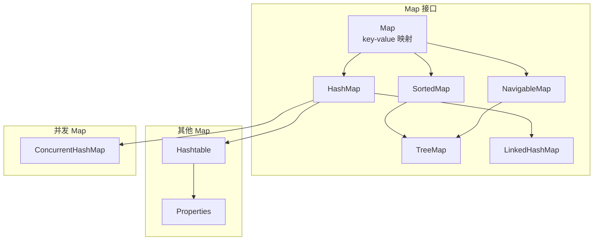
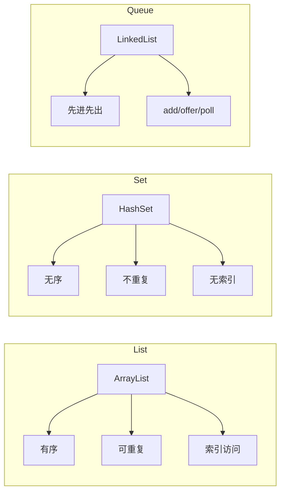
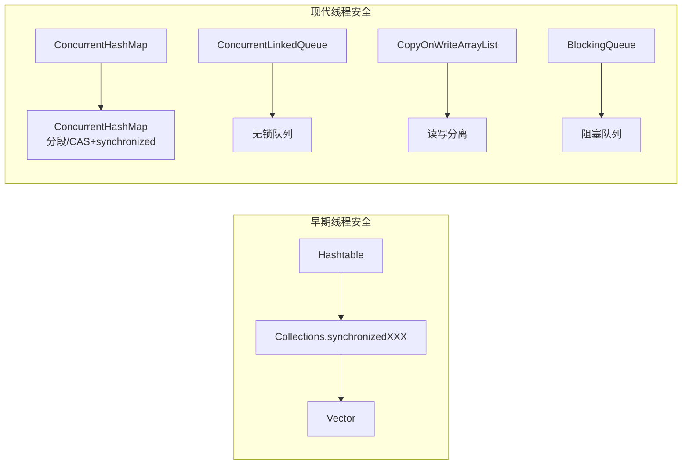
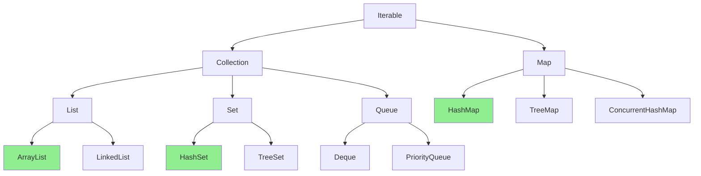

# 集合框架整体架构图

**目标级别**：P5 / P6

---

## 快速自测

面试官问：「能不能画一下 Java 集合框架的整体架构图？」

---

## 一、整体架构图

### 🔴 集合框架层次结构

```mermaid
flowchart TD
    subgraph Collection 接口
        A[Iterable<br/>+iterator()] --> B[Collection]
        
        B --> C[List<br/>有序、可重复]
        B --> D[Set<br/>无序、不重复]
        B --> E[Queue<br/>队列操作]
        
        E --> F[Deque<br/>双端队列]
    end
    
    subgraph List 实现
        C --> G[ArrayList]
        C --> H[LinkedList]
        C --> I[Vector]
        I --> I1[Stack]
    end
    
    subgraph Set 实现
        D --> J[HashSet]
        D --> K[TreeSet]
        D --> L[LinkedHashSet]
        
        J --> M[LinkedHashMap]
    end
    
    subgraph Queue 实现
        E --> N[LinkedList]
        E --> O[PriorityQueue]
        
        F --> N
        F --> P[ArrayDeque]
    end
```

---

## 二、Map 接口层级



---

## 三、接口对比

### 🔴 Collection 三大接口



---

## 四、实现类关系表

### 🔴 List 接口实现

| 实现类 | 底层结构 | 线程安全 | 特点 |
|-------|---------|---------|------|
| ArrayList | 数组 | ❌ | 随机访问快，尾部操作多 |
| LinkedList | 双向链表 | ❌ | 插入删除快，遍历慢 |
| Vector | 数组 | ✅ | 全方法加锁，不推荐 |
| Stack | 数组 | ✅ | 继承 Vector，已废弃 |

### 🔴 Set 接口实现

| 实现类 | 底层结构 | 线程安全 | 特点 |
|-------|---------|---------|------|
| HashSet | HashMap | ❌ | 无序，最常用 |
| LinkedHashSet | LinkedHashMap | ❌ | 保持插入顺序 |
| TreeSet | TreeMap | ❌ | 有序，需实现 Comparable |
| EnumSet | 位向量 | ❌ | 枚举类型，性能好 |
| CopyOnWriteArraySet | 数组 | ✅ | 读多写少 |

### 🔴 Map 接口实现

| 实现类 | 底层结构 | 线程安全 | 特点 |
|-------|---------|---------|------|
| HashMap | 数组+链表+红黑树 | ❌ | 最常用 |
| LinkedHashMap | HashMap+链表 | ❌ | 保持访问/插入顺序 |
| TreeMap | 红黑树 | ❌ | 有序 |
| Hashtable | 数组+链表 | ✅ | 全方法加锁，不推荐 |
| ConcurrentHashMap | 数组+链表+红黑树 | ✅ | 高并发，CAS+synchronized |

### 🔴 Queue 接口实现

| 实现类 | 底层结构 | 线程安全 | 特点 |
|-------|---------|---------|------|
| ArrayDeque | 循环数组 | ❌ | 双端队列，性能好 |
| LinkedList | 双向链表 | ❌ | 可作 List/Deque |
| PriorityQueue | 堆 | ❌ | 优先级队列 |
| ArrayBlockingQueue | 数组 | ✅ | 有界队列 |
| LinkedBlockingQueue | 链表 | ✅ | 可选有界队列 |
| ConcurrentLinkedQueue | 链表 | ✅ | ��锁队列 |

---

## 五、线程安全集合对比



---

## 六、选择指南

### 🔴 根据场景选型

| 场景 | 推荐选择 |
|------|---------|
| 单线程随机访问 | ArrayList |
| 单线程频繁增删中间位置 | LinkedList |
| 需要保持顺序 | LinkedHashSet/Map |
| 需要排序 | TreeSet/Map |
| 高并发 Map | ConcurrentHashMap |
| 高并发 List | CopyOnWriteArrayList |
| 高并发 Queue | ConcurrentLinkedQueue |
| 阻塞队列 | LinkedBlockingQueue |
| 生产者-消费者 | ArrayBlockingQueue |
| 需要优先级 | PriorityQueue |

---

## 七、面试题精讲

### 🔴 第一层：Java 集合框架的整体架构是什么？

> **参考答案**：
>
> Java 集合框架以 **Collection** 和 **Map** 两大接口为核心：
> 1. **Collection**：List（ArrayList、LinkedList）、Set（HashSet、TreeSet）、Queue（ArrayDeque、PriorityQueue）
> 2. **Map**：HashMap、TreeMap、LinkedHashMap
> 3. **线程安全版本**：ConcurrentHashMap、CopyOnWriteArrayList 等
>
> 每一族都有抽象类和具体实现类支撑。

### 🟡 第二层：List、Set、Queue 的区别是什么？

> **参考答案**：
>
> 1. **List**：有序、可重复、支持索引访问
> 2. **Set**：无序（大部分）、不重复
> 3. **Queue**：队列操作（先进先出）、支持阻塞
> 4. **Deque**：双端队列，头尾操作
>
> 三者都是 Collection 的子接口。

### ⚠️ 面试官挖坑点

| 陷阱 | 错误回答 | 正确回答 |
|------|---------|----------|
| 「HashMap 是 Collection 的子接口」 | 搞混了 | HashMap 是 Map 的实现 |
| 「LinkedList 只能做 List」 | 不了解接口实现 | 还实现了 Deque、Queue |
| 「所有集合都是线程安全的」 | 不了解并发版本 | 大部分不是，需要选择并发版本 |

---

## 八、总结

**集合框架架构核心要点**：



1. **两大根接口**：Collection 和 Map
2. **List/Set/Queue**：Collection 的三个子接口
3. **HashMap/TreeMap/ConcurrentHashMap**：Map 的主要实现
4. **选择原则**：根据功能需求和并发需求选择合适的实现类
