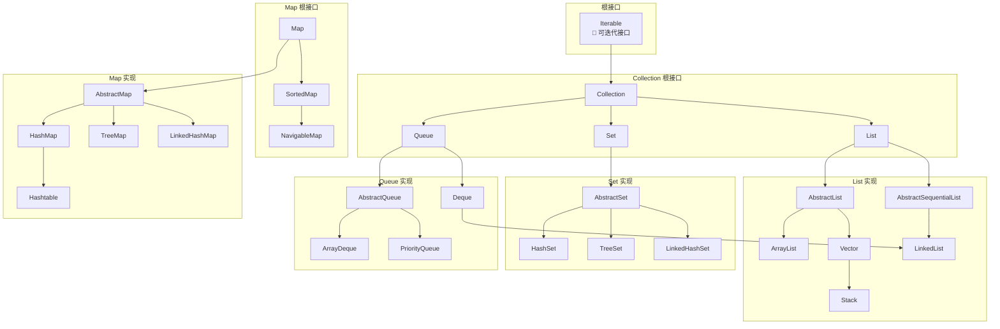
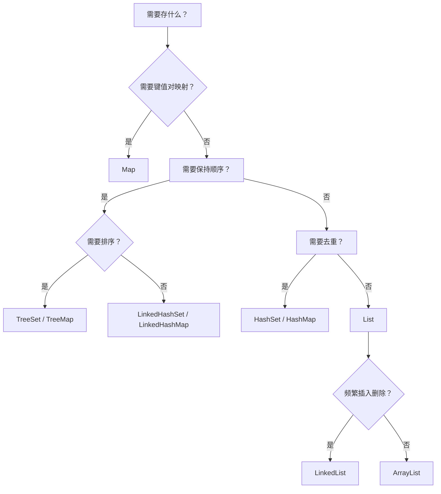

# 集合框架整体架构图

面试官翻到简历上"熟悉 Java 集合框架"，开口问道：

"Java 集合框架的整体架构是什么样的？Iterable 和 Collection 是什么关系？Map 和 Collection 又是并列的吗？"

候选人小杨支支吾吾："呃... Collection 是集合的根接口... Map 应该也算一种集合吧？"

面试官没说话，继续问："那你说说，ArrayList、LinkedList、Vector 的区别是什么？HashMap 和 Hashtable 呢？"

小杨开始语无伦次地背诵...

【面试官心理】
这道题看似简单，实际上是在测试候选人对 Java 集合框架的整体认知。能画出一张完整的架构图，说清楚各接口和实现类的关系，才是真正理解了 Java 集合的设计思想。

---

## 一、整体架构图



---

## 二、核心接口详解

### 2.1 Iterable —— 可迭代的根 🔴

```java
public interface Iterable<T> {
    Iterator<T> iterator();
    default void forEach(Consumer<? super T> action);
    default Spliterator<T> spliterator();
}
```

所有实现了 `Iterable` 的对象都可以用 `for-each` 循环遍历。

```java
for (String s : list) {
    System.out.println(s);
}
```

**Collection 继承了 Iterable**：

```java
public interface Collection<E> extends Iterable<E> {
    boolean add(E e);
    boolean remove(Object o);
    boolean contains(Object o);
    int size();
    boolean isEmpty();
    void clear();
    Iterator<E> iterator();
}
```

### 2.2 List —— 有序可重复 🔴

```java
public interface List<E> extends Collection<E> {
    E get(int index);
    E set(int index, E element);
    void add(int index, E element);
    E remove(int index);
    int indexOf(Object o);
    int lastIndexOf(Object o);
    List<E> subList(int from, int to);
}
```

**List 的三大实现对比**：

| 实现 | 底层数据结构 | 线程安全 | 适用场景 |
| --- | --- | --- | --- |
| ArrayList | 动态数组 | 不安全 | 随机访问为主，尾插为主 |
| LinkedList | 双向链表 | 不安全 | 频繁插入删除，无需随机访问 |
| Vector | 动态数组 | 安全（synchronized） | 需要线程安全时（已过时） |

### 2.3 Set —— 无序不重复 🔴

```java
public interface Set<E> extends Collection<E> {
    // Set 不允许重复元素
    // 其他方法与 Collection 相同
}
```

**Set 的三大实现对比**：

| 实现 | 底层数据结构 | 是否有序 | 适用场景 |
| --- | --- | --- | --- |
| HashSet | HashMap（哈希表） | 不保证顺序 | 通用去重，需要 O(1) 查找 |
| LinkedHashSet | LinkedHashMap | 保持插入顺序 | 需要保持顺序的去重 |
| TreeSet | 红黑树 | 保持排序顺序 | 需要有序去重，范围查询 |

### 2.4 Map —— 键值对映射 🔴

```java
public interface Map<K, V> {
    V put(K key, V value);
    V get(Object key);
    V remove(Object key);
    boolean containsKey(Object key);
    boolean containsValue(Object value);
    int size();
    Set<K> keySet();
    Collection<V> values();
    Set<Map.Entry<K, V>> entrySet();
}
```

**Map 和 Collection 是并列关系**！这不是继承关系，而是两个独立的根接口。

| 实现 | 底层数据结构 | 是否有序 | 线程安全 |
| --- | --- | --- | --- |
| HashMap | 数组+链表/红黑树 | 不保证顺序 | 不安全 |
| LinkedHashMap | HashMap + 双向链表 | 保持插入顺序 | 不安全 |
| TreeMap | 红黑树 | 保持排序顺序 | 不安全 |
| Hashtable | 数组+链表 | 不保证顺序 | 安全（synchronized，已过时） |

---

## 三、集合的继承关系速查表

```
Iterable
└── Collection
    ├── List
    │   ├── AbstractList
    │   │   ├── ArrayList
    │   │   └── Vector
    │   │       └── Stack
    │   └── AbstractSequentialList
    │       └── LinkedList
    ├── Set
    │   ├── AbstractSet
    │   │   ├── HashSet
    │   │   │   └── LinkedHashSet
    │   │   └── TreeSet
    │   └── CopyOnWriteArraySet
    └── Queue
        ├── AbstractQueue
        │   ├── PriorityQueue
        │   └── ArrayDeque
        └── Deque
            └── LinkedList

Map（独立体系）
├── AbstractMap
│   ├── HashMap
│   │   └── LinkedHashMap
│   ├── TreeMap
│   └── Hashtable
└── ConcurrentMap
    └── ConcurrentHashMap
```

---

## 四、集合选择决策树



---

## 五、常见误区 ⚠️

### ❌ 误区一：Map 继承了 Collection

**错误**：认为 `Map extends Collection`

**正确**：Map 和 Collection 是 Java 集合框架的两大分支，互相独立。

### ❌ 误区二：Vector 是 ArrayList 的线程安全版本

**不完全正确**：虽然 Vector 是线程安全的，但现在已经不推荐使用。如果需要线程安全，应该用 `CopyOnWriteArrayList`。

### ❌ 误区三：HashSet 可以存放重复元素

**错误**：HashSet 的 `add()` 方法底层调用 `HashMap.put()`，而 HashMap 的 key 是不允许重复的。

---

## 六、面试官心理

面试官问这道题，通常是想看你对 Java 集合框架有没有**全局认知**。能画出架构图、讲清楚继承关系的候选人，说明：

1. 看过源码至少一遍
2. 理解 Java 的设计模式（接口抽象、抽象类实现）
3. 能在实际开发中正确选型
