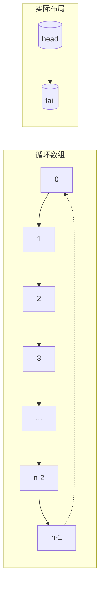

# ArrayDeque 与 LinkedList 对比

**目标级别**：P5 / P6

---

## 快速自测

面试官问：「ArrayDeque 和 LinkedList 都能实现队列，它们有什么区别？」

---

## 一、核心问题

### 🔴 ArrayDeque 底层是什么？

**循环数组**

```java
public class ArrayDeque<E> extends AbstractCollection<E>
        implements Deque<E>, Cloneable, Serializable {

    transient Object[] elements;
    transient int head;  // 头指针
    transient int tail;  // 尾指针
}
```

### 循环数组原理



**head 和 tail 会循环**，超过数组末尾会回到开头。

---

## 二、操作复杂度对比

### 🔴 各操作时间复杂度

| 操作 | ArrayDeque | LinkedList |
|------|-----------|------------|
| addFirst | 均摊 O(1) | O(1) |
| addLast | 均摊 O(1) | O(1) |
| removeFirst | 均摊 O(1) | O(1) |
| removeLast | 均摊 O(1) | O(1) |
| 随机访问 | O(1) | O(n) |
| 内存占用 | 小（无指针） | 大（前后指针） |

---

## 三、ArrayDeque vs LinkedList

### 🔴 选型建议

| 场景 | 推荐 | 原因 |
|------|------|------|
| 需要随机访问 | ArrayDeque | O(1) 随机访问 |
| 需要 removeLast | LinkedList | ArrayDeque 是 O(1) 但实现复杂 |
| 内存敏感 | ArrayDeque | 无额外指针 |
| 单线程场景 | ArrayDeque | 性能更好 |
| 需要遍历 | ArrayDeque | 迭代器效率更高 |

---

## 四、为什么不用 ArrayList 实现栈/队列？

### ⚠️ ArrayList 的问题

```java
// ArrayList 头部操作需要搬移元素
list.add(0, element);  // O(n)
list.remove(0);        // O(n)

// ArrayDeque 头部操作是 O(1)
deque.addFirst(element);  // O(1)
deque.removeFirst();      // O(1)
```

---

## 五、面试题精讲

### 🔴 第一层：ArrayDeque 和 LinkedList 都能实现队列，哪个更好？

> **参考答案**：
>
> 单线程场景推荐 **ArrayDeque**：
> 1. 底层是循环数组，内存连续，缓存友好
> 2. 头尾操作都是均摊 O(1)
> 3. 无额外指针开销，内存利用率高
> 4. 迭代器效率比 LinkedList 高
>
> 唯一缺点是不支持高效的 removeLast（虽然也是 O(1)，但实现复杂）。

### ⚠️ 面试官挖坑点

| 陷阱 | 错误回答 | 正确回答 |
|------|---------|----------|
| 「LinkedList 总是更好」 | 不了解 ArrayDeque 优势 | ArrayDeque 在单线程下性能更好 |
| 「ArrayDeque 不能做栈」 | 不了解功能 | ArrayDeque 实现了 Deque，支持栈操作 |
| 「ArrayDeque 是链表」 | 搞混结构 | ArrayDeque 是循环数组 |

---

## 六、总结

**ArrayDeque vs LinkedList 核心要点**：

| 维度 | ArrayDeque | LinkedList |
|------|-----------|------------|
| 底层 | 循环数组 | 双向链表 |
| 头尾操作 | 均摊 O(1) | O(1) |
| 内存 | 小 | 大 |
| 缓存 | 友好 | 不友好 |
| 推荐场景 | 单线程栈/队列 | 需要 List 功能 |
