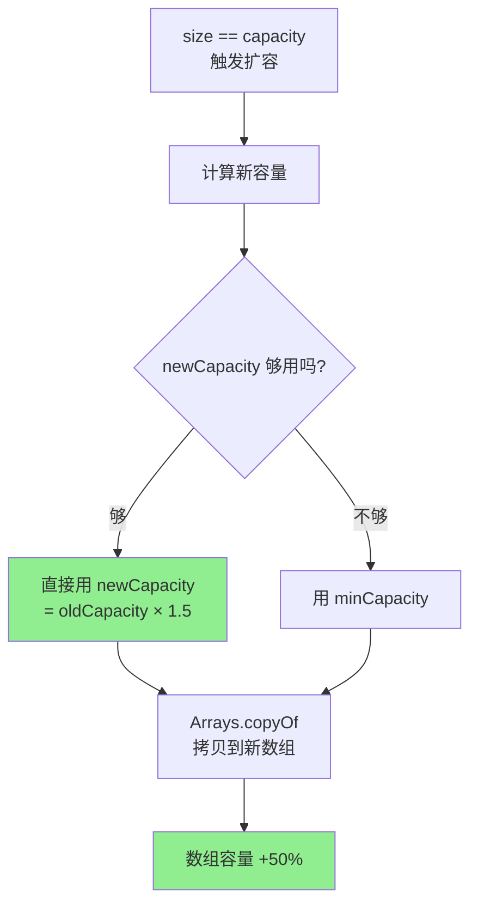
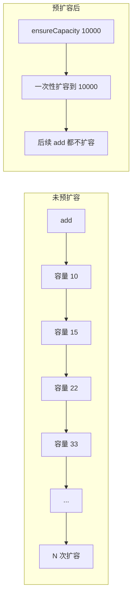
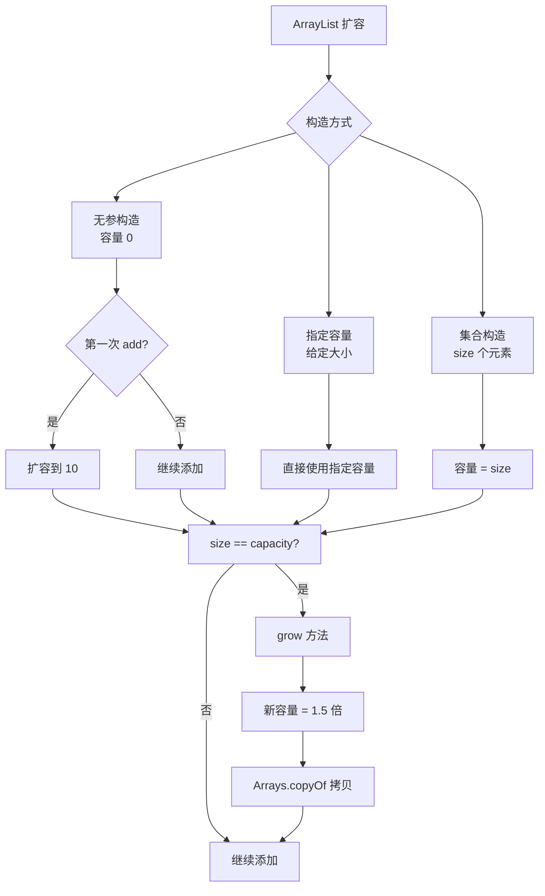

# ArrayList 扩容机制

**目标级别**：P5 / P6

---

## 快速自测

面试官问：「ArrayList 是怎么扩容的？扩容因子是多少？能不能手动触发扩容？」

你能回答到第几层？

---

## 一、核心问题

### 🔴 ArrayList 底层是什么数据结构？

ArrayList 底层是一个 **Object 数组**（`Object[] elementData`），这是理解扩容机制的前提。

```java
// JDK 源码
public class ArrayList<E> extends AbstractList<E>
        implements List<E>, RandomAccess, Cloneable, java.io.Serializable {

    transient Object[] elementData; // 非序列化，调用 toArray 时转换

    private int size;
}
```

### ⚠️ 常见错误

很多候选人会说「ArrayList 底层是数组」，但追问「那初始化的时候数组是多大？」就开始含糊了。

**正确答案**：ArrayList 有三种构造方式，对应不同的初始化策略：

| 构造方式 | 初始容量 |
|---------|----------|
| `new ArrayList<>()` | 空数组（`[]`），第一次 add 时扩容到 10 |
| `new ArrayList<>(capacity)` | 指定容量，不扩容 |
| `new ArrayList<>(collection)` | 容量 = 集合的 size |

```java
// 无参构造：懒加载，容量为 0
public ArrayList() {
    this.elementData = DEFAULTCAPACITY_EMPTY_ELEMENTDATA;
}

// 指定容量：直接用给定容量
public ArrayList(int initialCapacity) {
    if (initialCapacity > 0) {
        this.elementData = new Object[initialCapacity];
    } else if (initialCapacity == 0) {
        this.elementData = EMPTY_ELEMENTDATA;
    } else {
        throw new IllegalArgumentException(...);
    }
}
```

---

## 二、扩容机制详解

### 🔴 扩容因子（loadFactor）

ArrayList 的扩容因子是 **1.0**，意味着当 `size == capacity` 时触发扩容。

```java
// JDK 源码
private static final int MAX_ARRAY_SIZE = Integer.MAX_VALUE - 8;

/**
 * 扩容核心方法
 * 最小需要容量 = minCapacity
 */
private void grow(int minCapacity) {
    // 原容量
    int oldCapacity = elementData.length;

    // 新容量 = 原容量 + 原容量的一半（1.5 倍）
    int newCapacity = oldCapacity + (oldCapacity >> 1);

    // 如果 1.5 倍还不够，直接用 minCapacity
    if (newCapacity - minCapacity < 0)
        newCapacity = minCapacity;

    // 防止溢出：如果 newCapacity 超过最大数组大小，做限制
    if (newCapacity - MAX_ARRAY_SIZE > 0)
        newCapacity = hugeCapacity(minCapacity);

    // 核心操作：拷贝数组
    elementData = Arrays.copyOf(elementData, newCapacity);
}
```

### 扩容倍数计算



### 容量增长示例

| 原容量 | 触发扩容后新容量 | 增长量 |
|-------|-----------------|--------|
| 10 | 15 | +5 |
| 15 | 22 | +7 |
| 22 | 33 | +11 |
| 33 | 49 | +16 |
| 100 | 150 | +50 |
| 150 | 225 | +75 |

---

## 三、手动扩容：ensureCapacity

### 💡 超出预期的回答

如果面试官问「能不能手动触发扩容」，很多候选人只会说「ArrayList 会自动扩容」。

**加分回答**：JDK 提供了 `ensureCapacity` 方法，可以在已知数据量时预扩容，避免多次扩容带来的性能开销。

```java
// ArrayList 的公开方法
public void ensureCapacity(int minCapacity) {
    if (minCapacity > elementData.length
            && !(elementData == DEFAULTCAPACITY_EMPTY_ELEMENTDATA
                    && minCapacity <= DEFAULT_CAPACITY)) {
        modCount++;
        grow(minCapacity);
    }
}
```

**使用场景**：批量添加元素前，预估数据量，手动扩容

```java
// 场景：批量插入 10000 个元素
List<String> list = new ArrayList<>();

// 手动预扩容，避免多次扩容
((ArrayList<String>) list).ensureCapacity(10000);

for (int i = 0; i < 10000; i++) {
    list.add("item" + i);
}
```

### 性能对比



---

## 四、Integer.MAX_VALUE - 8 是什么？

### 💡 面试追问

面试官：「为什么最大容量是 `Integer.MAX_VALUE - 8` 而不是 `Integer.MAX_VALUE`？」

**参考答案**：

1. **内存对齐**：某些 JVM 实现会在数组头部添加额外内存，如果数组太大可能导致 `OutOfMemoryError`
2. **Header 空间**：JVM 数组对象头部有 12-16 字节的 header
3. **安全余量**：留 8 字节余量，避免 JVM 内部检查失败

```java
// JDK 源码
private static final int MAX_ARRAY_SIZE = Integer.MAX_VALUE - 8;

// hugeCapacity 方法处理边界情况
private static int hugeCapacity(int minCapacity) {
    if (minCapacity < 0) // overflow
        throw new OutOfMemoryError();
    return (minCapacity > MAX_ARRAY_SIZE) ?
        Integer.MAX_VALUE :
        MAX_ARRAY_SIZE;
}
```

---

## 五、ArrayList 与 Vector 对比

| 对比维度 | ArrayList | Vector |
|---------|-----------|--------|
| 初始容量 | 0（懒加载）或指定 | 10（必须）或指定 |
| 扩容方式 | 1.5 倍 | 2 倍（默认） |
| 线程安全 | 不安全 | 同步方法，安全但慢 |
| 迭代器 | 迭代时结构性修改会 fail-fast | 迭代时结构性修改会 fail-fast |
| 适用场景 | 单线程、追求性能 | 多线程、追求安全 |

---

## 六、面试题精讲

### 🔴 第一层：ArrayList 扩容机制是怎样的？

> **参考答案**：
>
> ArrayList 底层是 Object 数组，初始容量为 0（懒加载）或指定值。当元素数量达到容量上限时触发扩容，新容量 = 原容量 × 1.5。如果还不够，直接用所需容量。最后通过 `Arrays.copyOf` 拷贝到新数组。

### 🟡 第二层：为什么不一开始就把数组初始化为 10？

> **参考答案**：
>
> 这是一种**懒加载**策略，平衡了内存和性能：
> 1. 如果只添加 1-2 个元素，全初始化 10 个空间是浪费
> 2. JVM 启动时内存紧张，延迟分配减少启动开销
> 3. 第一次 add 时再初始化，既保证了常用场景的效率，又避免了无谓的内存占用

### 💡 第三层：扩容过程中有什么性能问题？

> **参考答案**：
>
> 扩容的核心问题是**数组拷贝**：
> 1. `Arrays.copyOf` 是**浅拷贝**，但会复制引用
> 2. 扩容时需要重新分配内存并拷贝所有元素，复杂度 O(n)
> 3. 如果数据量大，频繁扩容会导致**内存抖动**和**GC 压力**
> 4. 解决方案：预估容量，用 `ensureCapacity` 预扩容

### ⚠️ 面试官挖坑点

| 陷阱 | 错误回答 | 正确回答 |
|------|---------|----------|
| 「ArrayList 默认容量是 10」 | 无参构造默认容量 10 | 无参构造容量是 0，第一次 add 才变成 10 |
| 「扩容是 2 倍」 | ArrayList 扩容是 2 倍 | ArrayList 是 1.5 倍，Vector 才是 2 倍 |
| 「最大容量是 Integer.MAX_VALUE」 | 直接回答 Integer.MAX_VALUE | 应该是 Integer.MAX_VALUE - 8 |

---

## 七、对比表格

| 操作 | ArrayList | LinkedList |
|------|-----------|------------|
| 随机访问（get/set） | O(1)，数组下标直接访问 | O(n)，需要遍历 |
| 头部插入 | O(n)，需要搬移所有元素 | O(1)，修改指针 |
| 尾部插入 | 均摊 O(1)，偶尔扩容 | O(1) |
| 扩容机制 | 1.5 倍扩容 + 数组拷贝 | 按需分配，无扩容 |
| 内存占用 | 连续内存，空间利用率高 | 每个节点额外存储前后指针 |
| CPU 缓存 | 连续内存，缓存友好 | 节点分散，缓存命中率低 |

---

## 八、总结



**核心要点**：

1. ArrayList 底层是 **Object 数组**
2. 无参构造容量为 **0**，第一次 add 扩容到 **10**
3. 扩容公式：**新容量 = 原容量 × 1.5**
4. 最大容量 **Integer.MAX_VALUE - 8**
5. 批量添加前用 **ensureCapacity** 预扩容可提升性能

---

## 延伸思考

> **追问**：如果让你实现一个可自动扩容的数组，你会怎么做？需要考虑哪些问题？

1. 扩容策略：按固定倍数还是按固定增量？
2. 内存分配：一次性分配还是分段分配？
3. 拷贝代价：O(n) 拷贝如何优化？（预扩容、扩容因子调优）
4. 并发安全：多线程下扩容是否需要加锁？
