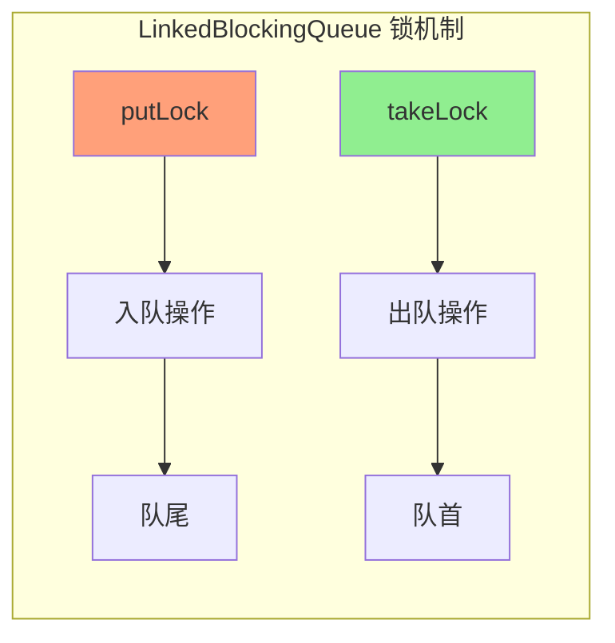

# BlockingQueue 实现类对比

**目标级别**：P6

---

## 快速自测

面试官问：「BlockingQueue 有哪些实现类？各自有什么区别？」

---

## 一、核心问题

### 🔴 BlockingQueue 是什么？

**支持阻塞操作的队列**，常用于生产者-消费者模式。

```java
public interface BlockingQueue<E> extends Queue<E> {
    // 阻塞式插入，队列满时等待
    void put(E e) throws InterruptedException;
    
    // 阻塞式移除，队列空时等待
    E take() throws InterruptedException;
    
    // 超时插入
    boolean offer(E e, long timeout, TimeUnit unit) throws InterruptedException;
    
    // 超时移除
    E poll(long timeout, TimeUnit unit) throws InterruptedException;
}
```

---

## 二、实现类对比

### 🔴 有哪些实现类？

| 实现类 | 底层结构 | 有界性 | 锁机制 | 特点 |
|-------|---------|--------|--------|------|
| ArrayBlockingQueue | 数组 | 有界 | 1 把锁 | 性能好，有界 |
| LinkedBlockingQueue | 链表 | 可选（默认 Integer.MAX_VALUE） | 2 把锁 | 吞吐量高 |
| LinkedBlockingDeque | 双向链表 | 可选 | 2 把锁 | 双端操作 |
| PriorityBlockingQueue | 堆 | 无界 | 1 把锁 | 按优先级 |
| DelayQueue | 优先队列 | 无界 | 1 把锁 | 延迟元素 |
| SynchronousQueue | 无存储 | 不存储 | 1 把锁 | 直接交付 |
| LinkedTransferQueue | 链表 | 无界 | CAS | 转移模式 |

---

## 三、ArrayBlockingQueue

### 🔴 特点

```java
// 构造函数
ArrayBlockingQueue(int capacity)
ArrayBlockingQueue(int capacity, boolean fair)
ArrayBlockingQueue(int capacity, boolean fair, Collection<? extends E> c)
```

**特点**：
- 底层是**数组**，容量固定
- **有界队列**，创建时指定容量
- 使用**单把锁**（ReentrantLock）
- 支持**公平/非公平**模式

### ⚠️ 公平模式的问题

```java
// 公平模式：线程按等待顺序获取锁
ArrayBlockingQueue<String> fairQueue = new ArrayBlockingQueue<>(10, true);

// 非公平模式（默认）：可能有线程饿死
ArrayBlockingQueue<String> unfairQueue = new ArrayBlockingQueue<>(10, false);
```

**公平模式**保证 FIFO，但吞吐量更低。

---

## 四、LinkedBlockingQueue

### 🔴 特点

```java
// 构造函数
LinkedBlockingQueue()  // 默认容量 Integer.MAX_VALUE
LinkedBlockingQueue(int capacity)  // 指定容量
LinkedBlockingQueue(Collection<? extends E> c)
```

**特点**：
- 底层是**单向链表**
- **可选有界**（默认无界）
- 使用**两把锁**（takeLock + putLock）
- **吞吐量高**（入队出队可并行）



### 💡 两把锁的优势

| 维度 | 单锁（ArrayBlockingQueue） | 双锁（LinkedBlockingQueue） |
|------|--------------------------|--------------------------|
| 入队操作 | 需获取唯一锁 | 只需 putLock |
| 出队操作 | 需获取唯一锁 | 只需 takeLock |
| 并行度 | 低 | 高 |
| 吞吐量 | 中 | 高 |

---

## 五、PriorityBlockingQueue

### 🔴 特点

```java
// 构造函数
PriorityBlockingQueue()  // 默认容量 11
PriorityBlockingQueue(int initialCapacity)
PriorityBlockingQueue(int initialCapacity, Comparator<? super E> comparator)
```

**特点**：
- 基于**堆**实现的**优先级队列**
- **无界队列**，容量自动扩展
- 元素必须实现 **Comparable** 或提供 **Comparator**
- 出队顺序按优先级（最小堆/最大堆）

### ⚠️ 注意

```java
// 元素必须可比较
PriorityBlockingQueue<User> queue = new PriorityBlockingQueue<>();

// User 必须实现 Comparable
class User implements Comparable<User> {
    private int priority;
    
    @Override
    public int compareTo(User o) {
        return this.priority - o.priority;  // 小的先出队
    }
}
```

---

## 六、DelayQueue

### 🔴 特点

```java
// 元素必须实现 Delayed 接口
public interface Delayed extends Comparable<Delayed> {
    long getDelay(TimeUnit unit);
}

// 使用示例
DelayQueue<Task> delayQueue = new DelayQueue<>();

// 任务 5 秒后执行
delayQueue.put(new Task(() -> System.out.println("执行"), 5000));

// take 会阻塞，直到有任务到期
Task task = delayQueue.take();
task.run();
```

**特点**：
- 基于 **PriorityBlockingQueue**
- 元素必须实现 **Delayed 接口**
- **无界队列**
- 只有到期元素才能被取出

---

## 七、SynchronousQueue

### 🔴 特点

```java
// 构造函数
SynchronousQueue()  // 非公平模式
SynchronousQueue(boolean fair)  // 可选公平模式
```

**特点**：
- **不存储元素**，每个 put 必须等待一个 take，反之亦然
- 容量始终为 **0**
- 适用于**直接交付**场景

```mermaid
flowchart LR
    subgraph SynchronousQueue
        A[put(E)] --> B[等待 take]
        C[take] --> D[获取 put 的元素]
        
        A -.->|交付| D
    end
    
    style B fill:#FFA07A
    style D fill:#90EE90
```

### 💡 使用场景

```java
// 场景：线程间直接传递数据，不缓存
SynchronousQueue<Task> queue = new SynchronousQueue<>();

// 生产者线程
new Thread(() -> {
    try {
        queue.put(task);  // 阻塞，直到有消费者拿走
    } catch (InterruptedException e) {}
}).start();

// 消费者线程
new Thread(() -> {
    try {
        Task task = queue.take();  // 阻塞，直到有生产者放入
    } catch (InterruptedException e) {}
}).start();
```

---

## 八、LinkedTransferQueue

### 🔴 特点

```java
// JDK 7 引入，无界队列
LinkedTransferQueue<E> queue = new LinkedTransferQueue<>();
```

**特点**：
- 基于**链表**的**无界队列**
- 使用 **CAS** 实现无锁
- 支持**转移模式**（transfer）和**数据保留模式**

### 💡 transfer vs put

```java
LinkedTransferQueue<String> queue = new LinkedTransferQueue<>();

// transfer：必须等消费者拿走才返回
queue.transfer("message");  // 阻塞

// put：队列有空位就放入
queue.put("message");  // 不阻塞
```

---

## 九、对比表格

| 实现类 | 有界/无界 | 存储结构 | 锁数量 | 特点 |
|-------|----------|---------|--------|------|
| ArrayBlockingQueue | 有界 | 数组 | 1 | 固定容量 |
| LinkedBlockingQueue | 可选 | 链表 | 2 | 高吞吐量 |
| LinkedBlockingDeque | 可选 | 双向链表 | 2 | 双端操作 |
| PriorityBlockingQueue | 无界 | 堆 | 1 | 优先级 |
| DelayQueue | 无界 | 堆 | 1 | 延迟 |
| SynchronousQueue | 不存储 | 无 | 1 | 直接交付 |
| LinkedTransferQueue | 无界 | 链表 | CAS | 转移模式 |

---

## 十、面试题精讲

### 🔴 第一层：BlockingQueue 有哪些实现类？

> **参考答案**：
>
> 主要有：
> 1. **ArrayBlockingQueue**：有界数组队列，单锁
> 2. **LinkedBlockingQueue**：可选有界的链表队列，双锁，吞吐量大
> 3. **PriorityBlockingQueue**：无界优先级队列
> 4. **DelayQueue**：延迟队列，元素需实现 Delayed 接口
> 5. **SynchronousQueue**：不存储元素，直接交付
> 6. **LinkedTransferQueue**：支持转移模式的队列

### 🟡 第二层：LinkedBlockingQueue 为什么要用两把锁？

> **参考答案**：
>
> 用两把锁是为了提高并发度：
> 1. 入队操作只需要获取 putLock
> 2. 出队操作只需要获取 takeLock
> 3. 入队和出队可以并行执行
> 4. 相比单锁的 ArrayBlockingQueue，吞吐量更高

### 💡 第三层：什么场景用什么队列？

> **参考答案**：
>
> - **固定容量限流**：ArrayBlockingQueue
> - **高并发生产者-消费者**：LinkedBlockingQueue
> - **按优先级处理任务**：PriorityBlockingQueue
> - **延迟任务调度**：DelayQueue
> - **线程间直接交付**：SynchronousQueue
> - **需要 transfer 语义**：LinkedTransferQueue

### ⚠️ 面试官挖坑点

| 陷阱 | 错误回答 | 正确回答 |
|------|---------|----------|
| 「LinkedBlockingQueue 容量无限制」 | 忽略可配置 | 可以通过构造参数指定容量 |
| 「PriorityBlockingQueue 是有界的」 | 搞混 | 默认无界，容量自动扩展 |
| 「SynchronousQueue 容量是 1」 | 搞混 | 不存储任何元素，容量始终为 0 |

---

## 十一、总结

**BlockingQueue 实现类对比核心要点**：

| 选择依据 | 推荐队列 |
|---------|---------|
| 需要有界限流 | ArrayBlockingQueue |
| 需要高吞吐量 | LinkedBlockingQueue |
| 需要优先级 | PriorityBlockingQueue |
| 需要延迟 | DelayQueue |
| 需要直接交付 | SynchronousQueue |
| 需要转移语义 | LinkedTransferQueue |
