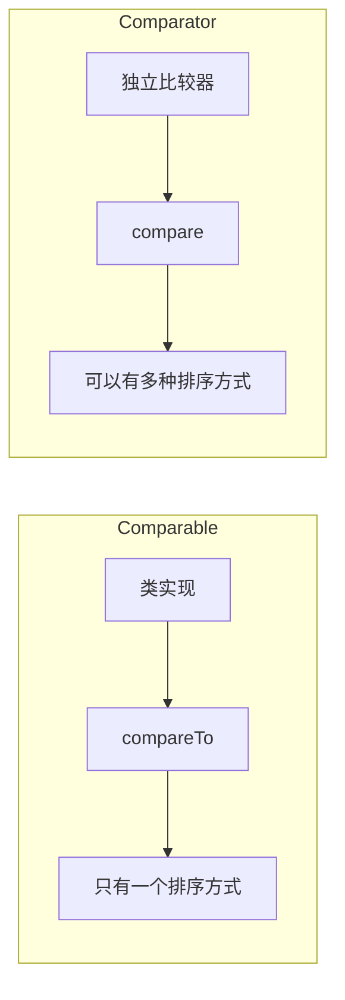
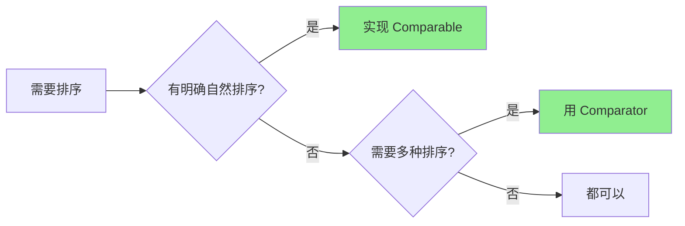

# Comparable 与 Comparator

**目标级别**：P5 / P6

---

## 快速自测

面试官问：「Comparable 和 Comparator 有什么区别？什么时候用哪个？」

---

## 一、核心问题

### 🔴 什么是 Comparable？

**自然排序接口**：类实现此接口，表示可以与同类对象比较

```java
public interface Comparable<T> {
    int compareTo(T o);  // 正数表示 this > o，0 表示相等，负数表示 this < o
}
```

### 🔴 什么是 Comparator？

**自定义比较器**：独立的比较逻辑，用于临时排序或多种排序方式

```java
public interface Comparator<T> {
    int compare(T o1, T o2);  // 正数表示 o1 > o2，0 表示相等，负数表示 o1 < o2
}
```

### 对比



---

## 二、Comparable 示例

### 🔴 实现 Comparable

```java
public class Student implements Comparable<Student> {
    private String name;
    private int score;
    
    @Override
    public int compareTo(Student o) {
        // 按分数从高到低排序
        return o.score - this.score;  // 降序
    }
}

// 使用
List<Student> students = new ArrayList<>();
Collections.sort(students);  // 使用 compareTo
```

### 💡 String 的自然排序

```java
// String 实现了 Comparable<String>
"apple".compareTo("banana");  // 负数，apple < banana
// 按字典顺序比较
```

---

## 三、Comparator 示例

### 🔴 使用 Comparator

```java
List<String> names = Arrays.asList("Tom", "Alice", "Bob");

// 1. 匿名内部类
Collections.sort(names, new Comparator<String>() {
    @Override
    public int compare(String a, String b) {
        return b.compareTo(a);  // 倒序
    }
});

// 2. Lambda（JDK 8+）
Collections.sort(names, (a, b) -> b.compareTo(a));

// 3. 方法引用
Collections.sort(names, String::compareTo);

// 4. Comparator 接口方法
Collections.sort(names, Comparator.reverseOrder());
```

---

## 四、Comparator 常用方法

### 🔴 Comparator 接口方法

```java
List<Student> students = new ArrayList<>();

// 自然排序
students.sort(Comparator.naturalOrder());

// 倒序
students.sort(Comparator.reverseOrder());

// 按字段排序
students.sort(Comparator.comparingInt(Student::getScore));

// 按字段倒序
students.sort(Comparator.comparingInt(Student::getScore).reversed());

// 多级排序
students.sort(Comparator
    .comparingInt(Student::getScore)
    .thenComparing(Student::getName));
```

### 💡 比较器链

```java
// 先按分数降序，分数相同按名字升序
students.sort(Comparator
    .comparingInt(Student::getScore).reversed()
    .thenComparing(Student::getName));
```

---

## 五、Arrays.sort 对比

### 🔴 Collections.sort vs Arrays.sort

```java
List<Integer> list = new ArrayList<>();
Collections.sort(list);  // 对 List 排序

int[] arr = {3, 1, 2};
Arrays.sort(arr);  // 对数组排序
```

### ⚠️ 基本类型 vs 包装类型数组

```java
int[] arr1 = {3, 1, 2};
Arrays.sort(arr1);  // 基本类型，用快速排序（不稳定）

Integer[] arr2 = {3, 1, 2};
Arrays.sort(arr2);  // 包装类型，用归并排序（稳定）
```

---

## 六、面试题精讲

### 🔴 第一层：Comparable 和 Comparator 有什么区别？

> **参考答案**：
>
> 主要区别：
> 1. **定义位置**：Comparable 在类内部定义，Comparator 是独立比较器
> 2. **方法名**：Comparable 是 compareTo，Comparator 是 compare
> 3. **排序方式**：一个类只能有一个自然排序，多个 Comparator 实现多种排序
> 4. **修改性**：Comparable 需要修改原类，Comparator 不需要

### 🟡 第二层：什么时候用 Comparable？什么时候用 Comparator？

> **参考答案**：
>
> - **Comparable**：类有明确的自然排序规则，且能修改源码
> - **Comparator**：需要多种排序方式，或不能修改原类
>
> 示例：
> - String 有明确的自然排序，用 Comparable
> - 学生按分数或按名字排序，用 Comparator

### ⚠️ 面试官挖坑点

| 陷阱 | 错误回答 | 正确回答 |
|------|---------|----------|
| 「compareTo 和 compare 返回 boolean」 | 搞混返回值 | 返回 int：正数/0/负数 |
| 「一个类只能有一种排序」 | 不了解 Comparator | 用 Comparator 可以有多种排序 |
| 「Comparator 可以替代 Comparable」 | 不完全正确 | 两者配合使用更灵活 |

---

## 七、对比表格

| 维度 | Comparable | Comparator |
|------|-----------|------------|
| 定义 | 在类内部实现 | 独立实现 |
| 方法 | compareTo(T o) | compare(T o1, T o2) |
| 自然排序 | ✅ | ❌ |
| 多种排序 | ❌ | ✅ |
| 修改原类 | 需要 | 不需要 |
| 参数顺序 | this vs 参数 | 参数1 vs 参数2 |

---

## 八、总结

**Comparable vs Comparator 核心要点**：



1. **Comparable**：类实现 compareTo，自然排序
2. **Comparator**：独立比较器，多种排序
3. **返回值**：都是 int，正数/0/负数
4. **建议**：有自然排序用 Comparable，灵活排序用 Comparator
